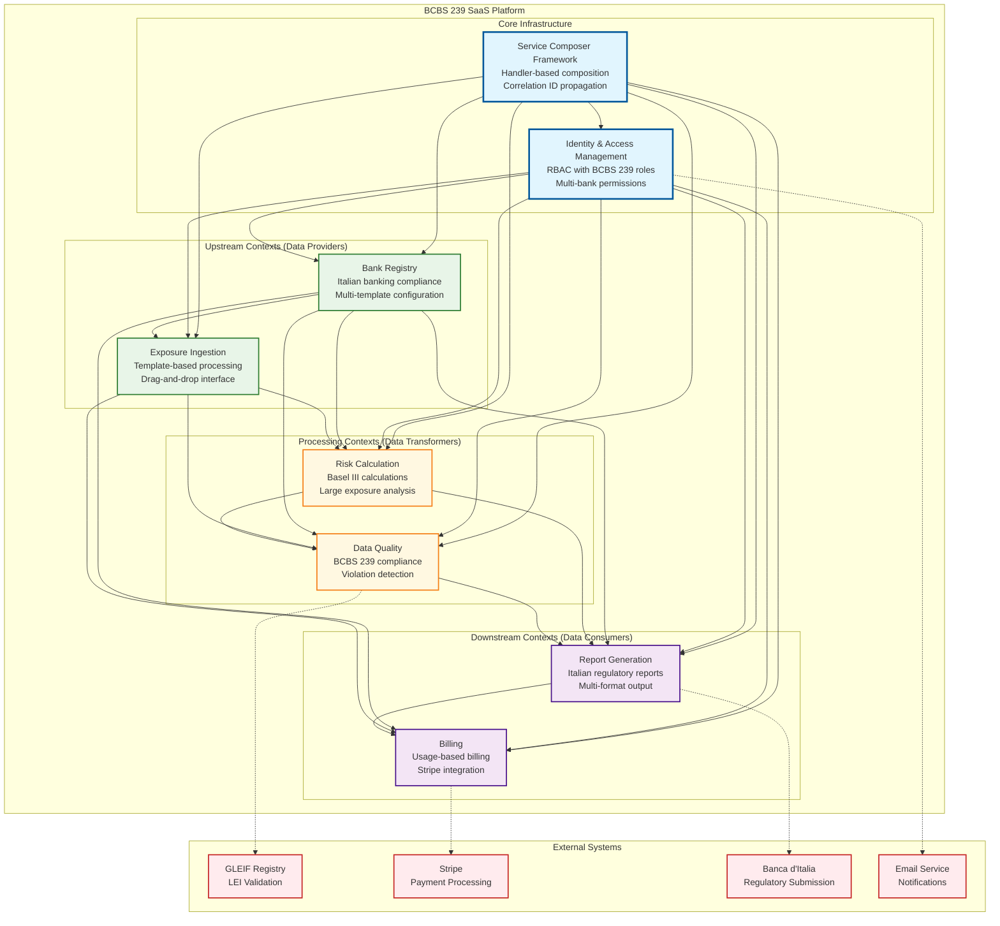
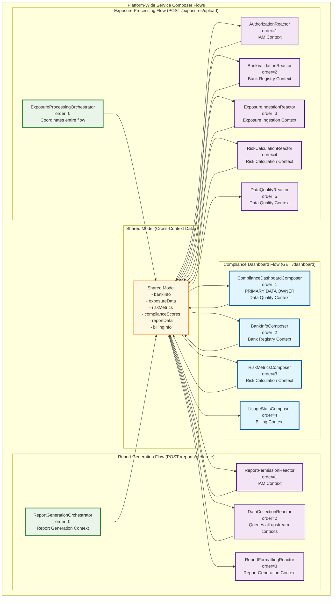

# BCBS 239 SaaS Platform - Design Document

## Overview

The BCBS 239 SaaS Platform is a comprehensive regulatory compliance solution that enables Italian banks to meet Basel Committee on Banking Supervision (BCBS) 239 requirements for risk data aggregation and reporting. The platform implements a sophisticated multi-tenant architecture using Domain-Driven Design principles, functional programming patterns, and the Service Composer Framework for coordinated cross-context operations.

The design emphasizes the four core BCBS 239 data quality principles (Principles 3-6): Accuracy & Integrity, Completeness, Timeliness, and Adaptability, while providing real-time compliance monitoring, automated regulatory reporting, and comprehensive analytics through autonomous bounded contexts.

## Architecture

### Core Architecture Principles

1. **Functional Programming Patterns**: Pure functions with `Result<T, ErrorDetail>` and `Maybe<T>` types for explicit error handling
2. **Value Objects as Records**: Immutable data structures with factory methods for validation
3. **Closure-Based Dependency Injection**: Framework-free business logic with function-based dependencies
4. **Autonomous Bounded Contexts**: Each context owns its data and communicates through APIs and events
5. **Service Composer Coordination**: Orchestrated multi-context flows with upstream/downstream patterns
6. **Event-Driven Architecture**: Domain events for internal consistency, integration events for cross-context communication

### Platform-Wide Context Map and Dependencies



### Service Composer Framework Integration Architecture



## Components and Interfaces

### 1. Platform-Wide Functional Programming Patterns

#### Core Value Objects and Factory Methods

```java
// Bank identification with Italian regulatory compliance
public record BankId(String value) {
    public static Result<BankId, ErrorDetail> create(String value) {
        if (value == null || value.trim().isEmpty()) {
            return Result.failure(ErrorDetail.validation("Bank ID cannot be empty"));
        }
        
        String trimmed = value.trim();
        if (trimmed.length() < 3 || trimmed.length() > 20) {
            return Result.failure(ErrorDetail.validation("Bank ID must be between 3 and 20 characters"));
        }
        
        return Result.success(new BankId(trimmed));
    }
}

// ABI Code for Italian banks
public record AbiCode(String value) {
    public static Result<AbiCode, ErrorDetail> create(String value) {
        if (value == null || !value.matches("^[0-9]{5}$")) {
            return Result.failure(ErrorDetail.validation("ABI code must be exactly 5 digits"));
        }
        
        return Result.success(new AbiCode(value));
    }
    
    public boolean isValidItalianBank() {
        int code = Integer.parseInt(value);
        return code >= 1000 && code <= 99999;
    }
}

// LEI Code with GLEIF validation
public record LeiCode(String value) {
    public static Result<LeiCode, ErrorDetail> create(String value) {
        if (value == null || !value.matches("^[A-Z0-9]{20}$")) {
            return Result.failure(ErrorDetail.validation("LEI code must be exactly 20 alphanumeric characters"));
        }
        
        // Validate checksum (simplified)
        if (!isValidChecksum(value)) {
            return Result.failure(ErrorDetail.validation("LEI code has invalid checksum"));
        }
        
        return Result.success(new LeiCode(value));
    }
    
    private static boolean isValidChecksum(String lei) {
        // Implement ISO 17442 checksum validation
        String rearranged = lei.substring(4, 18) + lei.substring(0, 4);
        StringBuilder numeric = new StringBuilder();
        
        for (char c : rearranged.toCharArray()) {
            if (Character.isDigit(c)) {
                numeric.append(c);
            } else {
                numeric.append(c - 'A' + 10);
            }
        }
        
        return mod97(numeric.toString()) == 1;
    }
    
    private static int mod97(String numeric) {
        int remainder = 0;
        for (char digit : numeric.toCharArray()) {
            remainder = (remainder * 10 + (digit - '0')) % 97;
        }
        return remainder;
    }
}

// Exposure Amount with currency validation
public record ExposureAmount(BigDecimal amount, Currency currency) {
    public static Result<ExposureAmount, ErrorDetail> create(BigDecimal amount, String currencyCode) {
        if (amount == null || amount.compareTo(BigDecimal.ZERO) < 0) {
            return Result.failure(ErrorDetail.validation("Exposure amount must be non-negative"));
        }
        
        try {
            Currency currency = Currency.getInstance(currencyCode);
            return Result.success(new ExposureAmount(amount, currency));
        } catch (IllegalArgumentException e) {
            return Result.failure(ErrorDetail.validation("Invalid currency code: " + currencyCode));
        }
    }
    
    public ExposureAmount add(ExposureAmount other) {
        if (!currency.equals(other.currency)) {
            throw new IllegalArgumentException("Cannot add amounts in different currencies");
        }
        return new ExposureAmount(amount.add(other.amount), currency);
    }
    
    public boolean isLargeExposure(Money eligibleCapital) {
        Money thisAmount = Money.of(amount, currency.getCurrencyCode());
        return thisAmount.divide(eligibleCapital).multiply(100.0).doubleValue() >= 10.0;
    }
}
```

#### Pure Business Functions with Closure-Based Dependencies

```java
// Bank registration with functional dependencies
public class BankRegistrationService {
    
    public static Result<RegisterBankResponse, ErrorDetail> registerBank(
        RegisterBankCommand command,
        Function<BankId, Result<Maybe<Bank>, ErrorDetail>> findBankById,
        Function<AbiCode, Result<Maybe<Bank>, ErrorDetail>> findBankByAbi,
        Function<LeiCode, Result<Boolean, ErrorDetail>> validateLeiWithGleif,
        Function<Bank, Result<BankId, ErrorDetail>> saveBank
    ) {
        // Validate command inputs
        Result<BankId, ErrorDetail> bankIdResult = BankId.create(command.bankId());
        if (bankIdResult.isFailure()) {
            return Result.failure(bankIdResult.getError());
        }
        
        Result<AbiCode, ErrorDetail> abiResult = AbiCode.create(command.abiCode());
        if (abiResult.isFailure()) {
            return Result.failure(abiResult.getError());
        }
        
        Result<LeiCode, ErrorDetail> leiResult = LeiCode.create(command.leiCode());
        if (leiResult.isFailure()) {
            return Result.failure(leiResult.getError());
        }
        
        BankId bankId = bankIdResult.getValue();
        AbiCode abiCode = abiResult.getValue();
        LeiCode leiCode = leiResult.getValue();
        
        // Check if bank already exists
        Result<Maybe<Bank>, ErrorDetail> existingBankResult = findBankById.apply(bankId);
        if (existingBankResult.isFailure()) {
            return Result.failure(existingBankResult.getError());
        }
        
        if (existingBankResult.getValue().isPresent()) {
            return Result.failure(ErrorDetail.businessRule("BANK_ALREADY_EXISTS", 
                "Bank with ID " + bankId.value() + " already exists"));
        }
        
        // Check ABI code uniqueness
        Result<Maybe<Bank>, ErrorDetail> existingAbiResult = findBankByAbi.apply(abiCode);
        if (existingAbiResult.isFailure()) {
            return Result.failure(existingAbiResult.getError());
        }
        
        if (existingAbiResult.getValue().isPresent()) {
            return Result.failure(ErrorDetail.businessRule("ABI_CODE_EXISTS", 
                "Bank with ABI code " + abiCode.value() + " already exists"));
        }
        
        // Validate LEI with GLEIF
        Result<Boolean, ErrorDetail> leiValidationResult = validateLeiWithGleif.apply(leiCode);
        if (leiValidationResult.isFailure()) {
            return Result.failure(leiValidationResult.getError());
        }
        
        if (!leiValidationResult.getValue()) {
            return Result.failure(ErrorDetail.businessRule("INVALID_LEI", 
                "LEI code " + leiCode.value() + " not found in GLEIF registry"));
        }
        
        // Create bank aggregate
        Result<Bank, ErrorDetail> bankResult = Bank.create(
            bankId, command.name(), abiCode, leiCode, 
            command.subscriptionTier(), command.billingAddress()
        );
        
        if (bankResult.isFailure()) {
            return Result.failure(bankResult.getError());
        }
        
        Bank bank = bankResult.getValue();
        
        // Save bank
        Result<BankId, ErrorDetail> saveResult = saveBank.apply(bank);
        if (saveResult.isFailure()) {
            return Result.failure(saveResult.getError());
        }
        
        return Result.success(new RegisterBankResponse(
            bankId, bank.name(), abiCode, leiCode, Instant.now()
        ));
    }
}

// Exposure processing with functional validation
public class ExposureProcessingService {
    
    public static Result<ProcessExposureResponse, ErrorDetail> processExposureBatch(
        ProcessExposureCommand command,
        Function<FileContent, Result<List<RawExposure>, ErrorDetail>> parseExposureFile,
        Function<RawExposure, Result<ValidatedExposure, ErrorDetail>> validateExposure,
        Function<List<ValidatedExposure>, Result<ExposureBatchId, ErrorDetail>> saveExposureBatch,
        Function<BankId, Result<BankParameters, ErrorDetail>> getBankParameters
    ) {
        // Get bank parameters for validation
        Result<BankParameters, ErrorDetail> parametersResult = getBankParameters.apply(command.bankId());
        if (parametersResult.isFailure()) {
            return Result.failure(parametersResult.getError());
        }
        
        BankParameters parameters = parametersResult.getValue();
        
        // Parse exposure file
        Result<List<RawExposure>, ErrorDetail> parseResult = parseExposureFile.apply(command.fileContent());
        if (parseResult.isFailure()) {
            return Result.failure(parseResult.getError());
        }
        
        List<RawExposure> rawExposures = parseResult.getValue();
        
        // Validate each exposure
        List<ValidatedExposure> validatedExposures = new ArrayList<>();
        List<ErrorDetail> validationErrors = new ArrayList<>();
        
        for (RawExposure rawExposure : rawExposures) {
            Result<ValidatedExposure, ErrorDetail> validationResult = validateExposure.apply(rawExposure);
            
            if (validationResult.isSuccess()) {
                validatedExposures.add(validationResult.getValue());
            } else {
                validationErrors.add(validationResult.getError());
            }
        }
        
        // Check if too many validation errors
        double errorRate = (double) validationErrors.size() / rawExposures.size();
        if (errorRate > 0.10) { // More than 10% errors
            return Result.failure(ErrorDetail.businessRule("HIGH_ERROR_RATE", 
                String.format("Validation error rate %.2f%% exceeds 10%% threshold", errorRate * 100)));
        }
        
        // Save validated exposures
        Result<ExposureBatchId, ErrorDetail> saveResult = saveExposureBatch.apply(validatedExposures);
        if (saveResult.isFailure()) {
            return Result.failure(saveResult.getError());
        }
        
        return Result.success(new ProcessExposureResponse(
            saveResult.getValue(),
            validatedExposures.size(),
            validationErrors.size(),
            Instant.now()
        ));
    }
}
```

### 2. BCBS 239 Principle Implementation

#### Principle 3: Accuracy & Integrity Validation

```java
public class Principle3Validator {
    
    public static Result<Principle3Score, ErrorDetail> validateAccuracyAndIntegrity(
        List<RawExposure> exposures,
        Function<LeiCode, Result<Boolean, ErrorDetail>> validateLeiWithGleif,
        Function<AbiCode, Result<BankInfo, ErrorDetail>> validateAbiWithBankItaly
    ) {
        List<ValidationResult> results = new ArrayList<>();
        int totalExposures = exposures.size();
        int validExposures = 0;
        
        for (RawExposure exposure : exposures) {
            boolean isValid = true;
            List<String> violations = new ArrayList<>();
            
            // Validate ABI code format
            Result<AbiCode, ErrorDetail> abiResult = AbiCode.create(exposure.abiCode());
            if (abiResult.isFailure()) {
                violations.add("Invalid ABI code format: " + exposure.abiCode());
                isValid = false;
            }
            
            // Validate LEI code format and registry
            Result<LeiCode, ErrorDetail> leiResult = LeiCode.create(exposure.leiCode());
            if (leiResult.isSuccess()) {
                Result<Boolean, ErrorDetail> gleifResult = validateLeiWithGleif.apply(leiResult.getValue());
                if (gleifResult.isFailure() || !gleifResult.getValue()) {
                    violations.add("LEI code not found in GLEIF registry: " + exposure.leiCode());
                    isValid = false;
                }
            } else {
                violations.add("Invalid LEI code format: " + exposure.leiCode());
                isValid = false;
            }
            
            // Validate exposure amount
            Result<ExposureAmount, ErrorDetail> amountResult = ExposureAmount.create(
                exposure.grossAmount(), exposure.currency()
            );
            if (amountResult.isFailure()) {
                violations.add("Invalid exposure amount: " + exposure.grossAmount());
                isValid = false;
            }
            
            // Validate currency code
            try {
                Currency.getInstance(exposure.currency());
            } catch (IllegalArgumentException e) {
                violations.add("Invalid currency code: " + exposure.currency());
                isValid = false;
            }
            
            if (isValid) {
                validExposures++;
            }
            
            results.add(new ValidationResult(exposure.id(), isValid, violations));
        }
        
        double accuracyScore = totalExposures > 0 ? (double) validExposures / totalExposures * 100.0 : 100.0;
        
        return Result.success(new Principle3Score(
            accuracyScore,
            validExposures,
            totalExposures,
            results.stream().filter(r -> !r.isValid()).toList(),
            generateAccuracyReport(results)
        ));
    }
    
    private static AccuracyReport generateAccuracyReport(List<ValidationResult> results) {
        Map<String, Integer> violationCounts = new HashMap<>();
        
        for (ValidationResult result : results) {
            for (String violation : result.violations()) {
                violationCounts.merge(violation.split(":")[0], 1, Integer::sum);
            }
        }
        
        return new AccuracyReport(
            violationCounts,
            results.size(),
            (int) results.stream().filter(ValidationResult::isValid).count()
        );
    }
}

public record Principle3Score(
    double accuracyScore,
    int validExposures,
    int totalExposures,
    List<ValidationResult> violations,
    AccuracyReport report
) {
    public boolean meetsThreshold() {
        return accuracyScore >= 95.0; // BCBS 239 accuracy threshold
    }
    
    public String getComplianceStatus() {
        return meetsThreshold() ? "COMPLIANT" : "NON_COMPLIANT";
    }
}
```

#### Principle 4: Completeness Validation

```java
public class Principle4Validator {
    
    public static Result<Principle4Score, ErrorDetail> validateCompleteness(
        List<RawExposure> exposures,
        BankParameters bankParameters
    ) {
        List<String> mandatoryFields = List.of(
            "exposure_id", "counterparty_name", "gross_exposure_amount", 
            "currency", "sector", "lei_code", "reporting_date"
        );
        
        Map<String, Integer> missingFieldCounts = new HashMap<>();
        int totalRecords = exposures.size();
        int completeRecords = 0;
        
        for (RawExposure exposure : exposures) {
            boolean isComplete = true;
            
            // Check mandatory fields
            if (exposure.id() == null || exposure.id().trim().isEmpty()) {
                missingFieldCounts.merge("exposure_id", 1, Integer::sum);
                isComplete = false;
            }
            
            if (exposure.counterpartyName() == null || exposure.counterpartyName().trim().isEmpty()) {
                missingFieldCounts.merge("counterparty_name", 1, Integer::sum);
                isComplete = false;
            }
            
            if (exposure.grossAmount() == null || exposure.grossAmount().compareTo(BigDecimal.ZERO) < 0) {
                missingFieldCounts.merge("gross_exposure_amount", 1, Integer::sum);
                isComplete = false;
            }
            
            if (exposure.currency() == null || exposure.currency().trim().isEmpty()) {
                missingFieldCounts.merge("currency", 1, Integer::sum);
                isComplete = false;
            }
            
            if (exposure.sector() == null || exposure.sector().trim().isEmpty()) {
                missingFieldCounts.merge("sector", 1, Integer::sum);
                isComplete = false;
            }
            
            if (exposure.leiCode() == null || exposure.leiCode().trim().isEmpty()) {
                missingFieldCounts.merge("lei_code", 1, Integer::sum);
                isComplete = false;
            }
            
            if (exposure.reportingDate() == null) {
                missingFieldCounts.merge("reporting_date", 1, Integer::sum);
                isComplete = false;
            }
            
            if (isComplete) {
                completeRecords++;
            }
        }
        
        // Check material risk coverage
        Money eligibleCapital = bankParameters.eligibleCapital();
        Money materialThreshold = eligibleCapital.multiply(0.10); // 10% threshold
        
        List<RawExposure> materialExposures = exposures.stream()
            .filter(e -> Money.of(e.grossAmount(), e.currency()).isGreaterThan(materialThreshold))
            .toList();
        
        // Check sector coverage
        Set<String> representedSectors = exposures.stream()
            .map(RawExposure::sector)
            .filter(Objects::nonNull)
            .collect(Collectors.toSet());
        
        Set<String> expectedSectors = bankParameters.expectedSectors();
        double sectorCoverage = expectedSectors.isEmpty() ? 100.0 : 
            (double) Sets.intersection(representedSectors, expectedSectors).size() / expectedSectors.size() * 100.0;
        
        double completenessScore = totalRecords > 0 ? (double) completeRecords / totalRecords * 100.0 : 100.0;
        
        return Result.success(new Principle4Score(
            completenessScore,
            completeRecords,
            totalRecords,
            missingFieldCounts,
            materialExposures.size(),
            sectorCoverage,
            generateCompletenessReport(missingFieldCounts, materialExposures, sectorCoverage)
        ));
    }
}
```

### 3. Platform-Wide Event Architecture

#### Domain Events and Integration Events

```java
// Domain Events (Internal to Context)
public sealed interface DomainEvent permits BankRegisteredEvent, ExposureProcessedEvent, 
    ComplianceAssessmentCompletedEvent, ReportGeneratedEvent {
    
    Instant occurredAt();
    String eventType();
}

public record BankRegisteredEvent(
    BankId bankId,
    String bankName,
    AbiCode abiCode,
    LeiCode leiCode,
    SubscriptionTier tier,
    Instant occurredAt
) implements DomainEvent {
    
    @Override
    public String eventType() {
        return "BankRegistered";
    }
}

public record ExposureProcessedEvent(
    ExposureBatchId batchId,
    BankId bankId,
    int exposureCount,
    ProcessingStatus status,
    Instant occurredAt
) implements DomainEvent {
    
    @Override
    public String eventType() {
        return "ExposureProcessed";
    }
}

// Integration Events (Cross-Context Communication)
public sealed interface IntegrationEvent permits BankRegistrationCompletedEvent, 
    ExposureIngestionCompletedEvent, RiskCalculationCompletedEvent, 
    QualityAssessmentCompletedEvent, ReportGenerationCompletedEvent {
    
    String eventId();
    Instant publishedAt();
    String eventType();
    Map<String, Object> metadata();
}

public record ExposureIngestionCompletedEvent(
    String eventId,
    BankId bankId,
    ExposureBatchId batchId,
    int exposureCount,
    ProcessingStatus status,
    Instant publishedAt,
    Map<String, Object> metadata
) implements IntegrationEvent {
    
    @Override
    public String eventType() {
        return "ExposureIngestionCompleted";
    }
    
    public static ExposureIngestionCompletedEvent fromDomainEvent(ExposureProcessedEvent domainEvent) {
        return new ExposureIngestionCompletedEvent(
            UUID.randomUUID().toString(),
            domainEvent.bankId(),
            domainEvent.batchId(),
            domainEvent.exposureCount(),
            domainEvent.status(),
            Instant.now(),
            Map.of(
                "source_context", "ExposureIngestion",
                "correlation_id", UUID.randomUUID().toString()
            )
        );
    }
}

// Event Publishers
@FunctionalInterface
public interface DomainEventPublisher {
    void publish(DomainEvent event);
}

@FunctionalInterface
public interface IntegrationEventPublisher {
    Result<Void, ErrorDetail> publish(IntegrationEvent event);
}

// Event Handlers
@FunctionalInterface
public interface DomainEventHandler<T extends DomainEvent> {
    Result<List<IntegrationEvent>, ErrorDetail> handle(T event);
}

public class ExposureProcessedEventHandler implements DomainEventHandler<ExposureProcessedEvent> {
    
    private final Function<ExposureBatchId, Result<ExposureBatch, ErrorDetail>> findBatch;
    private final IntegrationEventPublisher integrationEventPublisher;
    
    @Override
    public Result<List<IntegrationEvent>, ErrorDetail> handle(ExposureProcessedEvent event) {
        // Fetch additional data if needed
        Result<ExposureBatch, ErrorDetail> batchResult = findBatch.apply(event.batchId());
        
        if (batchResult.isFailure()) {
            return Result.failure(batchResult.getError());
        }
        
        // Create integration event
        ExposureIngestionCompletedEvent integrationEvent = 
            ExposureIngestionCompletedEvent.fromDomainEvent(event);
        
        // Publish integration event
        Result<Void, ErrorDetail> publishResult = integrationEventPublisher.publish(integrationEvent);
        
        if (publishResult.isFailure()) {
            return Result.failure(publishResult.getError());
        }
        
        return Result.success(List.of(integrationEvent));
    }
}
```### 4.
 Platform-Wide Service Composer Orchestration

#### Cross-Context Flow Coordination

```java
// Platform-wide exposure processing orchestrator
@CompositionHandler(route = "/platform/exposures/process", order = 0)
public class PlatformExposureProcessingOrchestrator implements PostCompositionHandler {
    
    @Override
    public Result<Void, ErrorDetail> onInitialized(
        HttpServletRequest request, 
        Map<String, Object> body, 
        CompositionContext context
    ) {
        // Initialize platform-wide processing
        BankId bankId = extractBankId(body);
        ExposureBatchId batchId = extractBatchId(body);
        
        context.putData("bankId", bankId);
        context.putData("batchId", batchId);
        context.putData("processingPhase", "INITIALIZED");
        context.putData("startTime", Instant.now());
        
        return Result.success();
    }
    
    @Override
    public Result<Void, ErrorDetail> onUpdated(
        HttpServletRequest request, 
        Map<String, Object> body, 
        CompositionContext context
    ) {
        // Check if all upstream contexts completed successfully
        boolean authorizationPassed = context.getData("authorizationPassed", Boolean.class).orElse(false);
        boolean bankValidated = context.getData("bankValidated", Boolean.class).orElse(false);
        boolean exposuresIngested = context.getData("exposuresIngested", Boolean.class).orElse(false);
        boolean risksCalculated = context.getData("risksCalculated", Boolean.class).orElse(false);
        boolean qualityAssessed = context.getData("qualityAssessed", Boolean.class).orElse(false);
        
        if (!authorizationPassed || !bankValidated || !exposuresIngested || !risksCalculated || !qualityAssessed) {
            context.putData("processingPhase", "FAILED");
            return Result.failure(ErrorDetail.businessRule("PROCESSING_INCOMPLETE", 
                "Not all processing phases completed successfully"));
        }
        
        context.putData("processingPhase", "COMPLETED");
        
        return Result.success();
    }
    
    @Override
    public Result<Void, ErrorDetail> onBackgroundWork(
        HttpServletRequest request, 
        Map<String, Object> body, 
        CompositionContext context
    ) {
        // Publish platform-wide completion event
        BankId bankId = context.getData("bankId", BankId.class).orElse(null);
        ExposureBatchId batchId = context.getData("batchId", ExposureBatchId.class).orElse(null);
        
        if (bankId != null && batchId != null) {
            PlatformProcessingCompletedEvent event = new PlatformProcessingCompletedEvent(
                UUID.randomUUID().toString(),
                bankId,
                batchId,
                context.getData("processingPhase", String.class).orElse("UNKNOWN"),
                Instant.now()
            );
            
            eventPublisher.publishEvent(event);
        }
        
        return Result.success();
    }
}
```

## Error Handling

### Platform-Wide Error Management

```java
@Component
public class PlatformErrorManager {
    
    public Result<Void, ErrorDetail> handleCrossContextError(
        String contextName,
        ErrorDetail error,
        CompositionContext context
    ) {
        // Log error with correlation ID
        log.error("Context {} failed: {}", contextName, error.message());
        
        // Update processing phase
        context.putData("processingPhase", "FAILED");
        context.putData("failedContext", contextName);
        context.putData("errorDetail", error);
        
        // Publish error event for monitoring
        PlatformErrorEvent errorEvent = new PlatformErrorEvent(
            UUID.randomUUID().toString(),
            contextName,
            error,
            Instant.now()
        );
        
        eventPublisher.publishEvent(errorEvent);
        
        return Result.success();
    }
}
```

## Testing Strategy

### Platform Integration Testing

```java
@ExtendWith(MockitoExtension.class)
class PlatformIntegrationTest {
    
    @Test
    void shouldProcessExposuresAcrossAllContexts() {
        // Given
        BankId bankId = BankId.of("12345");
        ExposureBatchId batchId = ExposureBatchId.generate();
        
        // When - Simulate full platform flow
        Result<Void, ErrorDetail> result = platformOrchestrator.processExposures(
            bankId, batchId, sampleExposureData
        );
        
        // Then
        assertThat(result.isSuccess()).isTrue();
        
        // Verify all contexts were called in correct order
        verify(authorizationReactor).onInitialized(any(), any(), any());
        verify(bankValidationReactor).onInitialized(any(), any(), any());
        verify(exposureIngestionReactor).onInitialized(any(), any(), any());
        verify(riskCalculationReactor).onInitialized(any(), any(), any());
        verify(dataQualityReactor).onInitialized(any(), any(), any());
    }
}
```

This comprehensive design provides the foundation for the BCBS 239 SaaS Platform with functional programming patterns, autonomous bounded contexts, and coordinated cross-context flows.