# Billing Context - Design Document

## Overview

The Billing context serves as the financial engine for the BCBS 239 SaaS platform, managing subscription tiers, usage tracking, payment processing, and revenue analytics. It integrates with Stripe for secure payment processing, enforces tier-based limits, calculates overage charges, and provides comprehensive billing analytics for both platform administrators and bank customers.

The design emphasizes autonomous operation through Service Composer Framework patterns, real-time usage tracking, automated billing workflows, and comprehensive financial reporting while maintaining strict data ownership of all billing and payment activities.

## Architecture

### Core Architecture Principles

1. **Financial Transaction Authority**: Owns all billing, payment processing, and revenue tracking
2. **Stripe Integration**: Seamless integration with Stripe for secure payment processing and webhook handling
3. **Usage-Based Billing**: Real-time usage tracking with tier-based limits and overage calculations
4. **Multi-Currency Support**: International billing with tax compliance and currency conversion
5. **Automated Dunning**: Professional collections management with graduated dunning sequences

### Context Dependencies

#### ⬆️ Upstream Dependencies
- **Exposure Ingestion Context**: ExposureProcessedEvent for usage tracking
- **Report Generation Context**: ReportGeneratedEvent for report usage tracking
- **Bank Registry Context**: Bank information and subscription details (via API queries)
- **Identity & Access Management Context**: User events for billing account management

#### ⬇️ Downstream Dependencies (Event Consumers)
- **Bank Registry Context**: Subscription tier updates and billing status changes
- **Identity & Access Management Context**: Account suspension and access control updates

### Service Composer Framework Architecture Diagram

```mermaid
graph TB
    subgraph "Service Composer Framework Flow"
        subgraph "Usage Tracking Flow (Reactive)"
            UTR[UsageTrackingReactor<br/>Triggered by ExposureProcessedEvent<br/>order=1]
            RTR[ReportTrackingReactor<br/>Triggered by ReportGeneratedEvent<br/>order=1]
            LCR[LimitCheckReactor<br/>order=2]
            OCR[OverageCalculationReactor<br/>order=3]
        end
        
        subgraph "Subscription Management Flow (Reactive)"
            SMR[SubscriptionManagementReactor<br/>Triggered by TierUpgradeRequestEvent<br/>order=1]
            SPR[StripeProvisioningReactor<br/>order=2]
            BAR[BillingAdjustmentReactor<br/>order=3]
        end
        
        subgraph "Billing Dashboard Flow (GET /billing/dashboard)"
            BDC[BillingDashboardComposer<br/>order=1<br/>PRIMARY DATA OWNER]
            SAR[SubscriptionAnalyticsReactor<br/>order=2]
        end
        
        subgraph "Payment Processing Flow (Webhook)"
            PPO[PaymentProcessingOrchestrator<br/>order=0]
            SWR[StripeWebhookReactor<br/>order=1]
            IPR[InvoiceProcessingReactor<br/>order=2]
        end
        
        subgraph "Shared Model"
            SM[Shared Model<br/>- usageMetrics<br/>- billingAccount<br/>- paymentStatus<br/>- invoiceData]
        end
    end
    
    subgraph "Billing Context (Financial Authority)"
        subgraph "Domain Aggregates"
            BA[BillingAccount Aggregate]
            UM[UsageMetrics Aggregate]
            IN[Invoice Aggregate]
            PM[Payment Aggregate]
            ST[SubscriptionTier Aggregate]
        end
        
        subgraph "Billing Engine"
            UTE[UsageTrackingEngine]
            OCE[OverageCalculationEngine]
            IGE[InvoiceGenerationEngine]
            DME[DunningManagementEngine]
            TCE[TaxCalculationEngine]
        end
        
        subgraph "Services"
            BS[BillingService]
            PS[PaymentService]
            US[UsageService]
            AS[AnalyticsService]
        end
        
        subgraph "Local Data Store"
            B_DB[(billing schema<br/>- billing_accounts<br/>- usage_metrics<br/>- invoices<br/>- payments<br/>- subscription_tiers)]
        end
    end
    
    subgraph "External Dependencies"
        STRIPE[Stripe API]
        TAX_API[Tax Calculation API]
        FX_API[Currency Exchange API]
        EMAIL[Email Service]
        BR_API[Bank Registry API]
    end
    
    subgraph "Upstream Events"
        EPE[ExposureProcessedEvent<br/>- batchId<br/>- bankId<br/>- exposureCount]
        RGE[ReportGeneratedEvent<br/>- reportId<br/>- bankId<br/>- reportType]
    end
    
    subgraph "Downstream Events"
        LLE[LimitExceededEvent<br/>- bankId<br/>- usageType<br/>- currentUsage<br/>- limit]
        PSE[PaymentStatusEvent<br/>- paymentId<br/>- bankId<br/>- status]
        TUE[TierUpgradeEvent<br/>- bankId<br/>- oldTier<br/>- newTier]
    end
    
    %% Service Composer Flow
    EPE -.-> UTR
    RGE -.-> RTR
    
    UTR --> SM
    RTR --> SM
    SM --> LCR
    LCR --> SM
    SM --> OCR
    
    SM --> SMR
    SMR --> SM
    SM --> SPR
    SPR --> SM
    SM --> BAR
    
    SM --> BDC
    BDC --> SM
    SM --> SAR
    
    PPO --> SM
    SM --> SWR
    SWR --> SM
    SM --> IPR
    
    %% Data Ownership
    UTR --> US
    BDC --> BS
    PPO --> PS
    SWR --> PS
    
    %% Domain Logic
    BS --> BA
    US --> UM
    PS --> PM
    BS --> IN
    
    %% Billing Engine
    US --> UTE
    BS --> OCE
    BS --> IGE
    PS --> DME
    BS --> TCE
    
    %% Local Data Storage
    BA --> B_DB
    UM --> B_DB
    IN --> B_DB
    PM --> B_DB
    ST --> B_DB
    
    %% External Integration
    PS -.-> STRIPE
    TCE -.-> TAX_API
    BS -.-> FX_API
    BS -.-> EMAIL
    BDC -.-> BR_API
    
    %% Event Publishing
    LCR --> LLE
    PS --> PSE
    BS --> TUE
    
    %% Styling
    classDef composer fill:#e1f5fe,stroke:#01579b,stroke-width:3px
    classDef reactor fill:#f3e5f5,stroke:#4a148c,stroke-width:2px
    classDef orchestrator fill:#e8f5e8,stroke:#2e7d32,stroke-width:3px
    classDef aggregate fill:#fff8e1,stroke:#f57f17,stroke-width:2px
    classDef engine fill:#fce4ec,stroke:#880e4f,stroke-width:2px
    classDef event fill:#fff3e0,stroke:#ef6c00,stroke-width:2px
    classDef external fill:#ffebee,stroke:#c62828,stroke-width:2px
    
    class BDC composer
    class UTR,RTR,LCR,SAR,SWR,IPR reactor
    class PPO orchestrator
    class BA,UM,IN,PM,ST aggregate
    class UTE,OCE,IGE,DME,TCE engine
    class EPE,RGE,LLE,PSE,TUE event
    class STRIPE,TAX_API,FX_API,EMAIL,BR_API external
```



## Components and Interfaces

### 1. Domain Models with Subscription and Payment Focus

#### BillingAccount Aggregate
Central aggregate managing customer billing accounts with subscription tiers and payment history.

```java
public record BillingAccount(
    BillingAccountId id,
    BankId bankId,
    SubscriptionTier currentTier,
    AccountStatus status,
    PaymentMethod primaryPaymentMethod,
    BillingAddress billingAddress,
    TaxInformation taxInfo,
    Money currentBalance,
    Currency billingCurrency,
    LocalDate billingCycleStart,
    LocalDate nextBillingDate,
    String stripeCustomerId,
    String stripeSubscriptionId,
    Instant createdAt,
    Maybe<Instant> suspendedAt
) {
    public static Result<BillingAccount, ErrorDetail> create(
        BankId bankId,
        SubscriptionTier tier,
        PaymentMethod paymentMethod,
        BillingAddress address,
        TaxInformation taxInfo
    ) {
        // Create Stripe customer
        Result<String, ErrorDetail> stripeResult = createStripeCustomer(bankId, address);
        
        if (stripeResult.isFailure()) {
            return Result.failure(stripeResult.getError());
        }
        
        String stripeCustomerId = stripeResult.getValue();
        
        // Calculate billing cycle dates
        LocalDate cycleStart = LocalDate.now().withDayOfMonth(1);
        LocalDate nextBilling = cycleStart.plusMonths(1);
        
        return Result.success(new BillingAccount(
            BillingAccountId.generate(),
            bankId,
            tier,
            AccountStatus.ACTIVE,
            paymentMethod,
            address,
            taxInfo,
            Money.zero(tier.currency()),
            tier.currency(),
            cycleStart,
            nextBilling,
            stripeCustomerId,
            null, // Will be set when subscription is created
            Instant.now(),
            Maybe.none()
        ));
    }
    
    public Result<BillingAccount, ErrorDetail> upgradeTier(
        SubscriptionTier newTier,
        Instant effectiveDate
    ) {
        if (newTier.priority() <= currentTier.priority()) {
            return Result.failure(ErrorDetail.businessRule(
                "INVALID_TIER_UPGRADE", 
                "New tier must be higher than current tier"
            ));
        }
        
        // Calculate pro-rated adjustment
        Money proRatedAdjustment = calculateProRatedAdjustment(currentTier, newTier, effectiveDate);
        Money newBalance = currentBalance.add(proRatedAdjustment);
        
        return Result.success(new BillingAccount(
            id, bankId, newTier, status, primaryPaymentMethod, billingAddress,
            taxInfo, newBalance, billingCurrency, billingCycleStart, nextBillingDate,
            stripeCustomerId, stripeSubscriptionId, createdAt, suspendedAt
        ));
    }
    
    public Result<BillingAccount, ErrorDetail> suspend(String reason) {
        if (status == AccountStatus.SUSPENDED) {
            return Result.failure(ErrorDetail.businessRule(
                "ACCOUNT_ALREADY_SUSPENDED", 
                "Account is already suspended"
            ));
        }
        
        return Result.success(new BillingAccount(
            id, bankId, currentTier, AccountStatus.SUSPENDED, primaryPaymentMethod,
            billingAddress, taxInfo, currentBalance, billingCurrency,
            billingCycleStart, nextBillingDate, stripeCustomerId, stripeSubscriptionId,
            createdAt, Maybe.some(Instant.now())
        ));
    }
    
    public boolean canProcessExposures(int exposureCount) {
        if (status != AccountStatus.ACTIVE) return false;
        
        return switch (currentTier) {
            case STARTER -> exposureCount <= 1000;
            case PROFESSIONAL -> exposureCount <= 10000;
            case ENTERPRISE -> true; // Unlimited
        };
    }
    
    public boolean canGenerateReports(int reportCount) {
        if (status != AccountStatus.ACTIVE) return false;
        
        return switch (currentTier) {
            case STARTER -> reportCount <= 5;
            case PROFESSIONAL -> reportCount <= 50;
            case ENTERPRISE -> true; // Unlimited
        };
    }
    
    private Money calculateProRatedAdjustment(
        SubscriptionTier oldTier, 
        SubscriptionTier newTier, 
        Instant effectiveDate
    ) {
        LocalDate effectiveLocalDate = effectiveDate.atZone(ZoneId.systemDefault()).toLocalDate();
        long daysRemaining = ChronoUnit.DAYS.between(effectiveLocalDate, nextBillingDate);
        long totalDaysInCycle = ChronoUnit.DAYS.between(billingCycleStart, nextBillingDate);
        
        double remainingRatio = (double) daysRemaining / totalDaysInCycle;
        
        Money oldTierCredit = oldTier.monthlyPrice().multiply(remainingRatio);
        Money newTierCharge = newTier.monthlyPrice().multiply(remainingRatio);
        
        return newTierCharge.subtract(oldTierCredit);
    }
}

public enum SubscriptionTier {
    STARTER("Starter", Money.of(500, "EUR"), 1000, 5, 1),
    PROFESSIONAL("Professional", Money.of(2000, "EUR"), 10000, 50, 2),
    ENTERPRISE("Enterprise", Money.of(5000, "EUR"), Integer.MAX_VALUE, Integer.MAX_VALUE, 3);
    
    private final String displayName;
    private final Money monthlyPrice;
    private final int exposureLimit;
    private final int reportLimit;
    private final int priority;
    
    SubscriptionTier(String displayName, Money monthlyPrice, int exposureLimit, int reportLimit, int priority) {
        this.displayName = displayName;
        this.monthlyPrice = monthlyPrice;
        this.exposureLimit = exposureLimit;
        this.reportLimit = reportLimit;
        this.priority = priority;
    }
    
    public String getDisplayName() { return displayName; }
    public Money monthlyPrice() { return monthlyPrice; }
    public int exposureLimit() { return exposureLimit; }
    public int reportLimit() { return reportLimit; }
    public int priority() { return priority; }
    public Currency currency() { return Currency.getInstance("EUR"); }
    
    public Money calculateOverageCharge(int actualUsage, UsageType usageType) {
        int limit = switch (usageType) {
            case EXPOSURES -> exposureLimit;
            case REPORTS -> reportLimit;
        };
        
        if (actualUsage <= limit) return Money.zero("EUR");
        
        int overage = actualUsage - limit;
        Money overageRate = switch (usageType) {
            case EXPOSURES -> Money.of(0.10, "EUR"); // €0.10 per excess exposure
            case REPORTS -> Money.of(10.00, "EUR");  // €10.00 per excess report
        };
        
        return overageRate.multiply(overage);
    }
}

public enum AccountStatus {
    ACTIVE("Active"),
    SUSPENDED("Suspended"),
    PAST_DUE("Past Due"),
    CANCELLED("Cancelled");
    
    private final String displayName;
    
    AccountStatus(String displayName) {
        this.displayName = displayName;
    }
    
    public String getDisplayName() { return displayName; }
}
```

#### UsageMetrics Aggregate
Tracks real-time usage metrics for billing calculations and tier limit enforcement.

```java
public record UsageMetrics(
    UsageMetricsId id,
    BankId bankId,
    BillingPeriod billingPeriod,
    int exposuresProcessed,
    int reportsGenerated,
    Map<String, Integer> detailedUsage,
    Money calculatedOverages,
    List<UsageEvent> usageEvents,
    Instant lastUpdated
) {
    public static UsageMetrics createForPeriod(BankId bankId, BillingPeriod period) {
        return new UsageMetrics(
            UsageMetricsId.generate(),
            bankId,
            period,
            0,
            0,
            new HashMap<>(),
            Money.zero("EUR"),
            new ArrayList<>(),
            Instant.now()
        );
    }
    
    public Result<UsageMetrics, ErrorDetail> recordExposureProcessing(
        int exposureCount,
        ExposureBatchId batchId,
        Instant processedAt
    ) {
        if (!billingPeriod.contains(processedAt)) {
            return Result.failure(ErrorDetail.businessRule(
                "USAGE_OUTSIDE_BILLING_PERIOD", 
                "Usage event is outside current billing period"
            ));
        }
        
        int newExposureCount = exposuresProcessed + exposureCount;
        
        Map<String, Integer> updatedDetailedUsage = new HashMap<>(detailedUsage);
        updatedDetailedUsage.merge("exposure_batches", 1, Integer::sum);
        updatedDetailedUsage.merge("total_exposures", exposureCount, Integer::sum);
        
        List<UsageEvent> updatedEvents = new ArrayList<>(usageEvents);
        updatedEvents.add(new UsageEvent(
            UsageEventId.generate(),
            UsageType.EXPOSURES,
            exposureCount,
            batchId.value(),
            processedAt
        ));
        
        return Result.success(new UsageMetrics(
            id, bankId, billingPeriod, newExposureCount, reportsGenerated,
            updatedDetailedUsage, calculatedOverages, updatedEvents, Instant.now()
        ));
    }
    
    public Result<UsageMetrics, ErrorDetail> recordReportGeneration(
        ReportType reportType,
        ReportId reportId,
        Instant generatedAt
    ) {
        if (!billingPeriod.contains(generatedAt)) {
            return Result.failure(ErrorDetail.businessRule(
                "USAGE_OUTSIDE_BILLING_PERIOD", 
                "Usage event is outside current billing period"
            ));
        }
        
        int newReportCount = reportsGenerated + 1;
        
        Map<String, Integer> updatedDetailedUsage = new HashMap<>(detailedUsage);
        updatedDetailedUsage.merge("reports_total", 1, Integer::sum);
        updatedDetailedUsage.merge("reports_" + reportType.name().toLowerCase(), 1, Integer::sum);
        
        List<UsageEvent> updatedEvents = new ArrayList<>(usageEvents);
        updatedEvents.add(new UsageEvent(
            UsageEventId.generate(),
            UsageType.REPORTS,
            1,
            reportId.value(),
            generatedAt
        ));
        
        return Result.success(new UsageMetrics(
            id, bankId, billingPeriod, exposuresProcessed, newReportCount,
            updatedDetailedUsage, calculatedOverages, updatedEvents, Instant.now()
        ));
    }
    
    public Result<UsageMetrics, ErrorDetail> calculateOverages(SubscriptionTier tier) {
        Money exposureOverage = tier.calculateOverageCharge(exposuresProcessed, UsageType.EXPOSURES);
        Money reportOverage = tier.calculateOverageCharge(reportsGenerated, UsageType.REPORTS);
        Money totalOverage = exposureOverage.add(reportOverage);
        
        return Result.success(new UsageMetrics(
            id, bankId, billingPeriod, exposuresProcessed, reportsGenerated,
            detailedUsage, totalOverage, usageEvents, Instant.now()
        ));
    }
    
    public boolean isApproachingLimit(SubscriptionTier tier, UsageType usageType, double threshold) {
        int currentUsage = switch (usageType) {
            case EXPOSURES -> exposuresProcessed;
            case REPORTS -> reportsGenerated;
        };
        
        int limit = switch (usageType) {
            case EXPOSURES -> tier.exposureLimit();
            case REPORTS -> tier.reportLimit();
        };
        
        if (limit == Integer.MAX_VALUE) return false; // Unlimited tier
        
        return (double) currentUsage / limit >= threshold;
    }
    
    public UsageSummary generateSummary(SubscriptionTier tier) {
        return new UsageSummary(
            exposuresProcessed,
            tier.exposureLimit(),
            reportsGenerated,
            tier.reportLimit(),
            calculatedOverages,
            isApproachingLimit(tier, UsageType.EXPOSURES, 0.8),
            isApproachingLimit(tier, UsageType.REPORTS, 0.8)
        );
    }
}

public record BillingPeriod(
    LocalDate startDate,
    LocalDate endDate
) {
    public boolean contains(Instant instant) {
        LocalDate date = instant.atZone(ZoneId.systemDefault()).toLocalDate();
        return !date.isBefore(startDate) && !date.isAfter(endDate);
    }
    
    public static BillingPeriod current() {
        LocalDate now = LocalDate.now();
        LocalDate start = now.withDayOfMonth(1);
        LocalDate end = start.plusMonths(1).minusDays(1);
        return new BillingPeriod(start, end);
    }
}

public record UsageEvent(
    UsageEventId id,
    UsageType type,
    int quantity,
    String referenceId,
    Instant occurredAt
) {}

public enum UsageType {
    EXPOSURES("Exposures Processed"),
    REPORTS("Reports Generated");
    
    private final String displayName;
    
    UsageType(String displayName) {
        this.displayName = displayName;
    }
    
    public String getDisplayName() { return displayName; }
}
```####
 Invoice Aggregate
Manages invoice generation, distribution, and payment tracking with detailed usage breakdowns.

```java
public record Invoice(
    InvoiceId id,
    BillingAccountId billingAccountId,
    BankId bankId,
    InvoiceNumber invoiceNumber,
    BillingPeriod billingPeriod,
    Money subscriptionAmount,
    Money overageAmount,
    Money taxAmount,
    Money totalAmount,
    Currency currency,
    InvoiceStatus status,
    List<InvoiceLineItem> lineItems,
    TaxBreakdown taxBreakdown,
    LocalDate issueDate,
    LocalDate dueDate,
    String stripeInvoiceId,
    Maybe<Instant> paidAt,
    Maybe<Instant> sentAt
) {
    public static Result<Invoice, ErrorDetail> generate(
        BillingAccount account,
        UsageMetrics usage,
        TaxCalculationResult taxResult
    ) {
        InvoiceNumber invoiceNumber = InvoiceNumber.generate(account.bankId(), usage.billingPeriod());
        
        // Calculate subscription amount
        Money subscriptionAmount = account.currentTier().monthlyPrice();
        
        // Calculate overage amount
        Money overageAmount = usage.calculatedOverages();
        
        // Calculate tax
        Money subtotal = subscriptionAmount.add(overageAmount);
        Money taxAmount = taxResult.calculateTax(subtotal);
        Money totalAmount = subtotal.add(taxAmount);
        
        // Create line items
        List<InvoiceLineItem> lineItems = createLineItems(account, usage);
        
        return Result.success(new Invoice(
            InvoiceId.generate(),
            account.id(),
            account.bankId(),
            invoiceNumber,
            usage.billingPeriod(),
            subscriptionAmount,
            overageAmount,
            taxAmount,
            totalAmount,
            account.billingCurrency(),
            InvoiceStatus.DRAFT,
            lineItems,
            taxResult.taxBreakdown(),
            LocalDate.now(),
            LocalDate.now().plusDays(30), // 30-day payment terms
            null, // Will be set when sent to Stripe
            Maybe.none(),
            Maybe.none()
        ));
    }
    
    public Result<Invoice, ErrorDetail> finalize() {
        if (status != InvoiceStatus.DRAFT) {
            return Result.failure(ErrorDetail.businessRule(
                "INVOICE_NOT_DRAFT", 
                "Invoice must be in draft status to finalize"
            ));
        }
        
        return Result.success(new Invoice(
            id, billingAccountId, bankId, invoiceNumber, billingPeriod,
            subscriptionAmount, overageAmount, taxAmount, totalAmount, currency,
            InvoiceStatus.FINALIZED, lineItems, taxBreakdown, issueDate, dueDate,
            stripeInvoiceId, paidAt, sentAt
        ));
    }
    
    public Result<Invoice, ErrorDetail> markAsSent(String stripeInvoiceId) {
        if (status != InvoiceStatus.FINALIZED) {
            return Result.failure(ErrorDetail.businessRule(
                "INVOICE_NOT_FINALIZED", 
                "Invoice must be finalized before sending"
            ));
        }
        
        return Result.success(new Invoice(
            id, billingAccountId, bankId, invoiceNumber, billingPeriod,
            subscriptionAmount, overageAmount, taxAmount, totalAmount, currency,
            InvoiceStatus.SENT, lineItems, taxBreakdown, issueDate, dueDate,
            stripeInvoiceId, paidAt, Maybe.some(Instant.now())
        ));
    }
    
    public Result<Invoice, ErrorDetail> markAsPaid(Instant paidAt) {
        if (status != InvoiceStatus.SENT) {
            return Result.failure(ErrorDetail.businessRule(
                "INVOICE_NOT_SENT", 
                "Invoice must be sent before marking as paid"
            ));
        }
        
        return Result.success(new Invoice(
            id, billingAccountId, bankId, invoiceNumber, billingPeriod,
            subscriptionAmount, overageAmount, taxAmount, totalAmount, currency,
            InvoiceStatus.PAID, lineItems, taxBreakdown, issueDate, dueDate,
            stripeInvoiceId, Maybe.some(paidAt), sentAt
        ));
    }
    
    public boolean isOverdue() {
        return status == InvoiceStatus.SENT && LocalDate.now().isAfter(dueDate);
    }
    
    public long getDaysOverdue() {
        if (!isOverdue()) return 0;
        return ChronoUnit.DAYS.between(dueDate, LocalDate.now());
    }
    
    private static List<InvoiceLineItem> createLineItems(
        BillingAccount account, 
        UsageMetrics usage
    ) {
        List<InvoiceLineItem> items = new ArrayList<>();
        
        // Subscription line item
        items.add(new InvoiceLineItem(
            InvoiceLineItemId.generate(),
            "Monthly Subscription - " + account.currentTier().getDisplayName(),
            1,
            account.currentTier().monthlyPrice(),
            account.currentTier().monthlyPrice()
        ));
        
        // Overage line items
        SubscriptionTier tier = account.currentTier();
        
        if (usage.exposuresProcessed() > tier.exposureLimit()) {
            int overage = usage.exposuresProcessed() - tier.exposureLimit();
            Money overageRate = Money.of(0.10, "EUR");
            Money overageAmount = overageRate.multiply(overage);
            
            items.add(new InvoiceLineItem(
                InvoiceLineItemId.generate(),
                String.format("Exposure Overage (%d excess exposures)", overage),
                overage,
                overageRate,
                overageAmount
            ));
        }
        
        if (usage.reportsGenerated() > tier.reportLimit()) {
            int overage = usage.reportsGenerated() - tier.reportLimit();
            Money overageRate = Money.of(10.00, "EUR");
            Money overageAmount = overageRate.multiply(overage);
            
            items.add(new InvoiceLineItem(
                InvoiceLineItemId.generate(),
                String.format("Report Overage (%d excess reports)", overage),
                overage,
                overageRate,
                overageAmount
            ));
        }
        
        return items;
    }
}

public record InvoiceLineItem(
    InvoiceLineItemId id,
    String description,
    int quantity,
    Money unitPrice,
    Money totalAmount
) {}

public record InvoiceNumber(String value) {
    public static InvoiceNumber generate(BankId bankId, BillingPeriod period) {
        String yearMonth = period.startDate().format(DateTimeFormatter.ofPattern("yyyyMM"));
        String bankCode = bankId.value().substring(0, Math.min(4, bankId.value().length()));
        String sequence = String.format("%04d", ThreadLocalRandom.current().nextInt(1000, 9999));
        
        return new InvoiceNumber(String.format("INV-%s-%s-%s", yearMonth, bankCode, sequence));
    }
}

public enum InvoiceStatus {
    DRAFT("Draft"),
    FINALIZED("Finalized"),
    SENT("Sent"),
    PAID("Paid"),
    OVERDUE("Overdue"),
    CANCELLED("Cancelled");
    
    private final String displayName;
    
    InvoiceStatus(String displayName) {
        this.displayName = displayName;
    }
    
    public String getDisplayName() { return displayName; }
}
```

#### Payment Aggregate
Manages payment processing, Stripe integration, and dunning workflows.

```java
public record Payment(
    PaymentId id,
    InvoiceId invoiceId,
    BillingAccountId billingAccountId,
    Money amount,
    Currency currency,
    PaymentMethod paymentMethod,
    PaymentStatus status,
    String stripePaymentIntentId,
    Maybe<String> stripeChargeId,
    PaymentAttempt currentAttempt,
    List<PaymentAttempt> attemptHistory,
    Maybe<String> failureReason,
    Instant createdAt,
    Maybe<Instant> succeededAt,
    Maybe<Instant> failedAt
) {
    public static Result<Payment, ErrorDetail> create(
        Invoice invoice,
        PaymentMethod paymentMethod
    ) {
        PaymentAttempt initialAttempt = PaymentAttempt.create(1, invoice.totalAmount());
        
        return Result.success(new Payment(
            PaymentId.generate(),
            invoice.id(),
            invoice.billingAccountId(),
            invoice.totalAmount(),
            invoice.currency(),
            paymentMethod,
            PaymentStatus.PENDING,
            null, // Will be set when Stripe payment intent is created
            Maybe.none(),
            initialAttempt,
            List.of(initialAttempt),
            Maybe.none(),
            Instant.now(),
            Maybe.none(),
            Maybe.none()
        ));
    }
    
    public Result<Payment, ErrorDetail> succeed(
        String stripeChargeId,
        Instant succeededAt
    ) {
        if (status != PaymentStatus.PENDING && status != PaymentStatus.RETRYING) {
            return Result.failure(ErrorDetail.businessRule(
                "PAYMENT_NOT_PENDING", 
                "Payment must be pending or retrying to succeed"
            ));
        }
        
        PaymentAttempt successfulAttempt = currentAttempt.succeed(succeededAt);
        List<PaymentAttempt> updatedHistory = new ArrayList<>(attemptHistory);
        updatedHistory.set(updatedHistory.size() - 1, successfulAttempt);
        
        return Result.success(new Payment(
            id, invoiceId, billingAccountId, amount, currency, paymentMethod,
            PaymentStatus.SUCCEEDED, stripePaymentIntentId, Maybe.some(stripeChargeId),
            successfulAttempt, updatedHistory, failureReason, createdAt,
            Maybe.some(succeededAt), failedAt
        ));
    }
    
    public Result<Payment, ErrorDetail> fail(String reason, Instant failedAt) {
        if (status == PaymentStatus.SUCCEEDED) {
            return Result.failure(ErrorDetail.businessRule(
                "PAYMENT_ALREADY_SUCCEEDED", 
                "Cannot fail a payment that has already succeeded"
            ));
        }
        
        PaymentAttempt failedAttempt = currentAttempt.fail(reason, failedAt);
        List<PaymentAttempt> updatedHistory = new ArrayList<>(attemptHistory);
        updatedHistory.set(updatedHistory.size() - 1, failedAttempt);
        
        // Determine if we should retry or mark as failed
        PaymentStatus newStatus = shouldRetry(reason, attemptHistory.size()) ? 
            PaymentStatus.RETRYING : PaymentStatus.FAILED;
        
        return Result.success(new Payment(
            id, invoiceId, billingAccountId, amount, currency, paymentMethod,
            newStatus, stripePaymentIntentId, stripeChargeId, failedAttempt,
            updatedHistory, Maybe.some(reason), createdAt, succeededAt,
            Maybe.some(failedAt)
        ));
    }
    
    public Result<Payment, ErrorDetail> retry() {
        if (status != PaymentStatus.RETRYING) {
            return Result.failure(ErrorDetail.businessRule(
                "PAYMENT_NOT_RETRYING", 
                "Payment must be in retrying status to retry"
            ));
        }
        
        int nextAttemptNumber = attemptHistory.size() + 1;
        PaymentAttempt newAttempt = PaymentAttempt.create(nextAttemptNumber, amount);
        
        List<PaymentAttempt> updatedHistory = new ArrayList<>(attemptHistory);
        updatedHistory.add(newAttempt);
        
        return Result.success(new Payment(
            id, invoiceId, billingAccountId, amount, currency, paymentMethod,
            PaymentStatus.PENDING, stripePaymentIntentId, stripeChargeId,
            newAttempt, updatedHistory, failureReason, createdAt, succeededAt, failedAt
        ));
    }
    
    public boolean isEligibleForRetry() {
        return status == PaymentStatus.RETRYING && 
               attemptHistory.size() < 3 && // Max 3 attempts
               failureReason.map(this::isRetryableFailure).orElse(false);
    }
    
    private boolean shouldRetry(String failureReason, int attemptCount) {
        return attemptCount < 3 && isRetryableFailure(failureReason);
    }
    
    private boolean isRetryableFailure(String reason) {
        return reason.contains("insufficient_funds") ||
               reason.contains("card_declined") ||
               reason.contains("processing_error");
    }
}

public record PaymentAttempt(
    int attemptNumber,
    Money amount,
    PaymentAttemptStatus status,
    Instant attemptedAt,
    Maybe<Instant> completedAt,
    Maybe<String> failureReason
) {
    public static PaymentAttempt create(int attemptNumber, Money amount) {
        return new PaymentAttempt(
            attemptNumber,
            amount,
            PaymentAttemptStatus.PENDING,
            Instant.now(),
            Maybe.none(),
            Maybe.none()
        );
    }
    
    public PaymentAttempt succeed(Instant succeededAt) {
        return new PaymentAttempt(
            attemptNumber, amount, PaymentAttemptStatus.SUCCEEDED,
            attemptedAt, Maybe.some(succeededAt), failureReason
        );
    }
    
    public PaymentAttempt fail(String reason, Instant failedAt) {
        return new PaymentAttempt(
            attemptNumber, amount, PaymentAttemptStatus.FAILED,
            attemptedAt, Maybe.some(failedAt), Maybe.some(reason)
        );
    }
}

public enum PaymentStatus {
    PENDING("Pending"),
    SUCCEEDED("Succeeded"),
    FAILED("Failed"),
    RETRYING("Retrying"),
    CANCELLED("Cancelled");
    
    private final String displayName;
    
    PaymentStatus(String displayName) {
        this.displayName = displayName;
    }
    
    public String getDisplayName() { return displayName; }
}

public enum PaymentAttemptStatus {
    PENDING("Pending"),
    SUCCEEDED("Succeeded"),
    FAILED("Failed");
    
    private final String displayName;
    
    PaymentAttemptStatus(String displayName) {
        this.displayName = displayName;
    }
    
    public String getDisplayName() { return displayName; }
}
```

### 2. Billing Engine Components

#### UsageTrackingEngine
Real-time usage tracking with tier limit enforcement and overage calculations.

```java
@Component
public class UsageTrackingEngine {
    
    private final UsageMetricsRepository usageRepository;
    private final BillingAccountRepository accountRepository;
    
    public Result<UsageMetrics, ErrorDetail> trackExposureProcessing(
        BankId bankId,
        int exposureCount,
        ExposureBatchId batchId,
        Instant processedAt
    ) {
        // Get current billing period usage
        BillingPeriod currentPeriod = BillingPeriod.current();
        Result<UsageMetrics, ErrorDetail> usageResult = usageRepository.findByBankAndPeriod(
            bankId, currentPeriod
        );
        
        UsageMetrics usage = usageResult.orElse(() -> 
            UsageMetrics.createForPeriod(bankId, currentPeriod)
        );
        
        // Record the usage
        Result<UsageMetrics, ErrorDetail> updatedUsageResult = usage.recordExposureProcessing(
            exposureCount, batchId, processedAt
        );
        
        if (updatedUsageResult.isFailure()) {
            return updatedUsageResult;
        }
        
        UsageMetrics updatedUsage = updatedUsageResult.getValue();
        
        // Check tier limits
        Result<BillingAccount, ErrorDetail> accountResult = accountRepository.findByBankId(bankId);
        
        if (accountResult.isSuccess()) {
            BillingAccount account = accountResult.getValue();
            
            // Check if approaching limits
            if (updatedUsage.isApproachingLimit(account.currentTier(), UsageType.EXPOSURES, 0.8)) {
                publishLimitWarningEvent(bankId, UsageType.EXPOSURES, updatedUsage.exposuresProcessed(), 
                    account.currentTier().exposureLimit());
            }
            
            // Check if exceeding limits
            if (updatedUsage.exposuresProcessed() > account.currentTier().exposureLimit()) {
                publishLimitExceededEvent(bankId, UsageType.EXPOSURES, updatedUsage.exposuresProcessed(), 
                    account.currentTier().exposureLimit());
            }
        }
        
        // Save updated usage
        return usageRepository.save(updatedUsage);
    }
    
    public Result<UsageMetrics, ErrorDetail> trackReportGeneration(
        BankId bankId,
        ReportType reportType,
        ReportId reportId,
        Instant generatedAt
    ) {
        // Similar implementation for report tracking
        BillingPeriod currentPeriod = BillingPeriod.current();
        Result<UsageMetrics, ErrorDetail> usageResult = usageRepository.findByBankAndPeriod(
            bankId, currentPeriod
        );
        
        UsageMetrics usage = usageResult.orElse(() -> 
            UsageMetrics.createForPeriod(bankId, currentPeriod)
        );
        
        Result<UsageMetrics, ErrorDetail> updatedUsageResult = usage.recordReportGeneration(
            reportType, reportId, generatedAt
        );
        
        if (updatedUsageResult.isFailure()) {
            return updatedUsageResult;
        }
        
        UsageMetrics updatedUsage = updatedUsageResult.getValue();
        
        // Check tier limits for reports
        Result<BillingAccount, ErrorDetail> accountResult = accountRepository.findByBankId(bankId);
        
        if (accountResult.isSuccess()) {
            BillingAccount account = accountResult.getValue();
            
            if (updatedUsage.isApproachingLimit(account.currentTier(), UsageType.REPORTS, 0.8)) {
                publishLimitWarningEvent(bankId, UsageType.REPORTS, updatedUsage.reportsGenerated(), 
                    account.currentTier().reportLimit());
            }
            
            if (updatedUsage.reportsGenerated() > account.currentTier().reportLimit()) {
                publishLimitExceededEvent(bankId, UsageType.REPORTS, updatedUsage.reportsGenerated(), 
                    account.currentTier().reportLimit());
            }
        }
        
        return usageRepository.save(updatedUsage);
    }
    
    private void publishLimitWarningEvent(BankId bankId, UsageType usageType, int currentUsage, int limit) {
        LimitWarningEvent event = new LimitWarningEvent(
            bankId, usageType, currentUsage, limit, 
            (double) currentUsage / limit, Instant.now()
        );
        eventPublisher.publishEvent(event);
    }
    
    private void publishLimitExceededEvent(BankId bankId, UsageType usageType, int currentUsage, int limit) {
        LimitExceededEvent event = new LimitExceededEvent(
            bankId, usageType, currentUsage, limit, Instant.now()
        );
        eventPublisher.publishEvent(event);
    }
}
```

#### StripeIntegrationService
Handles all Stripe API interactions for payment processing and webhook handling.

```java
@Component
public class StripeIntegrationService {
    
    private final StripeClient stripeClient;
    private final PaymentRepository paymentRepository;
    
    public Result<String, ErrorDetail> createCustomer(
        BankId bankId,
        BillingAddress address,
        String email
    ) {
        try {
            CustomerCreateParams params = CustomerCreateParams.builder()
                .setName(address.companyName())
                .setEmail(email)
                .setAddress(CustomerCreateParams.Address.builder()
                    .setLine1(address.addressLine1())
                    .setLine2(address.addressLine2())
                    .setCity(address.city())
                    .setPostalCode(address.postalCode())
                    .setCountry(address.country())
                    .build())
                .putMetadata("bank_id", bankId.value())
                .build();
            
            Customer customer = Customer.create(params);
            
            return Result.success(customer.getId());
            
        } catch (StripeException e) {
            return Result.failure(ErrorDetail.systemError("Failed to create Stripe customer", e));
        }
    }
    
    public Result<String, ErrorDetail> createSubscription(
        String customerId,
        SubscriptionTier tier,
        String paymentMethodId
    ) {
        try {
            // Create price for the tier if it doesn't exist
            String priceId = getOrCreatePrice(tier);
            
            SubscriptionCreateParams params = SubscriptionCreateParams.builder()
                .setCustomer(customerId)
                .addItem(SubscriptionCreateParams.Item.builder()
                    .setPrice(priceId)
                    .build())
                .setDefaultPaymentMethod(paymentMethodId)
                .setCollectionMethod(SubscriptionCreateParams.CollectionMethod.CHARGE_AUTOMATICALLY)
                .putMetadata("tier", tier.name())
                .build();
            
            Subscription subscription = Subscription.create(params);
            
            return Result.success(subscription.getId());
            
        } catch (StripeException e) {
            return Result.failure(ErrorDetail.systemError("Failed to create Stripe subscription", e));
        }
    }
    
    public Result<Void, ErrorDetail> processWebhook(
        String payload,
        String sigHeader
    ) {
        try {
            Event event = Webhook.constructEvent(payload, sigHeader, webhookSecret);
            
            return switch (event.getType()) {
                case "invoice.payment_succeeded" -> handlePaymentSucceeded(event);
                case "invoice.payment_failed" -> handlePaymentFailed(event);
                case "customer.subscription.updated" -> handleSubscriptionUpdated(event);
                case "customer.subscription.deleted" -> handleSubscriptionDeleted(event);
                default -> {
                    log.info("Unhandled webhook event type: {}", event.getType());
                    yield Result.success();
                }
            };
            
        } catch (SignatureVerificationException e) {
            return Result.failure(ErrorDetail.systemError("Invalid webhook signature", e));
        } catch (Exception e) {
            return Result.failure(ErrorDetail.systemError("Webhook processing failed", e));
        }
    }
    
    private Result<Void, ErrorDetail> handlePaymentSucceeded(Event event) {
        com.stripe.model.Invoice stripeInvoice = (com.stripe.model.Invoice) event.getDataObjectDeserializer()
            .getObject().orElse(null);
        
        if (stripeInvoice == null) {
            return Result.failure(ErrorDetail.systemError("Could not deserialize invoice from webhook"));
        }
        
        // Find our invoice by Stripe invoice ID
        Result<Invoice, ErrorDetail> invoiceResult = invoiceRepository.findByStripeInvoiceId(
            stripeInvoice.getId()
        );
        
        if (invoiceResult.isFailure()) {
            return Result.failure(invoiceResult.getError());
        }
        
        Invoice invoice = invoiceResult.getValue();
        
        // Mark invoice as paid
        Result<Invoice, ErrorDetail> paidInvoiceResult = invoice.markAsPaid(
            Instant.ofEpochSecond(stripeInvoice.getStatusTransitions().getPaidAt())
        );
        
        if (paidInvoiceResult.isFailure()) {
            return Result.failure(paidInvoiceResult.getError());
        }
        
        // Save updated invoice
        invoiceRepository.save(paidInvoiceResult.getValue());
        
        // Publish payment succeeded event
        PaymentStatusEvent event = new PaymentStatusEvent(
            PaymentId.fromInvoiceId(invoice.id()),
            invoice.bankId(),
            PaymentStatus.SUCCEEDED,
            Instant.now()
        );
        eventPublisher.publishEvent(event);
        
        return Result.success();
    }
    
    private Result<Void, ErrorDetail> handlePaymentFailed(Event event) {
        // Similar implementation for payment failures
        com.stripe.model.Invoice stripeInvoice = (com.stripe.model.Invoice) event.getDataObjectDeserializer()
            .getObject().orElse(null);
        
        if (stripeInvoice == null) {
            return Result.failure(ErrorDetail.systemError("Could not deserialize invoice from webhook"));
        }
        
        // Find and update our payment record
        // Implement dunning logic
        // Publish payment failed event
        
        return Result.success();
    }
}
```

### 3. Service Composer Framework Integration

#### UsageTrackingReactor - Real-time Usage Tracking

```java
@CompositionHandler(route = "/billing/track-usage", order = 1)
public class UsageTrackingReactor implements PostCompositionHandler {
    
    private final UsageTrackingEngine usageTrackingEngine;
    
    @Override
    public Result<Void, ErrorDetail> onInitialized(
        HttpServletRequest request, 
        Map<String, Object> body, 
        CompositionContext context
    ) {
        // Extract usage information from upstream events
        String eventType = extractEventType(body);
        BankId bankId = extractBankId(body);
        
        return switch (eventType) {
            case "ExposureProcessedEvent" -> handleExposureProcessing(body, context);
            case "ReportGeneratedEvent" -> handleReportGeneration(body, context);
            default -> {
                log.warn("Unknown usage event type: {}", eventType);
                yield Result.success();
            }
        };
    }
    
    private Result<Void, ErrorDetail> handleExposureProcessing(
        Map<String, Object> body, 
        CompositionContext context
    ) {
        BankId bankId = extractBankId(body);
        int exposureCount = extractExposureCount(body);
        ExposureBatchId batchId = extractBatchId(body);
        Instant processedAt = extractProcessedAt(body);
        
        Result<UsageMetrics, ErrorDetail> result = usageTrackingEngine.trackExposureProcessing(
            bankId, exposureCount, batchId, processedAt
        );
        
        if (result.isFailure()) {
            return Result.failure(result.getError());
        }
        
        UsageMetrics usage = result.getValue();
        context.putData("usageMetrics", usage);
        context.putData("usageType", UsageType.EXPOSURES);
        
        return Result.success();
    }
    
    private Result<Void, ErrorDetail> handleReportGeneration(
        Map<String, Object> body, 
        CompositionContext context
    ) {
        BankId bankId = extractBankId(body);
        ReportType reportType = extractReportType(body);
        ReportId reportId = extractReportId(body);
        Instant generatedAt = extractGeneratedAt(body);
        
        Result<UsageMetrics, ErrorDetail> result = usageTrackingEngine.trackReportGeneration(
            bankId, reportType, reportId, generatedAt
        );
        
        if (result.isFailure()) {
            return Result.failure(result.getError());
        }
        
        UsageMetrics usage = result.getValue();
        context.putData("usageMetrics", usage);
        context.putData("usageType", UsageType.REPORTS);
        
        return Result.success();
    }
}

#### LimitCheckReactor - Tier Limit Enforcement

```java
@CompositionHandler(route = "/billing/track-usage", order = 2)
public class LimitCheckReactor implements PostCompositionHandler {
    
    private final BillingService billingService;
    
    @Override
    public Result<Void, ErrorDetail> onInitialized(
        HttpServletRequest request, 
        Map<String, Object> body, 
        CompositionContext context
    ) {
        // Get usage metrics from previous reactor
        UsageMetrics usage = context.getData("usageMetrics", UsageMetrics.class).orElse(null);
        UsageType usageType = context.getData("usageType", UsageType.class).orElse(null);
        
        if (usage == null || usageType == null) {
            return Result.success(); // No usage to check
        }
        
        // Get billing account to check tier limits
        Result<BillingAccount, ErrorDetail> accountResult = billingService.getBillingAccount(usage.bankId());
        
        if (accountResult.isFailure()) {
            return Result.failure(accountResult.getError());
        }
        
        BillingAccount account = accountResult.getValue();
        
        // Check if approaching limits (80% threshold)
        if (usage.isApproachingLimit(account.currentTier(), usageType, 0.8)) {
            context.putData("approachingLimit", true);
            context.putData("limitWarningThreshold", 0.8);
            
            // Send warning notification
            sendLimitWarningNotification(usage.bankId(), usageType, usage, account.currentTier());
        }
        
        // Check if exceeding limits
        boolean exceedsLimit = switch (usageType) {
            case EXPOSURES -> usage.exposuresProcessed() > account.currentTier().exposureLimit();
            case REPORTS -> usage.reportsGenerated() > account.currentTier().reportLimit();
        };
        
        if (exceedsLimit) {
            context.putData("exceedsLimit", true);
            context.putData("requiresOverageCalculation", true);
            
            // Publish limit exceeded event
            LimitExceededEvent event = new LimitExceededEvent(
                usage.bankId(), usageType, getCurrentUsage(usage, usageType), 
                getTierLimit(account.currentTier(), usageType), Instant.now()
            );
            eventPublisher.publishEvent(event);
        }
        
        return Result.success();
    }
    
    private int getCurrentUsage(UsageMetrics usage, UsageType usageType) {
        return switch (usageType) {
            case EXPOSURES -> usage.exposuresProcessed();
            case REPORTS -> usage.reportsGenerated();
        };
    }
    
    private int getTierLimit(SubscriptionTier tier, UsageType usageType) {
        return switch (usageType) {
            case EXPOSURES -> tier.exposureLimit();
            case REPORTS -> tier.reportLimit();
        };
    }
}

#### OverageCalculationReactor - Automatic Overage Billing

```java
@CompositionHandler(route = "/billing/track-usage", order = 3)
public class OverageCalculationReactor implements PostCompositionHandler {
    
    private final OverageCalculationEngine overageEngine;
    
    @Override
    public Result<Void, ErrorDetail> onInitialized(
        HttpServletRequest request, 
        Map<String, Object> body, 
        CompositionContext context
    ) {
        // Only calculate overages if limits are exceeded
        boolean requiresOverageCalculation = context.getData("requiresOverageCalculation", Boolean.class)
            .orElse(false);
        
        if (!requiresOverageCalculation) {
            return Result.success();
        }
        
        UsageMetrics usage = context.getData("usageMetrics", UsageMetrics.class).orElse(null);
        
        if (usage == null) {
            return Result.failure(ErrorDetail.systemError("Usage metrics not found for overage calculation"));
        }
        
        // Get billing account for tier information
        Result<BillingAccount, ErrorDetail> accountResult = billingService.getBillingAccount(usage.bankId());
        
        if (accountResult.isFailure()) {
            return Result.failure(accountResult.getError());
        }
        
        BillingAccount account = accountResult.getValue();
        
        // Calculate overages
        Result<UsageMetrics, ErrorDetail> overageResult = usage.calculateOverages(account.currentTier());
        
        if (overageResult.isFailure()) {
            return Result.failure(overageResult.getError());
        }
        
        UsageMetrics updatedUsage = overageResult.getValue();
        
        // Store updated usage with overage calculations
        context.putData("usageWithOverages", updatedUsage);
        
        // If significant overages, suggest tier upgrade
        if (updatedUsage.calculatedOverages().amount().doubleValue() > 
            account.currentTier().monthlyPrice().amount().doubleValue() * 0.5) {
            
            context.putData("suggestTierUpgrade", true);
            sendTierUpgradeRecommendation(usage.bankId(), account.currentTier(), updatedUsage);
        }
        
        return Result.success();
    }
    
    private void sendTierUpgradeRecommendation(BankId bankId, SubscriptionTier currentTier, UsageMetrics usage) {
        TierUpgradeRecommendationEvent event = new TierUpgradeRecommendationEvent(
            bankId, currentTier, getRecommendedTier(currentTier), 
            usage.calculatedOverages(), Instant.now()
        );
        eventPublisher.publishEvent(event);
    }
    
    private SubscriptionTier getRecommendedTier(SubscriptionTier currentTier) {
        return switch (currentTier) {
            case STARTER -> SubscriptionTier.PROFESSIONAL;
            case PROFESSIONAL -> SubscriptionTier.ENTERPRISE;
            case ENTERPRISE -> SubscriptionTier.ENTERPRISE; // Already at highest tier
        };
    }
}

#### SubscriptionManagementReactor - Tier Changes and Provisioning

```java
@CompositionHandler(route = "/billing/subscription", order = 1)
public class SubscriptionManagementReactor implements PostCompositionHandler {
    
    private final BillingService billingService;
    
    @Override
    public Result<Void, ErrorDetail> onInitialized(
        HttpServletRequest request, 
        Map<String, Object> body, 
        CompositionContext context
    ) {
        // Extract tier upgrade request information
        BankId bankId = extractBankId(body);
        SubscriptionTier newTier = extractNewTier(body);
        Instant effectiveDate = extractEffectiveDate(body);
        
        // Get current billing account
        Result<BillingAccount, ErrorDetail> accountResult = billingService.getBillingAccount(bankId);
        
        if (accountResult.isFailure()) {
            return Result.failure(accountResult.getError());
        }
        
        BillingAccount account = accountResult.getValue();
        
        // Validate tier upgrade
        if (newTier.priority() <= account.currentTier().priority()) {
            return Result.failure(ErrorDetail.businessRule(
                "INVALID_TIER_CHANGE", 
                "Can only upgrade to higher tier"
            ));
        }
        
        // Calculate pro-rated billing adjustment
        Money proRatedAdjustment = calculateProRatedAdjustment(
            account.currentTier(), newTier, effectiveDate, account.nextBillingDate()
        );
        
        // Store upgrade information for next reactors
        context.putData("bankId", bankId);
        context.putData("currentTier", account.currentTier());
        context.putData("newTier", newTier);
        context.putData("effectiveDate", effectiveDate);
        context.putData("proRatedAdjustment", proRatedAdjustment);
        context.putData("stripeCustomerId", account.stripeCustomerId());
        context.putData("stripeSubscriptionId", account.stripeSubscriptionId());
        
        return Result.success();
    }
}
```

#### BillingDashboardComposer - Dashboard Data Owner

```java
@CompositionHandler(route = "/billing/dashboard", order = 1)
public class BillingDashboardComposer implements GetCompositionHandler {
    
    private final BillingService billingService;
    private final AnalyticsService analyticsService;
    
    @Override
    public Result<Void, ErrorDetail> handleGet(
        HttpServletRequest request, 
        CompositionContext context,
        Map<String, Object> model
    ) {
        BankId bankId = extractBankId(request);
        
        // Get billing account information
        Result<BillingAccount, ErrorDetail> accountResult = billingService.getBillingAccount(bankId);
        
        if (accountResult.isFailure()) {
            return Result.failure(accountResult.getError());
        }
        
        BillingAccount account = accountResult.getValue();
        
        // Get current usage metrics
        Result<UsageMetrics, ErrorDetail> usageResult = billingService.getCurrentUsage(bankId);
        
        if (usageResult.isFailure()) {
            return Result.failure(usageResult.getError());
        }
        
        UsageMetrics usage = usageResult.getValue();
        
        // Get recent invoices
        Result<List<Invoice>, ErrorDetail> invoicesResult = billingService.getRecentInvoices(bankId, 5);
        
        if (invoicesResult.isFailure()) {
            return Result.failure(invoicesResult.getError());
        }
        
        List<Invoice> recentInvoices = invoicesResult.getValue();
        
        // Get billing analytics
        Result<BillingAnalytics, ErrorDetail> analyticsResult = analyticsService.getBillingAnalytics(bankId);
        
        if (analyticsResult.isFailure()) {
            return Result.failure(analyticsResult.getError());
        }
        
        BillingAnalytics analytics = analyticsResult.getValue();
        
        // Compose billing dashboard
        BillingDashboard dashboard = new BillingDashboard(
            account,
            usage.generateSummary(account.currentTier()),
            recentInvoices,
            analytics,
            generateBillingActions(account, usage),
            Instant.now()
        );
        
        model.put("billingDashboard", dashboard);
        model.put("bankId", bankId.value());
        
        return Result.success();
    }
    
    private List<BillingAction> generateBillingActions(
        BillingAccount account, 
        UsageMetrics usage
    ) {
        List<BillingAction> actions = new ArrayList<>();
        
        // Tier upgrade recommendations
        if (usage.isApproachingLimit(account.currentTier(), UsageType.EXPOSURES, 0.9) ||
            usage.isApproachingLimit(account.currentTier(), UsageType.REPORTS, 0.9)) {
            actions.add(new BillingAction("upgrade", "Upgrade Tier", "/billing/upgrade"));
        }
        
        // Payment method management
        actions.add(new BillingAction("payment", "Manage Payment Methods", "/billing/payment-methods"));
        
        // Invoice management
        actions.add(new BillingAction("invoices", "View All Invoices", "/billing/invoices"));
        
        // Usage analytics
        actions.add(new BillingAction("analytics", "Usage Analytics", "/billing/analytics"));
        
        return actions;
    }
}

public record BillingDashboard(
    BillingAccount account,
    UsageSummary currentUsage,
    List<Invoice> recentInvoices,
    BillingAnalytics analytics,
    List<BillingAction> billingActions,
    Instant generatedAt
) {}

public record UsageSummary(
    int exposuresUsed,
    int exposureLimit,
    int reportsUsed,
    int reportLimit,
    Money estimatedOverages,
    boolean exposuresApproachingLimit,
    boolean reportsApproachingLimit
) {}

public record BillingAnalytics(
    Money monthlyRecurringRevenue,
    Money totalOverageCharges,
    double averageUsageRate,
    List<UsageTrend> usageTrends
) {}
```

## Error Handling

### Billing Error Management

```java
@Component
public class BillingErrorManager {
    
    public Result<Void, ErrorDetail> handlePaymentFailure(
        Payment failedPayment,
        String failureReason
    ) {
        // Implement graduated dunning sequence
        DunningSequence sequence = DunningSequence.forPaymentFailure(failedPayment, failureReason);
        
        // Send appropriate notification based on failure reason and attempt count
        if (failedPayment.attemptHistory().size() == 1) {
            sendPaymentFailureNotification(failedPayment, failureReason);
        } else if (failedPayment.attemptHistory().size() >= 3) {
            suspendAccountForNonPayment(failedPayment.billingAccountId());
        }
        
        return Result.success();
    }
    
    private void sendPaymentFailureNotification(Payment payment, String reason) {
        // Send email notification to customer
        // Include retry instructions and payment method update options
    }
    
    private void suspendAccountForNonPayment(BillingAccountId accountId) {
        // Suspend account but preserve data access
        // Notify customer of suspension and payment requirements
    }
}
```

This comprehensive design provides a robust foundation for the Billing context with full Stripe integration, usage-based billing, automated invoicing, and comprehensive financial analytics.