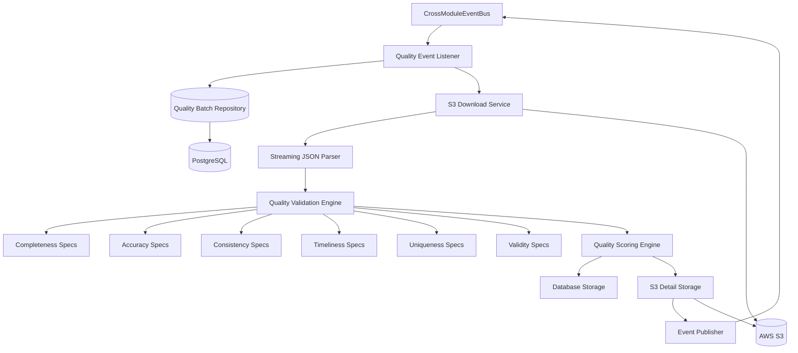

# Data Quality Module Design Document

## Overview

The Data Quality Module is designed as a comprehensive data validation system that assesses exposure data across six quality dimensions: Completeness, Accuracy, Consistency, Timeliness, Uniqueness, and Validity. It follows Domain-Driven Design (DDD) principles within the modular monolithic architecture, implementing business rules through the Specification Pattern and using the CrossModuleEventBus for inter-module communication.

The module processes batches of exposure data asynchronously, validates them against configurable business rules, calculates weighted quality scores, stores summary results in the database, archives detailed results in S3, and publishes quality events for downstream consumption by reporting and alerting services.

**Key Design Decisions:**
- **Six-Dimensional Quality Assessment**: Comprehensive evaluation across all data quality aspects
- **Specification Pattern**: Business rules implemented as composable, testable specifications
- **Result Pattern**: Domain-safe error handling without exceptions
- **Weighted Scoring System**: Configurable dimension weights for flexible quality assessment
- **CrossModuleEventBus**: Reliable event publishing within monolithic architecture
- **Dual Storage Strategy**: Summary in database, detailed results in S3

## Architecture

### High-Level Architecture



### Processing Flow

1. **Event Reception**: Listen for BatchIngested events from CrossModuleEventBus
2. **Batch Initialization**: Create quality report record with PENDING status
3. **Data Retrieval**: Download exposure data from S3 using streaming parser
4. **Quality Validation**: Apply six-dimensional validation using Specification pattern
5. **Score Calculation**: Compute weighted quality scores and compliance status
6. **Database Storage**: Store quality summary with error summaries
7. **S3 Archival**: Store detailed validation results in S3
8. **Event Publishing**: Publish BatchQualityCompleted event

### Module Boundaries

The Data Quality Module maintains clear boundaries:
- **Input**: BatchIngested events via CrossModuleEventBus
- **Output**: BatchQualityCompleted events, quality reports, S3 detailed results
- **Dependencies**: S3 (external), regtech-core (shared kernel)
- **Data Ownership**: Quality reports, validation results, quality metrics

## Components and Interfaces

### Domain Layer

#### QualityReport Aggregate
```java
public class QualityReport {
    private QualityReportId reportId;
    private BatchId batchId;
    private BankId bankId;
    private QualityStatus status;
    private QualityScores scores;
    private ValidationSummary validationSummary;
    private S3Reference detailsReference;
    private List<DomainEvent> domainEvents;
    
    // Factory method
    public static QualityReport createForBatch(BatchId batchId, BankId bankId) {
        return new QualityReport(
            QualityReportId.generate(),
            batchId,
            bankId,
            QualityStatus.PENDING,
            QualityScores.empty(),
            ValidationSummary.empty(),
            null,
            new ArrayList<>()
        );
    }
    
    // Business behavior methods
    public Result<Void> startValidation();
    public Result<Void> recordValidationResults(ValidationResult results);
    public Result<Void> calculateScores(QualityScores scores);
    public Result<Void> storeDetailedResults(S3Reference s3Reference);
    public Result<Void> completeValidation();
    public Result<Void> markAsFailed(String errorMessage);
    
    // State queries
    public boolean canStartValidation();
    public boolean canRecordResults();
    public boolean canCalculateScores();
    public boolean isCompleted();
}
```

#### Quality Dimensions Value Objects
```java
public record QualityScores(
    double completenessScore,
    double accuracyScore,
    double consistencyScore,
    double timelinessScore,
    double uniquenessScore,
    double validityScore,
    double overallScore,
    QualityGrade grade
) {
    public static QualityScores calculate(
        DimensionScores dimensions,
        QualityWeights weights
    ) {
        double overall = (dimensions.completeness() * weights.completeness()) +
                        (dimensions.accuracy() * weights.accuracy()) +
                        (dimensions.consistency() * weights.consistency()) +
                        (dimensions.timeliness() * weights.timeliness()) +
                        (dimensions.uniqueness() * weights.uniqueness()) +
                        (dimensions.validity() * weights.validity());
        
        return new QualityScores(
            dimensions.completeness(),
            dimensions.accuracy(),
            dimensions.consistency(),
            dimensions.timeliness(),
            dimensions.uniqueness(),
            dimensions.validity(),
            overall,
            QualityGrade.fromScore(overall)
        );
    }
}

public enum QualityGrade {
    EXCELLENT(95.0, "A+"),
    VERY_GOOD(90.0, "A"),
    GOOD(80.0, "B"),
    ACCEPTABLE(70.0, "C"),
    POOR(0.0, "F");
    
    private final double threshold;
    private final String displayName;
    
    public static QualityGrade fromScore(double score) {
        return Arrays.stream(values())
            .filter(grade -> score >= grade.threshold)
            .findFirst()
            .orElse(POOR);
    }
}

public record QualityWeights(
    double completeness,    // Default: 0.25 (25%)
    double accuracy,        // Default: 0.25 (25%)
    double consistency,     // Default: 0.20 (20%)
    double timeliness,      // Default: 0.15 (15%)
    double uniqueness,      // Default: 0.10 (10%)
    double validity         // Default: 0.05 (5%)
) {
    public static QualityWeights defaultWeights() {
        return new QualityWeights(0.25, 0.25, 0.20, 0.15, 0.10, 0.05);
    }
}
```

#### Specification Pattern Implementation

##### Base Specification Interface
```java
public interface Specification<T> {
    Result<Void> isSatisfiedBy(T candidate);
    
    default Specification<T> and(Specification<T> other) {
        return new AndSpecification<>(this, other);
    }
    
    default Specification<T> or(Specification<T> other) {
        return new OrSpecification<>(this, other);
    }
    
    default Specification<T> not() {
        return new NotSpecification<>(this);
    }
}

public class AndSpecification<T> implements Specification<T> {
    private final Specification<T> left;
    private final Specification<T> right;
    
    @Override
    public Result<Void> isSatisfiedBy(T candidate) {
        Result<Void> leftResult = left.isSatisfiedBy(candidate);
        if (!leftResult.isSuccess()) return leftResult;
        
        return right.isSatisfiedBy(candidate);
    }
}
```

##### Completeness Specifications
```java
public class CompletenessSpecifications {
    
    public static Specification<ExposureRecord> hasRequiredFields() {
        return exposure -> {
            List<ErrorDetail> errors = new ArrayList<>();
            
            if (isBlank(exposure.getExposureId())) {
                errors.add(ErrorDetail.of("COMPLETENESS_EXPOSURE_ID_MISSING", 
                    "Exposure ID is required", "exposure_id"));
            }
            
            if (exposure.getAmount() == null) {
                errors.add(ErrorDetail.of("COMPLETENESS_AMOUNT_MISSING", 
                    "Amount is required", "amount"));
            }
            
            if (isBlank(exposure.getCurrency())) {
                errors.add(ErrorDetail.of("COMPLETENESS_CURRENCY_MISSING", 
                    "Currency is required", "currency"));
            }
            
            if (isBlank(exposure.getCountry())) {
                errors.add(ErrorDetail.of("COMPLETENESS_COUNTRY_MISSING", 
                    "Country is required", "country"));
            }
            
            if (isBlank(exposure.getSector())) {
                errors.add(ErrorDetail.of("COMPLETENESS_SECTOR_MISSING", 
                    "Sector is required", "sector"));
            }
            
            return errors.isEmpty() ? Result.success() : Result.failure(errors);
        };
    }
    
    public static Specification<ExposureRecord> hasLeiForCorporates() {
        return exposure -> {
            if (isCorporateExposure(exposure) && isBlank(exposure.getLeiCode())) {
                return Result.failure(ErrorDetail.of("COMPLETENESS_LEI_MISSING", 
                    "LEI code required for corporate exposures", "lei_code"));
            }
            return Result.success();
        };
    }
    
    public static Specification<ExposureRecord> hasMaturityForTermExposures() {
        return exposure -> {
            if (isTermExposure(exposure) && exposure.getMaturityDate() == null) {
                return Result.failure(ErrorDetail.of("COMPLETENESS_MATURITY_MISSING", 
                    "Maturity date required for term exposures", "maturity_date"));
            }
            return Result.success();
        };
    }
    
    private static boolean isCorporateExposure(ExposureRecord exposure) {
        return exposure.getSector() != null && 
               (exposure.getSector().startsWith("CORPORATE") || 
                exposure.getSector().equals("BANKING"));
    }
    
    private static boolean isTermExposure(ExposureRecord exposure) {
        return exposure.getProductType() != null && 
               !exposure.getProductType().equals("EQUITY");
    }
}
```

##### Accuracy Specifications
```java
public class AccuracySpecifications {
    
    public static Specification<ExposureRecord> hasPositiveAmount() {
        return exposure -> {
            if (exposure.getAmount() != null && 
                exposure.getAmount().compareTo(BigDecimal.ZERO) <= 0) {
                return Result.failure(ErrorDetail.of("ACCURACY_AMOUNT_NOT_POSITIVE", 
                    "Amount must be positive", "amount"));
            }
            return Result.success();
        };
    }
    
    public static Specification<ExposureRecord> hasValidCurrency() {
        return exposure -> {
            if (exposure.getCurrency() != null && 
                !CurrencyValidator.isValidISO4217(exposure.getCurrency())) {
                return Result.failure(ErrorDetail.of("ACCURACY_INVALID_CURRENCY", 
                    "Currency must be valid ISO 4217 code", "currency"));
            }
            return Result.success();
        };
    }
    
    public static Specification<ExposureRecord> hasValidCountry() {
        return exposure -> {
            if (exposure.getCountry() != null && 
                !CountryValidator.isValidISO3166(exposure.getCountry())) {
                return Result.failure(ErrorDetail.of("ACCURACY_INVALID_COUNTRY", 
                    "Country must be valid ISO 3166 code", "country"));
            }
            return Result.success();
        };
    }
    
    public static Specification<ExposureRecord> hasValidLeiFormat() {
        return exposure -> {
            if (exposure.getLeiCode() != null && 
                !LeiValidator.isValidFormat(exposure.getLeiCode())) {
                return Result.failure(ErrorDetail.of("ACCURACY_INVALID_LEI_FORMAT", 
                    "LEI code must be 20 alphanumeric characters", "lei_code"));
            }
            return Result.success();
        };
    }
    
    public static Specification<ExposureRecord> hasReasonableAmount() {
        return exposure -> {
            if (exposure.getAmount() != null && 
                exposure.getAmount().compareTo(new BigDecimal("10000000000")) > 0) {
                return Result.failure(ErrorDetail.of("ACCURACY_AMOUNT_UNREASONABLE", 
                    "Amount exceeds reasonable bounds (10B EUR)", "amount"));
            }
            return Result.success();
        };
    }
}
```

##### Consistency Specifications
```java
public class ConsistencySpecifications {
    
    public static Specification<ExposureRecord> currencyMatchesCountry() {
        return exposure -> {
            if (exposure.getCurrency() != null && exposure.getCountry() != null) {
                if (!CurrencyCountryValidator.isConsistent(
                    exposure.getCurrency(), exposure.getCountry())) {
                    return Result.failure(ErrorDetail.of("CONSISTENCY_CURRENCY_COUNTRY_MISMATCH", 
                        "Currency does not match country", "currency"));
                }
            }
            return Result.success();
        };
    }
    
    public static Specification<ExposureRecord> sectorMatchesCounterpartyType() {
        return exposure -> {
            if (exposure.getSector() != null && exposure.getCounterpartyType() != null) {
                if (!SectorValidator.isConsistentWithCounterpartyType(
                    exposure.getSector(), exposure.getCounterpartyType())) {
                    return Result.failure(ErrorDetail.of("CONSISTENCY_SECTOR_COUNTERPARTY_MISMATCH", 
                        "Sector inconsistent with counterparty type", "sector"));
                }
            }
            return Result.success();
        };
    }
    
    public static Specification<ExposureRecord> ratingMatchesRiskCategory() {
        return exposure -> {
            if (exposure.getInternalRating() != null && exposure.getRiskCategory() != null) {
                if (!RatingValidator.isConsistentWithRiskCategory(
                    exposure.getInternalRating(), exposure.getRiskCategory())) {
                    return Result.failure(ErrorDetail.of("CONSISTENCY_RATING_RISK_MISMATCH", 
                        "Internal rating inconsistent with risk category", "internal_rating"));
                }
            }
            return Result.success();
        };
    }
}
```

##### Timeliness Specifications
```java
public class TimelinessSpecifications {
    
    public static Specification<ExposureRecord> isWithinReportingPeriod() {
        return exposure -> {
            if (exposure.getReportingDate() != null) {
                LocalDate reportingDate = exposure.getReportingDate();
                LocalDate now = LocalDate.now();
                
                if (reportingDate.isAfter(now)) {
                    return Result.failure(ErrorDetail.of("TIMELINESS_FUTURE_REPORTING_DATE", 
                        "Reporting date cannot be in the future", "reporting_date"));
                }
                
                if (reportingDate.isBefore(now.minusDays(90))) {
                    return Result.failure(ErrorDetail.of("TIMELINESS_STALE_REPORTING_DATE", 
                        "Reporting date is too old (>90 days)", "reporting_date"));
                }
            }
            return Result.success();
        };
    }
    
    public static Specification<ExposureRecord> hasRecentValuation() {
        return exposure -> {
            if (exposure.getValuationDate() != null) {
                LocalDate valuationDate = exposure.getValuationDate();
                LocalDate now = LocalDate.now();
                
                if (valuationDate.isBefore(now.minusDays(30))) {
                    return Result.failure(ErrorDetail.of("TIMELINESS_STALE_VALUATION", 
                        "Valuation date is too old (>30 days)", "valuation_date"));
                }
            }
            return Result.success();
        };
    }
}
```

##### Uniqueness Specifications
```java
public class UniquenessSpecifications {
    
    public static Specification<List<ExposureRecord>> hasUniqueExposureIds() {
        return exposures -> {
            Set<String> seenIds = new HashSet<>();
            List<String> duplicates = new ArrayList<>();
            
            for (ExposureRecord exposure : exposures) {
                if (exposure.getExposureId() != null) {
                    if (!seenIds.add(exposure.getExposureId())) {
                        duplicates.add(exposure.getExposureId());
                    }
                }
            }
            
            if (!duplicates.isEmpty()) {
                return Result.failure(ErrorDetail.of("UNIQUENESS_DUPLICATE_EXPOSURE_IDS", 
                    "Duplicate exposure IDs found: " + String.join(", ", duplicates), 
                    "exposure_id"));
            }
            
            return Result.success();
        };
    }
    
    public static Specification<List<ExposureRecord>> hasUniqueCounterpartyExposurePairs() {
        return exposures -> {
            Set<String> seenPairs = new HashSet<>();
            List<String> duplicates = new ArrayList<>();
            
            for (ExposureRecord exposure : exposures) {
                if (exposure.getCounterpartyId() != null && exposure.getExposureId() != null) {
                    String pair = exposure.getCounterpartyId() + ":" + exposure.getExposureId();
                    if (!seenPairs.add(pair)) {
                        duplicates.add(pair);
                    }
                }
            }
            
            if (!duplicates.isEmpty()) {
                return Result.failure(ErrorDetail.of("UNIQUENESS_DUPLICATE_COUNTERPARTY_EXPOSURE", 
                    "Duplicate counterparty-exposure pairs found", "counterparty_id"));
            }
            
            return Result.success();
        };
    }
}
```

##### Validity Specifications
```java
public class ValiditySpecifications {
    
    public static Specification<ExposureRecord> hasValidSector() {
        return exposure -> {
            if (exposure.getSector() != null && 
                !SectorValidator.isValidSector(exposure.getSector())) {
                return Result.failure(ErrorDetail.of("VALIDITY_INVALID_SECTOR", 
                    "Sector must be from approved list", "sector"));
            }
            return Result.success();
        };
    }
    
    public static Specification<ExposureRecord> hasValidRiskWeight() {
        return exposure -> {
            if (exposure.getRiskWeight() != null) {
                BigDecimal riskWeight = exposure.getRiskWeight();
                if (riskWeight.compareTo(BigDecimal.ZERO) < 0 || 
                    riskWeight.compareTo(new BigDecimal("1.5")) > 0) {
                    return Result.failure(ErrorDetail.of("VALIDITY_INVALID_RISK_WEIGHT", 
                        "Risk weight must be between 0 and 1.5", "risk_weight"));
                }
            }
            return Result.success();
        };
    }
    
    public static Specification<ExposureRecord> hasValidMaturityDate() {
        return exposure -> {
            if (exposure.getMaturityDate() != null && exposure.getReportingDate() != null) {
                if (exposure.getMaturityDate().isBefore(exposure.getReportingDate())) {
                    return Result.failure(ErrorDetail.of("VALIDITY_MATURITY_BEFORE_REPORTING", 
                        "Maturity date cannot be before reporting date", "maturity_date"));
                }
            }
            return Result.success();
        };
    }
}
```

### Application Layer

#### Command Handlers
```java
@Component
public class ValidateBatchQualityCommandHandler {
    private final IQualityReportRepository qualityReportRepository;
    private final QualityValidationEngine validationEngine;
    private final QualityScoringEngine scoringEngine;
    private final S3StorageService s3StorageService;
    private final CrossModuleEventPublisher eventPublisher;
    
    public Result<Void> handle(ValidateBatchQualityCommand command) {
        // 1. Create quality report
        QualityReport report = QualityReport.createForBatch(
            command.getBatchId(), command.getBankId());
        
        Result<Void> startResult = report.startValidation();
        if (!startResult.isSuccess()) return startResult;
        
        qualityReportRepository.save(report);
        
        // 2. Download and parse exposure data
        Result<List<ExposureRecord>> downloadResult = 
            s3StorageService.downloadExposures(command.getS3Uri());
        if (!downloadResult.isSuccess()) {
            report.markAsFailed(downloadResult.getError().getMessage());
            qualityReportRepository.save(report);
            return Result.failure(downloadResult.getError());
        }
        
        // 3. Validate quality across all dimensions
        ValidationResult validationResult = 
            validationEngine.validateExposures(downloadResult.getValue());
        
        Result<Void> recordResult = report.recordValidationResults(validationResult);
        if (!recordResult.isSuccess()) return recordResult;
        
        // 4. Calculate quality scores
        QualityScores scores = scoringEngine.calculateScores(validationResult);
        
        Result<Void> scoreResult = report.calculateScores(scores);
        if (!scoreResult.isSuccess()) return scoreResult;
        
        // 5. Store detailed results in S3
        Result<S3Reference> s3Result = 
            s3StorageService.storeDetailedResults(command.getBatchId(), validationResult);
        if (!s3Result.isSuccess()) return Result.failure(s3Result.getError());
        
        Result<Void> storeResult = report.storeDetailedResults(s3Result.getValue());
        if (!storeResult.isSuccess()) return storeResult;
        
        // 6. Complete validation
        Result<Void> completeResult = report.completeValidation();
        if (!completeResult.isSuccess()) return completeResult;
        
        qualityReportRepository.save(report);
        
        // 7. Publish completion event
        BatchQualityCompletedEvent event = new BatchQualityCompletedEvent(
            command.getBatchId(), command.getBankId(), scores, s3Result.getValue());
        
        return eventPublisher.publishBatchQualityCompleted(event);
    }
}
```

#### Query Handlers
```java
@Component
public class QualityReportQueryHandler {
    private final IQualityReportRepository qualityReportRepository;
    
    public Result<QualityReportDto> handle(GetQualityReportQuery query) {
        Optional<QualityReport> report = 
            qualityReportRepository.findByBatchId(query.getBatchId());
        
        if (report.isEmpty()) {
            return Result.failure(ErrorDetail.of("QUALITY_REPORT_NOT_FOUND", 
                "Quality report not found for batch", "batch_id"));
        }
        
        QualityReportDto dto = QualityReportDto.fromDomain(report.get());
        return Result.success(dto);
    }
}
```

### Infrastructure Layer

#### Quality Validation Engine
```java
@Component
public class QualityValidationEngine {
    private final QualityWeights weights;
    
    public ValidationResult validateExposures(List<ExposureRecord> exposures) {
        Map<String, ExposureValidationResult> exposureResults = new HashMap<>();
        List<ValidationError> allErrors = new ArrayList<>();
        
        // Individual exposure validation
        for (ExposureRecord exposure : exposures) {
            ExposureValidationResult result = validateSingleExposure(exposure);
            exposureResults.put(exposure.getExposureId(), result);
            allErrors.addAll(result.getErrors());
        }
        
        // Batch-level validation (uniqueness)
        List<ValidationError> batchErrors = validateBatchLevel(exposures);
        allErrors.addAll(batchErrors);
        
        // Calculate dimension scores
        DimensionScores dimensionScores = calculateDimensionScores(exposureResults, batchErrors);
        
        return ValidationResult.builder()
            .exposureResults(exposureResults)
            .batchErrors(batchErrors)
            .allErrors(allErrors)
            .dimensionScores(dimensionScores)
            .totalExposures(exposures.size())
            .validExposures(countValidExposures(exposureResults))
            .build();
    }
    
    private ExposureValidationResult validateSingleExposure(ExposureRecord exposure) {
        List<ValidationError> errors = new ArrayList<>();
        Map<QualityDimension, List<ValidationError>> dimensionErrors = new HashMap<>();
        
        // Completeness validation
        List<ValidationError> completenessErrors = validateCompleteness(exposure);
        errors.addAll(completenessErrors);
        dimensionErrors.put(QualityDimension.COMPLETENESS, completenessErrors);
        
        // Accuracy validation
        List<ValidationError> accuracyErrors = validateAccuracy(exposure);
        errors.addAll(accuracyErrors);
        dimensionErrors.put(QualityDimension.ACCURACY, accuracyErrors);
        
        // Consistency validation
        List<ValidationError> consistencyErrors = validateConsistency(exposure);
        errors.addAll(consistencyErrors);
        dimensionErrors.put(QualityDimension.CONSISTENCY, consistencyErrors);
        
        // Timeliness validation
        List<ValidationError> timelinessErrors = validateTimeliness(exposure);
        errors.addAll(timelinessErrors);
        dimensionErrors.put(QualityDimension.TIMELINESS, timelinessErrors);
        
        // Validity validation
        List<ValidationError> validityErrors = validateValidity(exposure);
        errors.addAll(validityErrors);
        dimensionErrors.put(QualityDimension.VALIDITY, validityErrors);
        
        return ExposureValidationResult.builder()
            .exposureId(exposure.getExposureId())
            .errors(errors)
            .dimensionErrors(dimensionErrors)
            .isValid(errors.isEmpty())
            .build();
    }
    
    private List<ValidationError> validateCompleteness(ExposureRecord exposure) {
        List<ValidationError> errors = new ArrayList<>();
        
        Specification<ExposureRecord> completenessSpec = 
            CompletenessSpecifications.hasRequiredFields()
                .and(CompletenessSpecifications.hasLeiForCorporates())
                .and(CompletenessSpecifications.hasMaturityForTermExposures());
        
        Result<Void> result = completenessSpec.isSatisfiedBy(exposure);
        if (!result.isSuccess()) {
            errors.addAll(result.getErrors().stream()
                .map(error -> ValidationError.fromErrorDetail(error, QualityDimension.COMPLETENESS))
                .collect(Collectors.toList()));
        }
        
        return errors;
    }
    
    private List<ValidationError> validateAccuracy(ExposureRecord exposure) {
        List<ValidationError> errors = new ArrayList<>();
        
        Specification<ExposureRecord> accuracySpec = 
            AccuracySpecifications.hasPositiveAmount()
                .and(AccuracySpecifications.hasValidCurrency())
                .and(AccuracySpecifications.hasValidCountry())
                .and(AccuracySpecifications.hasValidLeiFormat())
                .and(AccuracySpecifications.hasReasonableAmount());
        
        Result<Void> result = accuracySpec.isSatisfiedBy(exposure);
        if (!result.isSuccess()) {
            errors.addAll(result.getErrors().stream()
                .map(error -> ValidationError.fromErrorDetail(error, QualityDimension.ACCURACY))
                .collect(Collectors.toList()));
        }
        
        return errors;
    }
    
    // Similar methods for other dimensions...
}
```

#### Quality Scoring Engine
```java
@Component
public class QualityScoringEngine {
    private final QualityWeights defaultWeights;
    
    public QualityScores calculateScores(ValidationResult validationResult) {
        DimensionScores dimensionScores = validationResult.getDimensionScores();
        
        return QualityScores.calculate(dimensionScores, defaultWeights);
    }
    
    public DimensionScores calculateDimensionScores(
        Map<String, ExposureValidationResult> exposureResults,
        List<ValidationError> batchErrors) {
        
        int totalExposures = exposureResults.size();
        
        double completenessScore = calculateDimensionScore(
            exposureResults, QualityDimension.COMPLETENESS, totalExposures);
        double accuracyScore = calculateDimensionScore(
            exposureResults, QualityDimension.ACCURACY, totalExposures);
        double consistencyScore = calculateDimensionScore(
            exposureResults, QualityDimension.CONSISTENCY, totalExposures);
        double timelinessScore = calculateDimensionScore(
            exposureResults, QualityDimension.TIMELINESS, totalExposures);
        double validityScore = calculateDimensionScore(
            exposureResults, QualityDimension.VALIDITY, totalExposures);
        
        // Uniqueness is batch-level
        double uniquenessScore = calculateUniquenessScore(batchErrors, totalExposures);
        
        return new DimensionScores(
            completenessScore,
            accuracyScore,
            consistencyScore,
            timelinessScore,
            uniquenessScore,
            validityScore
        );
    }
    
    private double calculateDimensionScore(
        Map<String, ExposureValidationResult> exposureResults,
        QualityDimension dimension,
        int totalExposures) {
        
        long passedCount = exposureResults.values().stream()
            .mapToLong(result -> result.getDimensionErrors().get(dimension).isEmpty() ? 1 : 0)
            .sum();
        
        return totalExposures > 0 ? (double) passedCount / totalExposures * 100.0 : 0.0;
    }
}
```

### Presentation Layer

#### Quality Report Controller
```java
@Component
public class QualityReportController extends BaseController implements IEndpoint {
    private final QualityReportQueryHandler queryHandler;
    
    @Override
    public RouterFunction<ServerResponse> mapEndpoint() {
        return route(GET("/api/v1/data-quality/reports?bankId=..."), this::getQualityReport)
            .withAttribute("tags", new String[]{"Quality", "Reports"})
            .withAttribute("permissions", new String[]{"quality:read"});
    }
    
    private ServerResponse getQualityReport(ServerRequest request) {
        String batchId = request.pathVariable("batchId");
        
        GetQualityReportQuery query = new GetQualityReportQuery(batchId);
        Result<QualityReportDto> result = queryHandler.handle(query);
        
        if (result.isSuccess()) {
            return ok().body(ApiResponse.success(result.getValue()));
        } else {
            return handleError(result.getError());
        }
    }
}
```

## Data Models

### Database Schema

#### quality_reports Table
```sql
CREATE TABLE quality_reports (
    report_id VARCHAR(50) PRIMARY KEY,
    batch_id VARCHAR(50) UNIQUE NOT NULL,
    bank_id VARCHAR(20) NOT NULL,
    status VARCHAR(20) NOT NULL,
    
    -- Quality Scores
    completeness_score DECIMAL(5,2),
    accuracy_score DECIMAL(5,2),
    consistency_score DECIMAL(5,2),
    timeliness_score DECIMAL(5,2),
    uniqueness_score DECIMAL(5,2),
    validity_score DECIMAL(5,2),
    overall_score DECIMAL(5,2),
    quality_grade VARCHAR(5),
    
    -- Validation Counts
    total_exposures INTEGER,
    valid_exposures INTEGER,
    total_validations INTEGER,
    passed_validations INTEGER,
    failed_validations INTEGER,
    
    -- S3 Reference
    details_s3_uri TEXT,
    
    -- Timestamps
    started_at TIMESTAMP WITH TIME ZONE,
    completed_at TIMESTAMP WITH TIME ZONE,
    created_at TIMESTAMP WITH TIME ZONE DEFAULT NOW(),
    updated_at TIMESTAMP WITH TIME ZONE DEFAULT NOW(),
    
    -- Error handling
    error_message TEXT,
    
    -- Indexes
    INDEX idx_quality_reports_batch_id (batch_id),
    INDEX idx_quality_reports_bank_id (bank_id),
    INDEX idx_quality_reports_status (status),
    INDEX idx_quality_reports_overall_score (overall_score),
    INDEX idx_quality_reports_quality_grade (quality_grade)
);
```

#### quality_error_summaries Table
```sql
CREATE TABLE quality_error_summaries (
    id BIGSERIAL PRIMARY KEY,
    report_id VARCHAR(50) NOT NULL,
    dimension VARCHAR(20) NOT NULL,
    error_code VARCHAR(100) NOT NULL,
    error_message VARCHAR(500) NOT NULL,
    error_count INTEGER NOT NULL,
    affected_exposure_ids TEXT[], -- Array of up to 10 examples
    created_at TIMESTAMP WITH TIME ZONE DEFAULT NOW(),
    
    -- Indexes
    INDEX idx_quality_error_summaries_report_id (report_id),
    INDEX idx_quality_error_summaries_dimension (dimension),
    INDEX idx_quality_error_summaries_error_code (error_code),
    
    FOREIGN KEY (report_id) REFERENCES quality_reports(report_id)
);
```

### Domain Events

#### BatchQualityCompletedEvent
```java
public class BatchQualityCompletedEvent extends DomainEvent {
    private final String batchId;
    private final String bankId;
    private final QualityScores scores;
    private final S3Reference detailsReference;
    private final ValidationSummary validationSummary;
    private final Instant completedAt;
    
    public BatchQualityCompletedEvent(
        String batchId,
        String bankId,
        QualityScores scores,
        S3Reference detailsReference,
        ValidationSummary validationSummary
    ) {
        super();
        this.batchId = batchId;
        this.bankId = bankId;
        this.scores = scores;
        this.detailsReference = detailsReference;
        this.validationSummary = validationSummary;
        this.completedAt = Instant.now();
    }
}
```

### DTOs and Value Objects

#### QualityReportDto
```java
public record QualityReportDto(
    String reportId,
    String batchId,
    String bankId,
    String status,
    QualityScoresDto scores,
    ValidationSummaryDto validationSummary,
    String detailsS3Uri,
    Instant startedAt,
    Instant completedAt,
    String errorMessage
) {
    public static QualityReportDto fromDomain(QualityReport report) {
        return new QualityReportDto(
            report.getReportId().getValue(),
            report.getBatchId().getValue(),
            report.getBankId().getValue(),
            report.getStatus().name(),
            QualityScoresDto.fromDomain(report.getScores()),
            ValidationSummaryDto.fromDomain(report.getValidationSummary()),
            report.getDetailsReference() != null ? report.getDetailsReference().getUri() : null,
            report.getStartedAt(),
            report.getCompletedAt(),
            report.getErrorMessage()
        );
    }
}

public record QualityScoresDto(
    double completenessScore,
    double accuracyScore,
    double consistencyScore,
    double timelinessScore,
    double uniquenessScore,
    double validityScore,
    double overallScore,
    String grade
) {
    public static QualityScoresDto fromDomain(QualityScores scores) {
        return new QualityScoresDto(
            scores.completenessScore(),
            scores.accuracyScore(),
            scores.consistencyScore(),
            scores.timelinessScore(),
            scores.uniquenessScore(),
            scores.validityScore(),
            scores.overallScore(),
            scores.grade().getDisplayName()
        );
    }
}
```

## Error Handling

### Error Categories

1. **Validation Errors**: Data quality rule violations across six dimensions
2. **Business Rule Violations**: Specification pattern failures
3. **Infrastructure Errors**: S3 failures, database connectivity
4. **Integration Errors**: CrossModuleEventBus failures

### Error Response Strategy

```java
public class ValidationError {
    private final String code;
    private final String message;
    private final String field;
    private final QualityDimension dimension;
    private final String exposureId;
    
    public static ValidationError fromErrorDetail(ErrorDetail error, QualityDimension dimension) {
        return new ValidationError(
            error.getCode(),
            error.getMessage(),
            error.getField(),
            dimension,
            null
        );
    }
}

public class ValidationResult {
    private final Map<String, ExposureValidationResult> exposureResults;
    private final List<ValidationError> batchErrors;
    private final List<ValidationError> allErrors;
    private final DimensionScores dimensionScores;
    private final int totalExposures;
    private final int validExposures;
}
```

## Testing Strategy

### Unit Testing
- Specification pattern implementations for all quality dimensions
- Quality scoring calculations with different weights
- Domain aggregate behavior and state transitions
- Result pattern usage and error handling

### Integration Testing
- S3 storage operations with localstack
- Database operations with testcontainers
- CrossModuleEventBus integration
- End-to-end quality validation pipeline

### Performance Testing
- Large batch processing (1M+ exposures)
- Memory usage during streaming validation
- Concurrent quality validation scenarios
- S3 upload performance for detailed results

### Quality Testing
- Validation accuracy against known datasets
- Score calculation correctness
- Specification composition behavior
- Error message clarity and actionability

## Performance Considerations

### Scalability Design Decisions

1. **Streaming Validation**: Process exposures one at a time to avoid memory issues
2. **Parallel Processing**: Validate multiple batches concurrently
3. **Efficient Scoring**: Calculate dimension scores incrementally
4. **Database Optimization**: Store summaries only, detailed results in S3
5. **Caching**: Cache validation rules and configuration

### Performance Targets

- Small batches (< 1000 exposures): Complete within 5 seconds
- Large batches (> 100,000 exposures): Process without memory exhaustion
- Quality report queries: Respond within 2 seconds
- Concurrent validation: Handle multiple batches without resource contention

### Monitoring Metrics

- Validation processing time by batch size
- Quality score distributions over time
- Error rates by dimension and rule
- S3 storage success rates and latencies
- Memory usage during validation

## Security and Compliance

### Security Measures

1. **Encryption at Rest**: AES-256 for S3 detailed results storage
2. **Encryption in Transit**: TLS 1.3 for all communications
3. **Access Control**: JWT token validation for quality report access
4. **Audit Logging**: Complete validation history with timestamps
5. **Data Privacy**: No PII in validation error messages

### Compliance Features

1. **Data Quality Standards**: Six-dimensional assessment framework
2. **Audit Trail**: Complete validation history and score calculations
3. **Regulatory Reporting**: Quality metrics for regulatory submissions
4. **Data Lineage**: S3 versioning maintains validation history
5. **Retention Policies**: Configurable retention for quality reports

### Monitoring and Observability

#### Metrics Collection
- Quality scores by dimension and overall
- Validation rule failure rates
- Processing time by batch size
- Error rates by quality dimension
- S3 operation success rates

#### Structured Logging
- Correlation IDs for batch tracing
- Quality dimension breakdown in logs
- Specification failure details
- Performance metrics with timing data

#### Health Checks
- Database connectivity
- S3 service availability
- CrossModuleEventBus health
- Validation engine status

#### Alerting Thresholds
- Overall quality score < 70% (POOR grade)
- Processing time > 60 seconds for batches < 10K exposures
- Error rate > 10% over 10-minute window
- S3 upload failure rate > 2%
- Database query time > 5 seconds