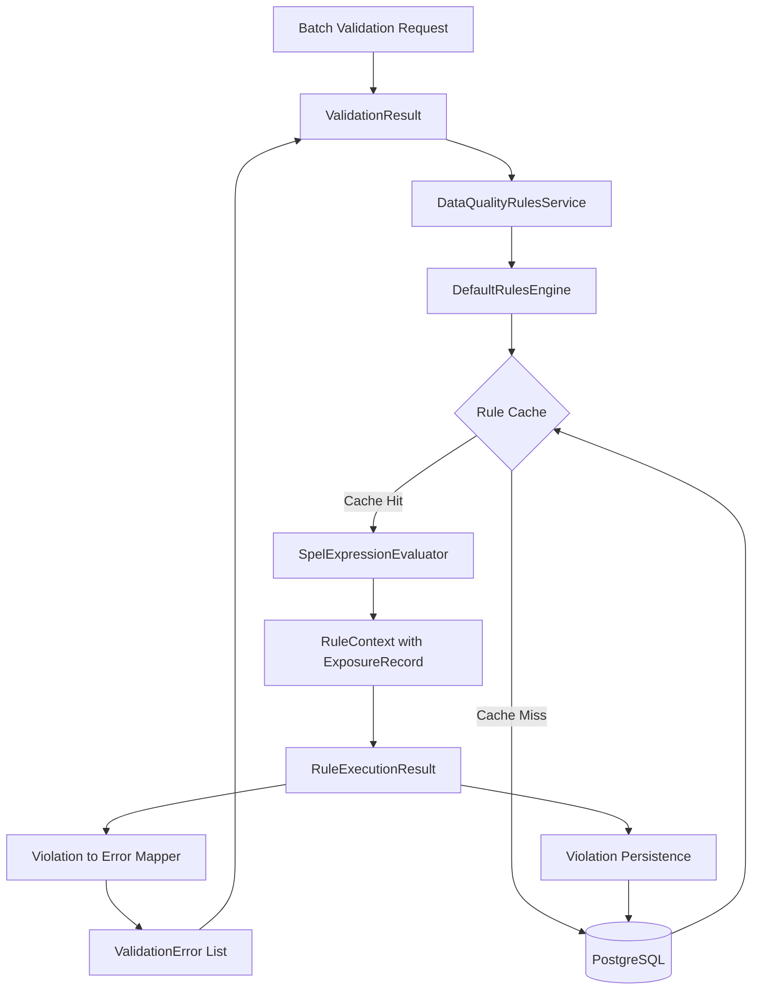

# Data Quality Rules Integration Design Document

## Overview

This design document describes the integration of the database-driven Rules Engine into the Data Quality validation pipeline, replacing the existing Specification-based validation approach. The Rules Engine infrastructure already exists (database schema, domain entities, SpEL evaluator, repositories) but is not yet connected to the active validation flow.

The integration will modify `ValidationResult` to execute Rules Engine validations exclusively, migrate all existing Specification logic to database rules, and maintain backward compatibility with all 309 existing tests. The system will use Spring Expression Language (SpEL) for dynamic rule evaluation, allowing business users to modify validation rules through database updates without code deployment.

**Key Design Decisions:**
- **Complete Migration**: Replace Specifications entirely with Rules Engine (not hybrid)
- **Backward Compatibility**: Maintain identical validation results for all existing tests
- **Database-Driven**: All validation logic stored in PostgreSQL with SpEL expressions
- **Caching Strategy**: In-memory rule caching with configurable TTL for performance
- **Error Format Preservation**: RuleViolations converted to ValidationErrors with same structure
- **Audit Trail**: All rule executions and violations persisted to database

## Architecture

### High-Level Architecture



### Processing Flow

1. **Validation Request**: ValidationResult.validate() receives ExposureRecord
2. **Rules Engine Invocation**: DataQualityRulesService.validateConfigurableRules() called
3. **Rule Loading**: DefaultRulesEngine loads active rules from cache or database
4. **Rule Execution**: Each rule evaluated using SpelExpressionEvaluator with ExposureRecord context
5. **Violation Detection**: Failed rules create RuleViolation objects
6. **Error Mapping**: RuleViolations converted to ValidationErrors with dimension mapping
7. **Persistence**: Violations and execution logs saved to database
8. **Result Return**: ValidationErrors returned in ValidationResult

## Components and Interfaces

### Modified ValidationResult

```java
public class ValidationResult {
    private final DataQualityRulesService rulesService;
    
    public static ValidationResult validate(
        ExposureRecord exposure,
        DataQualityRulesService rulesService
    ) {
        List<ValidationError> errors = new ArrayList<>();
        
        // Execute Rules Engine validations
        errors.addAll(rulesService.validateConfigurableRules(exposure));
        
        return new ValidationResult(exposure, errors);
    }
}
```


### DataQualityRulesService Enhancement

```java
@Service
public class DataQualityRulesService {
    private final RulesEngine rulesEngine;
    private final BusinessRuleRepository ruleRepository;
    private final RuleViolationRepository violationRepository;
    private final RuleExecutionLogRepository executionLogRepository;
    
    public List<ValidationError> validateConfigurableRules(ExposureRecord exposure) {
        List<ValidationError> errors = new ArrayList<>();
        
        // Load all active rules
        List<BusinessRule> activeRules = ruleRepository.findByEnabledTrue();
        
        // Execute rules
        List<RuleExecutionResult> results = rulesEngine.executeRules(
            activeRules, 
            createRuleContext(exposure)
        );
        
        // Convert violations to validation errors
        for (RuleExecutionResult result : results) {
            if (!result.isSuccess()) {
                for (RuleViolation violation : result.getViolations()) {
                    errors.add(convertToValidationError(violation));
                    violationRepository.save(violation);
                }
            }
            
            // Log execution
            executionLogRepository.save(createExecutionLog(result));
        }
        
        return errors;
    }
    
    private ValidationError convertToValidationError(RuleViolation violation) {
        return new ValidationError(
            violation.getRule().getRuleCode(),
            violation.getRule().getRuleName(),
            violation.getFieldName(),
            mapToQualityDimension(violation.getRule().getRuleType()),
            violation.getExposureId(),
            mapToValidationSeverity(violation.getSeverity())
        );
    }
    
    private QualityDimension mapToQualityDimension(RuleType ruleType) {
        return switch (ruleType) {
            case COMPLETENESS -> QualityDimension.COMPLETENESS;
            case ACCURACY -> QualityDimension.ACCURACY;
            case CONSISTENCY -> QualityDimension.CONSISTENCY;
            case TIMELINESS -> QualityDimension.TIMELINESS;
            case UNIQUENESS -> QualityDimension.UNIQUENESS;
            case VALIDITY -> QualityDimension.VALIDITY;
            default -> QualityDimension.VALIDITY;
        };
    }
}
```


### Rule Migration Strategy

All existing Specification logic will be migrated to database rules. The migration will create rules for all six quality dimensions:

**Completeness Rules:**
- `COMPLETENESS_EXPOSURE_ID_REQUIRED`: `#exposureId != null && !#exposureId.isEmpty()`
- `COMPLETENESS_AMOUNT_REQUIRED`: `#amount != null`
- `COMPLETENESS_CURRENCY_REQUIRED`: `#currency != null && !#currency.isEmpty()`
- `COMPLETENESS_COUNTRY_REQUIRED`: `#country != null && !#country.isEmpty()`
- `COMPLETENESS_SECTOR_REQUIRED`: `#sector != null && !#sector.isEmpty()`
- `COMPLETENESS_LEI_FOR_CORPORATES`: `#sector != 'CORPORATE' || (#leiCode != null && !#leiCode.isEmpty())`
- `COMPLETENESS_MATURITY_FOR_TERM`: `#productType == 'EQUITY' || #maturityDate != null`
- `COMPLETENESS_INTERNAL_RATING`: `#internalRating != null && !#internalRating.isEmpty()`

**Accuracy Rules:**
- `ACCURACY_POSITIVE_AMOUNT`: `#amount > 0`
- `ACCURACY_VALID_CURRENCY`: `#validCurrencies.contains(#currency)`
- `ACCURACY_VALID_COUNTRY`: `#validCountries.contains(#country)`
- `ACCURACY_VALID_LEI_FORMAT`: `#leiCode == null || #leiCode.matches('[A-Z0-9]{20}')`
- `ACCURACY_REASONABLE_AMOUNT`: `#amount < #maxReasonableAmount`

**Consistency Rules:**
- `CONSISTENCY_CURRENCY_COUNTRY`: Complex logic for currency-country matching
- `CONSISTENCY_SECTOR_COUNTERPARTY`: Sector and counterparty type consistency
- `CONSISTENCY_RATING_RISK`: Internal rating and risk category consistency

**Timeliness Rules:**
- `TIMELINESS_REPORTING_PERIOD`: `DAYS_BETWEEN(#reportingDate, TODAY()) <= #maxReportingAgeDays`
- `TIMELINESS_NO_FUTURE_DATE`: `#reportingDate <= TODAY()`
- `TIMELINESS_RECENT_VALUATION`: `#valuationDate == null || DAYS_BETWEEN(#valuationDate, TODAY()) <= 30`

**Uniqueness Rules:**
- `UNIQUENESS_EXPOSURE_IDS`: Batch-level check for duplicate exposure IDs
- `UNIQUENESS_COUNTERPARTY_EXPOSURE`: Batch-level check for duplicate counterparty-exposure pairs

**Validity Rules:**
- `VALIDITY_VALID_SECTOR`: `#validSectors.contains(#sector)`
- `VALIDITY_RISK_WEIGHT_RANGE`: `#riskWeight >= 0 && #riskWeight <= 1.5`
- `VALIDITY_MATURITY_AFTER_REPORTING`: `#maturityDate == null || #maturityDate >= #reportingDate`

## Data Models

### Enhanced RuleContext

```java
public class DefaultRuleContext implements RuleContext {
    private final ExposureRecord exposure;
    private final Map<String, Object> parameters;
    private final Map<String, List<String>> lists;
    
    @Override
    public Object getVariable(String name) {
        // First check exposure fields
        Object exposureValue = getExposureField(name);
        if (exposureValue != null) return exposureValue;
        
        // Then check parameters
        if (parameters.containsKey(name)) {
            return parameters.get(name);
        }
        
        // Then check lists
        if (lists.containsKey(name)) {
            return lists.get(name);
        }
        
        return null;
    }
    
    private Object getExposureField(String fieldName) {
        return switch (fieldName) {
            case "exposureId" -> exposure.getExposureId();
            case "amount" -> exposure.getAmount();
            case "currency" -> exposure.getCurrency();
            case "country" -> exposure.getCountry();
            case "sector" -> exposure.getSector();
            case "leiCode" -> exposure.getLeiCode();
            case "maturityDate" -> exposure.getMaturityDate();
            case "reportingDate" -> exposure.getReportingDate();
            case "valuationDate" -> exposure.getValuationDate();
            case "productType" -> exposure.getProductType();
            case "internalRating" -> exposure.getInternalRating();
            case "riskWeight" -> exposure.getRiskWeight();
            case "counterpartyId" -> exposure.getCounterpartyId();
            case "counterpartyType" -> exposure.getCounterpartyType();
            case "riskCategory" -> exposure.getRiskCategory();
            default -> null;
        };
    }
}
```


## Correctness Properties

*A property is a characteristic or behavior that should hold true across all valid executions of a system-essentially, a formal statement about what the system should do. Properties serve as the bridge between human-readable specifications and machine-verifiable correctness guarantees.*

### Property 1: Rules Engine Exclusive Execution
*For any* exposure record, when validation is performed, only the Rules Engine should execute (no Specifications)
**Validates: Requirements 1.1**

### Property 2: Identical Validation Results
*For any* exposure record that was validated with Specifications, validating with Rules Engine should produce the same validation errors
**Validates: Requirements 2.1**

### Property 3: All Dimensions Validated
*For any* validation execution, rules from all six quality dimensions (Completeness, Accuracy, Consistency, Timeliness, Uniqueness, Validity) should be evaluated
**Validates: Requirements 2.3**

### Property 4: Disabled Rules Skipped
*For any* rule that is disabled in the database, that rule should not execute during validation
**Validates: Requirements 3.1**

### Property 5: Enabled Rules Execute
*For any* rule that is enabled in the database, that rule should execute during validation
**Validates: Requirements 3.2**

### Property 6: Parameter Updates Applied
*For any* rule parameter that is updated in the database, the new value should be used in rule evaluation after cache refresh
**Validates: Requirements 3.3**

### Property 7: Multiple Rules Aggregate
*For any* exposure with multiple applicable rules for the same field, all enabled rules should execute and all violations should be reported
**Validates: Requirements 3.5**

### Property 8: Violation to Error Conversion
*For any* rule violation detected, it should be converted to a ValidationError with the same rule code, message, field name, and severity
**Validates: Requirements 4.1, 4.2**

### Property 9: Dimension Mapping Correctness
*For any* RuleType value, it should map to the correct QualityDimension (COMPLETENESS→COMPLETENESS, ACCURACY→ACCURACY, etc.)
**Validates: Requirements 4.3**

### Property 10: Dimension Scores Include All Errors
*For any* set of validation errors from Rules Engine, the dimension scores should reflect all errors in their respective dimensions
**Validates: Requirements 4.4**

### Property 11: Report Format Consistency
*For any* validation result, the format should match the structure used before Rules Engine migration (same fields, same structure)
**Validates: Requirements 4.5**

### Property 12: Cache Reuse Across Exposures
*For any* batch of exposures validated sequentially, rules should be loaded from database only once and reused for all exposures
**Validates: Requirements 5.3**

### Property 13: ExposureRecord Fields Available in SpEL
*For any* exposure record field, it should be accessible as a SpEL variable during rule evaluation
**Validates: Requirements 8.1**

### Property 14: Rule Parameters Available in SpEL
*For any* rule with parameters, those parameters should be accessible as SpEL variables during rule evaluation
**Validates: Requirements 8.2**

### Property 15: Null Field Handling
*For any* exposure record with null fields, rule evaluation should handle nulls gracefully without throwing exceptions
**Validates: Requirements 8.4**

### Property 16: Violation Persistence
*For any* rule violation detected, it should be persisted to the rule_violations table with batch_id, exposure_id, rule_code, and violation details
**Validates: Requirements 9.1, 9.2, 9.3**

### Property 17: Execution Log Persistence
*For any* rule execution, an entry should be persisted to rule_execution_log with execution duration, status, and violation count
**Validates: Requirements 9.4, 9.5**

### Property 18: Active Exemption Suppresses Violations
*For any* rule with an active exemption (valid dates, ACTIVE status), violations should not be reported
**Validates: Requirements 10.2**

### Property 19: Expired Exemption Reports Violations
*For any* rule with an expired exemption (past valid_to date), violations should be reported normally
**Validates: Requirements 10.3**

### Property 20: Revoked Exemption Reports Violations
*For any* rule with a revoked exemption (REVOKED status), violations should be reported immediately
**Validates: Requirements 10.4**

### Property 21: Exemption Date Validation
*For any* exemption, the system should validate that valid_from <= valid_to and current date is checked against these dates
**Validates: Requirements 10.5**


## Error Handling

### Rules Engine Unavailable
- **Scenario**: DataQualityRulesService bean not available
- **Handling**: Throw `IllegalStateException` with clear message: "Rules Engine is required but not configured"
- **Recovery**: None - this is a configuration error that must be fixed

### Rule Evaluation Exception
- **Scenario**: SpEL expression throws exception during evaluation
- **Handling**: Log error with rule code and exposure ID, mark rule execution as FAILED, continue with other rules
- **Recovery**: Return partial validation results with error logged

### Database Connection Failure
- **Scenario**: Cannot load rules from database
- **Handling**: If cache is available, use cached rules; otherwise throw `DataAccessException`
- **Recovery**: Retry with exponential backoff (3 attempts)

### Invalid SpEL Expression
- **Scenario**: Rule contains syntactically invalid SpEL expression
- **Handling**: Log error during rule loading, mark rule as disabled, continue with other rules
- **Recovery**: Administrator must fix rule expression in database

### Missing Parameter
- **Scenario**: Rule references parameter that doesn't exist
- **Handling**: Log warning, treat parameter as null, continue evaluation
- **Recovery**: Administrator should add missing parameter to database

### Violation Persistence Failure
- **Scenario**: Cannot save violation to database
- **Handling**: Log error but continue validation (violations still returned in memory)
- **Recovery**: Retry persistence asynchronously

## Testing Strategy

### Unit Testing

**ValidationResult Integration Tests:**
- Test that ValidationResult calls DataQualityRulesService
- Test that Specifications are not called
- Test error handling when service is unavailable
- Test error format consistency

**DataQualityRulesService Tests:**
- Test rule loading and caching
- Test violation to error conversion
- Test dimension mapping
- Test persistence of violations and execution logs

**RuleContext Tests:**
- Test exposure field access
- Test parameter access
- Test list access
- Test null handling

### Property-Based Testing

The system will use **jqwik** for property-based testing in Java. Each correctness property will be implemented as a property-based test.

**Property Test Configuration:**
- Minimum 100 iterations per property
- Custom generators for ExposureRecord with realistic data
- Custom generators for BusinessRule with valid SpEL expressions
- Shrinking enabled to find minimal failing examples

**Example Property Test:**
```java
@Property
@Label("Feature: data-quality-rules-integration, Property 2: Identical Validation Results")
void rulesEngineProducesSameResultsAsSpecifications(
    @ForAll("validExposures") ExposureRecord exposure
) {
    // Validate with old Specifications (for comparison)
    ValidationResult specResult = ValidationResult.validateWithSpecifications(exposure);
    
    // Validate with new Rules Engine
    ValidationResult rulesResult = ValidationResult.validate(exposure, rulesService);
    
    // Should produce identical errors
    assertThat(rulesResult.getErrors())
        .containsExactlyInAnyOrderElementsOf(specResult.getErrors());
}

@Provide
Arbitrary<ExposureRecord> validExposures() {
    return Combinators.combine(
        Arbitraries.strings().alpha().ofLength(20),  // exposureId
        Arbitraries.bigDecimals().between(1, 10000000),  // amount
        Arbitraries.of("EUR", "USD", "GBP"),  // currency
        Arbitraries.of("IT", "DE", "FR", "US"),  // country
        Arbitraries.of("CORPORATE", "RETAIL", "BANKING")  // sector
    ).as(ExposureRecord::new);
}
```

### Integration Testing

**End-to-End Validation Tests:**
- Test complete validation pipeline from batch ingestion to report generation
- Test with real database (Testcontainers PostgreSQL)
- Test rule loading, execution, and persistence
- Test cache behavior and TTL expiration

**Migration Verification Tests:**
- Test that all Specification rules have equivalent database rules
- Test that migrated rules produce same results as Specifications
- Test that all 309 existing tests pass with Rules Engine enabled

### Performance Testing

**Baseline Performance:**
- Measure validation time for 1000 exposures with Specifications
- Measure validation time for 1000 exposures with Rules Engine
- Verify Rules Engine is within 10% of Specification performance

**Cache Performance:**
- Measure rule loading time from database
- Measure rule loading time from cache
- Verify cache hit rate > 95% for sequential validations

**Parallel Execution:**
- Test concurrent validation of multiple batches
- Verify thread safety of rule cache
- Measure throughput improvement with parallel execution


## Configuration

### Application Properties

```yaml
regtech:
  dataquality:
    # Rules Engine Configuration
    rules-engine:
      enabled: true                    # Must be true (required for validation)
      cache-enabled: true              # Enable in-memory rule caching
      cache-ttl: 300                   # Cache TTL in seconds (5 minutes)
      parallel-execution: false        # Execute rules in parallel (future)
      max-threads: 4                   # Max threads for parallel execution
      
    # Rules Migration
    rules-migration:
      enabled: false                   # Set to true only for initial migration
      fail-on-error: true              # Fail startup if migration fails
      
    # Logging
    logging:
      log-executions: true             # Log each rule execution
      log-violations: true             # Log all violations
      log-level: INFO                  # Logging level
      
    # Performance
    performance:
      warn-threshold-ms: 100           # Warn if rule execution exceeds threshold
      max-execution-time-ms: 5000      # Fail if rule execution exceeds threshold
```

### Spring Configuration

```java
@Configuration
@ConditionalOnProperty(
    prefix = "regtech.dataquality.rules-engine",
    name = "enabled",
    havingValue = "true",
    matchIfMissing = false
)
public class RulesEngineConfiguration {
    
    @Bean
    public DataQualityRulesService dataQualityRulesService(
        RulesEngine rulesEngine,
        BusinessRuleRepository ruleRepository,
        RuleViolationRepository violationRepository,
        RuleExecutionLogRepository executionLogRepository
    ) {
        return new DataQualityRulesService(
            rulesEngine,
            ruleRepository,
            violationRepository,
            executionLogRepository
        );
    }
    
    @Bean
    @ConditionalOnMissingBean
    public RulesEngine rulesEngine(
        ExpressionEvaluator expressionEvaluator,
        BusinessRuleRepository ruleRepository,
        @Value("${regtech.dataquality.rules-engine.cache-enabled}") boolean cacheEnabled,
        @Value("${regtech.dataquality.rules-engine.cache-ttl}") int cacheTtl
    ) {
        return new DefaultRulesEngine(
            expressionEvaluator,
            ruleRepository,
            cacheEnabled,
            cacheTtl
        );
    }
    
    @Bean
    @ConditionalOnMissingBean
    public ExpressionEvaluator expressionEvaluator() {
        return new SpelExpressionEvaluator();
    }
}
```

## Migration Plan

### Phase 1: Rule Migration (Week 1)

1. **Create Migration Script**
   - Extend `InitialRulesMigration` to include all Specification rules
   - Map each Specification method to a database rule with SpEL expression
   - Create all required parameters and lists

2. **Verify Rule Equivalence**
   - For each Specification, create property test comparing Specification result to Rule result
   - Ensure 100% equivalence before proceeding

3. **Run Migration**
   - Enable `rules-migration.enabled: true`
   - Start application to populate database
   - Verify all rules created successfully
   - Disable migration flag

### Phase 2: Integration (Week 2)

1. **Modify ValidationResult**
   - Remove Specification calls
   - Add DataQualityRulesService injection
   - Call `validateConfigurableRules()` exclusively

2. **Update Tests**
   - Ensure all 309 tests pass with Rules Engine
   - Add property-based tests for new properties
   - Add integration tests for end-to-end validation

3. **Performance Validation**
   - Run performance tests
   - Verify < 10% degradation
   - Tune cache settings if needed

### Phase 3: Deprecation (Week 3)

1. **Mark Specifications as Deprecated**
   - Add `@Deprecated` annotations to all Specification classes
   - Add deprecation warnings in documentation

2. **Update Documentation**
   - Document Rules Engine usage
   - Provide examples of rule management
   - Create runbook for common operations

3. **Monitor Production**
   - Deploy to staging environment
   - Monitor validation performance
   - Monitor error rates and logs

### Phase 4: Cleanup (Week 4)

1. **Remove Specification Code**
   - Delete deprecated Specification classes
   - Remove unused imports and dependencies
   - Clean up test code

2. **Final Verification**
   - Run full test suite
   - Verify all tests pass
   - Verify no references to Specifications remain

## Deployment Strategy

### Staging Deployment

1. Deploy with Rules Engine enabled
2. Run validation on historical batches
3. Compare results with production (Specification-based)
4. Verify identical results
5. Monitor performance for 48 hours

### Production Deployment

1. Deploy during low-traffic window
2. Enable Rules Engine via configuration
3. Monitor validation performance
4. Monitor error rates
5. Have rollback plan ready (revert to Specifications)

### Rollback Plan

If issues are detected:
1. Disable Rules Engine: `rules-engine.enabled: false`
2. Re-enable Specifications in ValidationResult
3. Redeploy previous version
4. Investigate and fix issues
5. Retry deployment

## Monitoring and Observability

### Metrics to Track

- **Validation Performance**: Time to validate batch
- **Rule Execution Time**: Time per rule execution
- **Cache Hit Rate**: Percentage of cache hits vs misses
- **Violation Rate**: Number of violations per batch
- **Error Rate**: Number of rule evaluation errors
- **Database Load**: Query count and duration for rule loading

### Alerts

- **Slow Validation**: Alert if batch validation exceeds 5 seconds
- **High Error Rate**: Alert if rule evaluation errors exceed 5%
- **Cache Miss Rate**: Alert if cache hit rate drops below 90%
- **Database Errors**: Alert on any database connection failures

### Logging

All rule executions will be logged with:
- Rule code and name
- Execution duration
- Success/failure status
- Violation count
- Exposure ID (if applicable)

Example log entry:
```
INFO  [RulesEngine] Executed rule ACCURACY_POSITIVE_AMOUNT for exposure EXP_001 in 5ms - FAILED (1 violation)
```

