# Data Quality Context - Design Document

## Overview

The Data Quality context serves as the authoritative source for BCBS 239 compliance assessment, violation detection, and remediation planning within the BCBS 239 SaaS platform. It implements the 4 core BCBS 239 data quality principles (Accuracy & Integrity, Completeness, Timeliness, Adaptability) while providing comprehensive compliance dashboards, detailed violation analysis, and automated remediation recommendations.

The design emphasizes autonomous operation through Service Composer Framework patterns, local permission validation, and event-driven coordination with upstream contexts (Exposure Ingestion, Risk Calculation) while maintaining strict data ownership of all quality assessments and compliance metrics.

## Architecture

### Core Architecture Principles

1. **BCBS 239 Compliance Authority**: Owns all compliance scoring, violation detection, and remediation planning
2. **4 Data Quality Principles Implementation**: Comprehensive validation of Principles 3-6 with detailed scoring
3. **Autonomous Violation Management**: Local permission validation and independent violation analysis
4. **Service Composer Integration**: Reactive patterns for quality assessment triggered by upstream events
5. **Italian Regulatory Compliance**: Full support for Italian banking terminology and regulatory requirements

### Context Dependencies

#### ⬆️ Upstream Dependencies
- **Exposure Ingestion Context**: BatchProcessedEvent and ExposureIngestedEvent for quality assessment triggers
- **Risk Calculation Context**: CalculatedExposureEvent for large exposure violation detection
- **Bank Registry Context**: Bank parameters and BCBS 239 configuration data (via API queries)
- **Identity & Access Management Context**: Permission events for local cache updates

#### ⬇️ Downstream Dependencies (Event Consumers)
- **Report Generation Context**: Quality assessment data for compliance reporting
- **Bank Registry Context**: Compliance status updates for bank configuration

### Service Composer Framework Architecture Diagram

```mermaid
graph TB
    subgraph "Service Composer Framework Flow"
        subgraph "Quality Assessment Flow (Reactive)"
            DQR[DataQualityReactor<br/>Triggered by BatchProcessedEvent]
            LEA[LargeExposureAnalysisReactor<br/>Triggered by CalculatedExposureEvent]
            VPR[ViolationPermissionReactor<br/>order=0]
        end
        
        subgraph "Dashboard Flow (GET /compliance/dashboard)"
            CDC[ComplianceDashboardComposer<br/>order=1<br/>PRIMARY DATA OWNER]
            BIR[BankInfoReactor<br/>order=2]
        end
        
        subgraph "Violation Analysis Flow (GET /violations/details)"
            VAC[ViolationAnalysisComposer<br/>order=1<br/>PRIMARY DATA OWNER]
            RAR[RemediationActionReactor<br/>order=2]
        end
        
        subgraph "Shared Model"
            SM[Shared Model<br/>- complianceMetrics<br/>- violationAnalysis<br/>- remediationActions<br/>- qualityScores]
        end
    end
    
    subgraph "Data Quality Context (Compliance Authority)"
        subgraph "Domain Aggregates"
            QA[QualityAssessment Aggregate]
            VR[ViolationRecord Aggregate]
            RA[RemediationAction Aggregate]
            CS[ComplianceScore Aggregate]
            UP[UserPermission Aggregate]
        end
        
        subgraph "BCBS 239 Validation Engine"
            P3V[Principle3Validator<br/>Accuracy & Integrity]
            P4V[Principle4Validator<br/>Completeness]
            P5V[Principle5Validator<br/>Timeliness]
            P6V[Principle6Validator<br/>Adaptability]
        end
        
        subgraph "Services"
            DQS[DataQualityService]
            VMS[ViolationManagementService]
            RPS[RemediationPlanningService]
            CAS[ComplianceAssessmentService]
        end
        
        subgraph "Local Data Store"
            DQ_DB[(data_quality schema<br/>- quality_assessments<br/>- violation_records<br/>- remediation_actions<br/>- compliance_scores<br/>- user_permissions)]
        end
    end
    
    subgraph "External Dependencies"
        EI_API[Exposure Ingestion API]
        RC_API[Risk Calculation API]
        BR_API[Bank Registry API]
        IAM_EVENTS[IAM UserRoleAssignedEvent]
    end
    
    subgraph "Upstream Events"
        BPE[BatchProcessedEvent<br/>- batchId<br/>- bankId<br/>- templateId<br/>- qualityScore]
        CEE[CalculatedExposureEvent<br/>- exposureId<br/>- capitalPercentage<br/>- isLargeExposure]
    end
    
    subgraph "Downstream Events"
        QAC[QualityAssessmentCompletedEvent<br/>- assessmentId<br/>- bankId<br/>- overallScore<br/>- violationCount]
        VDE[ViolationDetectedEvent<br/>- violationId<br/>- severity<br/>- bankId]
    end
    
    %% Service Composer Flow
    BPE -.-> DQR
    CEE -.-> LEA
    
    DQR --> SM
    LEA --> SM
    
    VPR --> SM
    SM --> CDC
    CDC --> SM
    SM --> BIR
    
    SM --> VAC
    VAC --> SM
    SM --> RAR
    
    %% Data Ownership
    CDC --> DQS
    VAC --> VMS
    DQR --> CAS
    LEA --> VMS
    
    %% Domain Logic
    DQS --> QA
    VMS --> VR
    RPS --> RA
    CAS --> CS
    
    %% BCBS 239 Validation
    CAS --> P3V
    CAS --> P4V
    CAS --> P5V
    CAS --> P6V
    
    %% Local Data Storage
    QA --> DQ_DB
    VR --> DQ_DB
    RA --> DQ_DB
    CS --> DQ_DB
    UP --> DQ_DB
    
    %% External API Queries
    DQR -.-> EI_API
    LEA -.-> RC_API
    BIR -.-> BR_API
    IAM_EVENTS -.-> UP
    
    %% Event Publishing
    DQR --> QAC
    VMS --> VDE
    
    %% Styling
    classDef composer fill:#e1f5fe,stroke:#01579b,stroke-width:3px
    classDef reactor fill:#f3e5f5,stroke:#4a148c,stroke-width:2px
    classDef aggregate fill:#e8f5e8,stroke:#2e7d32,stroke-width:2px
    classDef validator fill:#fff8e1,stroke:#f57f17,stroke-width:2px
    classDef event fill:#fff3e0,stroke:#ef6c00,stroke-width:2px
    classDef external fill:#ffebee,stroke:#c62828,stroke-width:2px
    
    class CDC,VAC composer
    class DQR,LEA,VPR,BIR,RAR reactor
    class QA,VR,RA,CS,UP aggregate
    class P3V,P4V,P5V,P6V validator
    class BPE,CEE,QAC,VDE event
    class EI_API,RC_API,BR_API,IAM_EVENTS external
```



## Components and Interfaces

### 1. Domain Models with BCBS 239 Compliance Focus

#### QualityAssessment Aggregate
Central aggregate managing comprehensive BCBS 239 compliance assessment.

```java
public record QualityAssessment(
    QualityAssessmentId id,
    BankId bankId,
    ExposureBatchId batchId,
    TemplateId templateId,
    Bcbs239Scores bcbs239Scores,
    ComplianceStatus overallStatus,
    List<ViolationSummary> violationSummaries,
    Instant assessedAt,
    UserId assessedBy
) {
    public static Result<QualityAssessment, ErrorDetail> create(
        BankId bankId,
        ExposureBatchId batchId,
        TemplateId templateId,
        List<RawExposure> exposures,
        BankParameters bankParameters
    ) {
        Bcbs239Scores scores = calculateBcbs239Scores(exposures, bankParameters, templateId);
        List<ViolationSummary> violations = detectViolations(exposures, bankParameters);
        ComplianceStatus status = determineOverallStatus(scores, violations);
        
        return Result.success(new QualityAssessment(
            QualityAssessmentId.generate(),
            bankId,
            batchId,
            templateId,
            scores,
            status,
            violations,
            Instant.now(),
            UserId.system()
        ));
    }
    
    public boolean isCompliant() {
        return overallStatus == ComplianceStatus.COMPLIANT && 
               bcbs239Scores.overallScore() >= 85.0;
    }
    
    public int getCriticalViolationCount() {
        return violationSummaries.stream()
            .mapToInt(v -> v.severity() == ViolationSeverity.CRITICA ? v.count() : 0)
            .sum();
    }
    
    public List<RemediationAction> generateRemediationActions() {
        return violationSummaries.stream()
            .filter(v -> v.severity() != ViolationSeverity.INFO)
            .map(this::createRemediationAction)
            .toList();
    }
}

public record Bcbs239Scores(
    double overallScore,
    double dataQualityScore,
    double bcbsRulesScore,
    double completenessScore,
    Principle3Score accuracyIntegrityScore,
    Principle4Score completenessDetailScore,
    Principle5Score timelinessScore,
    Principle6Score adaptabilityScore
) {
    public static Bcbs239Scores calculate(
        List<RawExposure> exposures,
        BankParameters parameters,
        TemplateId templateId
    ) {
        Principle3Score p3 = Principle3Validator.validate(exposures, parameters);
        Principle4Score p4 = Principle4Validator.validate(exposures, parameters);
        Principle5Score p5 = Principle5Validator.validate(exposures, parameters);
        Principle6Score p6 = Principle6Validator.validate(exposures, parameters);
        
        double dataQuality = (p3.score() + p4.score()) / 2.0;
        double bcbsRules = (p5.score() + p6.score()) / 2.0;
        double completeness = p4.score();
        double overall = (dataQuality * 0.4 + bcbsRules * 0.35 + completeness * 0.25);
        
        return new Bcbs239Scores(
            overall, dataQuality, bcbsRules, completeness, p3, p4, p5, p6
        );
    }
    
    public String getScoreStatus(double score) {
        return score >= 95.0 ? "Eccellente" :
               score >= 90.0 ? "Buono" :
               score >= 85.0 ? "Sufficiente" :
               score >= 70.0 ? "Da Migliorare" : "Critico";
    }
}
```

#### ViolationRecord Aggregate
Detailed violation tracking with Italian regulatory terminology.

```java
public record ViolationRecord(
    ViolationId id,
    BankId bankId,
    QualityAssessmentId assessmentId,
    ViolationType type,
    ViolationSeverity severity,
    String counterpartyName,
    Money exposureAmount,
    double capitalPercentage,
    String description,
    String detailedMessage,
    List<String> affectedFields,
    int recordCount,
    Instant detectedAt,
    Maybe<Instant> resolvedAt
) {
    public static ViolationRecord createLargeExposureViolation(
        BankId bankId,
        QualityAssessmentId assessmentId,
        String counterpartyName,
        Money exposureAmount,
        double capitalPercentage
    ) {
        String description = String.format(
            "%s supera il limite del 25%% del capitale ammissibile con un'esposizione del %.2f%%",
            counterpartyName, capitalPercentage
        );
        
        return new ViolationRecord(
            ViolationId.generate(),
            bankId,
            assessmentId,
            ViolationType.SUPERAMENTO_LIMITE_GRANDE_ESPOSIZIONE,
            ViolationSeverity.CRITICA,
            counterpartyName,
            exposureAmount,
            capitalPercentage,
            "Superamento Limite Grande Esposizione",
            description,
            List.of("gross_exposure_amount", "capital_percentage"),
            1,
            Instant.now(),
            Maybe.none()
        );
    }
    
    public static ViolationRecord createMissingDataViolation(
        BankId bankId,
        QualityAssessmentId assessmentId,
        String fieldName,
        int recordCount,
        double percentage
    ) {
        String description = String.format(
            "%d record mancano del campo obbligatorio '%s' richiesto per BCBS 239",
            recordCount, fieldName
        );
        
        return new ViolationRecord(
            ViolationId.generate(),
            bankId,
            assessmentId,
            ViolationType.DATI_MANCANTI_CAMPO_OBBLIGATORIO,
            ViolationSeverity.ALTA,
            null,
            Money.zero("EUR"),
            0.0,
            "Dati Mancanti - Campo Obbligatorio",
            description,
            List.of(fieldName),
            recordCount,
            Instant.now(),
            Maybe.none()
        );
    }
    
    public RemediationAction generateRemediationAction() {
        return switch (type) {
            case SUPERAMENTO_LIMITE_GRANDE_ESPOSIZIONE -> 
                createLargeExposureRemediation();
            case DATI_MANCANTI_CAMPO_OBBLIGATORIO -> 
                createMissingDataRemediation();
            case FORMATO_DATA_NON_STANDARD -> 
                createFormatRemediation();
        };
    }
    
    private RemediationAction createLargeExposureRemediation() {
        Money excessAmount = exposureAmount.multiply((capitalPercentage - 25.0) / capitalPercentage);
        String actionDescription = String.format(
            "Vendere €%.1fM di esposizioni per rientrare nel limite del 25%%",
            excessAmount.amount().doubleValue() / 1_000_000
        );
        
        return RemediationAction.create(
            id,
            "Ridurre Esposizione " + counterpartyName,
            actionDescription,
            RemediationPriority.CRITICA,
            30, // days
            List.of(
                "Identificare posizioni da vendere",
                "Ottenere approvazioni necessarie",
                "Eseguire vendite",
                "Verificare conformità"
            )
        );
    }
}

public enum ViolationType {
    SUPERAMENTO_LIMITE_GRANDE_ESPOSIZIONE("Superamento Limite Grande Esposizione"),
    DATI_MANCANTI_CAMPO_OBBLIGATORIO("Dati Mancanti - Campo Obbligatorio"),
    FORMATO_DATA_NON_STANDARD("Formato Data Non Standard"),
    LEI_CODE_INVALID("Codice LEI Non Valido"),
    ABI_CODE_INVALID("Codice ABI Non Valido"),
    CURRENCY_MISMATCH("Valuta Non Coerente"),
    NEGATIVE_EXPOSURE("Esposizione Negativa");
    
    private final String displayName;
    
    ViolationType(String displayName) {
        this.displayName = displayName;
    }
    
    public String getDisplayName() { return displayName; }
}

public enum ViolationSeverity {
    CRITICA("CRITICA", 1),
    ALTA("ALTA", 2),
    MEDIA("MEDIA", 3),
    BASSA("BASSA", 4),
    INFO("INFO", 5);
    
    private final String displayName;
    private final int priority;
    
    ViolationSeverity(String displayName, int priority) {
        this.displayName = displayName;
        this.priority = priority;
    }
    
    public String getDisplayName() { return displayName; }
    public int getPriority() { return priority; }
}
```
#### 
RemediationAction Aggregate
Automated remediation planning with priority-based execution.

```java
public record RemediationAction(
    RemediationActionId id,
    ViolationId violationId,
    BankId bankId,
    String title,
    String description,
    RemediationPriority priority,
    RemediationStatus status,
    List<String> actionSteps,
    int estimatedDays,
    Instant createdAt,
    Maybe<Instant> startedAt,
    Maybe<Instant> completedAt,
    Maybe<UserId> assignedTo
) {
    public static RemediationAction create(
        ViolationId violationId,
        String title,
        String description,
        RemediationPriority priority,
        int estimatedDays,
        List<String> actionSteps
    ) {
        return new RemediationAction(
            RemediationActionId.generate(),
            violationId,
            extractBankId(violationId),
            title,
            description,
            priority,
            RemediationStatus.PENDING,
            actionSteps,
            estimatedDays,
            Instant.now(),
            Maybe.none(),
            Maybe.none(),
            Maybe.none()
        );
    }
    
    public Result<RemediationAction, ErrorDetail> start(UserId userId) {
        if (status != RemediationStatus.PENDING) {
            return Result.failure(ErrorDetail.businessRule(
                "REMEDIATION_ALREADY_STARTED", 
                "Remediation action already started"
            ));
        }
        
        return Result.success(new RemediationAction(
            id, violationId, bankId, title, description, priority,
            RemediationStatus.IN_PROGRESS, actionSteps, estimatedDays,
            createdAt, Maybe.some(Instant.now()), completedAt, Maybe.some(userId)
        ));
    }
    
    public Result<RemediationAction, ErrorDetail> complete() {
        if (status != RemediationStatus.IN_PROGRESS) {
            return Result.failure(ErrorDetail.businessRule(
                "REMEDIATION_NOT_IN_PROGRESS", 
                "Remediation action not in progress"
            ));
        }
        
        return Result.success(new RemediationAction(
            id, violationId, bankId, title, description, priority,
            RemediationStatus.COMPLETED, actionSteps, estimatedDays,
            createdAt, startedAt, Maybe.some(Instant.now()), assignedTo
        ));
    }
    
    public boolean isOverdue() {
        if (status == RemediationStatus.COMPLETED) return false;
        
        Instant deadline = startedAt
            .map(start -> start.plus(estimatedDays, ChronoUnit.DAYS))
            .orElse(createdAt.plus(estimatedDays, ChronoUnit.DAYS));
            
        return Instant.now().isAfter(deadline);
    }
}

public enum RemediationPriority {
    CRITICA("CRITICA", 1, 7),
    ALTA("ALTA", 2, 14),
    MEDIA("MEDIA", 3, 30),
    BASSA("BASSA", 4, 60);
    
    private final String displayName;
    private final int priority;
    private final int defaultDays;
    
    RemediationPriority(String displayName, int priority, int defaultDays) {
        this.displayName = displayName;
        this.priority = priority;
        this.defaultDays = defaultDays;
    }
    
    public String getDisplayName() { return displayName; }
    public int getPriority() { return priority; }
    public int getDefaultDays() { return defaultDays; }
}

public enum RemediationStatus {
    PENDING("In Attesa"),
    IN_PROGRESS("In Corso"),
    COMPLETED("Completata"),
    CANCELLED("Annullata");
    
    private final String displayName;
    
    RemediationStatus(String displayName) {
        this.displayName = displayName;
    }
    
    public String getDisplayName() { return displayName; }
}
```

### 2. BCBS 239 Validation Engine

#### Principle 3 Validator - Accuracy & Integrity
Validates data accuracy and integrity according to BCBS 239 Principle 3.

```java
@Component
public class Principle3Validator {
    
    private final BankRegistryService bankRegistryService;
    private final ExternalValidationService externalValidationService;
    
    public static Principle3Score validate(
        List<RawExposure> exposures, 
        BankParameters parameters
    ) {
        List<ValidationResult> results = new ArrayList<>();
        
        // Format validation
        ValidationResult formatResult = validateDataFormats(exposures);
        results.add(formatResult);
        
        // External registry checks
        ValidationResult registryResult = validateExternalRegistries(exposures, parameters);
        results.add(registryResult);
        
        // Cross-reference validation
        ValidationResult crossRefResult = validateCrossReferences(exposures);
        results.add(crossRefResult);
        
        // Calculate weighted score
        double score = calculateWeightedScore(results);
        
        return new Principle3Score(
            score,
            results,
            generateAccuracyReport(results),
            extractViolations(results)
        );
    }
    
    private static ValidationResult validateDataFormats(List<RawExposure> exposures) {
        int totalRecords = exposures.size();
        int validRecords = 0;
        List<FormatViolation> violations = new ArrayList<>();
        
        for (RawExposure exposure : exposures) {
            boolean isValid = true;
            
            // LEI Code validation
            if (!isValidLeiCode(exposure.leiCode())) {
                violations.add(new FormatViolation(
                    exposure.id(), "LEI_CODE", exposure.leiCode(), "Invalid LEI format"
                ));
                isValid = false;
            }
            
            // ABI Code validation
            if (!isValidAbiCode(exposure.abiCode())) {
                violations.add(new FormatViolation(
                    exposure.id(), "ABI_CODE", exposure.abiCode(), "Invalid ABI format"
                ));
                isValid = false;
            }
            
            // Date format validation
            if (!isValidDateFormat(exposure.reportingDate())) {
                violations.add(new FormatViolation(
                    exposure.id(), "REPORTING_DATE", exposure.reportingDate().toString(), 
                    "Date format should be YYYY-MM-DD"
                ));
                isValid = false;
            }
            
            if (isValid) validRecords++;
        }
        
        double accuracy = totalRecords > 0 ? (double) validRecords / totalRecords * 100.0 : 100.0;
        
        return new ValidationResult(
            "FORMAT_VALIDATION",
            accuracy,
            validRecords,
            totalRecords,
            violations
        );
    }
    
    private static ValidationResult validateExternalRegistries(
        List<RawExposure> exposures, 
        BankParameters parameters
    ) {
        // Validate against external registries (GLEIF for LEI, Bank of Italy for ABI)
        int validatedRecords = 0;
        List<RegistryViolation> violations = new ArrayList<>();
        
        for (RawExposure exposure : exposures) {
            // LEI validation against GLEIF
            if (!validateLeiInGleif(exposure.leiCode())) {
                violations.add(new RegistryViolation(
                    exposure.id(), "LEI_CODE", exposure.leiCode(), 
                    "LEI not found in GLEIF registry"
                ));
            } else {
                validatedRecords++;
            }
        }
        
        double accuracy = exposures.size() > 0 ? 
            (double) validatedRecords / exposures.size() * 100.0 : 100.0;
        
        return new ValidationResult(
            "REGISTRY_VALIDATION",
            accuracy,
            validatedRecords,
            exposures.size(),
            violations
        );
    }
    
    private static boolean isValidLeiCode(String leiCode) {
        return leiCode != null && 
               leiCode.length() == 20 && 
               leiCode.matches("[A-Z0-9]{20}");
    }
    
    private static boolean isValidAbiCode(String abiCode) {
        return abiCode != null && 
               abiCode.length() == 5 && 
               abiCode.matches("\\d{5}");
    }
}

public record Principle3Score(
    double score,
    List<ValidationResult> validationResults,
    AccuracyReport accuracyReport,
    List<DataViolation> violations
) {
    public boolean isCompliant() {
        return score >= 85.0;
    }
    
    public String getScoreCategory() {
        return score >= 95.0 ? "Eccellente" :
               score >= 90.0 ? "Buono" :
               score >= 85.0 ? "Sufficiente" : "Non Conforme";
    }
}
```

#### Principle 4 Validator - Completeness
Validates data completeness according to BCBS 239 Principle 4.

```java
@Component
public class Principle4Validator {
    
    public static Principle4Score validate(
        List<RawExposure> exposures, 
        BankParameters parameters
    ) {
        List<CompletenessCheck> checks = new ArrayList<>();
        
        // Mandatory fields check
        CompletenessCheck mandatoryCheck = validateMandatoryFields(exposures);
        checks.add(mandatoryCheck);
        
        // Material risk coverage check
        CompletenessCheck materialRiskCheck = validateMaterialRiskCoverage(exposures, parameters);
        checks.add(materialRiskCheck);
        
        // Sector representation check
        CompletenessCheck sectorCheck = validateSectorRepresentation(exposures, parameters);
        checks.add(sectorCheck);
        
        double score = calculateCompletenessScore(checks);
        
        return new Principle4Score(
            score,
            checks,
            generateCompletenessReport(checks),
            extractCompletenessViolations(checks)
        );
    }
    
    private static CompletenessCheck validateMandatoryFields(List<RawExposure> exposures) {
        List<String> mandatoryFields = List.of(
            "counterparty_name", "lei_code", "exposure_amount", 
            "reporting_date", "currency", "exposure_type"
        );
        
        Map<String, Integer> missingFieldCounts = new HashMap<>();
        int totalRecords = exposures.size();
        
        for (RawExposure exposure : exposures) {
            for (String field : mandatoryFields) {
                if (isFieldMissing(exposure, field)) {
                    missingFieldCounts.merge(field, 1, Integer::sum);
                }
            }
        }
        
        double completeness = calculateFieldCompleteness(missingFieldCounts, totalRecords, mandatoryFields.size());
        
        return new CompletenessCheck(
            "MANDATORY_FIELDS",
            completeness,
            totalRecords,
            missingFieldCounts,
            generateMissingFieldViolations(missingFieldCounts, totalRecords)
        );
    }
    
    private static CompletenessCheck validateMaterialRiskCoverage(
        List<RawExposure> exposures, 
        BankParameters parameters
    ) {
        // Check if all material exposures (>10% of capital) are included
        Money totalCapital = parameters.eligibleCapital();
        Money materialThreshold = totalCapital.multiply(0.10);
        
        List<RawExposure> materialExposures = exposures.stream()
            .filter(e -> e.exposureAmount().isGreaterThan(materialThreshold))
            .toList();
        
        // Validate coverage of known material counterparties
        Set<String> expectedMaterialCounterparties = parameters.knownMaterialCounterparties();
        Set<String> actualCounterparties = materialExposures.stream()
            .map(RawExposure::counterpartyName)
            .collect(Collectors.toSet());
        
        Set<String> missingCounterparties = new HashSet<>(expectedMaterialCounterparties);
        missingCounterparties.removeAll(actualCounterparties);
        
        double coverage = expectedMaterialCounterparties.isEmpty() ? 100.0 :
            (double) (expectedMaterialCounterparties.size() - missingCounterparties.size()) / 
            expectedMaterialCounterparties.size() * 100.0;
        
        return new CompletenessCheck(
            "MATERIAL_RISK_COVERAGE",
            coverage,
            expectedMaterialCounterparties.size(),
            Map.of("missing_counterparties", missingCounterparties.size()),
            generateMaterialRiskViolations(missingCounterparties)
        );
    }
}

public record Principle4Score(
    double score,
    List<CompletenessCheck> completenessChecks,
    CompletenessReport completenessReport,
    List<CompletenessViolation> violations
) {
    public boolean isCompliant() {
        return score >= 90.0; // Higher threshold for completeness
    }
}
```

### 3. Service Composer Framework Integration

#### DataQualityReactor - Primary Quality Assessment Handler

```java
@CompositionHandler(route = "/quality/assess", order = 1)
public class DataQualityReactor implements PostCompositionHandler {
    
    private final ComplianceAssessmentService complianceService;
    private final Function<ExposureBatchQueryRequest, Result<List<RawExposure>, ErrorDetail>> exposureQuery;
    private final Function<BankParametersQueryRequest, Result<BankParameters, ErrorDetail>> bankParametersQuery;
    
    @Override
    public Result<Void, ErrorDetail> onInitialized(
        HttpServletRequest request, 
        Map<String, Object> body, 
        CompositionContext context
    ) {
        // Extract batch information from BatchProcessedEvent
        ExposureBatchId batchId = extractBatchId(body);
        BankId bankId = extractBankId(body);
        TemplateId templateId = extractTemplateId(body);
        
        // Query exposure data from Exposure Ingestion context
        ExposureBatchQueryRequest exposureRequest = new ExposureBatchQueryRequest(batchId, bankId);
        Result<List<RawExposure>, ErrorDetail> exposuresResult = exposureQuery.apply(exposureRequest);
        
        if (exposuresResult.isFailure()) {
            return Result.failure(exposuresResult.getError());
        }
        
        // Query bank parameters from Bank Registry context
        BankParametersQueryRequest bankRequest = new BankParametersQueryRequest(bankId);
        Result<BankParameters, ErrorDetail> bankResult = bankParametersQuery.apply(bankRequest);
        
        if (bankResult.isFailure()) {
            return Result.failure(bankResult.getError());
        }
        
        // Store in context for next phase
        context.putData("exposures", exposuresResult.getValue());
        context.putData("bankParameters", bankResult.getValue());
        context.putData("batchId", batchId);
        context.putData("templateId", templateId);
        
        return Result.success();
    }
    
    @Override
    public Result<Void, ErrorDetail> onUpdated(
        HttpServletRequest request, 
        Map<String, Object> body, 
        CompositionContext context
    ) {
        // Retrieve data from context
        List<RawExposure> exposures = context.getData("exposures", List.class).orElse(List.of());
        BankParameters bankParameters = context.getData("bankParameters", BankParameters.class)
            .orElse(BankParameters.defaultParameters());
        ExposureBatchId batchId = context.getData("batchId", ExposureBatchId.class)
            .orElse(ExposureBatchId.generate());
        TemplateId templateId = context.getData("templateId", TemplateId.class)
            .orElse(TemplateId.defaultTemplate());
        
        BankId bankId = extractBankId(body);
        
        // Perform comprehensive quality assessment
        Result<QualityAssessment, ErrorDetail> assessmentResult = complianceService.performAssessment(
            bankId, batchId, templateId, exposures, bankParameters
        );
        
        if (assessmentResult.isFailure()) {
            return Result.failure(assessmentResult.getError());
        }
        
        QualityAssessment assessment = assessmentResult.getValue();
        
        // Store assessment results in context
        context.putData("qualityAssessment", assessment);
        context.putData("complianceScore", assessment.bcbs239Scores().overallScore());
        context.putData("violationCount", assessment.getCriticalViolationCount());
        
        return Result.success();
    }
    
    @Override
    public Result<Void, ErrorDetail> onBackgroundWork(
        HttpServletRequest request, 
        Map<String, Object> body, 
        CompositionContext context
    ) {
        // Publish quality assessment completed event for downstream contexts
        QualityAssessment assessment = context.getData("qualityAssessment", QualityAssessment.class)
            .orElse(null);
        
        if (assessment != null) {
            QualityAssessmentCompletedEvent event = new QualityAssessmentCompletedEvent(
                assessment.id(),
                assessment.bankId(),
                assessment.bcbs239Scores().overallScore(),
                assessment.getCriticalViolationCount(),
                assessment.assessedAt()
            );
            
            eventPublisher.publishEvent(event);
        }
        
        return Result.success();
    }
}
```

#### ComplianceDashboardComposer - Dashboard Data Owner

```java
@CompositionHandler(route = "/compliance/dashboard", order = 1)
public class ComplianceDashboardComposer implements GetCompositionHandler {
    
    private final DataQualityService dataQualityService;
    private final ViolationManagementService violationService;
    
    @Override
    public Result<Void, ErrorDetail> handleGet(
        HttpServletRequest request, 
        CompositionContext context,
        Map<String, Object> model
    ) {
        BankId bankId = extractBankId(request);
        
        // Get overall compliance metrics
        Result<ComplianceMetrics, ErrorDetail> metricsResult = 
            dataQualityService.getComplianceMetrics(bankId);
        
        if (metricsResult.isFailure()) {
            return Result.failure(metricsResult.getError());
        }
        
        ComplianceMetrics metrics = metricsResult.getValue();
        
        // Get recent violations
        Result<List<ViolationSummary>, ErrorDetail> violationsResult = 
            violationService.getRecentViolations(bankId, 10);
        
        if (violationsResult.isFailure()) {
            return Result.failure(violationsResult.getError());
        }
        
        List<ViolationSummary> violations = violationsResult.getValue();
        
        // Get recent file analysis
        Result<List<FileAnalysisSummary>, ErrorDetail> filesResult = 
            dataQualityService.getRecentFileAnalysis(bankId, 5);
        
        if (filesResult.isFailure()) {
            return Result.failure(filesResult.getError());
        }
        
        List<FileAnalysisSummary> files = filesResult.getValue();
        
        // Compose dashboard data
        ComplianceDashboard dashboard = new ComplianceDashboard(
            metrics,
            violations,
            files,
            generateQuickActions(violations),
            Instant.now()
        );
        
        model.put("dashboard", dashboard);
        model.put("bankId", bankId.value());
        
        return Result.success();
    }
    
    private List<QuickAction> generateQuickActions(List<ViolationSummary> violations) {
        List<QuickAction> actions = new ArrayList<>();
        
        actions.add(new QuickAction("upload", "Carica File", "/exposures/upload"));
        actions.add(new QuickAction("report", "Genera Report", "/reports/generate"));
        actions.add(new QuickAction("config", "Configurazione", "/settings"));
        
        if (!violations.isEmpty()) {
            actions.add(new QuickAction("violations", "Gestisci Violazioni", "/violations"));
        }
        
        return actions;
    }
}

public record ComplianceDashboard(
    ComplianceMetrics overallMetrics,
    List<ViolationSummary> recentViolations,
    List<FileAnalysisSummary> recentFiles,
    List<QuickAction> quickActions,
    Instant generatedAt
) {}

public record ComplianceMetrics(
    int filesProcessed,
    double averageComplianceScore,
    double trendPercentage,
    int totalViolations,
    ViolationBreakdown violationBreakdown,
    int reportsGenerated,
    Bcbs239Scores detailedScores
) {}

public record ViolationBreakdown(
    int critical,
    int high,
    int medium,
    int low
) {
    public int total() {
        return critical + high + medium + low;
    }
}
```

### 4. Data Models and Value Objects

#### Italian Regulatory Compliance Models

```java
public record LargeExposureAnalysis(
    BankId bankId,
    List<LargeExposureEntry> topExposures,
    Money totalEligibleCapital,
    int violationCount,
    Instant analysisDate
) {
    public static LargeExposureAnalysis analyze(
        List<RawExposure> exposures, 
        BankParameters parameters
    ) {
        Money eligibleCapital = parameters.eligibleCapital();
        Money largeExposureThreshold = eligibleCapital.multiply(0.10);
        
        List<LargeExposureEntry> largeExposures = exposures.stream()
            .filter(e -> e.exposureAmount().isGreaterThan(largeExposureThreshold))
            .map(e -> createLargeExposureEntry(e, eligibleCapital))
            .sorted((a, b) -> b.exposureAmount().compareTo(a.exposureAmount()))
            .limit(5)
            .toList();
        
        int violations = (int) largeExposures.stream()
            .filter(LargeExposureEntry::isViolation)
            .count();
        
        return new LargeExposureAnalysis(
            parameters.bankId(),
            largeExposures,
            eligibleCapital,
            violations,
            Instant.now()
        );
    }
    
    private static LargeExposureEntry createLargeExposureEntry(
        RawExposure exposure, 
        Money eligibleCapital
    ) {
        double percentage = exposure.exposureAmount()
            .divide(eligibleCapital)
            .multiply(100.0)
            .doubleValue();
        
        boolean isViolation = percentage > 25.0;
        
        return new LargeExposureEntry(
            exposure.counterpartyName(),
            exposure.exposureAmount(),
            percentage,
            isViolation ? ComplianceStatus.VIOLATION : ComplianceStatus.COMPLIANT
        );
    }
}

public record LargeExposureEntry(
    String counterpartyName,
    Money exposureAmount,
    double capitalPercentage,
    ComplianceStatus status
) {
    public boolean isViolation() {
        return status == ComplianceStatus.VIOLATION;
    }
    
    public String getFormattedAmount() {
        return String.format("€%,.0f", exposureAmount.amount().doubleValue());
    }
    
    public String getFormattedPercentage() {
        return String.format("%.2f%%", capitalPercentage);
    }
    
    public String getStatusDisplay() {
        return isViolation() ? "Violazione" : "Conforme";
    }
}

public enum ComplianceStatus {
    COMPLIANT("Conforme"),
    VIOLATION("Violazione"),
    WARNING("Attenzione"),
    PENDING("In Attesa");
    
    private final String displayName;
    
    ComplianceStatus(String displayName) {
        this.displayName = displayName;
    }
    
    public String getDisplayName() { return displayName; }
}
```

## Error Handling

### Validation Error Management

```java
@Component
public class ValidationErrorManager {
    
    public Result<List<ViolationRecord>, ErrorDetail> processValidationErrors(
        List<ValidationResult> validationResults,
        QualityAssessmentId assessmentId,
        BankId bankId
    ) {
        List<ViolationRecord> violations = new ArrayList<>();
        
        for (ValidationResult result : validationResults) {
            violations.addAll(convertToViolationRecords(result, assessmentId, bankId));
        }
        
        return Result.success(violations);
    }
    
    private List<ViolationRecord> convertToViolationRecords(
        ValidationResult result,
        QualityAssessmentId assessmentId,
        BankId bankId
    ) {
        return result.violations().stream()
            .map(violation -> createViolationRecord(violation, assessmentId, bankId))
            .toList();
    }
    
    private ViolationRecord createViolationRecord(
        Object violation,
        QualityAssessmentId assessmentId,
        BankId bankId
    ) {
        return switch (violation) {
            case FormatViolation fv -> ViolationRecord.createFormatViolation(
                bankId, assessmentId, fv.field(), fv.value(), fv.message()
            );
            case CompletenessViolation cv -> ViolationRecord.createMissingDataViolation(
                bankId, assessmentId, cv.field(), cv.recordCount(), cv.percentage()
            );
            case LargeExposureViolation lev -> ViolationRecord.createLargeExposureViolation(
                bankId, assessmentId, lev.counterpartyName(), 
                lev.exposureAmount(), lev.capitalPercentage()
            );
            default -> throw new IllegalArgumentException("Unknown violation type: " + violation.getClass());
        };
    }
}
```

## Testing Strategy

### Quality Assessment Testing

```java
@ExtendWith(MockitoExtension.class)
class DataQualityReactorTest {
    
    @Mock
    private ComplianceAssessmentService complianceService;
    
    @Mock
    private Function<ExposureBatchQueryRequest, Result<List<RawExposure>, ErrorDetail>> exposureQuery;
    
    @InjectMocks
    private DataQualityReactor dataQualityReactor;
    
    @Test
    void shouldPerformQualityAssessmentSuccessfully() {
        // Given
        BankId bankId = BankId.of("12345");
        ExposureBatchId batchId = ExposureBatchId.generate();
        List<RawExposure> exposures = TestDataFactory.createSampleExposures();
        BankParameters parameters = TestDataFactory.createBankParameters();
        
        when(exposureQuery.apply(any())).thenReturn(Result.success(exposures));
        when(complianceService.performAssessment(any(), any(), any(), any(), any()))
            .thenReturn(Result.success(TestDataFactory.createQualityAssessment()));
        
        CompositionContext context = TestDataFactory.createTestContext();
        Map<String, Object> body = Map.of(
            "batchId", batchId.value(),
            "bankId", bankId.value(),
            "templateId", "CIRCOLARE_285"
        );
        
        // When
        Result<Void, ErrorDetail> result = dataQualityReactor.onInitialized(
            new MockHttpServletRequest(), body, context
        );
        
        // Then
        assertThat(result.isSuccess()).isTrue();
        assertThat(context.getData("exposures", List.class)).isPresent();
    }
    
    @Test
    void shouldHandleExposureQueryFailure() {
        // Given
        ErrorDetail error = ErrorDetail.systemError("Exposure query failed");
        when(exposureQuery.apply(any())).thenReturn(Result.failure(error));
        
        CompositionContext context = TestDataFactory.createTestContext();
        Map<String, Object> body = Map.of("batchId", "test-batch");
        
        // When
        Result<Void, ErrorDetail> result = dataQualityReactor.onInitialized(
            new MockHttpServletRequest(), body, context
        );
        
        // Then
        assertThat(result.isFailure()).isTrue();
        assertThat(result.getError().message()).contains("Exposure query failed");
    }
}
```

This comprehensive design provides a robust foundation for the Data Quality context with full BCBS 239 compliance assessment, Italian regulatory support, and Service Composer Framework integration.