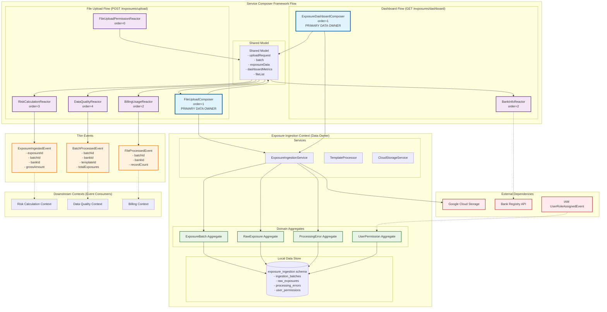

# Exposure Ingestion Context - Design Document

## Overview

The Exposure Ingestion context serves as the primary entry point for exposure data into the BCBS 239 SaaS platform. It implements template-based file processing, autonomous permission validation, and comprehensive file management with real-time quality assessment. The context maintains strict data ownership while coordinating with downstream contexts through thin events.

The design emphasizes regulatory template integration, drag-and-drop file upload, comprehensive dashboard monitoring, and autonomous operation within the bounded context architecture.

## Architecture

### Core Architecture Principles

1. **Template-Driven Processing**: Files are processed according to selected regulatory templates (Italian Circolare 285, EU EBA ITS, Italian Risk Concentration)
2. **Autonomous Permission Validation**: Local permission storage and validation without cross-context dependencies
3. **Real-Time Processing Feedback**: Live progress updates and quality assessment during file processing
4. **Comprehensive File Management**: Dashboard-based monitoring with advanced search and filtering
5. **Thin Event Publishing**: Minimal event data with downstream contexts querying for additional details when needed

### Context Dependencies

#### ⬆️ Upstream Dependencies
- **Bank Registry Context**: Template configurations and bank validation data (via API queries)
- **Identity & Access Management Context**: Permission events for local cache updates

#### ⬇️ Downstream Dependencies (Event Consumers)
- **Risk Calculation Context**: Raw exposure data for calculations
- **Data Quality Context**: Exposure data for BCBS 239 compliance validation
- **Billing Context**: Usage metrics for file processing charges

### Service Composer Framework Architecture Diagram



## Components and Interfaces

### 1. Domain Models with Template Integration

#### ExposureBatch Aggregate
Central aggregate managing file processing lifecycle with template awareness.

```java
public record ExposureBatch(
    ExposureBatchId id,
    BankId bankId,
    UserId uploadedBy,
    TemplateId templateId,
    String fileName,
    long fileSizeBytes,
    FileFormat fileFormat,
    BatchStatus status,
    ProcessingMetrics metrics,
    QualityAssessment qualityAssessment,
    Instant uploadedAt,
    Maybe<Instant> completedAt,
    String cloudStoragePath
) {
    public static Result<ExposureBatch, ErrorDetail> create(
        BankId bankId,
        UserId uploadedBy,
        TemplateId templateId,
        String fileName,
        long fileSizeBytes,
        FileFormat fileFormat,
        String cloudStoragePath
    ) {
        return Result.success(new ExposureBatch(
            ExposureBatchId.generate(),
            bankId,
            uploadedBy,
            templateId,
            fileName,
            fileSizeBytes,
            fileFormat,
            BatchStatus.PENDING,
            ProcessingMetrics.initial(),
            QualityAssessment.initial(),
            Instant.now(),
            Maybe.none(),
            cloudStoragePath
        ));
    }
    
    public ExposureBatch startProcessing() {
        return new ExposureBatch(
            id, bankId, uploadedBy, templateId, fileName, fileSizeBytes, fileFormat,
            BatchStatus.PROCESSING, metrics, qualityAssessment, uploadedAt, completedAt, cloudStoragePath
        );
    }
    
    public ExposureBatch updateProgress(int processedRecords, int errorRecords) {
        ProcessingMetrics updatedMetrics = metrics.updateProgress(processedRecords, errorRecords);
        return new ExposureBatch(
            id, bankId, uploadedBy, templateId, fileName, fileSizeBytes, fileFormat,
            status, updatedMetrics, qualityAssessment, uploadedAt, completedAt, cloudStoragePath
        );
    }
    
    public ExposureBatch completeProcessing(QualityAssessment finalQuality) {
        return new ExposureBatch(
            id, bankId, uploadedBy, templateId, fileName, fileSizeBytes, fileFormat,
            BatchStatus.COMPLETED, metrics, finalQuality, uploadedAt, Maybe.some(Instant.now()), cloudStoragePath
        );
    }
    
    public boolean isReadyForDownstreamProcessing() {
        return status == BatchStatus.COMPLETED && qualityAssessment.overallScore() >= 70.0;
    }
}

public record ProcessingMetrics(
    int totalRecords,
    int processedRecords,
    int errorRecords,
    Duration processingTime,
    Maybe<Duration> estimatedTimeRemaining
) {
    public static ProcessingMetrics initial() {
        return new ProcessingMetrics(0, 0, 0, Duration.ZERO, Maybe.none());
    }
    
    public ProcessingMetrics updateProgress(int processed, int errors) {
        Duration currentTime = Duration.ofMillis(System.currentTimeMillis());
        Maybe<Duration> estimated = calculateEstimatedTime(processed, totalRecords, currentTime);
        
        return new ProcessingMetrics(
            totalRecords, processed, errors, currentTime, estimated
        );
    }
    
    public double getProgressPercentage() {
        return totalRecords > 0 ? (double) processedRecords / totalRecords * 100.0 : 0.0;
    }
    
    private Maybe<Duration> calculateEstimatedTime(int processed, int total, Duration elapsed) {
        if (processed == 0) return Maybe.none();
        
        double rate = (double) processed / elapsed.toMillis();
        long remainingMs = (long) ((total - processed) / rate);
        return Maybe.some(Duration.ofMillis(remainingMs));
    }
}

public record QualityAssessment(
    double dataQualityScore,
    double complianceScore,
    double overallScore,
    int violationCount,
    List<QualityIssue> issues
) {
    public static QualityAssessment initial() {
        return new QualityAssessment(0.0, 0.0, 0.0, 0, List.of());
    }
    
    public static QualityAssessment calculate(
        List<RawExposure> exposures,
        List<ProcessingError> errors,
        TemplateId templateId
    ) {
        double dataQuality = calculateDataQuality(exposures, errors);
        double compliance = calculateComplianceScore(exposures, templateId);
        double overall = (dataQuality + compliance) / 2.0;
        int violations = countViolations(errors);
        List<QualityIssue> issues = extractQualityIssues(errors);
        
        return new QualityAssessment(dataQuality, compliance, overall, violations, issues);
    }
    
    private static double calculateDataQuality(List<RawExposure> exposures, List<ProcessingError> errors) {
        if (exposures.isEmpty()) return 0.0;
        
        int totalRecords = exposures.size() + errors.size();
        int validRecords = exposures.size();
        return (double) validRecords / totalRecords * 100.0;
    }
    
    private static double calculateComplianceScore(List<RawExposure> exposures, TemplateId templateId) {
        // Template-specific compliance calculation
        return switch (templateId) {
            case IT_LARGE_EXPOSURES_CIRCULARE_285 -> calculateItalianComplianceScore(exposures);
            case EU_LARGE_EXPOSURES_EBA_ITS -> calculateEbaComplianceScore(exposures);
            case IT_RISK_CONCENTRATION_SUPERVISORY -> calculateSupervisoryComplianceScore(exposures);
        };
    }
}
```

#### RawExposure Aggregate
Individual exposure records with template-specific validation.

```java
public record RawExposure(
    ExposureId id,
    ExposureBatchId batchId,
    BankId bankId,
    int rowNumber,
    CounterpartyName counterpartyName,
    Maybe<LeiCode> counterpartyLei,
    Money grossAmount,
    Currency currency,
    Maybe<String> sector,
    Maybe<String> countryCode,
    Maybe<Money> collateralValue,
    Map<String, Object> templateSpecificData,
    Instant createdAt
) {
    public static Result<RawExposure, ErrorDetail> create(
        ExposureBatchId batchId,
        BankId bankId,
        int rowNumber,
        Map<String, Object> rawData,
        TemplateId templateId
    ) {
        return validateTemplateData(rawData, templateId)
            .flatMap(validatedData -> CounterpartyName.create((String) validatedData.get("counterparty_name"))
                .flatMap(name -> Money.create((BigDecimal) validatedData.get("gross_amount"), "EUR")
                    .map(amount -> new RawExposure(
                        ExposureId.generate(),
                        batchId,
                        bankId,
                        rowNumber,
                        name,
                        extractLeiCode(validatedData),
                        amount,
                        Currency.getInstance("EUR"),
                        Maybe.ofNullable((String) validatedData.get("sector")),
                        Maybe.ofNullable((String) validatedData.get("country_code")),
                        extractCollateralValue(validatedData),
                        extractTemplateSpecificData(validatedData, templateId),
                        Instant.now()
                    ))
                )
            );
    }
    
    private static Result<Map<String, Object>, ErrorDetail> validateTemplateData(
        Map<String, Object> rawData, 
        TemplateId templateId
    ) {
        return switch (templateId) {
            case IT_LARGE_EXPOSURES_CIRCULARE_285 -> validateItalianLargeExposureData(rawData);
            case EU_LARGE_EXPOSURES_EBA_ITS -> validateEbaLargeExposureData(rawData);
            case IT_RISK_CONCENTRATION_SUPERVISORY -> validateSupervisoryData(rawData);
        };
    }
    
    public boolean hasValidLei() {
        return counterpartyLei.isPresent();
    }
    
    public boolean exceedsThreshold(Money capitalBase, double thresholdPercentage) {
        double exposurePercentage = grossAmount.divide(capitalBase).multiply(100.0);
        return exposurePercentage >= thresholdPercentage;
    }
}
```

#### UserPermission Aggregate (Local Permission Cache)
Autonomous permission storage for file upload validation.

```java
public record UserPermission(
    UserId userId,
    BankId bankId,
    boolean canUploadFiles,
    UserRole role,
    Instant lastUpdated
) {
    public static UserPermission fromRoleEvent(UserRoleAssignedEvent event) {
        boolean uploadPermission = event.permissions().contains(Permission.UPLOAD_FILES);
        
        return new UserPermission(
            event.userId(),
            event.bankId(),
            uploadPermission,
            event.role(),
            event.assignedAt()
        );
    }
    
    public boolean canUpload() {
        return canUploadFiles;
    }
    
    public String getPermissionSummary() {
        return String.format("Role: %s, Upload: %s", role, canUploadFiles ? "✓" : "✗");
    }
}
```

### 2. Template Processing System

#### TemplateProcessor
Coordinates template-based file processing.

```java
public class TemplateProcessor {
    
    private final Map<TemplateId, TemplateValidator> validators;
    private final Map<FileFormat, FileParser> parsers;
    
    public Result<ProcessingResult, ErrorDetail> processFile(
        ExposureBatch batch,
        InputStream fileStream,
        TemplateConfiguration templateConfig
    ) {
        return getValidator(batch.templateId())
            .flatMap(validator -> getParser(batch.fileFormat())
                .flatMap(parser -> parser.parse(fileStream, templateConfig)
                    .flatMap(rawData -> validator.validate(rawData, templateConfig)
                        .map(validatedData -> new ProcessingResult(
                            batch.id(),
                            validatedData.exposures(),
                            validatedData.errors(),
                            validatedData.qualityAssessment()
                        ))
                    )
                )
            );
    }
    
    private Result<TemplateValidator, ErrorDetail> getValidator(TemplateId templateId) {
        TemplateValidator validator = validators.get(templateId);
        return validator != null 
            ? Result.success(validator)
            : Result.failure(ErrorDetail.systemError("No validator for template: " + templateId));
    }
    
    private Result<FileParser, ErrorDetail> getParser(FileFormat format) {
        FileParser parser = parsers.get(format);
        return parser != null
            ? Result.success(parser)
            : Result.failure(ErrorDetail.systemError("No parser for format: " + format));
    }
}

public record ProcessingResult(
    ExposureBatchId batchId,
    List<RawExposure> exposures,
    List<ProcessingError> errors,
    QualityAssessment qualityAssessment
) {}
```

#### Template-Specific Validators

```java
public interface TemplateValidator {
    Result<ValidationResult, ErrorDetail> validate(
        ParsedData data, 
        TemplateConfiguration config
    );
}

@Component
public class ItalianLargeExposureValidator implements TemplateValidator {
    
    @Override
    public Result<ValidationResult, ErrorDetail> validate(
        ParsedData data, 
        TemplateConfiguration config
    ) {
        List<RawExposure> validExposures = new ArrayList<>();
        List<ProcessingError> errors = new ArrayList<>();
        
        for (ParsedRow row : data.rows()) {
            Result<RawExposure, ErrorDetail> exposureResult = validateItalianRow(row, data.batchId());
            
            if (exposureResult.isSuccess()) {
                validExposures.add(exposureResult.getValue());
            } else {
                errors.add(ProcessingError.fromValidationError(
                    data.batchId(), row.rowNumber(), exposureResult.getError()
                ));
            }
        }
        
        QualityAssessment quality = QualityAssessment.calculate(
            validExposures, errors, TemplateId.IT_LARGE_EXPOSURES_CIRCULARE_285
        );
        
        return Result.success(new ValidationResult(validExposures, errors, quality));
    }
    
    private Result<RawExposure, ErrorDetail> validateItalianRow(ParsedRow row, ExposureBatchId batchId) {
        // Italian Circolare 285 specific validation
        return validateAbiCode(row.get("abi_code"))
            .flatMap(__ -> validateLeiCode(row.get("lei_code"))
                .flatMap(__ -> validateExposureAmount(row.get("gross_exposure_amount"))
                    .flatMap(__ -> RawExposure.create(
                        batchId, 
                        extractBankId(row), 
                        row.rowNumber(), 
                        row.data(), 
                        TemplateId.IT_LARGE_EXPOSURES_CIRCULARE_285
                    ))
                )
            );
    }
}
```

### 3. Service Composer Integration

#### FileUploadComposer (Primary Data Owner)
Handles file upload as the primary bounded context for exposure data.

```java
@Component
@CompositionHandler(route = "/exposures/upload", order = 1)
public class FileUploadComposer implements PostCompositionHandler {
    
    private final ExposureIngestionService exposureService;
    private final CloudStorageService cloudStorage;
    
    @Override
    public void onInitialized(HttpServletRequest request, Map<String, Object> body, Map<String, Object> model) {
        // Initialize the upload flow - Exposure Ingestion owns this process
        FileUploadRequest uploadRequest = extractUploadRequest(body);
        
        model.put("uploadFlow", "INITIALIZED");
        model.put("uploadRequest", uploadRequest);
        model.put("requestId", UUID.randomUUID().toString());
        
        log.info("File upload initialized for bank {} with template {}", 
                 uploadRequest.bankId(), uploadRequest.templateId());
    }
    
    @Override
    public void onUpdated(HttpServletRequest request, Map<String, Object> body, Map<String, Object> model) {
        String phase = (String) model.get("uploadFlow");
        
        switch (phase) {
            case "INITIALIZED" -> handleFileUpload(model);
            case "UPLOADED" -> handleFileProcessing(model);
            case "PROCESSED" -> handleCompletion(model);
        }
    }
    
    private void handleFileUpload(Map<String, Object> model) {
        FileUploadRequest request = (FileUploadRequest) model.get("uploadRequest");
        String requestId = (String) model.get("requestId");
        
        try {
            // Upload to cloud storage - Exposure Ingestion owns file storage
            String storagePath = cloudStorage.upload(request.fileData(), request.fileName());
            
            // Create batch record in exposure_ingestion schema
            ExposureBatch batch = exposureService.createBatch(
                request.bankId(),
                request.uploadedBy(),
                request.templateId(),
                request.fileName(),
                request.fileSize(),
                request.fileFormat(),
                storagePath,
                requestId
            );
            
            model.put("batch", batch);
            model.put("uploadFlow", "UPLOADED");
            log.info("File uploaded successfully: {}", batch.id());
            
        } catch (Exception e) {
            model.put("uploadFlow", "FAILED");
            model.put("error", "File upload failed: " + e.getMessage());
            log.error("File upload failed", e);
        }
    }
    
    private void handleFileProcessing(Map<String, Object> model) {
        ExposureBatch batch = (ExposureBatch) model.get("batch");
        String requestId = (String) model.get("requestId");
        
        try {
            // Process file with template - Exposure Ingestion owns processing
            ProcessingResult result = exposureService.processFile(batch, requestId);
            
            model.put("processingResult", result);
            model.put("uploadFlow", "PROCESSED");
            log.info("File processed successfully: {} exposures, {} errors", 
                     result.exposures().size(), result.errors().size());
            
        } catch (Exception e) {
            model.put("uploadFlow", "FAILED");
            model.put("error", "File processing failed: " + e.getMessage());
            log.error("File processing failed", e);
        }
    }
    
    private void handleCompletion(Map<String, Object> model) {
        ExposureBatch batch = (ExposureBatch) model.get("batch");
        ProcessingResult result = (ProcessingResult) model.get("processingResult");
        
        // Exposure Ingestion completes its work and provides data for reactors
        model.put("exposureData", Map.of(
            "batchId", batch.id(),
            "bankId", batch.bankId(),
            "templateId", batch.templateId(),
            "totalExposures", result.exposures().size(),
            "qualityScore", result.qualityAssessment().overallScore(),
            "exposures", result.exposures().stream()
                .map(this::mapExposureForReactors)
                .toList()
        ));
        
        model.put("uploadFlow", "COMPLETED");
        log.info("File upload completed: {}", batch.id());
    }
    
    private Map<String, Object> mapExposureForReactors(RawExposure exposure) {
        // Provide minimal data for downstream reactors
        return Map.of(
            "exposureId", exposure.id(),
            "grossAmount", exposure.grossAmount().amount(),
            "currency", exposure.currency().getCurrencyCode(),
            "counterpartyName", exposure.counterpartyName().value(),
            "sector", exposure.sector().orElse("UNKNOWN")
        );
    }
}
```

#### FileUploadPermissionReactor
Validates upload permissions autonomously before the composer processes the file.

```java
@Component
@CompositionHandler(route = "/exposures/upload", order = 0) // Before composer
public class FileUploadPermissionReactor implements PostCompositionHandler {
    
    private final UserPermissionRepository permissionRepository;
    
    @Override
    public void onInitialized(HttpServletRequest request, Map<String, Object> body, Map<String, Object> model) {
        // REACT to authorization - check permissions before allowing upload
        TenantContext tenantContext = (TenantContext) model.get("tenantContext");
        
        if (tenantContext == null) {
            model.put("uploadFlow", "FAILED");
            model.put("error", "Authentication required");
            return;
        }
        
        BankId bankId = extractBankId(body);
        
        // Check local permission data - NO cross-context calls
        Optional<UserPermission> permission = permissionRepository.findByUserAndBank(
            tenantContext.userId(), bankId);
        
        if (permission.isEmpty() || !permission.get().canUpload()) {
            model.put("uploadFlow", "FAILED");
            model.put("error", "Insufficient permissions for file upload. Role: " + 
                     permission.map(p -> p.role().toString()).orElse("UNKNOWN"));
            log.warn("Upload denied for user {} in bank {}: insufficient permissions", 
                     tenantContext.userId(), bankId);
            return;
        }
        
        // Permission granted - allow composer to proceed
        model.put("uploadAuthorized", true);
        model.put("authorizedUser", tenantContext.userId());
        log.info("Upload authorized for user {} in bank {} with role {}", 
                 tenantContext.userId(), bankId, permission.get().role());
    }
}

#### BillingUsageReactor
Reacts to completed file processing to track usage for billing.

```java
@Component
@CompositionHandler(route = "/exposures/upload", order = 2) // After composer
public class BillingUsageReactor implements PostCompositionHandler {
    
    private final EventPublisher eventPublisher;
    
    @Override
    public void onUpdated(HttpServletRequest request, Map<String, Object> body, Map<String, Object> model) {
        // REACT to completed upload for billing tracking
        if ("COMPLETED".equals(model.get("uploadFlow"))) {
            Map<String, Object> exposureData = (Map<String, Object>) model.get("exposureData");
            String requestId = (String) model.get("requestId");
            
            if (exposureData != null) {
                // Publish thin event for billing context
                eventPublisher.publish(new FileProcessedEvent(
                    (ExposureBatchId) exposureData.get("batchId"),
                    (BankId) exposureData.get("bankId"),
                    (Integer) exposureData.get("totalExposures"),
                    requestId,
                    Instant.now(),
                    "FILE_PROCESSED"
                ));
                
                log.info("Billing event published for batch {}", exposureData.get("batchId"));
            }
        }
    }
}

#### RiskCalculationReactor
Reacts to completed processing to trigger risk calculations.

```java
@Component
@CompositionHandler(route = "/exposures/upload", order = 3) // After composer
public class RiskCalculationReactor implements PostCompositionHandler {
    
    private final EventPublisher eventPublisher;
    
    @Override
    public void onUpdated(HttpServletRequest request, Map<String, Object> body, Map<String, Object> model) {
        // REACT to completed processing for risk calculation
        if ("COMPLETED".equals(model.get("uploadFlow"))) {
            Map<String, Object> exposureData = (Map<String, Object>) model.get("exposureData");
            
            if (exposureData != null) {
                List<Map<String, Object>> exposures = (List<Map<String, Object>>) exposureData.get("exposures");
                
                // Publish thin events for each exposure
                for (Map<String, Object> exposure : exposures) {
                    eventPublisher.publish(new ExposureIngestedEvent(
                        (ExposureId) exposure.get("exposureId"),
                        (ExposureBatchId) exposureData.get("batchId"),
                        (BankId) exposureData.get("bankId"),
                        (BigDecimal) exposure.get("grossAmount"),
                        (String) exposure.get("currency"),
                        Instant.now(),
                        "EXPOSURE_INGESTED"
                    ));
                }
                
                log.info("Published {} exposure events for risk calculation", exposures.size());
            }
        }
    }
}

#### DataQualityReactor
Reacts to completed processing to trigger data quality assessment.

```java
@Component
@CompositionHandler(route = "/exposures/upload", order = 4) // After composer
public class DataQualityReactor implements PostCompositionHandler {
    
    private final EventPublisher eventPublisher;
    
    @Override
    public void onUpdated(HttpServletRequest request, Map<String, Object> body, Map<String, Object> model) {
        // REACT to completed processing for data quality assessment
        if ("COMPLETED".equals(model.get("uploadFlow"))) {
            Map<String, Object> exposureData = (Map<String, Object>) model.get("exposureData");
            
            if (exposureData != null) {
                // Publish batch processed event for quality assessment
                eventPublisher.publish(new BatchProcessedEvent(
                    (ExposureBatchId) exposureData.get("batchId"),
                    (BankId) exposureData.get("bankId"),
                    (TemplateId) exposureData.get("templateId"),
                    (Integer) exposureData.get("totalExposures"),
                    0, // Error count handled separately
                    (Double) exposureData.get("qualityScore"),
                    Instant.now(),
                    "BATCH_PROCESSED"
                ));
                
                log.info("Data quality event published for batch {}", exposureData.get("batchId"));
            }
        }
    }
}
```

### 4. Dashboard Management System

#### ExposureDashboardComposer
Primary composer that owns and provides exposure file management data.

```java
@Component
@CompositionHandler(route = "/exposures/dashboard", order = 1)
public class ExposureDashboardComposer implements GetCompositionHandler {
    
    private final ExposureIngestionService exposureService;
    private final DashboardMetricsCalculator metricsCalculator;
    
    @Override
    public void handleGet(HttpServletRequest request, Map<String, Object> composedModel) {
        TenantContext tenantContext = (TenantContext) composedModel.get("tenantContext");
        
        if (tenantContext == null) {
            composedModel.put("error", "Authentication required");
            return;
        }
        
        BankId bankId = extractCurrentBankId(request, tenantContext);
        
        // Exposure Ingestion owns file data - get primary dashboard data
        List<ExposureBatch> recentBatches = exposureService.getRecentBatches(bankId, 50);
        DashboardMetrics metrics = metricsCalculator.calculate(recentBatches);
        
        // Put primary dashboard data - reactors will enrich this
        composedModel.put("dashboardMetrics", Map.of(
            "totalFiles", metrics.totalFiles(),
            "lastUpload", metrics.lastUploadDate(),
            "completedFiles", metrics.completedFiles(),
            "successPercentage", metrics.successPercentage(),
            "processingFiles", metrics.processingFiles(),
            "estimatedTime", metrics.estimatedProcessingTime(),
            "errorFiles", metrics.errorFiles()
        ));
        
        // Put basic file list structure - reactors can enrich with additional data
        composedModel.put("fileList", recentBatches.stream()
            .map(this::mapToBasicFileItem)
            .toList());
        
        log.info("Dashboard data composed for bank {} with {} files", bankId, recentBatches.size());
    }
    
    private Map<String, Object> mapToBasicFileItem(ExposureBatch batch) {
        return Map.of(
            "batchId", batch.id(),
            "fileName", batch.fileName(),
            "uploadDate", batch.uploadedAt(),
            "recordCount", batch.metrics().totalRecords(),
            "status", mapStatus(batch.status()),
            "qualityScore", batch.qualityAssessment().dataQualityScore(),
            "complianceScore", batch.qualityAssessment().complianceScore(),
            "violationCount", batch.qualityAssessment().violationCount(),
            "templateType", batch.templateId().getDisplayName(),
            "templateId", batch.templateId(),
            "bankId", batch.bankId(),
            "actions", List.of("view", "download", "export")
        );
    }
    
    private String mapStatus(BatchStatus status) {
        return switch (status) {
            case COMPLETED -> "Completati";
            case PROCESSING -> "In Elaborazione";
            case FAILED -> "Con Errori";
            case PENDING -> "In Attesa";
        };
    }
}

#### BankInfoReactor
Reacts to dashboard request to enrich with bank-specific information.

```java
@Component
@CompositionHandler(route = "/exposures/dashboard", order = 2)
public class BankInfoReactor implements GetCompositionHandler {
    
    private final Function<BankId, Result<BankSummary, ErrorDetail>> bankQuery;
    
    @Override
    public void handleGet(HttpServletRequest request, Map<String, Object> composedModel) {
        // REACT to dashboard data and enrich with bank information
        if (composedModel.containsKey("fileList")) {
            List<Map<String, Object>> fileList = (List<Map<String, Object>>) composedModel.get("fileList");
            
            // Enrich each file with bank context information
            List<Map<String, Object>> enrichedFiles = fileList.stream()
                .map(this::enrichWithBankInfo)
                .toList();
            
            composedModel.put("fileList", enrichedFiles);
            
            // Add bank summary to dashboard
            if (!fileList.isEmpty()) {
                BankId bankId = (BankId) fileList.get(0).get("bankId");
                bankQuery.apply(bankId).ifSuccess(bankSummary -> {
                    composedModel.put("bankInfo", Map.of(
                        "bankName", bankSummary.denominazioneSociale(),
                        "abiCode", bankSummary.abiCode().value(),
                        "leiCode", bankSummary.leiCode().value()
                    ));
                });
            }
        }
    }
    
    private Map<String, Object> enrichWithBankInfo(Map<String, Object> fileItem) {
        // Add bank-specific context to file items
        BankId bankId = (BankId) fileItem.get("bankId");
        TemplateId templateId = (TemplateId) fileItem.get("templateId");
        
        // Add template-specific regulatory context
        fileItem.put("regulatoryFramework", getRegulatoryFramework(templateId));
        fileItem.put("complianceRequirements", getComplianceRequirements(templateId));
        
        return fileItem;
    }
    
    private String getRegulatoryFramework(TemplateId templateId) {
        return switch (templateId) {
            case IT_LARGE_EXPOSURES_CIRCULARE_285 -> "Banca d'Italia Circolare 285";
            case EU_LARGE_EXPOSURES_EBA_ITS -> "EBA ITS Large Exposures";
            case IT_RISK_CONCENTRATION_SUPERVISORY -> "Italian Supervisory Requirements";
        };
    }
}
```

## Data Models

### Event Objects (Thin Events)

```java
public record ExposureIngestedEvent(
    ExposureId exposureId,
    ExposureBatchId batchId,
    BankId bankId,
    BigDecimal grossAmount,
    String currency,
    Instant ingestedAt,
    String eventType
) {}

public record BatchProcessedEvent(
    ExposureBatchId batchId,
    BankId bankId,
    TemplateId templateId,
    int totalExposures,
    int errorCount,
    double qualityScore,
    Instant processedAt,
    String eventType
) {}
```

### Command Objects

```java
public record FileUploadRequest(
    BankId bankId,
    UserId uploadedBy,
    TemplateId templateId,
    String fileName,
    long fileSize,
    FileFormat fileFormat,
    byte[] fileData
) {}

public record DashboardSearchRequest(
    Maybe<String> fileNameFilter,
    Maybe<DateRange> uploadDateRange,
    Maybe<BatchStatus> statusFilter,
    Maybe<TemplateId> templateFilter,
    int pageSize,
    int pageNumber
) {}
```

### Response Objects

```java
public record FileUploadResponse(
    ExposureBatchId batchId,
    String fileName,
    BatchStatus status,
    ProcessingMetrics metrics,
    String nextStep,
    String message
) {}

public record DashboardMetrics(
    int totalFiles,
    String lastUploadDate,
    int completedFiles,
    double successPercentage,
    int processingFiles,
    String estimatedProcessingTime,
    int errorFiles
) {}
```

## Error Handling

### Domain-Specific Error Types

```java
public class ExposureIngestionErrorCodes {
    public static final String INSUFFICIENT_UPLOAD_PERMISSIONS = "INSUFFICIENT_UPLOAD_PERMISSIONS";
    public static final String UNSUPPORTED_FILE_FORMAT = "UNSUPPORTED_FILE_FORMAT";
    public static final String TEMPLATE_VALIDATION_FAILED = "TEMPLATE_VALIDATION_FAILED";
    public static final String FILE_SIZE_EXCEEDED = "FILE_SIZE_EXCEEDED";
    public static final String PROCESSING_TIMEOUT = "PROCESSING_TIMEOUT";
    public static final String CLOUD_STORAGE_ERROR = "CLOUD_STORAGE_ERROR";
}
```

## Testing Strategy

### Template Processing Testing

```java
class TemplateProcessorTest {
    
    @Test
    void shouldProcessItalianLargeExposureFile() {
        // Given
        ExposureBatch batch = createTestBatch(TemplateId.IT_LARGE_EXPOSURES_CIRCULARE_285);
        InputStream fileStream = loadTestFile("italian_large_exposures.xlsx");
        TemplateConfiguration config = loadItalianTemplate();
        
        // When
        Result<ProcessingResult, ErrorDetail> result = 
            templateProcessor.processFile(batch, fileStream, config);
        
        // Then
        assertTrue(result.isSuccess());
        ProcessingResult processingResult = result.getValue();
        assertTrue(processingResult.qualityAssessment().overallScore() > 85.0);
        assertEquals(0, processingResult.errors().size());
    }
}
```

This design provides a comprehensive foundation for exposure ingestion with template-based processing, autonomous permission validation, and real-time dashboard management while maintaining the bounded context architecture principles.