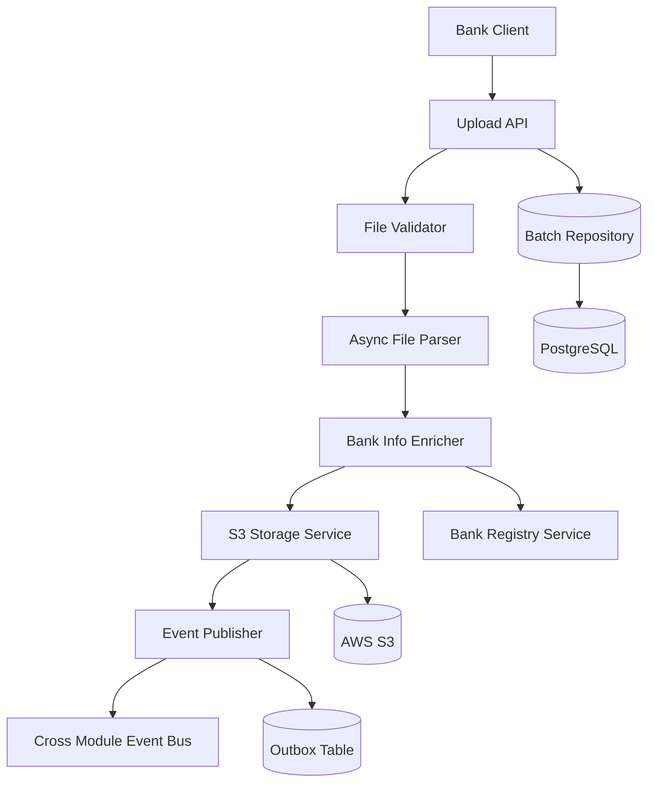

# Ingestion Module Design Document

## Overview

The Ingestion Module is designed as a production-ready, scalable system for processing bank exposure data files. It follows Domain-Driven Design (DDD) principles within a modular monolithic architecture, using AWS S3 for file storage and implementing comprehensive business rules through the Specification Pattern.

The module handles the complete ingestion lifecycle: file upload → parsing/validation → bank enrichment → S3 storage → database recording → event publishing. It supports both JSON and Excel formats, processes files ranging from 8 exposures to 1M+ exposures, and maintains enterprise-grade security, monitoring, and compliance features.

**Key Design Decisions:**
- **Asynchronous Processing**: Upload API returns immediately with batch ID, processing happens asynchronously to handle large files efficiently
- **Domain Aggregate Pattern**: IngestionBatch serves as the aggregate root encapsulating all batch-related business logic
- **Result Pattern**: Uses Result<T> instead of exceptions for predictable error handling
- **Outbox Pattern**: Ensures guaranteed event delivery to downstream modules
- **Specification Pattern**: Makes complex business rules explicit and testable

## Architecture

### High-Level Architecture



### Processing Flow

1. **Upload Phase**: Synchronous validation and batch creation
2. **Parsing Phase**: Asynchronous file parsing and structure validation
3. **Enrichment Phase**: Bank information retrieval and caching
4. **Storage Phase**: S3 upload with enterprise features
5. **Recording Phase**: Database batch metadata storage
6. **Publishing Phase**: Cross-module event publishing via outbox pattern

### Module Boundaries

The Ingestion Module maintains clear boundaries with other modules:
- **Input**: REST API for file uploads, status queries
- **Output**: Events via CrossModuleEventBus, S3 file references
- **Dependencies**: Bank Registry Service (external), S3 (external)
- **Data Ownership**: Batch metadata, file processing state

## Components and Interfaces

### Domain Layer

#### IngestionBatch Aggregate
```java
public class IngestionBatch {
    private BatchId batchId;
    private BankId bankId;
    private BatchStatus status;
    private FileMetadata fileMetadata;
    private S3Reference s3Reference;
    private BankInfo bankInfo;
    private List<DomainEvent> domainEvents;
    
    // Business behavior methods
    public Result<Void> startProcessing();
    public Result<Void> markAsValidated(int exposureCount);
    public Result<Void> attachBankInfo(BankInfo bankInfo);
    public Result<Void> recordS3Storage(S3Reference s3Ref);
    public Result<Void> completeIngestion();
    
    // State transition validation
    private boolean canTransitionTo(BatchStatus newStatus);
}
```

#### Specifications
```java
public class IngestionBatchSpecifications {
    public static Specification<IngestionBatch> canBeProcessed() {
        return batch -> batch.getStatus() == BatchStatus.UPLOADED 
            && batch.getFileMetadata().isValid();
    }
    
    public static Specification<IngestionBatch> mustBeParsed() {
        return batch -> batch.getStatus() == BatchStatus.VALIDATED;
    }
    
    public static Specification<IngestionBatch> canBeStored() {
        return mustBeParsed().and(hasBankInfo());
    }
    
    public static Specification<IngestionBatch> mustNotBeFailed() {
        return batch -> batch.getStatus() != BatchStatus.FAILED;
    }
}
```

#### Transition Rules
```java
public class BatchTransitions {
    public static Result<Void> validateTransition(BatchStatus from, BatchStatus to) {
        return switch (from) {
            case UPLOADED -> to == PARSING ? Result.success() : invalidTransition(from, to);
            case PARSING -> to == VALIDATED || to == FAILED ? Result.success() : invalidTransition(from, to);
            case VALIDATED -> to == STORING || to == FAILED ? Result.success() : invalidTransition(from, to);
            case STORING -> to == COMPLETED || to == FAILED ? Result.success() : invalidTransition(from, to);
            case COMPLETED, FAILED -> invalidTransition(from, to);
        };
    }
}
```

### Application Layer

#### Command Handlers
```java
@Component
public class UploadFileCommandHandler {
    public Result<BatchId> handle(UploadFileCommand command) {
        // 1. Validate file size and type
        // 2. Create IngestionBatch aggregate
        // 3. Store initial batch record
        // 4. Trigger async processing
        // 5. Return batch ID
    }
}

@Component
public class ProcessBatchCommandHandler {
    public Result<Void> handle(ProcessBatchCommand command) {
        // 1. Parse file content
        // 2. Validate structure and data
        // 3. Enrich with bank information
        // 4. Store in S3 with metadata
        // 5. Update batch record
        // 6. Publish events
    }
}
```

#### Query Handlers
```java
@Component
public class BatchStatusQueryHandler {
    public Result<BatchStatusDto> handle(BatchStatusQuery query) {
        // Return current batch status with progress information
    }
}
```

### Infrastructure Layer

#### File Processing Services
```java
@Component
public class FileParsingService {
    public Result<ParsedFileData> parseJsonFile(InputStream fileStream);
    public Result<ParsedFileData> parseExcelFile(InputStream fileStream);
    
    // Uses streaming parsing for large files to avoid memory issues
    // Validates required fields and data types
    // Checks for duplicate exposure_id values
}

@Component
public class FileValidationService {
    public Result<ValidationResult> validateStructure(ParsedFileData data);
    public Result<ValidationResult> validateBusinessRules(ParsedFileData data);
    
    // Validates currency codes against ISO 4217
    // Validates country codes against ISO 3166
    // Validates sector codes against internal enumeration
}
```

#### Bank Information Service
```java
@Component
public class BankInfoEnrichmentService {
    private final BankInfoRepository bankInfoRepository;
    private final BankRegistryClient bankRegistryClient;
    
    public Result<BankInfo> enrichBankInfo(BankId bankId) {
        // 1. Check local cache (bank_info table)
        // 2. If stale or missing, call Bank Registry
        // 3. Store fresh data with timestamp
        // 4. Return bank information
    }
}
```

#### S3 Storage Service
```java
@Component
public class S3StorageService {
    public Result<S3Reference> storeFile(FileData fileData, BatchMetadata metadata) {
        // 1. Calculate MD5 and SHA-256 checksums
        // 2. Use multipart upload for files > 100MB
        // 3. Enable server-side encryption (AES-256)
        // 4. Set metadata (batch-id, bank-id, exposure-count, timestamp)
        // 5. Verify ETag matches MD5 checksum
        // 6. Retry with exponential backoff on failure
        // 7. Return S3 reference with version ID
    }
}
```

#### Event Publishing
```java
@Component
public class CrossModuleEventPublisher {
    private final OutboxRepository outboxRepository;
    
    public Result<Void> publishBatchIngestedEvent(BatchIngestedEvent event) {
        // 1. Store event in outbox table with PENDING status
        // 2. Outbox processor handles actual publishing
        // 3. Retry failed events with exponential backoff
        // 4. Update status to PUBLISHED on success
    }
}
```

### REST API Layer

#### Upload Controller
```java
@RestController
@RequestMapping("/api/v1/ingestion")
public class IngestionController {
    
    @PostMapping("/upload")
    public ResponseEntity<UploadResponse> uploadFile(
            @RequestParam("file") MultipartFile file,
            @RequestHeader("Authorization") String authToken) {
        // 1. Validate JWT token and extract bank ID
        // 2. Apply rate limiting per bank
        // 3. Validate file size (< 500MB) and content type
        // 4. Generate unique batch ID
        // 5. Return HTTP 202 with batch ID and status URL
    }
    
    @GetMapping("/batch/{batchId}/status")
    public ResponseEntity<BatchStatusResponse> getBatchStatus(
            @PathVariable String batchId,
            @RequestHeader("Authorization") String authToken) {
        // Return current status, progress, and estimated completion time
    }
}
```

## Data Models

### Database Schema

#### ingestion_batches Table
```sql
CREATE TABLE ingestion_batches (
    batch_id VARCHAR(50) PRIMARY KEY,
    bank_id VARCHAR(20) NOT NULL,
    bank_name VARCHAR(100),
    bank_country VARCHAR(3),
    status VARCHAR(20) NOT NULL,
    total_exposures INTEGER,
    file_size_bytes BIGINT,
    file_name VARCHAR(255),
    content_type VARCHAR(100),
    s3_uri VARCHAR(500),
    s3_bucket VARCHAR(100),
    s3_key VARCHAR(300),
    s3_version_id VARCHAR(100),
    md5_checksum VARCHAR(32),
    sha256_checksum VARCHAR(64),
    uploaded_at TIMESTAMP WITH TIME ZONE NOT NULL,
    completed_at TIMESTAMP WITH TIME ZONE,
    error_message TEXT,
    processing_duration_ms BIGINT,
    created_at TIMESTAMP WITH TIME ZONE DEFAULT NOW(),
    updated_at TIMESTAMP WITH TIME ZONE DEFAULT NOW()
);

CREATE INDEX idx_ingestion_batches_bank_id ON ingestion_batches(bank_id);
CREATE INDEX idx_ingestion_batches_status ON ingestion_batches(status);
CREATE INDEX idx_ingestion_batches_uploaded_at ON ingestion_batches(uploaded_at);
```

#### bank_info Table (Cache)
```sql
CREATE TABLE bank_info (
    bank_id VARCHAR(20) PRIMARY KEY,
    bank_name VARCHAR(100) NOT NULL,
    bank_country VARCHAR(3) NOT NULL,
    bank_status VARCHAR(20) NOT NULL,
    last_updated TIMESTAMP WITH TIME ZONE NOT NULL,
    created_at TIMESTAMP WITH TIME ZONE DEFAULT NOW()
);
```

#### outbox Table (Event Publishing)
```sql
CREATE TABLE outbox (
    id BIGSERIAL PRIMARY KEY,
    event_type VARCHAR(100) NOT NULL,
    event_payload JSONB NOT NULL,
    status VARCHAR(20) NOT NULL DEFAULT 'PENDING',
    retry_count INTEGER DEFAULT 0,
    created_at TIMESTAMP WITH TIME ZONE DEFAULT NOW(),
    processed_at TIMESTAMP WITH TIME ZONE
);

CREATE INDEX idx_outbox_status ON outbox(status);
CREATE INDEX idx_outbox_created_at ON outbox(created_at);
```

### Domain Events

#### BatchIngestedEvent
```java
public class BatchIngestedEvent extends DomainEvent {
    private final String batchId;
    private final String bankId;
    private final String s3Uri;
    private final int totalExposures;
    private final long fileSizeBytes;
    private final Instant completedAt;
}
```

### DTOs and Value Objects

#### FileMetadata
```java
public record FileMetadata(
    String fileName,
    String contentType,
    long fileSizeBytes,
    String md5Checksum,
    String sha256Checksum
) {
    public boolean isValid() {
        return fileSizeBytes > 0 && fileSizeBytes <= MAX_FILE_SIZE
            && SUPPORTED_CONTENT_TYPES.contains(contentType);
    }
}
```

#### S3Reference
```java
public record S3Reference(
    String bucket,
    String key,
    String versionId,
    String uri
) {}
```

## Error Handling

### Error Categories

1. **Validation Errors**: File format, size, structure issues
2. **Business Rule Violations**: Invalid bank status, duplicate exposures
3. **Infrastructure Errors**: S3 failures, database connectivity
4. **Integration Errors**: Bank Registry unavailable

### Error Response Strategy

```java
public class ErrorDetail {
    private final String code;
    private final String message;
    private final String field;
    private final Object rejectedValue;
    
    // Factory methods for different error types
    public static ErrorDetail validationError(String field, Object value, String message);
    public static ErrorDetail businessRuleViolation(String rule, String message);
    public static ErrorDetail infrastructureError(String component, String message);
}

public class Result<T> {
    public static <T> Result<T> success(T value);
    public static <T> Result<T> failure(ErrorDetail... errors);
    public static <T> Result<T> failure(List<ErrorDetail> errors);
}
```

### Recovery Mechanisms

- **S3 Upload Failures**: Exponential backoff retry (3 attempts)
- **Bank Registry Unavailable**: Use cached bank_info if available
- **Database Transaction Failures**: Rollback and cleanup partial S3 uploads
- **Event Publishing Failures**: Outbox pattern ensures eventual delivery
- **File Corruption**: Checksum verification and clear error messages

## Testing Strategy

### Unit Testing
- Domain aggregate behavior and business rules
- Specification pattern implementations
- File parsing and validation logic
- Error handling and Result pattern usage

### Integration Testing
- S3 storage operations with localstack
- Database operations with testcontainers
- Bank Registry service integration
- Event publishing via outbox pattern

### Performance Testing
- Large file processing (1M+ exposures)
- Concurrent upload scenarios
- Memory usage during streaming parsing
- S3 multipart upload performance

### Security Testing
- JWT token validation
- File content security scanning
- S3 encryption verification
- Audit trail completeness

## Performance Considerations

### Scalability Design Decisions

1. **Streaming JSON Parsing**: Prevents memory exhaustion with large files
2. **Asynchronous Processing**: Upload API remains responsive
3. **S3 Multipart Upload**: Reliable transfer for large files
4. **Database Indexing**: Fast queries on batch metadata
5. **Bank Info Caching**: Reduces external service calls

### Performance Targets

- Small files (< 1000 exposures): Complete within 2 seconds
- Large files (> 100,000 exposures): Use streaming to avoid memory issues
- Status queries: Respond within 5 seconds under high load
- Concurrent processing: Handle multiple files without resource contention

### Monitoring Metrics

- File processing time by size
- S3 upload success rates and latencies
- Database query performance
- Memory usage during parsing
- Event publishing success rates

## Security and Compliance

### Security Measures

1. **Encryption at Rest**: AES-256 for S3 storage
2. **Encryption in Transit**: TLS 1.3 for all communications
3. **Access Control**: JWT token validation and bank permission verification
4. **Audit Logging**: Immutable logs of all processing steps
5. **Data Masking**: PII exclusion from log entries

### Compliance Features

1. **Data Retention**: Lifecycle policies per regulatory requirements
2. **Audit Trail**: Complete processing history with timestamps
3. **Access Logging**: All file access attempts recorded
4. **Compliance Reporting**: Detailed processing audit reports
5. **Data Lineage**: S3 versioning maintains complete history

### Monitoring and Observability

#### Metrics Collection
- Processing time by file size and type
- Success/failure rates by processing stage
- S3 operation latencies and success rates
- Database connection pool usage
- Memory and CPU utilization

#### Structured Logging
- Correlation IDs for request tracing
- Structured error information with context
- Performance metrics with timing data
- Security events and access attempts

#### Health Checks
- Database connectivity
- S3 service availability
- Bank Registry service health
- Outbox processor status

#### Alerting Thresholds
- Processing time > 30 seconds for files < 10MB
- Error rate > 5% over 5-minute window
- S3 upload failure rate > 1%
- Database query time > 2 seconds