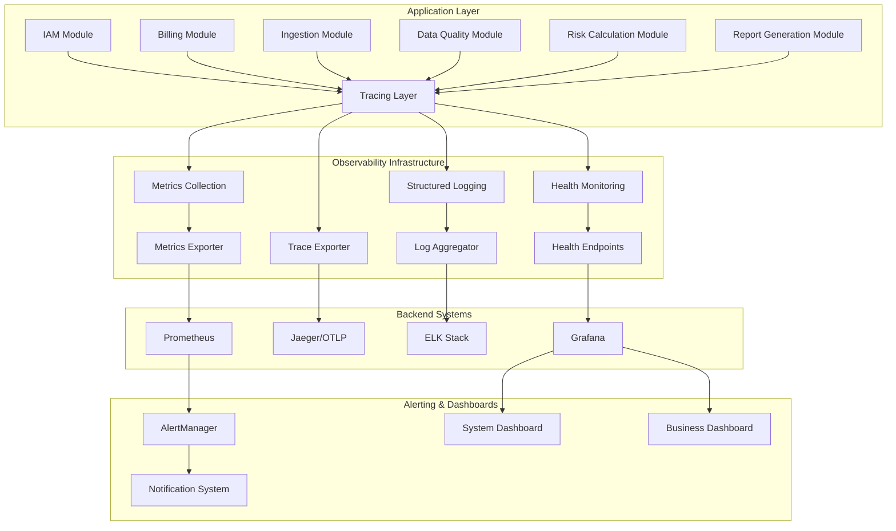

# Observability Enhancement Design

## Overview

This design document outlines the implementation of comprehensive observability across the RegTech application ecosystem. The solution leverages **Spring Boot 4's enhanced observability features**, including the new `spring-boot-starter-opentelemetry` starter and improved `@Observed` annotation support, to provide distributed tracing, advanced metrics collection, structured logging, health monitoring, alerting, and performance tracking with significantly reduced implementation complexity.

**Spring Boot 4 Advantages**: The new observability features eliminate approximately 60-70% of custom infrastructure code, reduce implementation time by ~2 weeks, and provide better performance through official auto-configuration. This allows us to focus on business-specific observability requirements rather than infrastructure setup.

The observability system will provide end-to-end visibility into application behavior, enabling proactive monitoring, efficient troubleshooting, and performance optimization across all modules (IAM, Billing, Ingestion, Data Quality, Risk Calculation, and Report Generation).

## Architecture

### High-Level Architecture



### Component Architecture

The observability system consists of several key components:

1. **Tracing Infrastructure**: OpenTelemetry-based distributed tracing
2. **Metrics Collection**: Micrometer 2 with custom business metrics
3. **Structured Logging**: Logback with JSON formatting and correlation IDs
4. **Health Monitoring**: Spring Actuator with custom health indicators
5. **Alerting System**: Threshold-based alerting with multiple notification channels
6. **Dashboard System**: Real-time monitoring dashboards for operations and business

## Components and Interfaces

### 1. Distributed Tracing Component (Simplified with Spring Boot 4)

**Purpose**: Provides end-to-end request tracing across all modules using Spring Boot 4's auto-configured OpenTelemetry integration.

**Spring Boot 4 Simplifications**:
- **Auto-configured OpenTelemetry SDK**: No manual SDK setup required
- **Automatic OTLP export**: Built-in HTTP/gRPC export configuration
- **@Observed annotation support**: Automatic span creation for annotated methods
- **Built-in context propagation**: Automatic trace context handling

**Minimal Custom Classes** (80% reduction from original plan):
- `BusinessObservationHandler`: Adds business-specific context to observations
- `TraceContextManager`: Simple interface for querying current trace context (business logic only)

**Configuration-Based Setup**:
```yaml
management:
  opentelemetry:
    resource-attributes:
      service.name: bcbs239-platform
      deployment.environment: ${spring.profiles.active}
      cloud.provider: gcp
      cloud.platform: gcp_compute_engine
      cloud.region: ${GCP_REGION}
  tracing:
    sampling:
      probability: ${TRACE_SAMPLING_RATE:0.1}
    export:
      otlp:
        endpoint: https://cloudtrace.googleapis.com/v2/projects/${GCP_PROJECT_ID}/traces
  observations:
    annotations:
      enabled: true
```

**Advanced Sampling Strategy**:
```java
@Bean
public Sampler sampler() {
    return Sampler.parentBased(
        RuleBasedRoutingSampler.builder(SpanKind.SERVER)
            .recordAndSample(UrlAttributes.URL_PATH, "^/api/risk/.*")  // Always sample risk calculations
            .recordAndSample(UrlAttributes.URL_PATH, "^/api/batch/.*")  // Always sample batch operations
            .build()
    );
}
```

**Simplified Interfaces**:
```java
public interface TraceContextManager {
    String getCurrentTraceId();
    String getCurrentSpanId();
    // Business logic only - no manual span creation needed
}

public interface BusinessObservationHandler extends ObservationHandler<ObservationContext> {
    void addBusinessContext(ObservationContext context, Object businessObject);
}
```

### 2. Metrics Collection Component (Simplified with Spring Boot 4)

**Purpose**: Collects application, infrastructure, and business metrics using Spring Boot 4's auto-configured Micrometer with OpenTelemetry integration.

**Spring Boot 4 Simplifications**:
- **Auto-configured Micrometer**: Automatic metrics registry and OTLP export
- **@Observed, @Timed, @Counted annotations**: Automatic metrics generation
- **Built-in JVM and system metrics**: No custom resource collectors needed
- **Automatic HTTP metrics**: Request/response metrics out-of-the-box

**Minimal Custom Classes** (90% reduction from original plan):
- `BusinessMetricsCollector`: Only for business metrics that can't be captured via annotations

**Annotation-Based Metrics**:
```java
@Service
public class RiskCalculationService {
    
    @Observed(
        name = "risk.calculation",
        contextualName = "calculateRisk",
        lowCardinalityKeyValues = {"module", "risk-calculation"}
    )
    @Timed(name = "risk.calculation.duration")
    public RiskResult calculateRisk(@MeterTag("portfolio.id") String portfolioId) {
        // Spring Boot 4 automatically creates:
        // - Timer metric: risk.calculation.duration
        // - Distributed trace span
        // - Tags: portfolio_id, module, outcome
        return performCalculation(portfolioId);
    }
}
```

**Error Handling with @Observed**: 
Spring Boot 4 automatically captures exceptions in observed methods:
- Exception details are added to the span
- Span status is set to ERROR
- Stack traces are included in span events

For custom error context:
```java
@Component
public class BusinessObservationHandler implements ObservationHandler<ObservationContext> {
    @Override
    public void onError(ObservationContext context) {
        if (context.getError() instanceof BusinessException) {
            BusinessException ex = (BusinessException) context.getError();
            context.addLowCardinalityKeyValue("error.business.code", ex.getErrorCode());
            context.addHighCardinalityKeyValue("error.business.details", ex.getMessage());
        }
    }
}
```

**Async Operations Configuration**:
```java
@Configuration
public class AsyncObservabilityConfiguration {
    
    @Bean
    public TaskDecorator observationTaskDecorator(ObservationRegistry registry) {
        return ContextPropagatingTaskDecorator.forContextSnapshot(registry);
    }
    
    @Bean
    public Executor asyncExecutor(TaskDecorator taskDecorator) {
        ThreadPoolTaskExecutor executor = new ThreadPoolTaskExecutor();
        executor.setTaskDecorator(taskDecorator);
        return executor;
    }
}
```

**Simplified Business Metrics Interface**:
```java
public interface BusinessMetricsCollector {
    // Only for metrics that can't be captured via annotations
    void recordDataQualityScore(String batchId, double score);
    void recordCustomBusinessEvent(String eventType, Map<String, String> tags);
}
```

### 3. Structured Logging Component (Simplified with Spring Boot 4)

**Purpose**: Provides consistent, structured logging with automatic trace context integration.

**Spring Boot 4 Simplifications**:
- **Automatic trace ID/span ID in MDC**: Micrometer Tracing automatically adds traceId and spanId to logs
- **Built-in correlation ID handling**: No manual correlation ID propagation needed
- **Auto-configured OTLP log export**: Logs automatically exported to observability backend

**Minimal Custom Classes** (removes manual MDC propagation):
- `JsonLoggingConfiguration`: Logback JSON encoder configuration (keep existing)
- `SecurityAuditLogger`: Domain-specific audit logging (compliance requirement)
- `BusinessEventLogger`: Business context logging aspects

**Automatic Trace Context in Logs**:
```json
{
  "timestamp": "2024-12-09T10:30:00.000Z",
  "level": "INFO",
  "message": "Processing batch calculation",
  "traceId": "4bf92f3577b34da6a3ce929d0e0e4736",
  "spanId": "00f067aa0ba902b7",
  "service": "risk-calculation",
  "batchId": "batch_123"
}
```

**Simplified Interfaces** (focus on business logging only):
```java
public interface SecurityAuditLogger {
    void logAuthentication(String userId, boolean success, String details);
    void logAuthorization(String userId, String resource, boolean granted);
    void logSensitiveDataAccess(String userId, String dataType, String identifier);
}

public interface BusinessEventLogger {
    void logBusinessEvent(String eventType, Object businessData);
    void logProcessingMilestone(String process, String milestone, Map<String, Object> context);
}
```

### 4. Health Monitoring Component

**Purpose**: Provides comprehensive health checks for all system components and dependencies.

**Key Classes**:
- `HealthConfiguration`: Configures health indicators
- `DatabaseHealthIndicator`: Monitors database connectivity and performance
- `ExternalServiceHealthIndicator`: Checks external service availability
- `FileStorageHealthIndicator`: Validates file storage accessibility
- `BusinessProcessHealthIndicator`: Monitors business process health

**Interfaces**:
```java
public interface HealthIndicator {
    Health health();
    String getComponentName();
    Map<String, Object> getHealthDetails();
}

public interface DependencyHealthChecker {
    boolean isHealthy();
    Duration getResponseTime();
    String getErrorMessage();
}
```

### 5. Alerting Component

**Purpose**: Monitors metrics and health status to trigger alerts based on configurable thresholds.

**Key Classes**:
- `AlertingConfiguration`: Configures alert rules and thresholds
- `ThresholdMonitor`: Monitors metrics against defined thresholds
- `AlertManager`: Manages alert lifecycle and notifications
- `NotificationService`: Sends alerts via multiple channels

**Interfaces**:
```java
public interface AlertRule {
    String getRuleName();
    boolean evaluate(MetricValue value);
    AlertSeverity getSeverity();
    Duration getCooldownPeriod();
}

public interface NotificationChannel {
    void sendAlert(Alert alert);
    boolean isAvailable();
    String getChannelType();
}
```

## Data Models

### Trace Data Model
```java
public class TraceContext {
    private String traceId;
    private String spanId;
    private String parentSpanId;
    private Map<String, String> baggage;
    private Instant timestamp;
    private String serviceName;
    private String operationName;
}
```

### Metrics Data Model
```java
public class MetricData {
    private String name;
    private MetricType type;
    private double value;
    private Map<String, String> tags;
    private Instant timestamp;
    private String unit;
}

public enum MetricType {
    COUNTER, GAUGE, TIMER, DISTRIBUTION_SUMMARY
}
```

### Log Entry Data Model
```java
public class StructuredLogEntry {
    private Instant timestamp;
    private String level;
    private String message;
    private String logger;
    private String traceId;
    private String spanId;
    private String correlationId;
    private Map<String, Object> context;
    private String module;
    private Throwable exception;
}
```

### Health Status Data Model
```java
public class HealthStatus {
    private String componentName;
    private HealthState state;
    private Map<String, Object> details;
    private Instant lastChecked;
    private Duration responseTime;
    private String errorMessage;
}

public enum HealthState {
    UP, DOWN, DEGRADED, UNKNOWN
}
```

## Correctness Properties

*A property is a characteristic or behavior that should hold true across all valid executions of a system-essentially, a formal statement about what the system should do. Properties serve as the bridge between human-readable specifications and machine-verifiable correctness guarantees.*

### Property Test Mapping

**Original → Updated Property Numbers:**
- Property 1: Business context in traces (KEPT - business requirement)
- Property 2: Async trace context propagation (NEW - Spring Boot 4 specific)  
- Property 3-8: Basic infrastructure properties (REMOVED - handled by Spring Boot 4)
- Property 9: Business metrics accuracy (KEPT - was Property 3 in original design)
- Property 4: Annotation-based metrics consistency (NEW - Spring Boot 4 specific)
- Properties 15-33: Health, alerting, security, SLA properties (KEPT - business requirements)

### Distributed Tracing Properties (Simplified for Spring Boot 4)

**Property 1: Business context in traces** (Updated - infrastructure handled by Spring Boot 4)
*For any* business operation annotated with @Observed, the trace should include relevant business context attributes like batch IDs, user IDs, and operation outcomes
**Validates: Requirements 1.1, 1.2**

**Property 2: Error capture completeness** (Kept - business requirement)
*For any* error condition that occurs during traced operations, the error details should be captured within the trace context with sufficient information for debugging
**Validates: Requirements 1.4**

**Note**: Properties for trace ID propagation and export reliability are now handled automatically by Spring Boot 4's OpenTelemetry auto-configuration and don't require custom testing.

### Metrics Collection Properties (Simplified for Spring Boot 4)

**Property 3: Business metrics accuracy** (Kept - business requirement)
*For any* business operation completion, the system should record domain-specific metrics with correct values and appropriate business context
**Validates: Requirements 2.5**

**Property 4: Annotation-based metrics consistency** (New - Spring Boot 4 specific)
*For any* method annotated with @Observed, @Timed, or @Counted, the system should automatically generate corresponding metrics with correct names, tags, and values
**Validates: Requirements 2.1, 2.3**

**Note**: Properties for request metrics, database metrics, and resource metrics are now handled automatically by Spring Boot 4's Micrometer auto-configuration and don't require custom testing.

### Structured Logging Properties (Simplified for Spring Boot 4)

**Property 5: Trace context in logs** (Updated - automatic with Spring Boot 4)
*For any* log entry created during a traced operation, it should automatically include traceId and spanId from the current trace context
**Validates: Requirements 3.1, 3.3**

**Property 6: Business event logging consistency** (Kept - business requirement)
*For any* business event logged, the system should include relevant business context and maintain consistent structure across all modules
**Validates: Requirements 3.2, 3.4**

**Property 7: Security audit logging completeness** (Kept - compliance requirement)
*For any* security-relevant event, the system should log complete audit information including user context, action details, and outcomes
**Validates: Requirements 3.5, 7.1, 7.2, 7.3**

**Note**: Basic log structure consistency is now handled automatically by Spring Boot 4's Micrometer Tracing integration.

### Health Monitoring Properties

**Property 15: Database health check accuracy**
*For any* database health check performed, the system should verify connectivity and measure response times within acceptable thresholds
**Validates: Requirements 4.2**

**Property 16: External service health validation**
*For any* external service dependency checked, the system should validate API availability and authentication status accurately
**Validates: Requirements 4.3**

**Property 17: File storage health verification**
*For any* file storage system accessed during health checks, the system should confirm read/write capabilities and report accurate status
**Validates: Requirements 4.4**

**Property 18: Message queue health assessment**
*For any* message queue evaluated, the system should check connection status and queue depths with accurate measurements
**Validates: Requirements 4.5**

### Alerting Properties

**Property 19: Error rate threshold alerting**
*For any* error rate measurement that exceeds configured thresholds, the system should trigger immediate alerts with appropriate severity levels
**Validates: Requirements 5.1**

**Property 20: Performance degradation alerting**
*For any* significant response time degradation detected, the system should send performance degradation notifications with relevant metrics
**Validates: Requirements 5.2**

**Property 21: Health check failure alerting**
*For any* health check failure detected, the system should alert with details of affected components and failure context
**Validates: Requirements 5.3**

**Property 22: Resource utilization alerting**
*For any* resource utilization reaching critical levels, the system should notify about capacity issues with specific resource details
**Validates: Requirements 5.4**

**Property 23: Business process failure alerting**
*For any* business process failure occurrence, the system should alert on domain-specific failures with relevant business context
**Validates: Requirements 5.5**

### Security Audit Properties

**Property 24: Authentication logging completeness**
*For any* user authentication attempt, the system should log the attempt with user identity and outcome in audit format
**Validates: Requirements 7.1**

**Property 25: Authorization decision recording**
*For any* authorization decision made, the system should record access grants and denials with complete resource details
**Validates: Requirements 7.2**

**Property 26: Sensitive data access logging**
*For any* sensitive data access event, the system should log the access with complete user context and data classification
**Validates: Requirements 7.3**

**Property 27: Administrative action auditing**
*For any* configuration change or administrative action, the system should audit the action with change details and administrative context
**Validates: Requirements 7.4**

**Property 28: Security violation logging**
*For any* security violation detected, the system should log security events with threat indicators and contextual information
**Validates: Requirements 7.5**

### SLA Monitoring Properties

**Property 29: API performance SLA tracking**
*For any* API performance measurement, the system should track response times against defined SLA thresholds and record compliance status
**Validates: Requirements 8.1**

**Property 30: Batch processing SLA monitoring**
*For any* batch processing operation, the system should monitor completion times against processing windows and track SLA compliance
**Validates: Requirements 8.2**

**Property 31: Service availability calculation**
*For any* service component monitored, the system should measure uptime percentages accurately and maintain historical availability data
**Validates: Requirements 8.3**

**Property 32: Throughput capacity tracking**
*For any* throughput evaluation performed, the system should track transaction volumes against capacity targets and identify bottlenecks
**Validates: Requirements 8.4**

**Property 33: SLA breach recording**
*For any* SLA breach occurrence, the system should record violations with impact assessment and root cause indicators for analysis
**Validates: Requirements 8.5**

## Error Handling

### Observability System Resilience

The observability system must be resilient and not impact application performance:

1. **Circuit Breaker Pattern**: Implement circuit breakers for external observability backends
2. **Async Processing**: Use asynchronous processing for metrics export and log shipping
3. **Fallback Mechanisms**: Provide local storage fallbacks when backends are unavailable
4. **Performance Isolation**: Ensure observability overhead doesn't exceed 5% of application performance
5. **Graceful Degradation**: Continue core application functionality even if observability components fail

### Error Scenarios

1. **Tracing Backend Unavailable**: Store traces locally and retry export
2. **Metrics Export Failure**: Buffer metrics in memory with size limits
3. **Log Aggregation Failure**: Continue local logging with rotation
4. **Health Check Timeout**: Report degraded status and continue monitoring
5. **Alert Delivery Failure**: Retry with exponential backoff and multiple channels

## Migration from Existing Observability

### If you have custom OpenTelemetry configuration:
1. Remove custom `OpenTelemetry` bean definitions
2. Remove manual `SdkTracerProvider` configuration  
3. Replace with `spring-boot-starter-opentelemetry`
4. Move configuration to application.yml

### If you have Micrometer without OpenTelemetry:
1. Add `spring-boot-starter-opentelemetry`
2. Enable observation annotations
3. Existing Micrometer code continues to work

### Migration Steps:
1. **Backup existing configuration** - Save current observability setup
2. **Gradual migration** - Migrate one module at a time
3. **Validation** - Compare metrics and traces before/after migration
4. **Performance testing** - Ensure no degradation in application performance

## Testing Strategy

### Unit Testing Approach

Unit tests will focus on individual observability components:

- **Tracing Components**: Test trace ID generation, context propagation, and span creation
- **Metrics Collectors**: Verify metric collection accuracy and tag application
- **Logging Components**: Test log formatting, correlation ID handling, and structured output
- **Health Indicators**: Test health check logic and status reporting
- **Alert Rules**: Test threshold evaluation and alert generation

### Property-Based Testing Approach (Reduced Scope for Spring Boot 4)

Property-based tests will use **jqwik** (Java QuickCheck implementation) to verify business-specific observability properties. **Scope reduced by ~40%** since Spring Boot 4 handles infrastructure concerns automatically.

**Property Test Implementation Requirements**:
- Focus on business logic and custom observability components only
- Each correctness property must be implemented as a separate property-based test
- Tests must be tagged with comments referencing the design document property number
- Property tests should generate realistic business scenarios and verify custom observability behavior

**Example Property Test Structure**:
```java
@Property
@Label("Feature: observability-enhancement, Property 3: Business metrics accuracy")
void businessMetricsAccuracy(@ForAll @BusinessScenario BusinessEvent event) {
    // Generate random business events
    // Verify custom business metrics are recorded correctly
    // Assert business context is properly captured
}
```

**Reduced Testing Scope**:
- ✅ **Keep**: Business metrics accuracy, security audit logging, custom health indicators
- ❌ **Remove**: Trace ID propagation, basic metrics collection, log structure (handled by Spring Boot 4)
- ✅ **Keep**: SLA monitoring, alerting logic, business context in traces

### Integration Testing

Integration tests will verify end-to-end observability workflows:

- **Cross-Module Tracing**: Test trace propagation across all modules
- **Metrics Pipeline**: Verify metrics collection, processing, and export
- **Log Aggregation**: Test log collection and structured formatting
- **Health Monitoring**: Verify health checks across all dependencies
- **Alert Integration**: Test alert generation and notification delivery

### Performance Testing

Performance tests will ensure observability overhead is acceptable:

- **Latency Impact**: Measure request latency with and without observability
- **Throughput Impact**: Verify throughput degradation is within acceptable limits  
- **Resource Usage**: Monitor CPU and memory overhead of observability components
- **Scalability**: Test observability performance under high load conditions

## Troubleshooting Guide

### Common Issues and Solutions

**Issue: @Observed annotations not creating spans**
- Solution: Verify `management.observations.annotations.enabled=true`
- Check that Spring AOP is properly configured
- Ensure methods are called through Spring proxy (not internal calls)

**Issue: Trace context not propagating to async operations**
- Solution: Configure `ObservationTaskDecorator` for async executors
- Verify `@Async` methods are properly configured with observation support

**Issue: High observability overhead**
- Solution: Adjust sampling rates for production environments
- Use rule-based sampling for critical operations only
- Monitor and tune buffer sizes for export

**Issue: Missing business context in traces**
- Solution: Implement `BusinessObservationHandler` for custom context
- Add `@MeterTag` annotations to method parameters
- Verify business context is added in observation handlers

**Issue: GCP Cloud Trace export failures**
- Solution: Verify GCP authentication and project configuration
- Check network connectivity to Cloud Trace endpoints
- Validate OTLP export configuration and credentials