# Report Generation Context - Design Document

## Overview

The Report Generation context serves as the authoritative source for regulatory-compliant report creation within the BCBS 239 SaaS platform. It implements Italian regulatory templates (Banca d'Italia, EBA), supports multi-format report generation (PDF, Excel, XML), and provides automated scheduling with secure distribution capabilities. The context emphasizes autonomous operation through Service Composer Framework patterns, role-based access control, and comprehensive audit trails.

The design focuses on regulatory compliance, template management, automated scheduling, and secure distribution while maintaining strict data ownership of all report generation activities and audit trails.

## Architecture

### Core Architecture Principles

1. **Regulatory Report Authority**: Owns all report generation, template management, and distribution activities
2. **Italian Regulatory Compliance**: Full support for Banca d'Italia and EBA reporting templates
3. **Multi-Format Generation**: Comprehensive support for PDF, Excel, and XML report formats
4. **Autonomous Permission Validation**: Local role-based access control for report generation
5. **Secure Distribution**: Encrypted distribution with comprehensive audit trails

### Context Dependencies

#### ⬆️ Upstream Dependencies
- **Data Quality Context**: Quality assessment data and compliance metrics (via API queries)
- **Risk Calculation Context**: Calculated exposures and large exposure analysis (via API queries)
- **Bank Registry Context**: Bank parameters and regulatory configuration (via API queries)
- **Identity & Access Management Context**: Permission events for local cache updates

#### ⬇️ Downstream Dependencies (Event Consumers)
- **Bank Registry Context**: Report generation status updates for bank configuration
- **Identity & Access Management Context**: Report access logging for audit trails

### Service Composer Framework Architecture Diagram

```mermaid
graph TB
    subgraph "Service Composer Framework Flow"
        subgraph "Report Generation Flow (POST /reports/generate)"
            RGO[ReportGenerationOrchestrator<br/>order=0]
            RPR[ReportPermissionReactor<br/>order=1]
            DCR[DataCollectionReactor<br/>order=2]
            RFR[ReportFormattingReactor<br/>order=3]
        end
        
        subgraph "Report Dashboard Flow (GET /reports/dashboard)"
            RDC[ReportDashboardComposer<br/>order=1<br/>PRIMARY DATA OWNER]
            RHR[ReportHistoryReactor<br/>order=2]
        end
        
        subgraph "Scheduled Generation Flow (Automated)"
            SGO[ScheduledGenerationOrchestrator<br/>order=0]
            STR[ScheduleTriggeredReactor<br/>order=1]
            AGR[AutoGenerationReactor<br/>order=2]
        end
        
        subgraph "Shared Model"
            SM[Shared Model<br/>- reportRequest<br/>- collectedData<br/>- generatedReport<br/>- distributionStatus]
        end
    end
    
    subgraph "Report Generation Context (Report Authority)"
        subgraph "Domain Aggregates"
            RR[ReportRequest Aggregate]
            GR[GeneratedReport Aggregate]
            RT[ReportTemplate Aggregate]
            RS[ReportSchedule Aggregate]
            UP[UserPermission Aggregate]
        end
        
        subgraph "Report Generation Engine"
            PDF[PDFReportGenerator]
            XLS[ExcelReportGenerator]
            XML[XMLReportGenerator]
            TM[TemplateManager]
            DV[DataValidator]
        end
        
        subgraph "Services"
            RGS[ReportGenerationService]
            TMS[TemplateManagementService]
            RSS[ReportSchedulingService]
            RDS[ReportDistributionService]
        end
        
        subgraph "Local Data Store"
            RG_DB[(report_generation schema<br/>- report_requests<br/>- generated_reports<br/>- report_templates<br/>- report_schedules<br/>- user_permissions)]
        end
    end
    
    subgraph "External Dependencies"
        DQ_API[Data Quality API]
        RC_API[Risk Calculation API]
        BR_API[Bank Registry API]
        EMAIL[Email Service]
        PORTAL[Regulatory Portal API]
        IAM_EVENTS[IAM UserRoleAssignedEvent]
    end
    
    subgraph "Upstream Events"
        QAC[QualityAssessmentCompletedEvent<br/>- assessmentId<br/>- bankId<br/>- overallScore]
        CEE[CalculatedExposureEvent<br/>- exposureId<br/>- capitalPercentage<br/>- isLargeExposure]
    end
    
    subgraph "Downstream Events"
        RGE[ReportGeneratedEvent<br/>- reportId<br/>- bankId<br/>- reportType<br/>- generatedAt]
        RDE[ReportDistributedEvent<br/>- reportId<br/>- recipients<br/>- distributionMethod]
    end
    
    %% Service Composer Flow
    RGO --> SM
    SM --> RPR
    RPR --> SM
    SM --> DCR
    DCR --> SM
    SM --> RFR
    
    SM --> RDC
    RDC --> SM
    SM --> RHR
    
    SGO --> SM
    SM --> STR
    STR --> SM
    SM --> AGR
    
    %% Data Ownership
    RGO --> RGS
    RDC --> RGS
    RFR --> RGS
    RDC --> RGS
    SGO --> RSS
    
    %% Domain Logic
    RGS --> RR
    RGS --> GR
    TMS --> RT
    RSS --> RS
    
    %% Report Generation Engine
    RGS --> PDF
    RGS --> XLS
    RGS --> XML
    TMS --> TM
    RGS --> DV
    
    %% Local Data Storage
    RR --> RG_DB
    GR --> RG_DB
    RT --> RG_DB
    RS --> RG_DB
    UP --> RG_DB
    
    %% External API Queries
    DCR -.-> DQ_API
    DCR -.-> RC_API
    DCR -.-> BR_API
    RDS -.-> EMAIL
    RDS -.-> PORTAL
    IAM_EVENTS -.-> UP
    
    %% Event Consumption
    QAC -.-> DCR
    CEE -.-> DCR
    
    %% Event Publishing
    RFR --> RGE
    RDS --> RDE
    
    %% Styling
    classDef composer fill:#e1f5fe,stroke:#01579b,stroke-width:3px
    classDef reactor fill:#f3e5f5,stroke:#4a148c,stroke-width:2px
    classDef orchestrator fill:#e8f5e8,stroke:#2e7d32,stroke-width:3px
    classDef aggregate fill:#fff8e1,stroke:#f57f17,stroke-width:2px
    classDef generator fill:#fce4ec,stroke:#880e4f,stroke-width:2px
    classDef event fill:#fff3e0,stroke:#ef6c00,stroke-width:2px
    classDef external fill:#ffebee,stroke:#c62828,stroke-width:2px
    
    class RDC composer
    class RPR,DCR,RFR,RHR,STR,AGR reactor
    class RGO,SGO orchestrator
    class RR,GR,RT,RS,UP aggregate
    class PDF,XLS,XML,TM,DV generator
    class QAC,CEE,RGE,RDE event
    class DQ_API,RC_API,BR_API,EMAIL,PORTAL,IAM_EVENTS external
```



## Components and Interfaces

### 1. Domain Models with Italian Regulatory Focus

#### ReportRequest Aggregate
Central aggregate managing report generation requests with Italian regulatory compliance.

```java
public record ReportRequest(
    ReportRequestId id,
    BankId bankId,
    UserId requestedBy,
    ReportType reportType,
    List<ReportFormat> formats,
    ReportingPeriod reportingPeriod,
    TemplateId templateId,
    ReportParameters parameters,
    RequestStatus status,
    Maybe<String> rejectionReason,
    Instant requestedAt,
    Maybe<Instant> completedAt
) {
    public static Result<ReportRequest, ErrorDetail> create(
        BankId bankId,
        UserId requestedBy,
        ReportType reportType,
        List<ReportFormat> formats,
        ReportingPeriod reportingPeriod,
        ReportParameters parameters
    ) {
        // Validate report type and formats
        if (!isValidReportTypeForFormats(reportType, formats)) {
            return Result.failure(ErrorDetail.validation(
                "Invalid format combination for report type: " + reportType
            ));
        }
        
        // Determine appropriate template
        TemplateId templateId = determineTemplate(reportType, parameters);
        
        return Result.success(new ReportRequest(
            ReportRequestId.generate(),
            bankId,
            requestedBy,
            reportType,
            formats,
            reportingPeriod,
            templateId,
            parameters,
            RequestStatus.PENDING,
            Maybe.none(),
            Instant.now(),
            Maybe.none()
        ));
    }
    
    public Result<ReportRequest, ErrorDetail> approve() {
        if (status != RequestStatus.PENDING) {
            return Result.failure(ErrorDetail.businessRule(
                "REQUEST_NOT_PENDING", 
                "Report request is not in pending status"
            ));
        }
        
        return Result.success(new ReportRequest(
            id, bankId, requestedBy, reportType, formats, reportingPeriod,
            templateId, parameters, RequestStatus.APPROVED, rejectionReason,
            requestedAt, completedAt
        ));
    }
    
    public Result<ReportRequest, ErrorDetail> complete(List<GeneratedReportId> generatedReportIds) {
        if (status != RequestStatus.APPROVED && status != RequestStatus.GENERATING) {
            return Result.failure(ErrorDetail.businessRule(
                "REQUEST_NOT_APPROVED", 
                "Report request is not approved for completion"
            ));
        }
        
        return Result.success(new ReportRequest(
            id, bankId, requestedBy, reportType, formats, reportingPeriod,
            templateId, parameters, RequestStatus.COMPLETED, rejectionReason,
            requestedAt, Maybe.some(Instant.now())
        ));
    }
    
    public boolean isItalianRegulatoryReport() {
        return reportType == ReportType.BANCA_ITALIA_LARGE_EXPOSURES ||
               reportType == ReportType.EBA_LARGE_EXPOSURES ||
               reportType == ReportType.BCBS_239_COMPLIANCE;
    }
    
    private static TemplateId determineTemplate(ReportType reportType, ReportParameters parameters) {
        return switch (reportType) {
            case BANCA_ITALIA_LARGE_EXPOSURES -> TemplateId.of("BANCA_ITALIA_LE_V2024");
            case EBA_LARGE_EXPOSURES -> TemplateId.of("EBA_LE_V3.2");
            case BCBS_239_COMPLIANCE -> TemplateId.of("BCBS_239_COMPLIANCE_V1.0");
            case EXECUTIVE_SUMMARY -> TemplateId.of("EXECUTIVE_SUMMARY_V1.0");
        };
    }
}

public enum ReportType {
    BANCA_ITALIA_LARGE_EXPOSURES("Banca d'Italia - Grandi Esposizioni"),
    EBA_LARGE_EXPOSURES("EBA - Large Exposures"),
    BCBS_239_COMPLIANCE("BCBS 239 - Compliance Report"),
    EXECUTIVE_SUMMARY("Executive Summary"),
    CUSTOM("Custom Report");
    
    private final String displayName;
    
    ReportType(String displayName) {
        this.displayName = displayName;
    }
    
    public String getDisplayName() { return displayName; }
}

public enum ReportFormat {
    PDF("PDF", "application/pdf", ".pdf"),
    EXCEL("Excel", "application/vnd.openxmlformats-officedocument.spreadsheetml.sheet", ".xlsx"),
    XML("XML", "application/xml", ".xml"),
    CSV("CSV", "text/csv", ".csv");
    
    private final String displayName;
    private final String mimeType;
    private final String fileExtension;
    
    ReportFormat(String displayName, String mimeType, String fileExtension) {
        this.displayName = displayName;
        this.mimeType = mimeType;
        this.fileExtension = fileExtension;
    }
    
    public String getDisplayName() { return displayName; }
    public String getMimeType() { return mimeType; }
    public String getFileExtension() { return fileExtension; }
}

public enum RequestStatus {
    PENDING("In Attesa"),
    APPROVED("Approvata"),
    GENERATING("Generazione in Corso"),
    COMPLETED("Completata"),
    FAILED("Fallita"),
    CANCELLED("Annullata");
    
    private final String displayName;
    
    RequestStatus(String displayName) {
        this.displayName = displayName;
    }
    
    public String getDisplayName() { return displayName; }
}
```

#### GeneratedReport Aggregate
Manages generated reports with Italian regulatory compliance and distribution tracking.

```java
public record GeneratedReport(
    GeneratedReportId id,
    ReportRequestId requestId,
    BankId bankId,
    ReportType reportType,
    ReportFormat format,
    ReportingPeriod reportingPeriod,
    String fileName,
    String filePath,
    long fileSizeBytes,
    String checksum,
    ReportMetadata metadata,
    GenerationStatus status,
    Maybe<String> errorMessage,
    Instant generatedAt,
    Maybe<Instant> distributedAt,
    List<DistributionRecord> distributionHistory
) {
    public static Result<GeneratedReport, ErrorDetail> create(
        ReportRequest request,
        ReportFormat format,
        byte[] reportContent,
        ReportMetadata metadata
    ) {
        String fileName = generateFileName(request, format);
        String checksum = calculateChecksum(reportContent);
        
        // Validate report content
        Result<Void, ErrorDetail> validationResult = validateReportContent(
            reportContent, format, request.reportType()
        );
        
        if (validationResult.isFailure()) {
            return Result.failure(validationResult.getError());
        }
        
        return Result.success(new GeneratedReport(
            GeneratedReportId.generate(),
            request.id(),
            request.bankId(),
            request.reportType(),
            format,
            request.reportingPeriod(),
            fileName,
            generateFilePath(fileName),
            reportContent.length,
            checksum,
            metadata,
            GenerationStatus.COMPLETED,
            Maybe.none(),
            Instant.now(),
            Maybe.none(),
            new ArrayList<>()
        ));
    }
    
    public Result<GeneratedReport, ErrorDetail> distribute(
        List<String> recipients,
        DistributionMethod method,
        UserId distributedBy
    ) {
        if (status != GenerationStatus.COMPLETED) {
            return Result.failure(ErrorDetail.businessRule(
                "REPORT_NOT_READY", 
                "Report is not ready for distribution"
            ));
        }
        
        DistributionRecord record = new DistributionRecord(
            DistributionRecordId.generate(),
            recipients,
            method,
            distributedBy,
            Instant.now(),
            DistributionStatus.SENT
        );
        
        List<DistributionRecord> updatedHistory = new ArrayList<>(distributionHistory);
        updatedHistory.add(record);
        
        return Result.success(new GeneratedReport(
            id, requestId, bankId, reportType, format, reportingPeriod,
            fileName, filePath, fileSizeBytes, checksum, metadata,
            status, errorMessage, generatedAt, Maybe.some(Instant.now()),
            updatedHistory
        ));
    }
    
    public String getItalianFileName() {
        return switch (reportType) {
            case BANCA_ITALIA_LARGE_EXPOSURES -> String.format(
                "Grandi_Esposizioni_%s_%s%s",
                metadata.abiCode(),
                reportingPeriod.getFormattedDate(),
                format.getFileExtension()
            );
            case EBA_LARGE_EXPOSURES -> String.format(
                "Large_Exposures_%s_%s%s",
                metadata.abiCode(),
                reportingPeriod.getFormattedDate(),
                format.getFileExtension()
            );
            case BCBS_239_COMPLIANCE -> String.format(
                "BCBS239_Compliance_%s_%s%s",
                metadata.abiCode(),
                reportingPeriod.getFormattedDate(),
                format.getFileExtension()
            );
            default -> fileName;
        };
    }
    
    public boolean isRegulatoryCompliant() {
        return metadata.complianceValidation().isCompliant() &&
               checksum != null &&
               !checksum.isEmpty() &&
               status == GenerationStatus.COMPLETED;
    }
    
    private static String generateFileName(ReportRequest request, ReportFormat format) {
        return String.format(
            "%s_%s_%s%s",
            request.reportType().name(),
            request.bankId().value(),
            request.reportingPeriod().getFormattedDate(),
            format.getFileExtension()
        );
    }
    
    private static String calculateChecksum(byte[] content) {
        try {
            MessageDigest md = MessageDigest.getInstance("SHA-256");
            byte[] hash = md.digest(content);
            return Base64.getEncoder().encodeToString(hash);
        } catch (NoSuchAlgorithmException e) {
            throw new RuntimeException("SHA-256 algorithm not available", e);
        }
    }
}

public record ReportMetadata(
    String abiCode,
    String leiCode,
    String bankName,
    ReportingPeriod reportingPeriod,
    int totalExposures,
    int largeExposures,
    Money totalNetExposure,
    double averageCapitalPercentage,
    ComplianceValidation complianceValidation,
    Instant dataAsOf
) {}

public record ComplianceValidation(
    boolean isCompliant,
    List<String> validationErrors,
    List<String> validationWarnings,
    String validationVersion
) {}

public enum GenerationStatus {
    PENDING("In Attesa"),
    GENERATING("Generazione in Corso"),
    COMPLETED("Completato"),
    FAILED("Fallito");
    
    private final String displayName;
    
    GenerationStatus(String displayName) {
        this.displayName = displayName;
    }
    
    public String getDisplayName() { return displayName; }
}
```

#### ReportTemplate Aggregate
Manages Italian regulatory templates with versioning and customization.

```java
public record ReportTemplate(
    TemplateId id,
    String name,
    String description,
    ReportType reportType,
    List<ReportFormat> supportedFormats,
    TemplateVersion version,
    RegulatoryAuthority authority,
    String templateContent,
    Map<String, Object> defaultParameters,
    List<TemplateField> requiredFields,
    TemplateStatus status,
    Instant createdAt,
    Maybe<Instant> activatedAt
) {
    public static Result<ReportTemplate, ErrorDetail> create(
        String name,
        String description,
        ReportType reportType,
        List<ReportFormat> supportedFormats,
        RegulatoryAuthority authority,
        String templateContent
    ) {
        // Validate template content
        Result<List<TemplateField>, ErrorDetail> fieldsResult = parseTemplateFields(templateContent);
        
        if (fieldsResult.isFailure()) {
            return Result.failure(fieldsResult.getError());
        }
        
        List<TemplateField> requiredFields = fieldsResult.getValue();
        
        // Validate regulatory compliance
        Result<Void, ErrorDetail> complianceResult = validateRegulatoryCompliance(
            templateContent, authority, reportType
        );
        
        if (complianceResult.isFailure()) {
            return Result.failure(complianceResult.getError());
        }
        
        return Result.success(new ReportTemplate(
            TemplateId.generate(),
            name,
            description,
            reportType,
            supportedFormats,
            TemplateVersion.initial(),
            authority,
            templateContent,
            generateDefaultParameters(reportType),
            requiredFields,
            TemplateStatus.DRAFT,
            Instant.now(),
            Maybe.none()
        ));
    }
    
    public Result<ReportTemplate, ErrorDetail> activate() {
        if (status != TemplateStatus.DRAFT && status != TemplateStatus.TESTING) {
            return Result.failure(ErrorDetail.businessRule(
                "TEMPLATE_NOT_READY", 
                "Template is not ready for activation"
            ));
        }
        
        return Result.success(new ReportTemplate(
            id, name, description, reportType, supportedFormats, version,
            authority, templateContent, defaultParameters, requiredFields,
            TemplateStatus.ACTIVE, createdAt, Maybe.some(Instant.now())
        ));
    }
    
    public Result<ReportTemplate, ErrorDetail> createNewVersion(
        String updatedContent,
        String changeDescription
    ) {
        TemplateVersion newVersion = version.increment(changeDescription);
        
        Result<List<TemplateField>, ErrorDetail> fieldsResult = parseTemplateFields(updatedContent);
        
        if (fieldsResult.isFailure()) {
            return Result.failure(fieldsResult.getError());
        }
        
        return Result.success(new ReportTemplate(
            id, name, description, reportType, supportedFormats, newVersion,
            authority, updatedContent, defaultParameters, fieldsResult.getValue(),
            TemplateStatus.DRAFT, createdAt, activatedAt
        ));
    }
    
    public boolean isItalianRegulatoryTemplate() {
        return authority == RegulatoryAuthority.BANCA_ITALIA ||
               authority == RegulatoryAuthority.EBA;
    }
    
    private static Map<String, Object> generateDefaultParameters(ReportType reportType) {
        Map<String, Object> defaults = new HashMap<>();
        
        switch (reportType) {
            case BANCA_ITALIA_LARGE_EXPOSURES -> {
                defaults.put("namespace", "urn:bancaditalia:xsd:LE:1.0");
                defaults.put("schema_version", "2024.1");
                defaults.put("currency", "EUR");
            }
            case EBA_LARGE_EXPOSURES -> {
                defaults.put("namespace", "urn:eba:xsd:LE:3.2");
                defaults.put("schema_version", "3.2");
                defaults.put("currency", "EUR");
            }
            case BCBS_239_COMPLIANCE -> {
                defaults.put("principles", List.of("P3", "P4", "P5", "P6"));
                defaults.put("scoring_method", "WEIGHTED_AVERAGE");
            }
        }
        
        return defaults;
    }
}

public enum RegulatoryAuthority {
    BANCA_ITALIA("Banca d'Italia"),
    EBA("European Banking Authority"),
    ECB("European Central Bank"),
    CUSTOM("Custom Template");
    
    private final String displayName;
    
    RegulatoryAuthority(String displayName) {
        this.displayName = displayName;
    }
    
    public String getDisplayName() { return displayName; }
}

public enum TemplateStatus {
    DRAFT("Bozza"),
    TESTING("Test"),
    ACTIVE("Attivo"),
    DEPRECATED("Deprecato"),
    ARCHIVED("Archiviato");
    
    private final String displayName;
    
    TemplateStatus(String displayName) {
        this.displayName = displayName;
    }
    
    public String getDisplayName() { return displayName; }
}
```### 
2. Report Generation Engine Components

#### PDFReportGenerator
Generates PDF reports with Italian regulatory formatting and executive summaries.

```java
@Component
public class PDFReportGenerator {
    
    private final TemplateEngine templateEngine;
    private final PDFRenderer pdfRenderer;
    
    public Result<byte[], ErrorDetail> generateReport(
        ReportRequest request,
        ReportData reportData,
        ReportTemplate template
    ) {
        try {
            // Prepare template context with Italian localization
            Map<String, Object> context = prepareTemplateContext(request, reportData);
            
            // Render HTML from template
            String htmlContent = templateEngine.process(template.templateContent(), context);
            
            // Convert to PDF with Italian formatting
            byte[] pdfContent = pdfRenderer.renderToPdf(htmlContent, getPdfOptions());
            
            // Validate PDF compliance
            Result<Void, ErrorDetail> validationResult = validatePdfCompliance(
                pdfContent, request.reportType()
            );
            
            if (validationResult.isFailure()) {
                return Result.failure(validationResult.getError());
            }
            
            return Result.success(pdfContent);
            
        } catch (Exception e) {
            return Result.failure(ErrorDetail.systemError("PDF generation failed", e));
        }
    }
    
    private Map<String, Object> prepareTemplateContext(
        ReportRequest request,
        ReportData reportData
    ) {
        Map<String, Object> context = new HashMap<>();
        
        // Bank information
        context.put("bankName", reportData.bankInfo().name());
        context.put("abiCode", reportData.bankInfo().abiCode());
        context.put("leiCode", reportData.bankInfo().leiCode());
        
        // Reporting period with Italian formatting
        context.put("reportingPeriod", formatItalianDate(request.reportingPeriod()));
        context.put("generationDate", formatItalianDate(LocalDate.now()));
        
        // Executive summary
        context.put("executiveSummary", createExecutiveSummary(reportData));
        
        // Large exposures analysis
        context.put("largeExposures", formatLargeExposures(reportData.largeExposures()));
        
        // Compliance status
        context.put("complianceStatus", formatComplianceStatus(reportData.complianceMetrics()));
        
        // Italian regulatory sections
        context.put("grandiEsposizioni", createGrandiEsposizioniSection(reportData));
        context.put("riepilogoBcbs239", createBcbs239Summary(reportData));
        
        return context;
    }
    
    private ExecutiveSummary createExecutiveSummary(ReportData reportData) {
        return new ExecutiveSummary(
            reportData.totalExposures(),
            reportData.largeExposures().size(),
            reportData.complianceMetrics().overallScore(),
            reportData.violationSummary().criticalCount(),
            generateKeyFindings(reportData),
            generateRecommendations(reportData)
        );
    }
    
    private List<String> generateKeyFindings(ReportData reportData) {
        List<String> findings = new ArrayList<>();
        
        if (reportData.complianceMetrics().overallScore() < 85.0) {
            findings.add("Punteggio di conformità BCBS 239 sotto la soglia minima del 85%");
        }
        
        int breaches = reportData.violationSummary().breachCount();
        if (breaches > 0) {
            findings.add(String.format("%d violazioni del limite del 25%% rilevate", breaches));
        }
        
        if (reportData.largeExposures().size() > 20) {
            findings.add("Elevato numero di grandi esposizioni richiede monitoraggio rafforzato");
        }
        
        return findings;
    }
}
```

#### ExcelReportGenerator
Generates Excel reports with multiple sheets for Italian regulatory compliance.

```java
@Component
public class ExcelReportGenerator {
    
    public Result<byte[], ErrorDetail> generateReport(
        ReportRequest request,
        ReportData reportData,
        ReportTemplate template
    ) {
        try (Workbook workbook = new XSSFWorkbook()) {
            
            // Create Italian regulatory sheets
            createAnagraficaSheet(workbook, reportData);
            createGrandiEsposizioniSheet(workbook, reportData);
            createRiepilogoBcbs239Sheet(workbook, reportData);
            createDettaglioViolazioniSheet(workbook, reportData);
            
            // Apply Italian formatting
            applyItalianFormatting(workbook);
            
            // Convert to byte array
            ByteArrayOutputStream outputStream = new ByteArrayOutputStream();
            workbook.write(outputStream);
            
            return Result.success(outputStream.toByteArray());
            
        } catch (Exception e) {
            return Result.failure(ErrorDetail.systemError("Excel generation failed", e));
        }
    }
    
    private void createAnagraficaSheet(Workbook workbook, ReportData reportData) {
        Sheet sheet = workbook.createSheet("Anagrafica");
        
        // Header row
        Row headerRow = sheet.createRow(0);
        headerRow.createCell(0).setCellValue("Campo");
        headerRow.createCell(1).setCellValue("Valore");
        
        // Bank information
        int rowNum = 1;
        addDataRow(sheet, rowNum++, "Denominazione Banca", reportData.bankInfo().name());
        addDataRow(sheet, rowNum++, "Codice ABI", reportData.bankInfo().abiCode());
        addDataRow(sheet, rowNum++, "Codice LEI", reportData.bankInfo().leiCode());
        addDataRow(sheet, rowNum++, "Periodo di Riferimento", 
            formatItalianDate(reportData.reportingPeriod()));
        addDataRow(sheet, rowNum++, "Data Generazione", 
            formatItalianDate(LocalDate.now()));
        
        // Summary statistics
        addDataRow(sheet, rowNum++, "Totale Esposizioni", 
            String.valueOf(reportData.totalExposures()));
        addDataRow(sheet, rowNum++, "Grandi Esposizioni", 
            String.valueOf(reportData.largeExposures().size()));
        addDataRow(sheet, rowNum++, "Punteggio BCBS 239", 
            String.format("%.2f%%", reportData.complianceMetrics().overallScore()));
        
        // Auto-size columns
        sheet.autoSizeColumn(0);
        sheet.autoSizeColumn(1);
    }
    
    private void createGrandiEsposizioniSheet(Workbook workbook, ReportData reportData) {
        Sheet sheet = workbook.createSheet("Grandi Esposizioni");
        
        // Header row with Italian column names
        Row headerRow = sheet.createRow(0);
        String[] headers = {
            "Controparte", "Codice LEI", "Classificazione", "Esposizione Netta (EUR)",
            "% Capitale", "Stato Limite", "Settore", "Rating"
        };
        
        for (int i = 0; i < headers.length; i++) {
            headerRow.createCell(i).setCellValue(headers[i]);
        }
        
        // Data rows
        List<LargeExposureData> largeExposures = reportData.largeExposures();
        for (int i = 0; i < largeExposures.size(); i++) {
            LargeExposureData exposure = largeExposures.get(i);
            Row dataRow = sheet.createRow(i + 1);
            
            dataRow.createCell(0).setCellValue(exposure.counterpartyName());
            dataRow.createCell(1).setCellValue(exposure.leiCode());
            dataRow.createCell(2).setCellValue(exposure.classification().getDescription());
            dataRow.createCell(3).setCellValue(exposure.netExposureAmount().amount().doubleValue());
            dataRow.createCell(4).setCellValue(exposure.capitalPercentage());
            dataRow.createCell(5).setCellValue(exposure.breachStatus().getDescription());
            dataRow.createCell(6).setCellValue(exposure.sector());
            dataRow.createCell(7).setCellValue(exposure.rating().orElse("N/A"));
        }
        
        // Auto-size all columns
        for (int i = 0; i < headers.length; i++) {
            sheet.autoSizeColumn(i);
        }
    }
    
    private void createRiepilogoBcbs239Sheet(Workbook workbook, ReportData reportData) {
        Sheet sheet = workbook.createSheet("Riepilogo BCBS 239");
        
        ComplianceMetrics metrics = reportData.complianceMetrics();
        
        // BCBS 239 Principles summary
        Row headerRow = sheet.createRow(0);
        headerRow.createCell(0).setCellValue("Principio BCBS 239");
        headerRow.createCell(1).setCellValue("Punteggio");
        headerRow.createCell(2).setCellValue("Stato");
        headerRow.createCell(3).setCellValue("Note");
        
        int rowNum = 1;
        addBcbs239PrincipleRow(sheet, rowNum++, "Principio 3 - Accuratezza e Integrità", 
            metrics.principle3Score(), "Validazione formati e registri esterni");
        addBcbs239PrincipleRow(sheet, rowNum++, "Principio 4 - Completezza", 
            metrics.principle4Score(), "Campi obbligatori e copertura rischi materiali");
        addBcbs239PrincipleRow(sheet, rowNum++, "Principio 5 - Tempestività", 
            metrics.principle5Score(), "Frequenza reporting e SLA elaborazione");
        addBcbs239PrincipleRow(sheet, rowNum++, "Principio 6 - Adattabilità", 
            metrics.principle6Score(), "Analisi multidimensionale e stress testing");
        
        // Overall compliance summary
        rowNum += 2;
        addDataRow(sheet, rowNum++, "Punteggio Complessivo", 
            String.format("%.2f%%", metrics.overallScore()));
        addDataRow(sheet, rowNum++, "Stato Conformità", 
            metrics.overallScore() >= 85.0 ? "CONFORME" : "NON CONFORME");
        addDataRow(sheet, rowNum++, "Violazioni Critiche", 
            String.valueOf(reportData.violationSummary().criticalCount()));
        
        // Auto-size columns
        for (int i = 0; i < 4; i++) {
            sheet.autoSizeColumn(i);
        }
    }
}
```

#### XMLReportGenerator
Generates XML reports for Italian regulatory submission with proper namespaces.

```java
@Component
public class XMLReportGenerator {
    
    private final JAXBContext jaxbContext;
    private final XMLValidator xmlValidator;
    
    public Result<byte[], ErrorDetail> generateReport(
        ReportRequest request,
        ReportData reportData,
        ReportTemplate template
    ) {
        try {
            // Create XML document based on report type
            Object xmlDocument = createXmlDocument(request.reportType(), reportData);
            
            // Marshal to XML with Italian regulatory namespace
            StringWriter writer = new StringWriter();
            Marshaller marshaller = jaxbContext.createMarshaller();
            marshaller.setProperty(Marshaller.JAXB_FORMATTED_OUTPUT, true);
            marshaller.setProperty(Marshaller.JAXB_ENCODING, "UTF-8");
            
            // Set Italian regulatory namespace
            String namespace = getItalianRegulatoryNamespace(request.reportType());
            marshaller.setProperty("com.sun.xml.bind.namespacePrefixMapper", 
                new ItalianNamespacePrefixMapper(namespace));
            
            marshaller.marshal(xmlDocument, writer);
            
            String xmlContent = writer.toString();
            
            // Validate against Italian regulatory schema
            Result<Void, ErrorDetail> validationResult = validateAgainstSchema(
                xmlContent, request.reportType()
            );
            
            if (validationResult.isFailure()) {
                return Result.failure(validationResult.getError());
            }
            
            return Result.success(xmlContent.getBytes(StandardCharsets.UTF_8));
            
        } catch (Exception e) {
            return Result.failure(ErrorDetail.systemError("XML generation failed", e));
        }
    }
    
    private Object createXmlDocument(ReportType reportType, ReportData reportData) {
        return switch (reportType) {
            case BANCA_ITALIA_LARGE_EXPOSURES -> createBancaItaliaDocument(reportData);
            case EBA_LARGE_EXPOSURES -> createEbaDocument(reportData);
            case BCBS_239_COMPLIANCE -> createBcbs239Document(reportData);
            default -> throw new IllegalArgumentException("Unsupported XML report type: " + reportType);
        };
    }
    
    private BancaItaliaLargeExposuresReport createBancaItaliaDocument(ReportData reportData) {
        BancaItaliaLargeExposuresReport report = new BancaItaliaLargeExposuresReport();
        
        // Header information
        report.setReportHeader(createBancaItaliaHeader(reportData));
        
        // Large exposures data
        List<BancaItaliaLargeExposure> exposures = reportData.largeExposures().stream()
            .map(this::convertToBancaItaliaExposure)
            .toList();
        report.setLargeExposures(exposures);
        
        // Summary information
        report.setSummary(createBancaItaliaSummary(reportData));
        
        return report;
    }
    
    private BancaItaliaReportHeader createBancaItaliaHeader(ReportData reportData) {
        BancaItaliaReportHeader header = new BancaItaliaReportHeader();
        header.setAbiCode(reportData.bankInfo().abiCode());
        header.setLeiCode(reportData.bankInfo().leiCode());
        header.setBankName(reportData.bankInfo().name());
        header.setReportingDate(reportData.reportingPeriod().getEndDate());
        header.setGenerationDate(LocalDate.now());
        header.setSchemaVersion("2024.1");
        header.setNamespace("urn:bancaditalia:xsd:LE:1.0");
        return header;
    }
    
    private BancaItaliaLargeExposure convertToBancaItaliaExposure(LargeExposureData exposure) {
        BancaItaliaLargeExposure bancaExposure = new BancaItaliaLargeExposure();
        bancaExposure.setCounterpartyName(exposure.counterpartyName());
        bancaExposure.setLeiCode(exposure.leiCode());
        bancaExposure.setNetExposureAmount(exposure.netExposureAmount().amount());
        bancaExposure.setCapitalPercentage(exposure.capitalPercentage());
        bancaExposure.setClassification(mapToItalianClassification(exposure.classification()));
        bancaExposure.setSector(exposure.sector());
        bancaExposure.setBreachStatus(exposure.breachStatus() != BreachStatus.COMPLIANT);
        return bancaExposure;
    }
    
    private String getItalianRegulatoryNamespace(ReportType reportType) {
        return switch (reportType) {
            case BANCA_ITALIA_LARGE_EXPOSURES -> "urn:bancaditalia:xsd:LE:1.0";
            case EBA_LARGE_EXPOSURES -> "urn:eba:xsd:LE:3.2";
            case BCBS_239_COMPLIANCE -> "urn:bcbs:xsd:BCBS239:1.0";
            default -> "urn:default:xsd:report:1.0";
        };
    }
}

// Italian regulatory XML classes
@XmlRootElement(name = "LargeExposuresReport", namespace = "urn:bancaditalia:xsd:LE:1.0")
public class BancaItaliaLargeExposuresReport {
    @XmlElement(name = "Header")
    private BancaItaliaReportHeader reportHeader;
    
    @XmlElementWrapper(name = "GrandiEsposizioni")
    @XmlElement(name = "Esposizione")
    private List<BancaItaliaLargeExposure> largeExposures;
    
    @XmlElement(name = "Riepilogo")
    private BancaItaliaSummary summary;
    
    // getters and setters
}
```

### 3. Service Composer Framework Integration

#### ReportGenerationOrchestrator - Primary Report Generation Coordinator

```java
@CompositionHandler(route = "/reports/generate", order = 0)
public class ReportGenerationOrchestrator implements PostCompositionHandler {
    
    private final ReportGenerationService reportGenerationService;
    
    @Override
    public Result<Void, ErrorDetail> onInitialized(
        HttpServletRequest request, 
        Map<String, Object> body, 
        CompositionContext context
    ) {
        // Extract report request information
        BankId bankId = extractBankId(body);
        ReportType reportType = extractReportType(body);
        List<ReportFormat> formats = extractFormats(body);
        ReportingPeriod period = extractReportingPeriod(body);
        
        // Create report request
        Result<ReportRequest, ErrorDetail> requestResult = ReportRequest.create(
            bankId,
            extractUserId(request),
            reportType,
            formats,
            period,
            extractReportParameters(body)
        );
        
        if (requestResult.isFailure()) {
            return Result.failure(requestResult.getError());
        }
        
        ReportRequest reportRequest = requestResult.getValue();
        
        // Store in context for next phases
        context.putData("reportRequest", reportRequest);
        context.putData("bankId", bankId);
        context.putData("reportType", reportType);
        context.putData("formats", formats);
        
        return Result.success();
    }
    
    @Override
    public Result<Void, ErrorDetail> onUpdated(
        HttpServletRequest request, 
        Map<String, Object> body, 
        CompositionContext context
    ) {
        // Retrieve report request from context
        ReportRequest reportRequest = context.getData("reportRequest", ReportRequest.class)
            .orElse(null);
        
        if (reportRequest == null) {
            return Result.failure(ErrorDetail.systemError("Report request not found in context"));
        }
        
        // Check if all required data has been collected
        boolean dataCollected = context.getData("dataCollected", Boolean.class).orElse(false);
        boolean permissionValidated = context.getData("permissionValidated", Boolean.class).orElse(false);
        
        if (!dataCollected || !permissionValidated) {
            return Result.failure(ErrorDetail.businessRule(
                "PREREQUISITES_NOT_MET", 
                "Data collection or permission validation not completed"
            ));
        }
        
        // Approve report request for generation
        Result<ReportRequest, ErrorDetail> approvalResult = reportRequest.approve();
        
        if (approvalResult.isFailure()) {
            return Result.failure(approvalResult.getError());
        }
        
        context.putData("approvedRequest", approvalResult.getValue());
        
        return Result.success();
    }
    
    @Override
    public Result<Void, ErrorDetail> onBackgroundWork(
        HttpServletRequest request, 
        Map<String, Object> body, 
        CompositionContext context
    ) {
        // Retrieve approved request and collected data
        ReportRequest approvedRequest = context.getData("approvedRequest", ReportRequest.class)
            .orElse(null);
        ReportData reportData = context.getData("reportData", ReportData.class)
            .orElse(null);
        
        if (approvedRequest == null || reportData == null) {
            return Result.failure(ErrorDetail.systemError("Required data not available for generation"));
        }
        
        // Generate reports in background
        Result<List<GeneratedReport>, ErrorDetail> generationResult = 
            reportGenerationService.generateReports(approvedRequest, reportData);
        
        if (generationResult.isFailure()) {
            return Result.failure(generationResult.getError());
        }
        
        List<GeneratedReport> generatedReports = generationResult.getValue();
        
        // Publish report generated events
        for (GeneratedReport report : generatedReports) {
            ReportGeneratedEvent event = new ReportGeneratedEvent(
                report.id(),
                report.bankId(),
                report.reportType(),
                report.format(),
                report.generatedAt()
            );
            
            eventPublisher.publishEvent(event);
        }
        
        return Result.success();
    }
}
```

#### DataCollectionReactor - Aggregates Data from Upstream Contexts

```java
@CompositionHandler(route = "/reports/generate", order = 2)
public class DataCollectionReactor implements PostCompositionHandler {
    
    private final Function<QualityMetricsQueryRequest, Result<ComplianceMetrics, ErrorDetail>> qualityQuery;
    private final Function<LargeExposureQueryRequest, Result<List<LargeExposureData>, ErrorDetail>> exposureQuery;
    private final Function<BankInfoQueryRequest, Result<BankInfo, ErrorDetail>> bankQuery;
    
    @Override
    public Result<Void, ErrorDetail> onInitialized(
        HttpServletRequest request, 
        Map<String, Object> body, 
        CompositionContext context
    ) {
        BankId bankId = context.getData("bankId", BankId.class).orElse(null);
        ReportingPeriod period = extractReportingPeriod(body);
        
        if (bankId == null) {
            return Result.failure(ErrorDetail.systemError("Bank ID not found in context"));
        }
        
        // Query compliance metrics from Data Quality context
        QualityMetricsQueryRequest qualityRequest = new QualityMetricsQueryRequest(bankId, period);
        Result<ComplianceMetrics, ErrorDetail> qualityResult = qualityQuery.apply(qualityRequest);
        
        if (qualityResult.isFailure()) {
            return Result.failure(qualityResult.getError());
        }
        
        // Query large exposures from Risk Calculation context
        LargeExposureQueryRequest exposureRequest = new LargeExposureQueryRequest(bankId, period);
        Result<List<LargeExposureData>, ErrorDetail> exposureResult = exposureQuery.apply(exposureRequest);
        
        if (exposureResult.isFailure()) {
            return Result.failure(exposureResult.getError());
        }
        
        // Query bank information from Bank Registry context
        BankInfoQueryRequest bankRequest = new BankInfoQueryRequest(bankId);
        Result<BankInfo, ErrorDetail> bankResult = bankQuery.apply(bankRequest);
        
        if (bankResult.isFailure()) {
            return Result.failure(bankResult.getError());
        }
        
        // Aggregate collected data
        ReportData reportData = new ReportData(
            bankResult.getValue(),
            period,
            qualityResult.getValue(),
            exposureResult.getValue(),
            calculateTotalExposures(exposureResult.getValue()),
            createViolationSummary(qualityResult.getValue())
        );
        
        context.putData("reportData", reportData);
        context.putData("dataCollected", true);
        
        return Result.success();
    }
}
```

### 4. Report Scheduling and Automation

#### ReportSchedule Aggregate
Manages automated report generation scheduling with Italian regulatory requirements.

```java
public record ReportSchedule(
    ReportScheduleId id,
    BankId bankId,
    ReportType reportType,
    List<ReportFormat> formats,
    ScheduleFrequency frequency,
    LocalTime generationTime,
    List<String> recipients,
    DistributionMethod distributionMethod,
    ScheduleStatus status,
    Maybe<LocalDate> nextGenerationDate,
    Instant createdAt,
    Maybe<Instant> lastExecutedAt
) {
    public static ReportSchedule createMonthlySchedule(
        BankId bankId,
        ReportType reportType,
        List<ReportFormat> formats,
        List<String> recipients
    ) {
        LocalDate nextGeneration = calculateNextMonthlyGeneration();
        
        return new ReportSchedule(
            ReportScheduleId.generate(),
            bankId,
            reportType,
            formats,
            ScheduleFrequency.MONTHLY,
            LocalTime.of(6, 0), // 6 AM generation time
            recipients,
            DistributionMethod.EMAIL,
            ScheduleStatus.ACTIVE,
            Maybe.some(nextGeneration),
            Instant.now(),
            Maybe.none()
        );
    }
    
    public boolean isDueForGeneration() {
        return nextGenerationDate
            .map(date -> !date.isAfter(LocalDate.now()))
            .orElse(false);
    }
    
    public ReportSchedule updateNextGeneration() {
        LocalDate nextDate = calculateNextGenerationDate();
        
        return new ReportSchedule(
            id, bankId, reportType, formats, frequency, generationTime,
            recipients, distributionMethod, status, Maybe.some(nextDate),
            createdAt, Maybe.some(Instant.now())
        );
    }
    
    private LocalDate calculateNextGenerationDate() {
        LocalDate baseDate = LocalDate.now();
        
        return switch (frequency) {
            case DAILY -> baseDate.plusDays(1);
            case WEEKLY -> baseDate.plusWeeks(1);
            case MONTHLY -> calculateNextMonthlyGeneration();
            case QUARTERLY -> baseDate.plusMonths(3);
        };
    }
    
    private static LocalDate calculateNextMonthlyGeneration() {
        LocalDate now = LocalDate.now();
        LocalDate endOfMonth = now.withDayOfMonth(now.lengthOfMonth());
        
        // Generate by 30th day after month-end, or next business day
        LocalDate targetDate = endOfMonth.plusDays(30);
        
        // Adjust for weekends and holidays
        while (targetDate.getDayOfWeek() == DayOfWeek.SATURDAY || 
               targetDate.getDayOfWeek() == DayOfWeek.SUNDAY) {
            targetDate = targetDate.plusDays(1);
        }
        
        return targetDate;
    }
}

public enum ScheduleFrequency {
    DAILY("Giornaliera"),
    WEEKLY("Settimanale"),
    MONTHLY("Mensile"),
    QUARTERLY("Trimestrale");
    
    private final String displayName;
    
    ScheduleFrequency(String displayName) {
        this.displayName = displayName;
    }
    
    public String getDisplayName() { return displayName; }
}
```

## Error Handling

### Report Generation Error Management

```java
@Component
public class ReportGenerationErrorManager {
    
    public Result<List<GeneratedReport>, ErrorDetail> processGenerationErrors(
        ReportRequest request,
        List<ReportGenerationError> errors
    ) {
        List<GeneratedReport> successfulReports = new ArrayList<>();
        List<ErrorDetail> criticalErrors = new ArrayList<>();
        
        for (ReportFormat format : request.formats()) {
            try {
                Result<GeneratedReport, ErrorDetail> result = generateSingleReport(
                    request, format
                );
                
                if (result.isSuccess()) {
                    successfulReports.add(result.getValue());
                } else {
                    criticalErrors.add(result.getError());
                }
                
            } catch (Exception e) {
                ErrorDetail error = ErrorDetail.systemError(
                    "Report generation failed for format: " + format, e
                );
                criticalErrors.add(error);
            }
        }
        
        // If all formats fail, return error
        if (successfulReports.isEmpty()) {
            return Result.failure(ErrorDetail.systemError(
                "All report formats failed to generate"
            ));
        }
        
        return Result.success(successfulReports);
    }
}
```

## Testing Strategy

### Report Generation Testing

```java
@ExtendWith(MockitoExtension.class)
class ReportGenerationOrchestratorTest {
    
    @Mock
    private ReportGenerationService reportGenerationService;
    
    @InjectMocks
    private ReportGenerationOrchestrator reportOrchestrator;
    
    @Test
    void shouldGenerateItalianRegulatoryReportSuccessfully() {
        // Given
        BankId bankId = BankId.of("12345");
        ReportType reportType = ReportType.BANCA_ITALIA_LARGE_EXPOSURES;
        List<ReportFormat> formats = List.of(ReportFormat.PDF, ReportFormat.XML);
        
        CompositionContext context = TestDataFactory.createTestContext();
        Map<String, Object> body = Map.of(
            "bankId", bankId.value(),
            "reportType", reportType.name(),
            "formats", formats.stream().map(ReportFormat::name).toList(),
            "reportingPeriod", "2024-03"
        );
        
        // When
        Result<Void, ErrorDetail> result = reportOrchestrator.onInitialized(
            new MockHttpServletRequest(), body, context
        );
        
        // Then
        assertThat(result.isSuccess()).isTrue();
        assertThat(context.getData("reportRequest", ReportRequest.class)).isPresent();
        assertThat(context.getData("reportType", ReportType.class)).contains(reportType);
    }
}
```

This comprehensive design provides a robust foundation for the Report Generation context with full Italian regulatory compliance, multi-format generation capabilities, and Service Composer Framework integration.