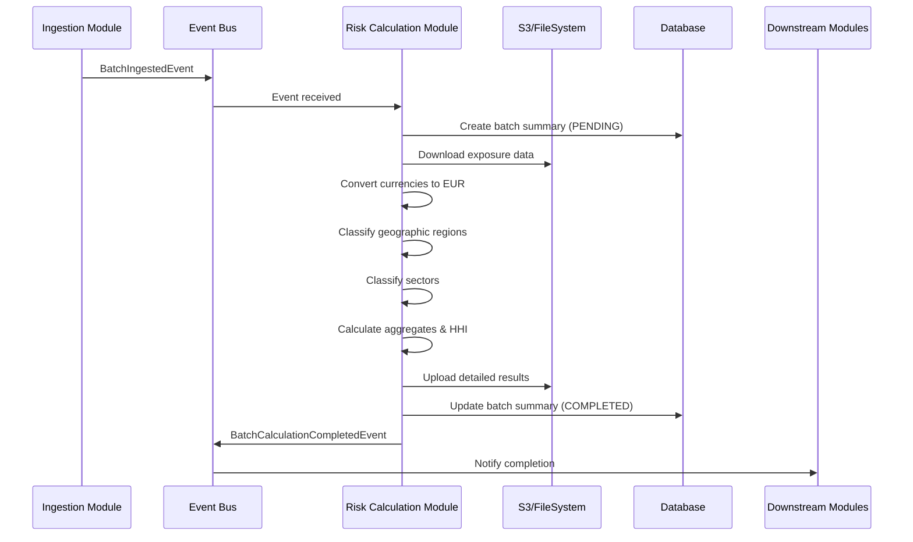

# Risk Calculation Module - Design Document

## Overview

The Risk Calculation Module is a critical component of the RegTech platform that processes financial exposure data to calculate comprehensive risk metrics, geographic and sector concentration analysis, and regulatory compliance indicators. The module follows Clean Architecture principles with Domain-Driven Design (DDD) and integrates seamlessly with the existing event-driven architecture.

### Key Capabilities

- **Real-time Risk Processing**: Automatically triggered by batch ingestion events
- **Currency Normalization**: Converts all exposures to EUR using current exchange rates
- **Geographic Classification**: Categorizes exposures by ITALY, EU_OTHER, and NON_EUROPEAN regions
- **Sector Analysis**: Classifies exposures across RETAIL_MORTGAGE, SOVEREIGN, CORPORATE, BANKING, and OTHER sectors
- **Concentration Metrics**: Calculates Herfindahl-Hirschman Index for both geographic and sector concentration
- **Dual Storage Strategy**: Database for aggregated summaries, S3/filesystem for detailed calculations
- **Event-Driven Integration**: Publishes completion events for downstream processing

## Architecture

The Risk Calculation Module follows the established 4-layer architecture pattern with Maven multi-module structure:

```
regtech-risk-calculation/
├── pom.xml                                    # Parent POM
├── domain/
│   ├── pom.xml                               # Domain layer POM
│   └── src/main/java/.../domain/             # Pure business logic
├── application/
│   ├── pom.xml                               # Application layer POM  
│   └── src/main/java/.../application/        # Commands, handlers, sagas
├── infrastructure/
│   ├── pom.xml                               # Infrastructure layer POM
│   └── src/main/java/.../infrastructure/     # Repositories, external services
└── presentation/
    ├── pom.xml                               # Presentation layer POM
    └── src/main/java/.../presentation/       # Controllers, DTOs, APIs
```

### Layer Dependencies

```
┌─────────────────────────────────────────────────────────────┐
│  Presentation Layer (regtech-risk-calculation-presentation) │
│  - Health endpoints, monitoring APIs                        │
│  - Risk calculation status queries                          │
│  Dependencies: Application + Domain ONLY                    │
├─────────────────────────────────────────────────────────────┤
│  Infrastructure Layer (regtech-risk-calculation-infrastructure) │
│  - File storage (S3 + filesystem)                          │
│  - Database repositories                                    │
│  - Currency exchange rate providers                        │
│  - Event publishing infrastructure                          │
│  Dependencies: Domain ONLY                                  │
├─────────────────────────────────────────────────────────────┤
│  Application Layer (regtech-risk-calculation-application)   │
│  - Event listeners (BatchIngestedEventListener)            │
│  - Command handlers (CalculateRiskMetricsCommandHandler)   │
│  - Integration adapters                                     │
│  Dependencies: Domain + regtech-core-application           │
├─────────────────────────────────────────────────────────────┤
│  Domain Layer (regtech-risk-calculation-domain)            │
│  - Risk calculation aggregates                              │
│  - Geographic and sector classification                     │
│  - Concentration index calculations                         │
│  - Currency conversion logic                                │
│  Dependencies: regtech-core-domain ONLY                    │
└─────────────────────────────────────────────────────────────┘
```

### Maven POM Structure

**Parent POM** (`regtech-risk-calculation/pom.xml`):
```xml
<parent>
    <groupId>com.bcbs239</groupId>
    <artifactId>regtech</artifactId>
    <version>0.0.1-SNAPSHOT</version>
</parent>

<artifactId>regtech-risk-calculation</artifactId>
<packaging>pom</packaging>
<name>regtech-risk-calculation</name>

<modules>
    <module>domain</module>
    <module>application</module>
    <module>infrastructure</module>
    <module>presentation</module>
</modules>
```

**Domain Layer POM** (`regtech-risk-calculation/domain/pom.xml`):
```xml
<parent>
    <groupId>com.bcbs239</groupId>
    <artifactId>regtech-risk-calculation</artifactId>
    <version>0.0.1-SNAPSHOT</version>
</parent>

<artifactId>regtech-risk-calculation-domain</artifactId>
<name>regtech-risk-calculation-domain</name>

<dependencies>
    <dependency>
        <groupId>com.bcbs239</groupId>
        <artifactId>regtech-core-domain</artifactId>
        <version>${project.version}</version>
    </dependency>
    <dependency>
        <groupId>org.projectlombok</groupId>
        <artifactId>lombok</artifactId>
        <optional>true</optional>
    </dependency>
</dependencies>
```

**Application Layer POM** (`regtech-risk-calculation/application/pom.xml`):
```xml
<parent>
    <groupId>com.bcbs239</groupId>
    <artifactId>regtech-risk-calculation</artifactId>
    <version>0.0.1-SNAPSHOT</version>
</parent>

<artifactId>regtech-risk-calculation-application</artifactId>
<name>regtech-risk-calculation-application</name>

<dependencies>
    <dependency>
        <groupId>com.bcbs239</groupId>
        <artifactId>regtech-risk-calculation-domain</artifactId>
        <version>${project.version}</version>
    </dependency>
    <dependency>
        <groupId>com.bcbs239</groupId>
        <artifactId>regtech-core-application</artifactId>
        <version>${project.version}</version>
    </dependency>
    <dependency>
        <groupId>org.springframework.boot</groupId>
        <artifactId>spring-boot-starter</artifactId>
    </dependency>
    <dependency>
        <groupId>org.springframework.boot</groupId>
        <artifactId>spring-boot-starter-validation</artifactId>
    </dependency>
</dependencies>
```

**Infrastructure Layer POM** (`regtech-risk-calculation/infrastructure/pom.xml`):
```xml
<parent>
    <groupId>com.bcbs239</groupId>
    <artifactId>regtech-risk-calculation</artifactId>
    <version>0.0.1-SNAPSHOT</version>
</parent>

<artifactId>regtech-risk-calculation-infrastructure</artifactId>
<name>regtech-risk-calculation-infrastructure</name>

<dependencies>
    <dependency>
        <groupId>com.bcbs239</groupId>
        <artifactId>regtech-risk-calculation-domain</artifactId>
        <version>${project.version}</version>
    </dependency>
    <dependency>
        <groupId>com.bcbs239</groupId>
        <artifactId>regtech-core-infrastructure</artifactId>
        <version>${project.version}</version>
    </dependency>
    <dependency>
        <groupId>org.springframework.boot</groupId>
        <artifactId>spring-boot-starter-data-jpa</artifactId>
    </dependency>
    <dependency>
        <groupId>software.amazon.awssdk</groupId>
        <artifactId>s3</artifactId>
    </dependency>
</dependencies>
```

**Presentation Layer POM** (`regtech-risk-calculation/presentation/pom.xml`):
```xml
<parent>
    <groupId>com.bcbs239</groupId>
    <artifactId>regtech-risk-calculation</artifactId>
    <version>0.0.1-SNAPSHOT</version>
</parent>

<artifactId>regtech-risk-calculation-presentation</artifactId>
<name>regtech-risk-calculation-presentation</name>

<dependencies>
    <dependency>
        <groupId>com.bcbs239</groupId>
        <artifactId>regtech-risk-calculation-domain</artifactId>
        <version>${project.version}</version>
    </dependency>
    <dependency>
        <groupId>com.bcbs239</groupId>
        <artifactId>regtech-risk-calculation-application</artifactId>
        <version>${project.version}</version>
    </dependency>
    <dependency>
        <groupId>com.bcbs239</groupId>
        <artifactId>regtech-core-presentation</artifactId>
        <version>${project.version}</version>
    </dependency>
    <dependency>
        <groupId>org.springframework.boot</groupId>
        <artifactId>spring-boot-starter-web</artifactId>
    </dependency>
    <dependency>
        <groupId>org.springframework.boot</groupId>
        <artifactId>spring-boot-starter-validation</artifactId>
    </dependency>
</dependencies>
```

### Event Flow



## Components and Interfaces

### Domain Layer Components

**Domain Organization by Capabilities**:

```
domain/
├── calculation/                    # Core calculation aggregates
│   ├── BatchSummary.java          # Main aggregate root
│   ├── CalculatedExposure.java    # Individual exposure entity
│   └── events/
│       ├── BatchCalculationStartedEvent.java
│       ├── BatchCalculationCompletedEvent.java
│       └── BatchCalculationFailedEvent.java
├── classification/                 # Classification domain logic
│   ├── GeographicClassifier.java
│   ├── SectorClassifier.java
│   └── ClassificationRules.java
├── aggregation/                    # Aggregation and concentration
│   ├── ConcentrationCalculator.java
│   ├── HerfindahlIndex.java
│   └── AggregationRules.java
└── shared/                        # Shared value objects and enums
    ├── valueobjects/
    │   ├── BatchId.java
    │   ├── AmountEur.java
    │   └── ExchangeRate.java
    └── enums/
        ├── GeographicRegion.java
        ├── SectorCategory.java
        └── CalculationStatus.java
```

#### Core Aggregates

**calculation/BatchSummary** - Main aggregate root for risk calculation results (using Lombok)
```java
@Getter
@Setter
@NoArgsConstructor
@AllArgsConstructor
@Builder
public class BatchSummary extends AggregateRoot<BatchSummaryId> {
    private BatchId batchId;
    private BankId bankId;
    private CalculationStatus status;
    private TotalExposures totalExposures;
    private TotalAmountEur totalAmountEur;
    private GeographicBreakdown geographicBreakdown;
    private SectorBreakdown sectorBreakdown;
    private ConcentrationIndices concentrationIndices;
    private FileStorageUri resultFileUri;
    private ProcessingTimestamps timestamps;
    
    // DDD: Ask the object to do the work
    public void startCalculation() {
        this.status = CalculationStatus.PENDING;
        this.timestamps = ProcessingTimestamps.started();
        addDomainEvent(new BatchCalculationStartedEvent(this.batchId));
    }
    
    public void completeCalculation(GeographicBreakdown geographic, 
                                  SectorBreakdown sector, 
                                  ConcentrationIndices indices,
                                  FileStorageUri resultUri) {
        this.geographicBreakdown = geographic;
        this.sectorBreakdown = sector;
        this.concentrationIndices = indices;
        this.resultFileUri = resultUri;
        this.status = CalculationStatus.COMPLETED;
        this.timestamps = this.timestamps.completed();
        addDomainEvent(new BatchCalculationCompletedEvent(this.batchId, resultUri));
    }
    
    public void failCalculation(String errorMessage) {
        this.status = CalculationStatus.FAILED;
        this.timestamps = this.timestamps.failed();
        addDomainEvent(new BatchCalculationFailedEvent(this.batchId, errorMessage));
    }
}
```

**calculation/CalculatedExposure** - Individual exposure with calculated metrics (using Lombok)
```java
@Getter
@Setter
@NoArgsConstructor
@AllArgsConstructor
@Builder
public class CalculatedExposure extends Entity<ExposureId> {
    private ExposureId exposureId;
    private ClientName clientName;
    private OriginalAmount originalAmount;
    private OriginalCurrency originalCurrency;
    private AmountEur amountEur;
    private ExchangeRate exchangeRateUsed;
    private Country country;
    private GeographicRegion geographicRegion;
    private Sector sector;
    private SectorCategory sectorCategory;
    private PercentageOfTotal percentageOfTotal;
    
    // DDD: Ask the object to do the work
    public void convertCurrency(CurrencyConversionService conversionService) {
        if (!originalCurrency.isEur()) {
            var conversionResult = conversionService.convertToEur(originalAmount, originalCurrency, LocalDate.now());
            if (conversionResult.isSuccess()) {
                this.amountEur = conversionResult.getValue().get();
                this.exchangeRateUsed = conversionService.getExchangeRate(originalCurrency, LocalDate.now()).getValue().get();
            }
        } else {
            this.amountEur = AmountEur.from(originalAmount);
            this.exchangeRateUsed = null; // No conversion needed
        }
    }
    
    public void classify(GeographicClassificationService geoService, SectorClassificationService sectorService, Country bankHomeCountry) {
        this.geographicRegion = geoService.classify(this.country, bankHomeCountry);
        this.sectorCategory = sectorService.classify(this.sector);
    }
    
    public void calculatePercentage(TotalAmountEur totalPortfolio) {
        this.percentageOfTotal = PercentageOfTotal.calculate(this.amountEur, totalPortfolio);
    }
}
```

#### Value Objects

**Key Value Objects (using records for immutability)**:
```java
// Currency and amounts
public record OriginalAmount(BigDecimal value) {
    public OriginalAmount {
        if (value == null || value.compareTo(BigDecimal.ZERO) <= 0) {
            throw new IllegalArgumentException("Amount must be positive");
        }
    }
}

public record AmountEur(BigDecimal value) {
    public static AmountEur from(OriginalAmount original) {
        return new AmountEur(original.value());
    }
}

public record OriginalCurrency(String code) {
    public boolean isEur() {
        return "EUR".equals(code);
    }
}

public record ExchangeRate(BigDecimal rate, LocalDate date) {}

// Identifiers
public record BatchId(String value) {}
public record BankId(String value) {}
public record ExposureId(String value) {}
public record BatchSummaryId(String value) {}

// Business concepts
public record ClientName(String value) {}
public record Country(String code) {}
public record Sector(String code) {}
public record TotalExposures(int count) {}
public record TotalAmountEur(BigDecimal value) {}
public record PercentageOfTotal(BigDecimal value) {
    public static PercentageOfTotal calculate(AmountEur amount, TotalAmountEur total) {
        if (total.value().compareTo(BigDecimal.ZERO) == 0) {
            return new PercentageOfTotal(BigDecimal.ZERO);
        }
        return new PercentageOfTotal(
            amount.value()
                .divide(total.value(), 4, RoundingMode.HALF_UP)
                .multiply(new BigDecimal("100"))
                .setScale(2, RoundingMode.HALF_UP)
        );
    }
}

public record FileStorageUri(String uri) {}

public record ProcessingTimestamps(Instant startedAt, Instant completedAt, Instant failedAt) {
    public static ProcessingTimestamps started() {
        return new ProcessingTimestamps(Instant.now(), null, null);
    }
    
    public ProcessingTimestamps completed() {
        return new ProcessingTimestamps(startedAt, Instant.now(), failedAt);
    }
    
    public ProcessingTimestamps failed() {
        return new ProcessingTimestamps(startedAt, completedAt, Instant.now());
    }
}
```

**GeographicRegion** - Classification of exposure locations
```java
public enum GeographicRegion {
    ITALY,      // Home country exposures
    EU_OTHER,   // Other European Union countries
    NON_EUROPEAN // Rest of world
}
```

**SectorCategory** - Economic sector classifications
```java
public enum SectorCategory {
    RETAIL_MORTGAGE,  // Retail home loans
    SOVEREIGN,        // Government bonds
    CORPORATE,        // Corporate loans/bonds
    BANKING,          // Interbank exposures
    OTHER             // Other sectors
}
```

**HerfindahlIndex** - Concentration measurement (using record)
```java
public record HerfindahlIndex(BigDecimal value) {
    
    public static HerfindahlIndex calculate(Map<?, BigDecimal> breakdown, BigDecimal total) {
        double hhi = breakdown.values().stream()
            .mapToDouble(amount -> {
                double share = amount.divide(total, 4, RoundingMode.HALF_UP).doubleValue();
                return share * share;
            })
            .sum();
        return new HerfindahlIndex(BigDecimal.valueOf(hhi).setScale(4, RoundingMode.HALF_UP));
    }
    
    public ConcentrationLevel getConcentrationLevel() {
        if (value.compareTo(new BigDecimal("0.15")) < 0) return ConcentrationLevel.LOW;
        if (value.compareTo(new BigDecimal("0.25")) < 0) return ConcentrationLevel.MODERATE;
        return ConcentrationLevel.HIGH;
    }
}
```

#### Domain Services

**CurrencyConversionService** - Handles currency conversion logic
```java
public interface CurrencyConversionService {
    Result<AmountEur> convertToEur(OriginalAmount amount, OriginalCurrency currency, LocalDate date);
    Result<ExchangeRate> getExchangeRate(OriginalCurrency from, LocalDate date);
}
```

**GeographicClassificationService** - Classifies exposures by geography
```java
public interface GeographicClassificationService {
    GeographicRegion classify(Country country, Country bankHomeCountry);
}
```

**SectorClassificationService** - Classifies exposures by sector
```java
public interface SectorClassificationService {
    SectorCategory classify(Sector sector);
}
```

### Application Layer Components

**Organized by Capabilities** (following regtech-billing pattern):

```
application/
├── calculation/                    # Core risk calculation capability
│   ├── CalculateRiskMetricsCommand.java
│   ├── CalculateRiskMetricsCommandHandler.java
│   └── RiskCalculationService.java
├── classification/                 # Geographic and sector classification
│   ├── ClassifyExposuresCommand.java
│   ├── ClassifyExposuresCommandHandler.java
│   ├── GeographicClassificationService.java
│   └── SectorClassificationService.java
├── aggregation/                    # Summary statistics and concentration
│   ├── CalculateAggregatesCommand.java
│   ├── CalculateAggregatesCommandHandler.java
│   └── ConcentrationCalculationService.java
├── integration/                    # Cross-module event handling
│   ├── BatchIngestedEventListener.java
│   ├── BatchCompletedIntegrationAdapter.java
│   └── RiskCalculationEventPublisher.java
└── shared/                        # Common application services
    ├── FileProcessingService.java
    └── CurrencyConversionService.java
```

#### Core Capability Components

**calculation/CalculateRiskMetricsCommand**
```java
public record CalculateRiskMetricsCommand(
    BatchId batchId,
    BankId bankId,
    FileStorageUri sourceFileUri,
    TotalExposures expectedExposures,
    Maybe<String> correlationId
) implements Command {
    public static Result<CalculateRiskMetricsCommand> create(
        String batchId,
        String bankId,
        String sourceFileUri,
        int expectedExposures,
        String correlationId
    ) {
        // Validation logic
    }
}
```

**calculation/CalculateRiskMetricsCommandHandler**
```java
@Component
@RequiredArgsConstructor
public class CalculateRiskMetricsCommandHandler {
    private final ILogger asyncLogger;
    private final BaseUnitOfWork unitOfWork;
    private final IBatchSummaryRepository batchSummaryRepository;
    private final FileProcessingService fileProcessingService;
    private final ClassifyExposuresCommandHandler classificationHandler;
    private final CalculateAggregatesCommandHandler aggregationHandler;
    
    @Transactional
    public Result<Void> handle(CalculateRiskMetricsCommand command) {
        // Orchestrate the calculation workflow
    }
}
```

**integration/BatchIngestedEventListener**
```java
@Component
@RequiredArgsConstructor
public class BatchIngestedEventListener {
    private final CalculateRiskMetricsCommandHandler commandHandler;
    private final IBatchSummaryRepository batchSummaryRepository;
    private final IEventProcessingFailureRepository failureRepository;
    
    @EventListener
    @Async("riskCalculationExecutor")
    @Transactional
    public void handleBatchIngestedEvent(BatchIngestedEvent event) {
        // Event processing with idempotency and error handling
    }
}
```

### Infrastructure Layer Components

#### Repositories

**IBatchSummaryRepository** - Domain interface for batch summary persistence
```java
public interface IBatchSummaryRepository {
    Result<BatchSummary> save(BatchSummary batchSummary);
    Result<BatchSummary> findByBatchId(BatchId batchId);
    boolean existsByBatchId(BatchId batchId);
    Result<List<BatchSummary>> findByBankId(BankId bankId);
}
```

#### File Storage

**IFileStorageService** - Abstraction for file operations
```java
public interface IFileStorageService {
    Result<List<ExposureRecord>> downloadExposures(FileStorageUri uri);
    Result<FileStorageUri> uploadCalculationResults(String batchId, CalculationResult results);
}
```

**FileStorageServiceImpl** - Implementation with S3/filesystem switching
```java
@Service
public class FileStorageServiceImpl implements IFileStorageService {
    private final S3FileStorageService s3Service;
    private final LocalFileStorageService localService;
    private final boolean useS3;
    
    @Override
    public Result<List<ExposureRecord>> downloadExposures(FileStorageUri uri) {
        return useS3 ? s3Service.downloadExposures(uri) : localService.downloadExposures(uri);
    }
}
```

#### Currency Exchange

**ExchangeRateProvider** - External exchange rate integration
```java
public interface ExchangeRateProvider {
    Result<ExchangeRate> getRate(String fromCurrency, String toCurrency, LocalDate date);
}
```

## Data Models

### Database Schema

**batch_summaries** - Main summary table
```sql
CREATE TABLE batch_summaries (
    id SERIAL PRIMARY KEY,
    batch_id VARCHAR(100) UNIQUE NOT NULL,
    bank_id VARCHAR(50) NOT NULL,
    
    -- Status and timestamps
    status VARCHAR(50) NOT NULL,
    created_at TIMESTAMP DEFAULT CURRENT_TIMESTAMP,
    started_at TIMESTAMP,
    completed_at TIMESTAMP,
    
    -- Totals
    total_exposures INTEGER NOT NULL,
    total_amount_eur DECIMAL(20,2) NOT NULL,
    
    -- Geographic breakdown
    italy_amount DECIMAL(20,2) NOT NULL,
    italy_pct DECIMAL(5,2) NOT NULL,
    italy_count INTEGER NOT NULL,
    eu_amount DECIMAL(20,2) NOT NULL,
    eu_pct DECIMAL(5,2) NOT NULL,
    eu_count INTEGER NOT NULL,
    non_eu_amount DECIMAL(20,2) NOT NULL,
    non_eu_pct DECIMAL(5,2) NOT NULL,
    non_eu_count INTEGER NOT NULL,
    
    -- Sector breakdown
    retail_amount DECIMAL(20,2) NOT NULL,
    retail_pct DECIMAL(5,2) NOT NULL,
    retail_count INTEGER NOT NULL,
    sovereign_amount DECIMAL(20,2) NOT NULL,
    sovereign_pct DECIMAL(5,2) NOT NULL,
    sovereign_count INTEGER NOT NULL,
    corporate_amount DECIMAL(20,2) NOT NULL,
    corporate_pct DECIMAL(5,2) NOT NULL,
    corporate_count INTEGER NOT NULL,
    banking_amount DECIMAL(20,2) NOT NULL,
    banking_pct DECIMAL(5,2) NOT NULL,
    banking_count INTEGER NOT NULL,
    other_amount DECIMAL(20,2) NOT NULL,
    other_pct DECIMAL(5,2) NOT NULL,
    other_count INTEGER NOT NULL,
    
    -- Concentration metrics
    herfindahl_geographic DECIMAL(6,4) NOT NULL,
    herfindahl_sector DECIMAL(6,4) NOT NULL,
    
    -- File reference
    result_file_uri TEXT NOT NULL,
    
    -- Error handling
    error_message TEXT,
    
    -- Indexes
    INDEX idx_batch_id (batch_id),
    INDEX idx_bank_id (bank_id),
    INDEX idx_status (status),
    INDEX idx_created_at (created_at),
    
    -- Foreign key
    FOREIGN KEY (batch_id) REFERENCES ingestion_batches(batch_id)
);
```

### File Storage Format

**Detailed Calculation Results** (JSON)
```json
{
  "batch_id": "batch_20240331_001",
  "calculated_at": "2024-03-31T14:23:47Z",
  "summary": {
    "total_exposures": 8,
    "total_amount_eur": 2758075000.00,
    "geographic_breakdown": {
      "italy": {"amount": 2220000000.00, "pct": 80.50, "count": 3},
      "eu_other": {"amount": 400000000.00, "pct": 14.50, "count": 3},
      "non_eu": {"amount": 138075000.00, "pct": 5.00, "count": 2}
    },
    "sector_breakdown": {
      "retail_mortgage": {"amount": 950000000.00, "pct": 34.45, "count": 1},
      "sovereign": {"amount": 928242500.00, "pct": 33.66, "count": 2},
      "corporate": {"amount": 545000000.00, "pct": 19.76, "count": 2},
      "banking": {"amount": 334832500.00, "pct": 12.14, "count": 3}
    },
    "concentration_indices": {
      "herfindahl_geographic": 0.6716,
      "herfindahl_sector": 0.2858
    }
  },
  "exposures": [
    {
      "exposure_id": "EXP_001",
      "client_name": "MUTUI CASA TRENTINO",
      "original_amount": 950000000.00,
      "original_currency": "EUR",
      "amount_eur": 950000000.00,
      "exchange_rate_used": null,
      "country": "IT",
      "geographic_region": "ITALY",
      "sector": "RETAIL_MORTGAGE",
      "sector_category": "RETAIL_MORTGAGE",
      "percentage_of_total": 34.45
    }
  ]
}
```

## Correctness Properties

*A property is a characteristic or behavior that should hold true across all valid executions of a system-essentially, a formal statement about what the system should do. Properties serve as the bridge between human-readable specifications and machine-verifiable correctness guarantees.*

### Property Reflection

After analyzing all acceptance criteria, I identified several areas where properties can be consolidated:

**Redundancy Elimination:**
- Properties 2.1, 2.2, 2.3, 2.4 can be combined into a comprehensive currency conversion property
- Properties 3.1, 3.2, 3.3, 3.4, 3.5 can be combined into a comprehensive geographic classification property  
- Properties 4.1, 4.2, 4.3, 4.4, 4.5 can be combined into a comprehensive sector classification property
- Properties 5.1, 5.2, 5.3 can be combined into a comprehensive Herfindahl calculation property
- Properties 7.1, 7.2, 7.3, 7.4 can be combined into a comprehensive event publishing property

This consolidation reduces redundancy while maintaining complete validation coverage.

### Core Properties

**Property 1: Event Processing Responsiveness**
*For any* valid BatchIngestedEvent, the system should initiate risk calculation processing and create a batch summary record with PENDING status within the specified time limit
**Validates: Requirements 1.1, 1.2**

**Property 2: Parallel Processing Capability**
*For any* set of BatchIngestedEvents received simultaneously, the system should process all of them in parallel without blocking or interference
**Validates: Requirements 1.3**

**Property 3: Invalid Event Handling**
*For any* BatchIngestedEvent with invalid data, the system should log appropriate errors and skip processing without affecting other valid events
**Validates: Requirements 1.4**

**Property 4: Idempotency Guarantee**
*For any* BatchIngestedEvent processed multiple times, the system should detect duplicates and process each unique batch exactly once
**Validates: Requirements 1.5**

**Property 5: Currency Conversion Completeness**
*For any* set of exposure records, all amounts should be converted to EUR with original amounts preserved, exchange rates recorded, and EUR amounts unchanged when already in EUR
**Validates: Requirements 2.1, 2.2, 2.3, 2.4**

**Property 6: Geographic Classification Accuracy**
*For any* exposure record, the geographic region classification should correctly map countries to ITALY (home country), EU_OTHER (EU members), or NON_EUROPEAN (rest of world) with accurate totals and percentages
**Validates: Requirements 3.1, 3.2, 3.3, 3.4, 3.5**

**Property 7: Sector Classification Completeness**
*For any* exposure record, the sector classification should correctly map sector codes to standardized categories with accurate totals, percentages that sum to 100%, and proper use of total portfolio as denominator
**Validates: Requirements 4.1, 4.2, 4.3, 4.4, 4.5**

**Property 8: Herfindahl Index Calculation Accuracy**
*For any* portfolio breakdown (geographic or sector), the Herfindahl-Hirschman Index should be calculated using the formula HHI = Σ(share_i)² with 4 decimal precision
**Validates: Requirements 5.1, 5.2, 5.3, 5.5**

**Property 9: Database Storage Consistency**
*For any* completed risk calculation, exactly one batch summary record should be stored in the database with all required fields (geographic breakdowns, sector breakdowns, concentration indices, and storage URI reference)
**Validates: Requirements 6.1, 6.2, 6.6**

**Property 10: Event Publishing Completeness**
*For any* successful risk calculation, a BatchCalculationCompletedEvent should be published containing batch summary data, storage URI, geographic breakdowns, sector breakdowns, and concentration indices
**Validates: Requirements 7.1, 7.2, 7.3, 7.4**

**Property 11: Error Event Publishing**
*For any* failed risk calculation, a BatchCalculationFailedEvent should be published with appropriate error details
**Validates: Requirements 7.5**

**Property 12: Transaction Rollback on Failure**
*For any* database operation failure during calculation, the transaction should be rolled back and the batch status should be marked as FAILED with error message
**Validates: Requirements 8.3, 8.4**

**Property 13: Error Logging Consistency**
*For any* error that occurs during processing, structured error details should be logged for troubleshooting purposes
**Validates: Requirements 8.5**

**Property 14: Concurrent Processing Management**
*For any* multiple batches being processed, the system should execute calculations in parallel using thread pools, and when resources are constrained, queue calculations for sequential processing
**Validates: Requirements 9.1, 9.4**

**Property 15: Processing Metrics Logging**
*For any* completed calculation, processing time and throughput metrics should be logged
**Validates: Requirements 9.5**

## Error Handling

### Error Types and Recovery Strategies

**File Download Failures**
- Retry up to 3 times with exponential backoff (1s, 2s, 4s)
- Log each retry attempt with structured details
- Mark batch as FAILED after max retries exceeded

**Currency Conversion Failures**
- Fail fast when exchange rate data unavailable
- Log specific currency and date that failed
- Mark entire batch as FAILED (no partial processing)

**Database Transaction Failures**
- Automatic rollback via Spring @Transactional
- Update batch status to FAILED with error message
- Preserve error details for troubleshooting

**Validation Failures**
- Skip invalid events with structured logging
- Continue processing other valid events
- Track validation failure metrics

### Error Event Publishing

**BatchCalculationFailedEvent**
```java
public class BatchCalculationFailedEvent extends IntegrationEvent {
    private final String batchId;
    private final String bankId;
    private final String errorCode;
    private final String errorMessage;
    private final Instant failedAt;
    private final CalculationStage failureStage;
}
```

## Testing Strategy

### Dual Testing Approach

The Risk Calculation Module will implement both unit testing and property-based testing to ensure comprehensive coverage:

**Unit Tests:**
- Verify specific examples and edge cases
- Test integration points between components
- Validate error conditions and boundary values
- Test configuration and setup scenarios

**Property-Based Tests:**
- Verify universal properties across all valid inputs
- Use **QuickCheck for Java** as the property-based testing library
- Configure each property test to run a minimum of 100 iterations
- Generate random exposure data, currencies, countries, and sectors

### Property-Based Testing Requirements

Each correctness property will be implemented as a single property-based test with the following format:

```java
@Property
@Report(Reporting.GENERATED)
void property1_eventProcessingResponsiveness(@ForAll BatchIngestedEventGenerator event) {
    /**
     * Feature: risk-calculation-module, Property 1: Event Processing Responsiveness
     * For any valid BatchIngestedEvent, the system should initiate risk calculation 
     * processing and create a batch summary record with PENDING status within the specified time limit
     */
    
    // Test implementation
}
```

### Test Data Generation

**Smart Generators:**
- **CurrencyGenerator**: Generates realistic currency combinations (EUR, USD, GBP, CHF, etc.)
- **CountryGenerator**: Generates valid country codes with proper EU/non-EU distribution
- **SectorGenerator**: Generates realistic sector codes and categories
- **ExposureGenerator**: Generates exposure records with realistic amounts and relationships
- **BatchGenerator**: Generates complete batches with varying sizes and compositions

### Integration Testing

**Event Flow Testing:**
- Test complete event flow from BatchIngestedEvent to BatchCalculationCompletedEvent
- Verify parallel processing with multiple concurrent events
- Test error scenarios and recovery mechanisms

**Storage Testing:**
- Test both S3 and filesystem storage implementations
- Verify file encryption and URI generation
- Test storage switching based on profile configuration

**Database Testing:**
- Use Testcontainers for PostgreSQL integration tests
- Test transaction rollback scenarios
- Verify foreign key constraints and indexing

### Performance Testing

**Load Testing:**
- Test processing of batches up to 10,000 exposures
- Verify 30-second completion time requirement
- Test memory usage during large batch processing

**Concurrency Testing:**
- Test parallel processing of multiple batches
- Verify thread pool configuration and resource management
- Test system behavior under resource constraints