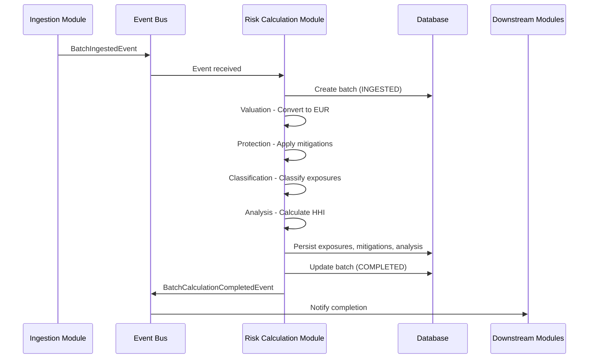
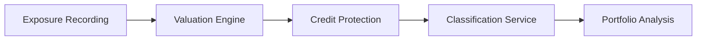

# Risk Calculation Module - Design Document

## Overview

The Risk Calculation Module processes financial exposure data through distinct bounded contexts following Domain-Driven Design principles. The module separates concerns across Exposure Recording, Valuation, Credit Protection, Classification, and Portfolio Analysis contexts, ensuring clean separation of responsibilities and supporting generic financial instruments (loans, bonds, derivatives, guarantees, etc.).

### Key Capabilities

- **Generic Exposure Support**: Handles any type of financial instrument (LOAN, BOND, DERIVATIVE, GUARANTEE, CREDIT_LINE, REPO, SECURITY, INTERBANK, OTHER)
- **Bounded Context Separation**: Clear separation between Recording, Valuation, Protection, Classification, and Analysis
- **Currency Normalization**: Converts all exposures to EUR using exchange rates
- **Credit Risk Mitigation**: Calculates net exposures after applying collateral and guarantees
- **Geographic Classification**: Categorizes exposures by ITALY, EU_OTHER, and NON_EUROPEAN regions
- **Sector Analysis**: Classifies exposures across RETAIL_MORTGAGE, SOVEREIGN, CORPORATE, BANKING, and OTHER sectors
- **Concentration Metrics**: Calculates Herfindahl-Hirschman Index for both geographic and sector concentration
- **Database Persistence**: Stores batches, exposures, mitigations, and portfolio analysis results

## Architecture

The Risk Calculation Module follows the established 4-layer architecture pattern with Maven multi-module structure and event-driven integration:

```
regtech-risk-calculation/
├── pom.xml                                    # Parent POM
├── domain/
│   ├── pom.xml                               # Domain layer POM
│   └── src/main/java/.../domain/             # Pure business logic
├── application/
│   ├── pom.xml                               # Application layer POM  
│   └── src/main/java/.../application/        # Commands, handlers, services
├── infrastructure/
│   ├── pom.xml                               # Infrastructure layer POM
│   └── src/main/java/.../infrastructure/     # Repositories, external services
└── presentation/
    ├── pom.xml                               # Presentation layer POM
    └── src/main/java/.../presentation/       # Controllers, DTOs, APIs
```

### Event Flow



### Bounded Contexts Flow



**Data Flow:**
1. **Exposure Recording**: Captures immutable facts (instrument ID, counterparty, original amount, currency, country, product type)
2. **Valuation Engine**: Converts original amounts to EUR using exchange rates
3. **Credit Protection**: Applies mitigations to calculate net exposures
4. **Classification Service**: Classifies by geographic region and economic sector
5. **Portfolio Analysis**: Aggregates and calculates concentration metrics (HHI)

## Components and Interfaces

### Domain Layer Components

**Domain Organization by Bounded Contexts**:

```
domain/
├── exposure/                       # Exposure Recording context
│   ├── ExposureRecording.java     # Aggregate root
│   ├── InstrumentId.java          # Value object
│   ├── InstrumentType.java        # Enum
│   ├── CounterpartyRef.java       # Value object
│   ├── MonetaryAmount.java        # Value object
│   └── ExposureClassification.java # Value object
├── valuation/                      # Valuation Engine context
│   ├── ExposureValuation.java     # Aggregate root
│   ├── EurAmount.java             # Value object
│   ├── ExchangeRate.java          # Value object
│   └── ExchangeRateProvider.java  # Domain service interface
├── protection/                     # Credit Protection context
│   ├── ProtectedExposure.java     # Aggregate root
│   ├── Mitigation.java            # Entity
│   ├── MitigationType.java        # Enum
│   └── RawMitigationData.java     # Value object
├── classification/                 # Classification context
│   ├── ExposureClassifier.java    # Domain service
│   ├── ClassifiedExposure.java    # Value object
│   ├── GeographicRegion.java      # Enum
│   └── EconomicSector.java        # Enum
├── analysis/                       # Portfolio Analysis context
│   ├── PortfolioAnalysis.java     # Aggregate root
│   ├── Breakdown.java             # Value object
│   ├── Share.java                 # Value object
│   ├── HHI.java                   # Value object
│   └── ConcentrationLevel.java    # Enum
└── shared/                        # Shared value objects
    ├── ExposureId.java
    ├── BankInfo.java
    └── BalanceSheetType.java
```

#### Exposure Recording Context

**ExposureRecording** - Aggregate root for immutable exposure facts
```java
public class ExposureRecording {
    private final ExposureId id;
    private final InstrumentId instrumentId;           // Generic: loan ID, bond ISIN, derivative contract, etc.
    private final CounterpartyRef counterparty;
    private final MonetaryAmount exposureAmount;       // Original amount in original currency
    private final ExposureClassification classification;
    private final Instant recordedAt;
    
    // Only getters - immutable
}
```

**Value Objects**:
```java
public record InstrumentId(String value) {}

public enum InstrumentType {
    LOAN, BOND, DERIVATIVE, GUARANTEE, CREDIT_LINE, 
    REPO, SECURITY, INTERBANK, OTHER
}

public record CounterpartyRef(
    String counterpartyId,
    String name,
    Optional<String> leiCode
) {}

public record MonetaryAmount(
    BigDecimal amount,
    String currencyCode
) {}

public record ExposureClassification(
    String productType,              // "Business Loan", "Corporate Bond", "IRS", etc.
    InstrumentType instrumentType,   // LOAN, BOND, DERIVATIVE, etc.
    BalanceSheetType balanceSheetType,
    String countryCode
) {}

public enum BalanceSheetType {
    ON_BALANCE,
    OFF_BALANCE
}
```

#### Valuation Engine Context

**ExposureValuation** - Aggregate root for currency conversion
```java
public class ExposureValuation {
    private final ExposureId exposureId;
    private final MonetaryAmount original;
    private final EurAmount converted;
    private final ExchangeRate rateUsed;
    private final Instant valuedAt;
    
    public static ExposureValuation convert(
        ExposureId exposureId,
        MonetaryAmount original,
        ExchangeRateProvider rateProvider
    ) {
        if ("EUR".equals(original.currencyCode())) {
            // No conversion needed
            return new ExposureValuation(
                exposureId,
                original,
                new EurAmount(original.amount()),
                ExchangeRate.identity(),
                Instant.now()
            );
        }
        
        ExchangeRate rate = rateProvider.getRate(original.currencyCode(), "EUR");
        BigDecimal eurAmount = original.amount().multiply(rate.rate());
        
        return new ExposureValuation(
            exposureId,
            original,
            new EurAmount(eurAmount),
            rate,
            Instant.now()
        );
    }
}
```

**Value Objects**:
```java
public record EurAmount(BigDecimal value) {
    public EurAmount {
        Objects.requireNonNull(value);
        if (value.compareTo(BigDecimal.ZERO) < 0) {
            throw new IllegalArgumentException("EUR amount cannot be negative");
        }
    }
}

public record ExchangeRate(
    String fromCurrency,
    String toCurrency,
    BigDecimal rate,
    LocalDate effectiveDate
) {
    public static ExchangeRate identity() {
        return new ExchangeRate("EUR", "EUR", BigDecimal.ONE, LocalDate.now());
    }
}
```

**Domain Service Interface**:
```java
public interface ExchangeRateProvider {
    ExchangeRate getRate(String fromCurrency, String toCurrency);
}
```

#### Credit Protection Context

**ProtectedExposure** - Aggregate root for net exposure calculation
```java
public class ProtectedExposure {
    private final ExposureId exposureId;
    private final EurAmount grossExposure;
    private final List<Mitigation> mitigations;
    private final EurAmount netExposure;
    
    public static ProtectedExposure calculate(
        ExposureId exposureId,
        EurAmount grossExposure,
        List<Mitigation> mitigations
    ) {
        BigDecimal totalMitigation = mitigations.stream()
            .map(m -> m.eurValue().value())
            .reduce(BigDecimal.ZERO, BigDecimal::add);
        
        BigDecimal net = grossExposure.value()
            .subtract(totalMitigation)
            .max(BigDecimal.ZERO);  // Net exposure cannot be negative
        
        return new ProtectedExposure(
            exposureId,
            grossExposure,
            mitigations,
            new EurAmount(net)
        );
    }
}
```

**Mitigation Entity**:
```java
public class Mitigation {
    private final MitigationType type;
    private final EurAmount eurValue;
    
    public Mitigation(
        MitigationType type,
        BigDecimal value,
        String currency,
        ExchangeRateProvider rateProvider
    ) {
        this.type = Objects.requireNonNull(type);
        
        // Convert to EUR immediately
        if ("EUR".equals(currency)) {
            this.eurValue = new EurAmount(value);
        } else {
            ExchangeRate rate = rateProvider.getRate(currency, "EUR");
            BigDecimal eurVal = value.multiply(rate.rate());
            this.eurValue = new EurAmount(eurVal);
        }
    }
}
```

**Value Objects**:
```java
public enum MitigationType {
    FINANCIAL_COLLATERAL,
    GUARANTEE,
    PHYSICAL_ASSET,
    REAL_ESTATE
}

public record RawMitigationData(
    MitigationType type,
    BigDecimal value,
    String currency
) {}
```

#### Classification Context

**ExposureClassifier** - Domain service for classification
```java
public class ExposureClassifier {
    
    private static final Set<String> EU_COUNTRIES = Set.of(
        "AT", "BE", "BG", "HR", "CY", "CZ", "DK", "EE", "FI", "FR",
        "DE", "GR", "HU", "IE", "LV", "LT", "LU", "MT", "NL", "PL",
        "PT", "RO", "SK", "SI", "ES", "SE"
    );
    
    public GeographicRegion classifyRegion(String countryCode) {
        Objects.requireNonNull(countryCode);
        
        if ("IT".equals(countryCode)) {
            return GeographicRegion.ITALY;
        } else if (EU_COUNTRIES.contains(countryCode)) {
            return GeographicRegion.EU_OTHER;
        } else {
            return GeographicRegion.NON_EUROPEAN;
        }
    }
    
    public EconomicSector classifySector(String productType) {
        Objects.requireNonNull(productType);
        
        String normalized = productType.toUpperCase().trim();
        
        if (normalized.contains("MORTGAGE")) {
            return EconomicSector.RETAIL_MORTGAGE;
        } else if (normalized.contains("GOVERNMENT") || normalized.contains("TREASURY")) {
            return EconomicSector.SOVEREIGN;
        } else if (normalized.contains("INTERBANK")) {
            return EconomicSector.BANKING;
        } else if (normalized.contains("BUSINESS") || normalized.contains("EQUIPMENT") || 
                   normalized.contains("CREDIT LINE")) {
            return EconomicSector.CORPORATE;
        } else {
            return EconomicSector.OTHER;
        }
    }
}
```

**Value Objects**:
```java
public enum GeographicRegion {
    ITALY,
    EU_OTHER,
    NON_EUROPEAN
}

public enum EconomicSector {
    RETAIL_MORTGAGE,
    SOVEREIGN,
    CORPORATE,
    BANKING,
    OTHER
}

public record ClassifiedExposure(
    ExposureId exposureId,
    EurAmount netExposure,
    GeographicRegion region,
    EconomicSector sector
) {}
```

#### Portfolio Analysis Context

**PortfolioAnalysis** - Aggregate root for concentration metrics
```java
public class PortfolioAnalysis {
    private final String batchId;
    private final EurAmount totalPortfolio;
    private final Breakdown geographicBreakdown;
    private final Breakdown sectorBreakdown;
    private final HHI geographicHHI;
    private final HHI sectorHHI;
    private final Instant analyzedAt;
    
    public static PortfolioAnalysis analyze(
        String batchId,
        List<ClassifiedExposure> exposures
    ) {
        // Calculate total
        BigDecimal total = exposures.stream()
            .map(e -> e.netExposure().value())
            .reduce(BigDecimal.ZERO, BigDecimal::add);
        
        EurAmount totalPortfolio = new EurAmount(total);
        
        // Geographic breakdown
        Map<GeographicRegion, BigDecimal> geoAmounts = exposures.stream()
            .collect(Collectors.groupingBy(
                ClassifiedExposure::region,
                Collectors.mapping(
                    e -> e.netExposure().value(),
                    Collectors.reducing(BigDecimal.ZERO, BigDecimal::add)
                )
            ));
        
        Breakdown geoBreakdown = Breakdown.from(geoAmounts, total);
        HHI geoHHI = HHI.calculate(geoBreakdown);
        
        // Sector breakdown
        Map<EconomicSector, BigDecimal> sectorAmounts = exposures.stream()
            .collect(Collectors.groupingBy(
                ClassifiedExposure::sector,
                Collectors.mapping(
                    e -> e.netExposure().value(),
                    Collectors.reducing(BigDecimal.ZERO, BigDecimal::add)
                )
            ));
        
        Breakdown sectorBreakdown = Breakdown.from(sectorAmounts, total);
        HHI sectorHHI = HHI.calculate(sectorBreakdown);
        
        return new PortfolioAnalysis(
            batchId,
            totalPortfolio,
            geoBreakdown,
            sectorBreakdown,
            geoHHI,
            sectorHHI,
            Instant.now()
        );
    }
}
```

**Value Objects**:
```java
public record Breakdown(Map<String, Share> shares) {
    
    public static Breakdown from(Map<?, BigDecimal> amounts, BigDecimal total) {
        Map<String, Share> shares = amounts.entrySet().stream()
            .collect(Collectors.toMap(
                e -> e.getKey().toString(),
                e -> Share.calculate(e.getValue(), total)
            ));
        return new Breakdown(Map.copyOf(shares));
    }
}

public record Share(
    EurAmount amount,
    BigDecimal percentage
) {
    public static Share calculate(BigDecimal amount, BigDecimal total) {
        BigDecimal pct = amount
            .divide(total, 4, RoundingMode.HALF_UP)
            .multiply(BigDecimal.valueOf(100));
        return new Share(new EurAmount(amount), pct);
    }
}

public record HHI(BigDecimal value, ConcentrationLevel level) {
    
    public HHI {
        if (value.compareTo(BigDecimal.ZERO) < 0 || value.compareTo(BigDecimal.ONE) > 0) {
            throw new IllegalArgumentException("HHI must be between 0 and 1");
        }
    }
    
    public static HHI calculate(Breakdown breakdown) {
        BigDecimal hhi = breakdown.shares().values().stream()
            .map(share -> {
                BigDecimal decimal = share.percentage()
                    .divide(BigDecimal.valueOf(100), 6, RoundingMode.HALF_UP);
                return decimal.multiply(decimal);
            })
            .reduce(BigDecimal.ZERO, BigDecimal::add);
        
        ConcentrationLevel level;
        if (hhi.compareTo(BigDecimal.valueOf(0.15)) < 0) {
            level = ConcentrationLevel.LOW;
        } else if (hhi.compareTo(BigDecimal.valueOf(0.25)) < 0) {
            level = ConcentrationLevel.MODERATE;
        } else {
            level = ConcentrationLevel.HIGH;
        }
        
        return new HHI(hhi, level);
    }
}

public enum ConcentrationLevel {
    LOW,
    MODERATE,
    HIGH
}
```

### Application Layer Components

**Organized by Capabilities**:

```
application/
├── ingestion/                      # Report ingestion and validation
│   ├── RiskReportIngestionService.java
│   ├── RiskReportMapper.java
│   └── IngestedRiskReport.java
├── calculation/                    # Risk calculation orchestration
│   ├── RiskCalculationService.java
│   └── RiskCalculationResult.java
└── shared/                        # Shared exceptions
    └── InvalidReportException.java
```

#### Ingestion Service

**RiskReportIngestionService** - Orchestrates the entire calculation flow
```java
@Service
public class RiskReportIngestionService {
    
    private final RiskReportMapper mapper;
    private final RiskCalculationService calculationService;
    
    @Transactional
    public RiskCalculationResult ingestAndCalculate(RiskReportDTO rawReport) {
        
        // Step 1: Validate raw input
        validateRawReport(rawReport);
        
        // Step 2: Convert DTO → Domain
        IngestedRiskReport ingestedReport = mapper.toDomain(rawReport);
        
        // Step 3: Validate domain model
        validateIngestedReport(ingestedReport);
        
        // Step 4: Calculate risk metrics
        PortfolioAnalysis analysis = calculationService.calculateRisk(
            ingestedReport.getBatchId(),
            ingestedReport.getExposures(),
            ingestedReport.getMitigations()
        );
        
        // Step 5: Return result
        return new RiskCalculationResult(
            ingestedReport.getBatchId(),
            ingestedReport.getBankInfo(),
            ingestedReport.getTotalExposures(),
            analysis,
            ingestedReport.getIngestedAt()
        );
    }
}
```

**RiskCalculationService** - Orchestrates bounded context flow
```java
@Service
public class RiskCalculationService {
    
    private final ExchangeRateProvider exchangeRateProvider;
    private final ExposureClassifier classifier;
    
    public PortfolioAnalysis calculateRisk(
        String batchId,
        List<ExposureRecording> exposures,
        Map<ExposureId, List<RawMitigationData>> mitigations
    ) {
        // Step 1: Valuation - Convert to EUR
        Map<ExposureId, ExposureValuation> valuations = exposures.stream()
            .collect(Collectors.toMap(
                ExposureRecording::getId,
                exp -> ExposureValuation.convert(
                    exp.getId(),
                    exp.getExposureAmount(),
                    exchangeRateProvider
                )
            ));
        
        // Step 2: Protection - Apply mitigations
        Map<ExposureId, ProtectedExposure> protectedExposures = exposures.stream()
            .collect(Collectors.toMap(
                ExposureRecording::getId,
                exp -> {
                    EurAmount grossExposure = valuations.get(exp.getId()).getConverted();
                    List<Mitigation> mits = convertMitigations(
                        mitigations.getOrDefault(exp.getId(), List.of())
                    );
                    return ProtectedExposure.calculate(exp.getId(), grossExposure, mits);
                }
            ));
        
        // Step 3: Classification - Classify by region and sector
        List<ClassifiedExposure> classified = exposures.stream()
            .map(exp -> new ClassifiedExposure(
                exp.getId(),
                protectedExposures.get(exp.getId()).getNetExposure(),
                classifier.classifyRegion(exp.getClassification().countryCode()),
                classifier.classifySector(exp.getClassification().productType())
            ))
            .toList();
        
        // Step 4: Analysis - Calculate concentration metrics
        return PortfolioAnalysis.analyze(batchId, classified);
    }
}
```

### Infrastructure Layer Components

#### Database Schema

**batches** - Batch metadata table
```sql
CREATE TABLE batches (
    batch_id VARCHAR(100) PRIMARY KEY,
    bank_name VARCHAR(255) NOT NULL,
    abi_code VARCHAR(10) NOT NULL,
    lei_code VARCHAR(20) NOT NULL,
    report_date DATE NOT NULL,
    total_exposures INTEGER NOT NULL,
    status VARCHAR(20) NOT NULL,
    ingested_at TIMESTAMP NOT NULL,
    processed_at TIMESTAMP,
    
    INDEX idx_report_date (report_date),
    INDEX idx_status (status)
);
```

**exposures** - Exposure records table
```sql
CREATE TABLE exposures (
    exposure_id VARCHAR(100) PRIMARY KEY,
    batch_id VARCHAR(100) NOT NULL,
    instrument_id VARCHAR(100) NOT NULL,
    
    -- Counterparty
    counterparty_id VARCHAR(100) NOT NULL,
    counterparty_name VARCHAR(255) NOT NULL,
    counterparty_lei VARCHAR(20),
    
    -- Monetary amount
    exposure_amount DECIMAL(20, 2) NOT NULL,
    currency_code VARCHAR(3) NOT NULL,
    
    -- Classification
    product_type VARCHAR(100) NOT NULL,
    instrument_type VARCHAR(20) NOT NULL,
    balance_sheet_type VARCHAR(20) NOT NULL,
    country_code VARCHAR(2) NOT NULL,
    
    -- Metadata
    recorded_at TIMESTAMP NOT NULL,
    created_at TIMESTAMP NOT NULL,
    
    FOREIGN KEY (batch_id) REFERENCES batches(batch_id),
    INDEX idx_batch_id (batch_id),
    INDEX idx_country_code (country_code)
);
```

**mitigations** - Credit risk mitigation table
```sql
CREATE TABLE mitigations (
    id BIGINT AUTO_INCREMENT PRIMARY KEY,
    exposure_id VARCHAR(100) NOT NULL,
    batch_id VARCHAR(100) NOT NULL,
    mitigation_type VARCHAR(50) NOT NULL,
    value DECIMAL(20, 2) NOT NULL,
    currency_code VARCHAR(3) NOT NULL,
    created_at TIMESTAMP NOT NULL,
    
    FOREIGN KEY (exposure_id) REFERENCES exposures(exposure_id),
    FOREIGN KEY (batch_id) REFERENCES batches(batch_id),
    INDEX idx_exposure_id (exposure_id),
    INDEX idx_batch_id (batch_id)
);
```

**portfolio_analysis** - Portfolio analysis results table
```sql
CREATE TABLE portfolio_analysis (
    batch_id VARCHAR(100) PRIMARY KEY,
    
    -- Totals
    total_portfolio_eur DECIMAL(20, 2) NOT NULL,
    
    -- Geographic breakdown
    italy_amount DECIMAL(20, 2),
    italy_percentage DECIMAL(5, 2),
    eu_other_amount DECIMAL(20, 2),
    eu_other_percentage DECIMAL(5, 2),
    non_european_amount DECIMAL(20, 2),
    non_european_percentage DECIMAL(5, 2),
    
    -- Sector breakdown
    retail_mortgage_amount DECIMAL(20, 2),
    retail_mortgage_percentage DECIMAL(5, 2),
    sovereign_amount DECIMAL(20, 2),
    sovereign_percentage DECIMAL(5, 2),
    corporate_amount DECIMAL(20, 2),
    corporate_percentage DECIMAL(5, 2),
    banking_amount DECIMAL(20, 2),
    banking_percentage DECIMAL(5, 2),
    other_amount DECIMAL(20, 2),
    other_percentage DECIMAL(5, 2),
    
    -- Concentration indices
    geographic_hhi DECIMAL(6, 4) NOT NULL,
    geographic_concentration_level VARCHAR(20) NOT NULL,
    sector_hhi DECIMAL(6, 4) NOT NULL,
    sector_concentration_level VARCHAR(20) NOT NULL,
    
    -- Metadata
    analyzed_at TIMESTAMP NOT NULL,
    
    FOREIGN KEY (batch_id) REFERENCES batches(batch_id)
);
```

#### Repository Interfaces

**Domain Interfaces**:
```java
public interface ExposureRepository {
    void save(ExposureRecording exposure, String batchId);
    void saveAll(List<ExposureRecording> exposures, String batchId);
    Optional<ExposureRecording> findById(ExposureId id);
    List<ExposureRecording> findByBatchId(String batchId);
}

public interface MitigationRepository {
    void save(ExposureId exposureId, String batchId, RawMitigationData mitigation);
    void saveAll(ExposureId exposureId, String batchId, List<RawMitigationData> mitigations);
    List<RawMitigationData> findByExposureId(ExposureId exposureId);
}

public interface PortfolioAnalysisRepository {
    void save(PortfolioAnalysis analysis);
    Optional<PortfolioAnalysis> findByBatchId(String batchId);
}
```

### Presentation Layer Components

**DTOs for Generic Exposures**:

```java
public class RiskReportDTO {
    private BankInfoDTO bankInfo;
    private List<ExposureDTO> exposures;  // Generic exposures
    private List<CreditRiskMitigationDTO> creditRiskMitigation;
}

public class ExposureDTO {
    private String exposureId;
    private String instrumentId;          // Generic: loan ID, bond ISIN, etc.
    private String instrumentType;        // LOAN, BOND, DERIVATIVE, etc.
    private String counterpartyName;
    private String counterpartyId;
    private String counterpartyLei;
    private BigDecimal exposureAmount;
    private String currency;
    private String productType;           // "Business Loan", "Corporate Bond", etc.
    private String balanceSheetType;
    private String countryCode;
}
```

## Event-Driven Integration

### Inbound Events

**BatchIngestedEvent** - Triggers risk calculation
```java
@Component
public class BatchIngestedEventListener {
    private final RiskReportIngestionService ingestionService;
    
    @EventListener
    @Async
    public void handleBatchIngested(BatchIngestedEvent event) {
        log.info("Received BatchIngestedEvent for batch: {}", event.getBatchId());
        
        try {
            // Download report from S3
            RiskReportDTO report = downloadReport(event.getFileUri());
            
            // Process through bounded contexts
            RiskCalculationResult result = ingestionService.ingestAndCalculate(report);
            
            log.info("Risk calculation completed for batch: {}", event.getBatchId());
            
        } catch (Exception e) {
            log.error("Risk calculation failed for batch: {}", event.getBatchId(), e);
            throw new RiskCalculationException("Failed to calculate risk metrics", e);
        }
    }
}
```

### Outbound Events

**BatchCalculationCompletedEvent** - Notifies downstream modules
```java
@Component
public class RiskCalculationEventPublisher {
    private final ApplicationEventPublisher eventPublisher;
    
    public void publishCalculationCompleted(
        String batchId,
        BankInfo bankInfo,
        PortfolioAnalysis analysis
    ) {
        BatchCalculationCompletedEvent event = new BatchCalculationCompletedEvent(
            batchId,
            bankInfo,
            analysis.getTotalPortfolio(),
            analysis.getGeographicBreakdown(),
            analysis.getSectorBreakdown(),
            analysis.getGeographicHHI(),
            analysis.getSectorHHI(),
            Instant.now()
        );
        
        eventPublisher.publishEvent(event);
        log.info("Published BatchCalculationCompletedEvent for batch: {}", batchId);
    }
    
    public void publishCalculationFailed(String batchId, String errorMessage) {
        BatchCalculationFailedEvent event = new BatchCalculationFailedEvent(
            batchId,
            errorMessage,
            Instant.now()
        );
        
        eventPublisher.publishEvent(event);
        log.error("Published BatchCalculationFailedEvent for batch: {}", batchId);
    }
}
```

**Integration Event DTOs**:
```java
public record BatchCalculationCompletedEvent(
    String batchId,
    BankInfo bankInfo,
    EurAmount totalPortfolio,
    Breakdown geographicBreakdown,
    Breakdown sectorBreakdown,
    HHI geographicHHI,
    HHI sectorHHI,
    Instant completedAt
) {}

public record BatchCalculationFailedEvent(
    String batchId,
    String errorMessage,
    Instant failedAt
) {}
```

## Error Handling

**Validation Errors**:
- Bank information missing → InvalidReportException
- Empty exposure portfolio → InvalidReportException
- Missing mitigation data → InvalidReportException
- Duplicate exposure IDs → InvalidReportException
- Mitigations referencing non-existent exposures → InvalidReportException

**Exchange Rate Errors**:
- Unavailable exchange rate → ExchangeRateProvider returns error
- System fails calculation and logs error

**Event Processing Errors**:
- Event listener catches exceptions and publishes BatchCalculationFailedEvent
- Failed batches are marked with FAILED status in database
- Error messages are logged for troubleshooting

## Correctness Properties

*A property is a characteristic or behavior that should hold true across all valid executions of a system—essentially, a formal statement about what the system should do. Properties serve as the bridge between human-readable specifications and machine-verifiable correctness guarantees.*

### Property 1: Instrument Type Support
*For any* valid instrument type (LOAN, BOND, DERIVATIVE, GUARANTEE, CREDIT_LINE, REPO, SECURITY, INTERBANK, OTHER), the system should successfully parse and process exposures of that type
**Validates: Requirements 1.2**

### Property 2: Exposure ID Uniqueness Detection
*For any* batch of exposures, if duplicate exposure IDs exist, the system should detect and reject them with InvalidReportException
**Validates: Requirements 1.3**

### Property 3: Mitigation Referential Integrity
*For any* set of mitigations, if a mitigation references a non-existent exposure ID, the system should detect and reject it with InvalidReportException
**Validates: Requirements 1.4**

### Property 4: Currency Conversion Correctness
*For any* exposure with non-EUR currency, converting to EUR and then using the inverse rate should return approximately the original amount (within rounding tolerance)
**Validates: Requirements 2.1**

### Property 5: Original Amount Preservation
*For any* exposure, after currency conversion, the original monetary amount and currency code should remain unchanged
**Validates: Requirements 2.3**

### Property 6: Net Exposure Calculation
*For any* exposure with gross exposure G and total mitigations M, the net exposure should equal max(G - M, 0)
**Validates: Requirements 3.3, 3.4**

### Property 7: Mitigation Currency Conversion
*For any* mitigation in non-EUR currency, the EUR-converted value should be positive and non-zero when the original value is positive
**Validates: Requirements 3.2**

### Property 8: Geographic Classification Completeness
*For any* country code, the classification service should return exactly one of ITALY, EU_OTHER, or NON_EUROPEAN
**Validates: Requirements 4.1**

### Property 9: EU Country Classification
*For any* country code in the EU_COUNTRIES set (excluding IT), the classification should be EU_OTHER
**Validates: Requirements 4.3**

### Property 10: Non-EU Country Classification
*For any* country code not in the EU_COUNTRIES set and not IT, the classification should be NON_EUROPEAN
**Validates: Requirements 4.4**

### Property 11: Sector Classification Completeness
*For any* product type string, the classification service should return exactly one of RETAIL_MORTGAGE, SOVEREIGN, CORPORATE, BANKING, or OTHER
**Validates: Requirements 5.1**

### Property 12: Mortgage Pattern Matching
*For any* product type containing "MORTGAGE" (case-insensitive), the sector classification should be RETAIL_MORTGAGE
**Validates: Requirements 5.2**

### Property 13: Sovereign Pattern Matching
*For any* product type containing "GOVERNMENT" or "TREASURY" (case-insensitive), the sector classification should be SOVEREIGN
**Validates: Requirements 5.3**

### Property 14: Banking Pattern Matching
*For any* product type containing "INTERBANK" (case-insensitive), the sector classification should be BANKING
**Validates: Requirements 5.4**

### Property 15: Corporate Pattern Matching
*For any* product type containing "BUSINESS", "EQUIPMENT", or "CREDIT LINE" (case-insensitive), the sector classification should be CORPORATE
**Validates: Requirements 5.5**

### Property 16: Portfolio Total Calculation
*For any* list of classified exposures, the total portfolio amount should equal the sum of all net exposure amounts
**Validates: Requirements 6.1**

### Property 17: Geographic Breakdown Sum
*For any* portfolio analysis, the sum of geographic breakdown amounts (ITALY + EU_OTHER + NON_EUROPEAN) should equal the total portfolio amount
**Validates: Requirements 6.2**

### Property 18: Geographic Percentage Sum
*For any* portfolio analysis, the sum of geographic breakdown percentages should equal 100% (within rounding tolerance)
**Validates: Requirements 6.2**

### Property 19: Sector Breakdown Sum
*For any* portfolio analysis, the sum of sector breakdown amounts should equal the total portfolio amount
**Validates: Requirements 6.3**

### Property 20: Sector Percentage Sum
*For any* portfolio analysis, the sum of sector breakdown percentages should equal 100% (within rounding tolerance)
**Validates: Requirements 6.3**

### Property 21: HHI Formula Correctness
*For any* breakdown with shares s₁, s₂, ..., sₙ, the HHI should equal Σ(sᵢ)² where shares are expressed as decimals (not percentages)
**Validates: Requirements 6.4**

### Property 22: HHI Range Constraint
*For any* calculated HHI, the value should be between 0 and 1 (inclusive)
**Validates: Requirements 6.4**

### Property 23: Batch Persistence Completeness
*For any* successfully ingested report, the batches table should contain a record with all required fields (bank_name, abi_code, lei_code, report_date, total_exposures, status, timestamps)
**Validates: Requirements 7.1, 7.2**

### Property 24: Exposure Persistence Count
*For any* successfully ingested report with N exposures, the exposures table should contain exactly N records for that batch_id
**Validates: Requirements 7.3**

### Property 25: Exposure Persistence Completeness
*For any* persisted exposure, all required fields should be non-null (exposure_id, batch_id, instrument_id, counterparty details, amounts, currency, classification, timestamps)
**Validates: Requirements 7.4**

### Property 26: Mitigation Persistence Count
*For any* successfully ingested report with M mitigations, the mitigations table should contain exactly M records for that batch_id
**Validates: Requirements 7.5**

### Property 27: Portfolio Analysis Persistence
*For any* successfully completed risk calculation, the portfolio_analysis table should contain exactly one record for that batch_id
**Validates: Requirements 8.1**

### Property 28: Portfolio Analysis Completeness
*For any* persisted portfolio analysis, all breakdown fields (geographic and sector amounts/percentages) and HHI fields should be non-null
**Validates: Requirements 8.3, 8.4, 8.5**

## Testing Strategy

### Unit Testing
- Test value object validation (ExposureId, MonetaryAmount, EurAmount)
- Test domain services (ExposureClassifier)
- Test aggregate behavior (PortfolioAnalysis.analyze())
- Test calculation logic (HHI.calculate(), Share.calculate())
- Test specific error cases (Requirements 9.1-9.5)

### Integration Testing
- Test complete flow from DTO to PortfolioAnalysis
- Test database persistence for all entities
- Test repository implementations
- Test mapper conversions (DTO → Domain)
- Test event-driven integration (BatchIngestedEvent → BatchCalculationCompletedEvent)

### Property-Based Testing
- Use **jqwik** (recommended for Java)
- Each correctness property above should be implemented as a property-based test
- Configure minimum 100 iterations per property test
- Tag each property test with: `@Property("Feature: risk-calculation-module, Property N: [property description]")`
- Generate random exposures, mitigations, and classifications for comprehensive testing
- Test edge cases through generators (empty lists, zero amounts, boundary values)

## Summary

This design separates concerns across five bounded contexts (Exposure Recording, Valuation, Credit Protection, Classification, Portfolio Analysis), supports generic financial instruments, and provides clear data flow from ingestion through analysis. The architecture follows Clean Architecture principles with proper layer separation and dependency management.
