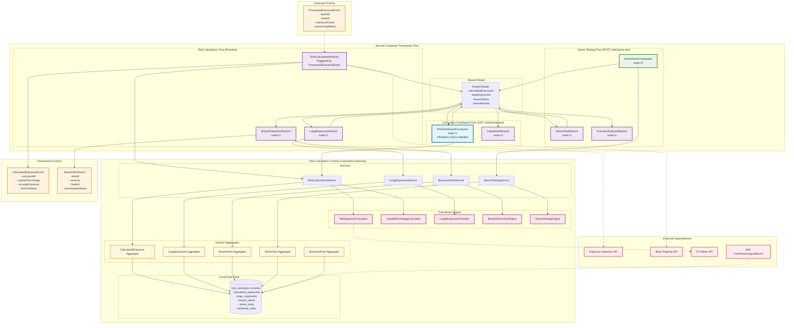

# Risk Calculation Context - Design Document

## Overview

The Risk Calculation context serves as the computational engine for BCBS 239 compliant risk calculations within the BCBS 239 SaaS platform. It performs net exposure calculations, capital percentage computations, large exposure identification, and regulatory limit breach detection. The context implements Basel III large exposure framework requirements while providing configurable business rules, stress testing capabilities, and comprehensive audit trails.

The design emphasizes autonomous operation through Service Composer Framework patterns, high-performance calculation processing, and event-driven coordination with upstream contexts (Exposure Ingestion) and downstream contexts (Data Quality, Report Generation).

## Architecture

### Core Architecture Principles

1. **Regulatory Calculation Authority**: Owns all risk calculations, capital percentages, and large exposure classifications
2. **Basel III Compliance**: Full implementation of Basel III large exposure framework and BCBS 239 requirements
3. **High-Performance Computing**: Optimized for large-scale portfolio calculations with parallel processing
4. **Configurable Business Rules**: Flexible rule engine supporting regulatory changes and bank-specific requirements
5. **Comprehensive Audit Trail**: Complete calculation traceability for regulatory compliance and internal audit

### Context Dependencies

#### ⬆️ Upstream Dependencies
- **Exposure Ingestion Context**: ProcessedExposureEvent for raw exposure data
- **Bank Registry Context**: Bank parameters, eligible capital, and regulatory configuration (via API queries)
- **Identity & Access Management Context**: Permission events for local cache updates

#### ⬇️ Downstream Dependencies (Event Consumers)
- **Data Quality Context**: CalculatedExposureEvent for large exposure violation detection
- **Report Generation Context**: Risk calculation results for regulatory reporting
- **Bank Registry Context**: Large exposure status updates for bank configuration

### Service Composer Framework Architecture Diagram



## Components and Interfaces

### 1. Domain Models with Basel III Compliance Focus

#### CalculatedExposure Aggregate
Central aggregate managing comprehensive risk calculations for individual exposures.

```java
public record CalculatedExposure(
    CalculatedExposureId id,
    ExposureId originalExposureId,
    BankId bankId,
    String counterpartyName,
    String leiCode,
    Money grossExposureAmount,
    Money netExposureAmount,
    Money eligibleCapital,
    double capitalPercentage,
    ExposureClassification classification,
    LargeExposureStatus largeExposureStatus,
    BreachStatus breachStatus,
    CalculationMetadata calculationMetadata,
    Instant calculatedAt,
    UserId calculatedBy
) {
    public static Result<CalculatedExposure, ErrorDetail> calculate(
        RawExposure rawExposure,
        BankParameters bankParameters,
        List<BusinessRule> applicableRules
    ) {
        // Apply business rules for net exposure calculation
        Result<Money, ErrorDetail> netExposureResult = NetExposureCalculator.calculate(
            rawExposure, bankParameters, applicableRules
        );
        
        if (netExposureResult.isFailure()) {
            return Result.failure(netExposureResult.getError());
        }
        
        Money netExposure = netExposureResult.getValue();
        Money eligibleCapital = bankParameters.eligibleCapitalLargeExposures();
        
        // Calculate capital percentage
        double capitalPercentage = CapitalPercentageCalculator.calculate(
            netExposure, eligibleCapital
        );
        
        // Determine classification and status
        ExposureClassification classification = LargeExposureClassifier.classify(
            rawExposure, bankParameters
        );
        
        LargeExposureStatus largeExposureStatus = capitalPercentage >= 10.0 ? 
            LargeExposureStatus.LARGE_EXPOSURE : LargeExposureStatus.BELOW_THRESHOLD;
        
        BreachStatus breachStatus = determineBreachStatus(capitalPercentage);
        
        CalculationMetadata metadata = new CalculationMetadata(
            extractAppliedRules(applicableRules),
            rawExposure.currency(),
            bankParameters.reportingDate(),
            "BASEL_III_LARGE_EXPOSURE_V1.0"
        );
        
        return Result.success(new CalculatedExposure(
            CalculatedExposureId.generate(),
            rawExposure.id(),
            rawExposure.bankId(),
            rawExposure.counterpartyName(),
            rawExposure.leiCode(),
            rawExposure.exposureAmount(),
            netExposure,
            eligibleCapital,
            capitalPercentage,
            classification,
            largeExposureStatus,
            breachStatus,
            metadata,
            Instant.now(),
            UserId.system()
        ));
    }
    
    public boolean isLargeExposure() {
        return largeExposureStatus == LargeExposureStatus.LARGE_EXPOSURE;
    }
    
    public boolean hasLimitBreach() {
        return breachStatus == BreachStatus.BREACH || breachStatus == BreachStatus.CRITICAL;
    }
    
    public Money getExcessAmount() {
        if (!hasLimitBreach()) return Money.zero(netExposureAmount.currency());
        
        Money legalLimit = eligibleCapital.multiply(0.25); // 25% legal limit
        return netExposureAmount.subtract(legalLimit);
    }
    
    private static BreachStatus determineBreachStatus(double capitalPercentage) {
        return capitalPercentage >= 30.0 ? BreachStatus.CRITICAL :
               capitalPercentage >= 25.0 ? BreachStatus.BREACH :
               capitalPercentage >= 20.0 ? BreachStatus.WARNING :
               BreachStatus.COMPLIANT;
    }
}

public enum LargeExposureStatus {
    BELOW_THRESHOLD("Below 10% Threshold"),
    LARGE_EXPOSURE("Large Exposure (≥10%)"),
    EXEMPT("Exempt from Large Exposure Rules");
    
    private final String description;
    
    LargeExposureStatus(String description) {
        this.description = description;
    }
    
    public String getDescription() { return description; }
}

public enum BreachStatus {
    COMPLIANT("Compliant (<20%)"),
    WARNING("Warning (20-25%)"),
    BREACH("Breach (25-30%)"),
    CRITICAL("Critical (>30%)");
    
    private final String description;
    
    BreachStatus(String description) {
        this.description = description;
    }
    
    public String getDescription() { return description; }
    public boolean requiresAction() { return this != COMPLIANT; }
}

public record CalculationMetadata(
    List<String> appliedRules,
    String originalCurrency,
    LocalDate reportingDate,
    String calculationVersion
) {}
```

#### LargeExposure Aggregate
Specialized aggregate for managing large exposures with enhanced monitoring and classification.

```java
public record LargeExposure(
    LargeExposureId id,
    CalculatedExposureId calculatedExposureId,
    BankId bankId,
    String counterpartyName,
    String leiCode,
    ExposureClassification classification,
    Money netExposureAmount,
    double capitalPercentage,
    LargeExposureCategory category,
    RiskRating riskRating,
    List<String> connectedCounterparties,
    MonitoringStatus monitoringStatus,
    Instant identifiedAt,
    Maybe<Instant> lastReviewedAt
) {
    public static LargeExposure fromCalculatedExposure(
        CalculatedExposure calculatedExposure,
        BankParameters bankParameters
    ) {
        LargeExposureCategory category = determineCategory(
            calculatedExposure.classification(), 
            calculatedExposure.capitalPercentage()
        );
        
        RiskRating riskRating = assessRiskRating(
            calculatedExposure, bankParameters
        );
        
        List<String> connectedCounterparties = identifyConnectedCounterparties(
            calculatedExposure.leiCode(), bankParameters
        );
        
        MonitoringStatus monitoringStatus = calculatedExposure.hasLimitBreach() ? 
            MonitoringStatus.ENHANCED : MonitoringStatus.STANDARD;
        
        return new LargeExposure(
            LargeExposureId.generate(),
            calculatedExposure.id(),
            calculatedExposure.bankId(),
            calculatedExposure.counterpartyName(),
            calculatedExposure.leiCode(),
            calculatedExposure.classification(),
            calculatedExposure.netExposureAmount(),
            calculatedExposure.capitalPercentage(),
            category,
            riskRating,
            connectedCounterparties,
            monitoringStatus,
            Instant.now(),
            Maybe.none()
        );
    }
    
    public boolean requiresEnhancedMonitoring() {
        return monitoringStatus == MonitoringStatus.ENHANCED || 
               capitalPercentage >= 20.0 ||
               riskRating == RiskRating.HIGH;
    }
    
    public List<String> generateMonitoringActions() {
        List<String> actions = new ArrayList<>();
        
        if (capitalPercentage >= 25.0) {
            actions.add("Immediate breach notification required");
            actions.add("Develop reduction plan within 24 hours");
        }
        
        if (capitalPercentage >= 20.0) {
            actions.add("Enhanced monitoring required");
            actions.add("Weekly exposure review");
        }
        
        if (!connectedCounterparties.isEmpty()) {
            actions.add("Review connected counterparty exposures");
        }
        
        return actions;
    }
    
    private static LargeExposureCategory determineCategory(
        ExposureClassification classification, 
        double capitalPercentage
    ) {
        return switch (classification) {
            case SOVEREIGN -> LargeExposureCategory.SOVEREIGN;
            case BANK -> capitalPercentage >= 15.0 ? 
                LargeExposureCategory.SIGNIFICANT_BANK : LargeExposureCategory.BANK;
            case CORPORATE -> capitalPercentage >= 20.0 ? 
                LargeExposureCategory.MAJOR_CORPORATE : LargeExposureCategory.CORPORATE;
            case OTHER -> LargeExposureCategory.OTHER;
        };
    }
}

public enum LargeExposureCategory {
    SOVEREIGN("Sovereign Exposure"),
    BANK("Bank Exposure"),
    SIGNIFICANT_BANK("Significant Bank Exposure"),
    CORPORATE("Corporate Exposure"),
    MAJOR_CORPORATE("Major Corporate Exposure"),
    OTHER("Other Exposure");
    
    private final String description;
    
    LargeExposureCategory(String description) {
        this.description = description;
    }
    
    public String getDescription() { return description; }
}

public enum MonitoringStatus {
    STANDARD("Standard Monitoring"),
    ENHANCED("Enhanced Monitoring"),
    CRITICAL("Critical Monitoring");
    
    private final String description;
    
    MonitoringStatus(String description) {
        this.description = description;
    }
    
    public String getDescription() { return description; }
}
```

#### BreachAlert Aggregate
Manages regulatory limit breach detection and escalation.

```java
public record BreachAlert(
    BreachAlertId id,
    CalculatedExposureId exposureId,
    BankId bankId,
    String counterpartyName,
    BreachSeverity severity,
    double capitalPercentage,
    Money excessAmount,
    String alertMessage,
    AlertStatus status,
    List<String> requiredActions,
    Instant detectedAt,
    Maybe<Instant> acknowledgedAt,
    Maybe<Instant> resolvedAt,
    Maybe<UserId> assignedTo
) {
    public static BreachAlert create(
        CalculatedExposure calculatedExposure,
        BankParameters bankParameters
    ) {
        if (!calculatedExposure.hasLimitBreach()) {
            throw new IllegalArgumentException("No breach detected for exposure");
        }
        
        BreachSeverity severity = mapBreachStatusToSeverity(calculatedExposure.breachStatus());
        Money excessAmount = calculatedExposure.getExcessAmount();
        
        String alertMessage = generateAlertMessage(
            calculatedExposure.counterpartyName(),
            calculatedExposure.capitalPercentage(),
            excessAmount
        );
        
        List<String> requiredActions = generateRequiredActions(severity, excessAmount);
        
        return new BreachAlert(
            BreachAlertId.generate(),
            calculatedExposure.id(),
            calculatedExposure.bankId(),
            calculatedExposure.counterpartyName(),
            severity,
            calculatedExposure.capitalPercentage(),
            excessAmount,
            alertMessage,
            AlertStatus.ACTIVE,
            requiredActions,
            Instant.now(),
            Maybe.none(),
            Maybe.none(),
            Maybe.none()
        );
    }
    
    public Result<BreachAlert, ErrorDetail> acknowledge(UserId userId) {
        if (status != AlertStatus.ACTIVE) {
            return Result.failure(ErrorDetail.businessRule(
                "ALERT_ALREADY_ACKNOWLEDGED", 
                "Alert has already been acknowledged"
            ));
        }
        
        return Result.success(new BreachAlert(
            id, exposureId, bankId, counterpartyName, severity, capitalPercentage,
            excessAmount, alertMessage, AlertStatus.ACKNOWLEDGED, requiredActions,
            detectedAt, Maybe.some(Instant.now()), resolvedAt, Maybe.some(userId)
        ));
    }
    
    public Result<BreachAlert, ErrorDetail> resolve(String resolutionNote) {
        if (status == AlertStatus.RESOLVED) {
            return Result.failure(ErrorDetail.businessRule(
                "ALERT_ALREADY_RESOLVED", 
                "Alert has already been resolved"
            ));
        }
        
        return Result.success(new BreachAlert(
            id, exposureId, bankId, counterpartyName, severity, capitalPercentage,
            excessAmount, alertMessage + " | Resolution: " + resolutionNote, 
            AlertStatus.RESOLVED, requiredActions, detectedAt, acknowledgedAt, 
            Maybe.some(Instant.now()), assignedTo
        ));
    }
    
    public boolean isOverdue() {
        if (status == AlertStatus.RESOLVED) return false;
        
        Duration allowedTime = switch (severity) {
            case CRITICAL -> Duration.ofHours(4);
            case HIGH -> Duration.ofHours(24);
            case MEDIUM -> Duration.ofDays(3);
        };
        
        return Instant.now().isAfter(detectedAt.plus(allowedTime));
    }
    
    private static String generateAlertMessage(
        String counterpartyName, 
        double capitalPercentage, 
        Money excessAmount
    ) {
        return String.format(
            "Large exposure limit breach detected: %s exceeds 25%% limit with %.2f%% of capital (excess: %s)",
            counterpartyName, capitalPercentage, excessAmount.toString()
        );
    }
    
    private static List<String> generateRequiredActions(BreachSeverity severity, Money excessAmount) {
        List<String> actions = new ArrayList<>();
        
        switch (severity) {
            case CRITICAL -> {
                actions.add("Immediate escalation to Board Risk Committee");
                actions.add("Develop emergency reduction plan within 2 hours");
                actions.add("Daily monitoring until resolved");
            }
            case HIGH -> {
                actions.add("Notify senior management within 4 hours");
                actions.add("Develop reduction plan within 24 hours");
                actions.add("Weekly progress reporting");
            }
            case MEDIUM -> {
                actions.add("Acknowledge breach within 24 hours");
                actions.add("Develop reduction plan within 72 hours");
                actions.add("Monthly progress review");
            }
        }
        
        return actions;
    }
}

public enum BreachSeverity {
    MEDIUM("Medium", 3),
    HIGH("High", 2),
    CRITICAL("Critical", 1);
    
    private final String description;
    private final int priority;
    
    BreachSeverity(String description, int priority) {
        this.description = description;
        this.priority = priority;
    }
    
    public String getDescription() { return description; }
    public int getPriority() { return priority; }
}

public enum AlertStatus {
    ACTIVE("Active"),
    ACKNOWLEDGED("Acknowledged"),
    RESOLVED("Resolved"),
    ESCALATED("Escalated");
    
    private final String description;
    
    AlertStatus(String description) {
        this.description = description;
    }
    
    public String getDescription() { return description; }
}
```### 
2. Calculation Engine Components

#### NetExposureCalculator
Performs net exposure calculations with credit risk mitigation.

```java
@Component
public class NetExposureCalculator {
    
    private final FxRateService fxRateService;
    private final CollateralValidationService collateralService;
    
    public static Result<Money, ErrorDetail> calculate(
        RawExposure rawExposure,
        BankParameters bankParameters,
        List<BusinessRule> applicableRules
    ) {
        Money grossExposure = rawExposure.exposureAmount();
        
        // Apply credit risk mitigation
        Result<Money, ErrorDetail> crmResult = applyCreditRiskMitigation(
            rawExposure, bankParameters, applicableRules
        );
        
        if (crmResult.isFailure()) {
            return crmResult;
        }
        
        Money creditRiskMitigation = crmResult.getValue();
        Money netExposure = grossExposure.subtract(creditRiskMitigation);
        
        // Ensure net exposure is not negative
        if (netExposure.isNegative()) {
            netExposure = Money.zero(grossExposure.currency());
        }
        
        // Apply currency conversion if needed
        if (!netExposure.currency().equals(bankParameters.reportingCurrency())) {
            Result<Money, ErrorDetail> conversionResult = convertToReportingCurrency(
                netExposure, bankParameters.reportingCurrency(), bankParameters.reportingDate()
            );
            
            if (conversionResult.isFailure()) {
                return conversionResult;
            }
            
            netExposure = conversionResult.getValue();
        }
        
        return Result.success(netExposure);
    }
    
    private static Result<Money, ErrorDetail> applyCreditRiskMitigation(
        RawExposure rawExposure,
        BankParameters bankParameters,
        List<BusinessRule> applicableRules
    ) {
        Money totalMitigation = Money.zero(rawExposure.exposureAmount().currency());
        
        // Apply collateral
        if (rawExposure.collateralValue().isPresent()) {
            Money collateralValue = rawExposure.collateralValue().get();
            
            // Apply haircut based on collateral type
            double haircutRate = getCollateralHaircut(rawExposure.collateralType(), applicableRules);
            Money eligibleCollateral = collateralValue.multiply(1.0 - haircutRate);
            
            totalMitigation = totalMitigation.add(eligibleCollateral);
        }
        
        // Apply netting agreements
        if (rawExposure.nettingAgreementId().isPresent()) {
            Result<Money, ErrorDetail> nettingBenefit = calculateNettingBenefit(
                rawExposure, bankParameters
            );
            
            if (nettingBenefit.isSuccess()) {
                totalMitigation = totalMitigation.add(nettingBenefit.getValue());
            }
        }
        
        // Apply guarantees
        if (rawExposure.guaranteeValue().isPresent()) {
            Money guaranteeValue = rawExposure.guaranteeValue().get();
            
            // Apply guarantee recognition rules
            double recognitionRate = getGuaranteeRecognition(rawExposure.guarantorRating(), applicableRules);
            Money eligibleGuarantee = guaranteeValue.multiply(recognitionRate);
            
            totalMitigation = totalMitigation.add(eligibleGuarantee);
        }
        
        return Result.success(totalMitigation);
    }
    
    private static double getCollateralHaircut(String collateralType, List<BusinessRule> rules) {
        return rules.stream()
            .filter(rule -> rule.type() == RuleType.COLLATERAL_HAIRCUT)
            .filter(rule -> rule.parameters().containsKey("collateral_type"))
            .filter(rule -> rule.parameters().get("collateral_type").equals(collateralType))
            .findFirst()
            .map(rule -> Double.parseDouble(rule.parameters().get("haircut_rate")))
            .orElse(0.20); // Default 20% haircut
    }
}
```

#### CapitalPercentageCalculator
Calculates capital percentages using Basel III formulas.

```java
@Component
public class CapitalPercentageCalculator {
    
    public static double calculate(Money netExposure, Money eligibleCapital) {
        if (eligibleCapital.isZero()) {
            throw new IllegalArgumentException("Eligible capital cannot be zero");
        }
        
        // Convert to same currency if needed
        if (!netExposure.currency().equals(eligibleCapital.currency())) {
            throw new IllegalArgumentException("Net exposure and eligible capital must be in same currency");
        }
        
        // Calculate percentage: (net_exposure / eligible_capital) * 100
        BigDecimal percentage = netExposure.amount()
            .divide(eligibleCapital.amount(), 4, RoundingMode.HALF_UP)
            .multiply(BigDecimal.valueOf(100));
        
        return percentage.doubleValue();
    }
    
    public static Result<CapitalPercentageBreakdown, ErrorDetail> calculateWithBreakdown(
        CalculatedExposure exposure,
        BankParameters bankParameters
    ) {
        double totalPercentage = exposure.capitalPercentage();
        
        // Break down by exposure components
        Map<String, Double> componentBreakdown = new HashMap<>();
        
        // Base exposure percentage
        double basePercentage = calculate(exposure.grossExposureAmount(), exposure.eligibleCapital());
        componentBreakdown.put("base_exposure", basePercentage);
        
        // Credit risk mitigation impact
        Money mitigation = exposure.grossExposureAmount().subtract(exposure.netExposureAmount());
        double mitigationPercentage = calculate(mitigation, exposure.eligibleCapital());
        componentBreakdown.put("credit_risk_mitigation", -mitigationPercentage);
        
        // Net percentage
        componentBreakdown.put("net_exposure", totalPercentage);
        
        return Result.success(new CapitalPercentageBreakdown(
            totalPercentage,
            componentBreakdown,
            exposure.calculationMetadata()
        ));
    }
}

public record CapitalPercentageBreakdown(
    double totalPercentage,
    Map<String, Double> componentBreakdown,
    CalculationMetadata metadata
) {}
```

#### LargeExposureClassifier
Classifies exposures according to Basel III categories.

```java
@Component
public class LargeExposureClassifier {
    
    public static ExposureClassification classify(
        RawExposure rawExposure,
        BankParameters bankParameters
    ) {
        // Sovereign classification
        if (isSovereignExposure(rawExposure, bankParameters)) {
            return ExposureClassification.SOVEREIGN;
        }
        
        // Bank classification
        if (isBankExposure(rawExposure, bankParameters)) {
            return ExposureClassification.BANK;
        }
        
        // Corporate classification (default)
        if (isCorporateExposure(rawExposure)) {
            return ExposureClassification.CORPORATE;
        }
        
        return ExposureClassification.OTHER;
    }
    
    private static boolean isSovereignExposure(RawExposure exposure, BankParameters parameters) {
        // Check if counterparty is a sovereign entity
        Set<String> sovereignEntities = parameters.sovereignEntities();
        
        return sovereignEntities.contains(exposure.counterpartyName()) ||
               sovereignEntities.contains(exposure.leiCode()) ||
               exposure.exposureType().equals("SOVEREIGN_BOND") ||
               exposure.exposureType().equals("GOVERNMENT_GUARANTEE");
    }
    
    private static boolean isBankExposure(RawExposure exposure, BankParameters parameters) {
        // Check if counterparty is a bank
        Set<String> bankEntities = parameters.bankEntities();
        
        return bankEntities.contains(exposure.leiCode()) ||
               exposure.exposureType().equals("INTERBANK_LOAN") ||
               exposure.exposureType().equals("BANK_DEPOSIT") ||
               isAbiCodeBank(exposure.counterpartyId());
    }
    
    private static boolean isCorporateExposure(RawExposure exposure) {
        return exposure.exposureType().equals("CORPORATE_LOAN") ||
               exposure.exposureType().equals("CORPORATE_BOND") ||
               exposure.exposureType().equals("TRADE_FINANCE");
    }
    
    private static boolean isAbiCodeBank(String counterpartyId) {
        // Check if counterparty ID follows ABI code pattern for banks
        return counterpartyId != null && 
               counterpartyId.matches("\\d{5}") && 
               Integer.parseInt(counterpartyId) >= 1000 && 
               Integer.parseInt(counterpartyId) <= 99999;
    }
}

public enum ExposureClassification {
    SOVEREIGN("Sovereign"),
    BANK("Bank"),
    CORPORATE("Corporate"),
    OTHER("Other");
    
    private final String description;
    
    ExposureClassification(String description) {
        this.description = description;
    }
    
    public String getDescription() { return description; }
}
```

### 3. Service Composer Framework Integration

#### RiskCalculationReactor - Primary Calculation Handler

```java
@CompositionHandler(route = "/risk/calculate", order = 1)
public class RiskCalculationReactor implements PostCompositionHandler {
    
    private final RiskCalculationService riskCalculationService;
    private final Function<ExposureBatchQueryRequest, Result<List<RawExposure>, ErrorDetail>> exposureQuery;
    private final Function<BankParametersQueryRequest, Result<BankParameters, ErrorDetail>> bankParametersQuery;
    
    @Override
    public Result<Void, ErrorDetail> onInitialized(
        HttpServletRequest request, 
        Map<String, Object> body, 
        CompositionContext context
    ) {
        // Extract batch information from ProcessedExposureEvent
        ExposureBatchId batchId = extractBatchId(body);
        BankId bankId = extractBankId(body);
        
        // Query exposure data from Exposure Ingestion context
        ExposureBatchQueryRequest exposureRequest = new ExposureBatchQueryRequest(batchId, bankId);
        Result<List<RawExposure>, ErrorDetail> exposuresResult = exposureQuery.apply(exposureRequest);
        
        if (exposuresResult.isFailure()) {
            return Result.failure(exposuresResult.getError());
        }
        
        // Query bank parameters from Bank Registry context
        BankParametersQueryRequest bankRequest = new BankParametersQueryRequest(bankId);
        Result<BankParameters, ErrorDetail> bankResult = bankParametersQuery.apply(bankRequest);
        
        if (bankResult.isFailure()) {
            return Result.failure(bankResult.getError());
        }
        
        // Store in context for next phase
        context.putData("exposures", exposuresResult.getValue());
        context.putData("bankParameters", bankResult.getValue());
        context.putData("batchId", batchId);
        
        return Result.success();
    }
    
    @Override
    public Result<Void, ErrorDetail> onUpdated(
        HttpServletRequest request, 
        Map<String, Object> body, 
        CompositionContext context
    ) {
        // Retrieve data from context
        List<RawExposure> exposures = context.getData("exposures", List.class).orElse(List.of());
        BankParameters bankParameters = context.getData("bankParameters", BankParameters.class)
            .orElse(BankParameters.defaultParameters());
        ExposureBatchId batchId = context.getData("batchId", ExposureBatchId.class)
            .orElse(ExposureBatchId.generate());
        
        BankId bankId = extractBankId(body);
        
        // Perform risk calculations for all exposures
        Result<List<CalculatedExposure>, ErrorDetail> calculationResult = 
            riskCalculationService.calculateExposures(exposures, bankParameters);
        
        if (calculationResult.isFailure()) {
            return Result.failure(calculationResult.getError());
        }
        
        List<CalculatedExposure> calculatedExposures = calculationResult.getValue();
        
        // Store calculation results in context
        context.putData("calculatedExposures", calculatedExposures);
        context.putData("largeExposureCount", countLargeExposures(calculatedExposures));
        context.putData("breachCount", countBreaches(calculatedExposures));
        
        return Result.success();
    }
    
    @Override
    public Result<Void, ErrorDetail> onBackgroundWork(
        HttpServletRequest request, 
        Map<String, Object> body, 
        CompositionContext context
    ) {
        // Publish calculated exposure events for downstream contexts
        List<CalculatedExposure> calculatedExposures = context.getData("calculatedExposures", List.class)
            .orElse(List.of());
        
        for (CalculatedExposure exposure : calculatedExposures) {
            CalculatedExposureEvent event = new CalculatedExposureEvent(
                exposure.id(),
                exposure.originalExposureId(),
                exposure.bankId(),
                exposure.capitalPercentage(),
                exposure.isLargeExposure(),
                exposure.breachStatus(),
                exposure.calculatedAt()
            );
            
            eventPublisher.publishEvent(event);
        }
        
        return Result.success();
    }
    
    private int countLargeExposures(List<CalculatedExposure> exposures) {
        return (int) exposures.stream().filter(CalculatedExposure::isLargeExposure).count();
    }
    
    private int countBreaches(List<CalculatedExposure> exposures) {
        return (int) exposures.stream().filter(CalculatedExposure::hasLimitBreach).count();
    }
}
```

#### RiskDashboardComposer - Dashboard Data Owner

```java
@CompositionHandler(route = "/risk/dashboard", order = 1)
public class RiskDashboardComposer implements GetCompositionHandler {
    
    private final RiskCalculationService riskCalculationService;
    private final LargeExposureService largeExposureService;
    
    @Override
    public Result<Void, ErrorDetail> handleGet(
        HttpServletRequest request, 
        CompositionContext context,
        Map<String, Object> model
    ) {
        BankId bankId = extractBankId(request);
        
        // Get risk calculation summary
        Result<RiskCalculationSummary, ErrorDetail> summaryResult = 
            riskCalculationService.getRiskSummary(bankId);
        
        if (summaryResult.isFailure()) {
            return Result.failure(summaryResult.getError());
        }
        
        RiskCalculationSummary summary = summaryResult.getValue();
        
        // Get top large exposures
        Result<List<LargeExposure>, ErrorDetail> largeExposuresResult = 
            largeExposureService.getTopLargeExposures(bankId, 10);
        
        if (largeExposuresResult.isFailure()) {
            return Result.failure(largeExposuresResult.getError());
        }
        
        List<LargeExposure> topExposures = largeExposuresResult.getValue();
        
        // Get active breach alerts
        Result<List<BreachAlert>, ErrorDetail> alertsResult = 
            riskCalculationService.getActiveBreachAlerts(bankId);
        
        if (alertsResult.isFailure()) {
            return Result.failure(alertsResult.getError());
        }
        
        List<BreachAlert> activeAlerts = alertsResult.getValue();
        
        // Compose risk dashboard
        RiskDashboard dashboard = new RiskDashboard(
            summary,
            topExposures,
            activeAlerts,
            generateRiskActions(activeAlerts, topExposures),
            Instant.now()
        );
        
        model.put("riskDashboard", dashboard);
        model.put("bankId", bankId.value());
        
        return Result.success();
    }
    
    private List<RiskAction> generateRiskActions(
        List<BreachAlert> alerts, 
        List<LargeExposure> exposures
    ) {
        List<RiskAction> actions = new ArrayList<>();
        
        if (!alerts.isEmpty()) {
            actions.add(new RiskAction("alerts", "Review Breach Alerts", "/risk/alerts"));
        }
        
        long enhancedMonitoring = exposures.stream()
            .filter(LargeExposure::requiresEnhancedMonitoring)
            .count();
        
        if (enhancedMonitoring > 0) {
            actions.add(new RiskAction("monitoring", "Enhanced Monitoring", "/risk/monitoring"));
        }
        
        actions.add(new RiskAction("calculate", "Recalculate Exposures", "/risk/calculate"));
        actions.add(new RiskAction("stress", "Run Stress Test", "/risk/stress-test"));
        
        return actions;
    }
}

public record RiskDashboard(
    RiskCalculationSummary summary,
    List<LargeExposure> topExposures,
    List<BreachAlert> activeAlerts,
    List<RiskAction> riskActions,
    Instant generatedAt
) {}

public record RiskCalculationSummary(
    int totalExposures,
    int largeExposures,
    int breachAlerts,
    Money totalNetExposure,
    double averageCapitalPercentage,
    double maxCapitalPercentage,
    ExposureDistribution distribution,
    Instant lastCalculated
) {}

public record ExposureDistribution(
    int belowThreshold,    // < 10%
    int largeExposures,    // 10-20%
    int warnings,          // 20-25%
    int breaches          // > 25%
) {}
```

### 4. Stress Testing Engine

#### StressTestingEngine
Performs scenario analysis and stress testing on exposure portfolios.

```java
@Component
public class StressTestingEngine {
    
    private final RiskCalculationService riskCalculationService;
    
    public Result<StressTestResult, ErrorDetail> performStressTest(
        List<CalculatedExposure> baseExposures,
        StressScenario scenario,
        BankParameters bankParameters
    ) {
        List<StressedExposure> stressedExposures = new ArrayList<>();
        
        for (CalculatedExposure baseExposure : baseExposures) {
            Result<StressedExposure, ErrorDetail> stressResult = applyStressScenario(
                baseExposure, scenario, bankParameters
            );
            
            if (stressResult.isFailure()) {
                return Result.failure(stressResult.getError());
            }
            
            stressedExposures.add(stressResult.getValue());
        }
        
        // Analyze stress test results
        StressTestAnalysis analysis = analyzeStressResults(baseExposures, stressedExposures);
        
        return Result.success(new StressTestResult(
            scenario,
            baseExposures,
            stressedExposures,
            analysis,
            Instant.now()
        ));
    }
    
    private Result<StressedExposure, ErrorDetail> applyStressScenario(
        CalculatedExposure baseExposure,
        StressScenario scenario,
        BankParameters bankParameters
    ) {
        // Get stress factor for exposure classification
        double stressFactor = scenario.getStressFactor(baseExposure.classification());
        
        // Apply stress to net exposure
        Money stressedNetExposure = baseExposure.netExposureAmount().multiply(stressFactor);
        
        // Recalculate capital percentage
        double stressedCapitalPercentage = CapitalPercentageCalculator.calculate(
            stressedNetExposure, baseExposure.eligibleCapital()
        );
        
        // Determine new breach status
        BreachStatus stressedBreachStatus = determineBreachStatus(stressedCapitalPercentage);
        
        return Result.success(new StressedExposure(
            baseExposure.id(),
            baseExposure.counterpartyName(),
            baseExposure.netExposureAmount(),
            stressedNetExposure,
            baseExposure.capitalPercentage(),
            stressedCapitalPercentage,
            baseExposure.breachStatus(),
            stressedBreachStatus,
            stressFactor
        ));
    }
    
    private StressTestAnalysis analyzeStressResults(
        List<CalculatedExposure> baseExposures,
        List<StressedExposure> stressedExposures
    ) {
        int baseBreaches = (int) baseExposures.stream()
            .filter(CalculatedExposure::hasLimitBreach)
            .count();
        
        int stressedBreaches = (int) stressedExposures.stream()
            .filter(e -> e.stressedBreachStatus().requiresAction())
            .count();
        
        int newBreaches = stressedBreaches - baseBreaches;
        
        List<String> newBreachCounterparties = stressedExposures.stream()
            .filter(e -> !e.baseBreachStatus().requiresAction() && 
                        e.stressedBreachStatus().requiresAction())
            .map(StressedExposure::counterpartyName)
            .toList();
        
        Money totalAdditionalExposure = stressedExposures.stream()
            .map(e -> e.stressedNetExposure().subtract(e.baseNetExposure()))
            .reduce(Money.zero("EUR"), Money::add);
        
        return new StressTestAnalysis(
            baseBreaches,
            stressedBreaches,
            newBreaches,
            newBreachCounterparties,
            totalAdditionalExposure,
            generateRecommendations(newBreaches, newBreachCounterparties)
        );
    }
}

public record StressScenario(
    String name,
    String description,
    Map<ExposureClassification, Double> stressFactors,
    Instant createdAt
) {
    public double getStressFactor(ExposureClassification classification) {
        return stressFactors.getOrDefault(classification, 1.0);
    }
    
    public static StressScenario createSevereAdverseScenario() {
        Map<ExposureClassification, Double> factors = Map.of(
            ExposureClassification.CORPORATE, 2.1,
            ExposureClassification.BANK, 1.8,
            ExposureClassification.SOVEREIGN, 1.5,
            ExposureClassification.OTHER, 2.0
        );
        
        return new StressScenario(
            "SEVERE_ADVERSE",
            "Severe adverse economic scenario with significant credit deterioration",
            factors,
            Instant.now()
        );
    }
}

public record StressedExposure(
    CalculatedExposureId exposureId,
    String counterpartyName,
    Money baseNetExposure,
    Money stressedNetExposure,
    double baseCapitalPercentage,
    double stressedCapitalPercentage,
    BreachStatus baseBreachStatus,
    BreachStatus stressedBreachStatus,
    double appliedStressFactor
) {}

public record StressTestResult(
    StressScenario scenario,
    List<CalculatedExposure> baseExposures,
    List<StressedExposure> stressedExposures,
    StressTestAnalysis analysis,
    Instant performedAt
) {}

public record StressTestAnalysis(
    int baseBreaches,
    int stressedBreaches,
    int newBreaches,
    List<String> newBreachCounterparties,
    Money totalAdditionalExposure,
    List<String> recommendations
) {}
```

## Error Handling

### Calculation Error Management

```java
@Component
public class CalculationErrorManager {
    
    public Result<List<CalculatedExposure>, ErrorDetail> processCalculationErrors(
        List<RawExposure> exposures,
        BankParameters bankParameters,
        List<CalculationError> errors
    ) {
        List<CalculatedExposure> successfulCalculations = new ArrayList<>();
        List<ErrorDetail> criticalErrors = new ArrayList<>();
        
        for (RawExposure exposure : exposures) {
            try {
                Result<CalculatedExposure, ErrorDetail> result = CalculatedExposure.calculate(
                    exposure, bankParameters, bankParameters.businessRules()
                );
                
                if (result.isSuccess()) {
                    successfulCalculations.add(result.getValue());
                } else {
                    criticalErrors.add(result.getError());
                }
                
            } catch (Exception e) {
                ErrorDetail error = ErrorDetail.systemError(
                    "Calculation failed for exposure: " + exposure.id(), e
                );
                criticalErrors.add(error);
            }
        }
        
        // If more than 10% of calculations fail, return error
        double failureRate = (double) criticalErrors.size() / exposures.size();
        if (failureRate > 0.10) {
            return Result.failure(ErrorDetail.systemError(
                String.format("High calculation failure rate: %.2f%%", failureRate * 100)
            ));
        }
        
        return Result.success(successfulCalculations);
    }
}
```

## Testing Strategy

### Risk Calculation Testing

```java
@ExtendWith(MockitoExtension.class)
class RiskCalculationReactorTest {
    
    @Mock
    private RiskCalculationService riskCalculationService;
    
    @Mock
    private Function<ExposureBatchQueryRequest, Result<List<RawExposure>, ErrorDetail>> exposureQuery;
    
    @InjectMocks
    private RiskCalculationReactor riskCalculationReactor;
    
    @Test
    void shouldCalculateExposuresSuccessfully() {
        // Given
        BankId bankId = BankId.of("12345");
        ExposureBatchId batchId = ExposureBatchId.generate();
        List<RawExposure> exposures = TestDataFactory.createSampleExposures();
        List<CalculatedExposure> calculatedExposures = TestDataFactory.createCalculatedExposures();
        
        when(exposureQuery.apply(any())).thenReturn(Result.success(exposures));
        when(riskCalculationService.calculateExposures(any(), any()))
            .thenReturn(Result.success(calculatedExposures));
        
        CompositionContext context = TestDataFactory.createTestContext();
        Map<String, Object> body = Map.of(
            "batchId", batchId.value(),
            "bankId", bankId.value()
        );
        
        // When
        Result<Void, ErrorDetail> result = riskCalculationReactor.onUpdated(
            new MockHttpServletRequest(), body, context
        );
        
        // Then
        assertThat(result.isSuccess()).isTrue();
        assertThat(context.getData("calculatedExposures", List.class)).isPresent();
        assertThat(context.getData("largeExposureCount", Integer.class)).isPresent();
    }
    
    @Test
    void shouldHandleCalculationFailure() {
        // Given
        ErrorDetail error = ErrorDetail.systemError("Calculation engine failure");
        when(riskCalculationService.calculateExposures(any(), any()))
            .thenReturn(Result.failure(error));
        
        CompositionContext context = TestDataFactory.createTestContext();
        context.putData("exposures", TestDataFactory.createSampleExposures());
        context.putData("bankParameters", TestDataFactory.createBankParameters());
        
        // When
        Result<Void, ErrorDetail> result = riskCalculationReactor.onUpdated(
            new MockHttpServletRequest(), Map.of(), context
        );
        
        // Then
        assertThat(result.isFailure()).isTrue();
        assertThat(result.getError().message()).contains("Calculation engine failure");
    }
}
```

This comprehensive design provides a robust foundation for the Risk Calculation context with full Basel III compliance, high-performance calculation processing, and Service Composer Framework integration.