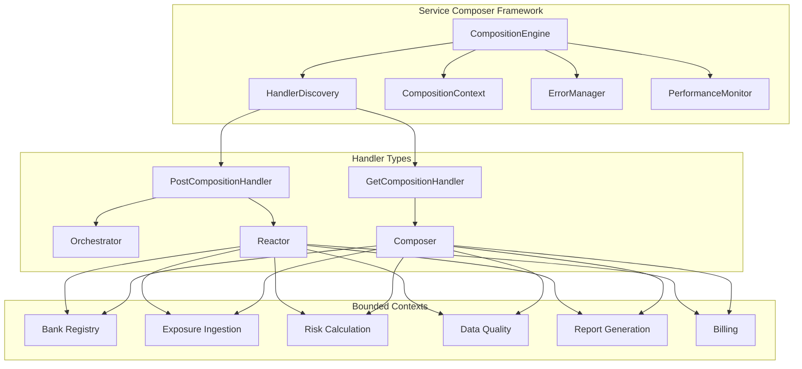

# Service Composer Framework - Design Document

## Overview

The Service Composer Framework implements a handler-based composition architecture that enables building complex web applications through autonomous bounded contexts. The framework provides declarative composition patterns for both GET operations (data aggregation) and POST operations (coordinated business flows) while maintaining strict separation of concerns and functional programming principles.

The design emphasizes closure-based dependency injection, explicit error handling through `Result<T, ErrorDetail>` types, and upstream/downstream context coordination patterns that respect bounded context autonomy.

## Architecture

### Core Architecture Principles

1. **Handler-Based Composition**: All business logic is implemented through composition handlers that are automatically discovered and orchestrated
2. **Functional Programming Patterns**: Heavy use of closures, pure functions, and immutable data structures
3. **Explicit Error Handling**: All operations return `Result<T, ErrorDetail>` types with no exceptions for business logic
4. **Context Autonomy**: Bounded contexts remain autonomous with API-based communication only
5. **Upstream/Downstream Coordination**: Clear dependency ordering between contexts with proper data flow

### High-Level Architecture Diagram



## Components and Interfaces

### 1. Core Framework Components

#### CompositionEngine
The central orchestration component that manages handler execution and context lifecycle with correlation ID propagation.

```java
public class CompositionEngine {
    private final HandlerRegistry handlerRegistry;
    private final ExecutorService executorService;
    private final ErrorManager errorManager;
    private final PerformanceMonitor performanceMonitor;
    private static final Logger log = LoggerFactory.getLogger(CompositionEngine.class);
    
    public Result<Map<String, Object>, ErrorDetail> executeGet(
        String route, 
        HttpServletRequest request
    ) {
        CompositionContext context = CompositionContext.create(request);
        CorrelationId correlationId = context.getCorrelationId();
        
        log.info("{} Starting GET composition for route: {}", correlationId.toLogFormat(), route);
        
        try {
            List<GetCompositionHandler> handlers = handlerRegistry.getGetHandlers(route);
            Map<String, Object> composedModel = new ConcurrentHashMap<>();
            
            // Add correlation ID to response headers
            addCorrelationIdToResponse(request, correlationId);
            
            for (GetCompositionHandler handler : handlers) {
                context.getExecutionTrace().recordHandlerStart(handler.getHandlerName());
                
                Result<Void, ErrorDetail> result = executeHandlerSafely(
                    () -> handler.handleGet(request, context, composedModel),
                    handler.getHandlerName(),
                    correlationId
                );
                
                context.getExecutionTrace().recordHandlerEnd(handler.getHandlerName(), result);
                
                if (result.isFailure()) {
                    log.error("{} Handler {} failed, stopping composition", 
                        correlationId.toLogFormat(), handler.getHandlerName());
                    return Result.failure(result.getError());
                }
            }
            
            log.info("{} GET composition completed successfully in {}ms", 
                correlationId.toLogFormat(), 
                context.getExecutionTrace().getTotalExecutionTime().toMillis());
            
            return Result.success(composedModel);
            
        } catch (Exception e) {
            ErrorDetail error = ErrorDetail.systemError("Composition execution failed", e, correlationId);
            log.error("{} Composition execution failed", correlationId.toLogFormat(), e);
            return Result.failure(error);
        }
    }
    
    public Result<Map<String, Object>, ErrorDetail> executePost(
        String route, 
        HttpServletRequest request, 
        Map<String, Object> body
    ) {
        CompositionContext context = CompositionContext.create(request);
        CorrelationId correlationId = context.getCorrelationId();
        
        log.info("{} Starting POST composition for route: {}", correlationId.toLogFormat(), route);
        
        try {
            List<PostCompositionHandler> handlers = handlerRegistry.getPostHandlers(route);
            
            // Add correlation ID to response headers
            addCorrelationIdToResponse(request, correlationId);
            
            // Execute in three phases with correlation ID tracking
            Result<Void, ErrorDetail> initResult = executePhase("onInitialized", handlers, request, body, context);
            if (initResult.isFailure()) return Result.failure(initResult.getError());
            
            Result<Void, ErrorDetail> updateResult = executePhase("onUpdated", handlers, request, body, context);
            if (updateResult.isFailure()) return Result.failure(updateResult.getError());
            
            // Background work is fire-and-forget with correlation ID
            executeBackgroundPhase(handlers, request, body, context);
            
            log.info("{} POST composition completed successfully in {}ms", 
                correlationId.toLogFormat(), 
                context.getExecutionTrace().getTotalExecutionTime().toMillis());
            
            return Result.success(Map.of(
                "status", "success",
                "correlationId", correlationId.value(),
                "executionSummary", context.getExecutionTrace().getExecutionSummary()
            ));
            
        } catch (Exception e) {
            ErrorDetail error = ErrorDetail.systemError("Composition execution failed", e, correlationId);
            log.error("{} Composition execution failed", correlationId.toLogFormat(), e);
            return Result.failure(error);
        }
    }
    
    private Result<Void, ErrorDetail> executeHandlerSafely(
        Supplier<Result<Void, ErrorDetail>> operation,
        String handlerName,
        CorrelationId correlationId
    ) {
        try {
            return operation.get();
        } catch (Exception e) {
            ErrorDetail error = ErrorDetail.systemError(
                "Handler " + handlerName + " execution failed", e, correlationId);
            return Result.failure(error);
        }
    }
    
    private void addCorrelationIdToResponse(HttpServletRequest request, CorrelationId correlationId) {
        if (request instanceof HttpServletResponse response) {
            response.setHeader("X-Correlation-ID", correlationId.value());
        }
    }
    
    private Result<Void, ErrorDetail> executePhase(
        String phaseName,
        List<PostCompositionHandler> handlers,
        HttpServletRequest request,
        Map<String, Object> body,
        CompositionContext context
    ) {
        CorrelationId correlationId = context.getCorrelationId();
        log.debug("{} Executing phase: {}", correlationId.toLogFormat(), phaseName);
        
        for (PostCompositionHandler handler : handlers) {
            String handlerName = handler.getHandlerName();
            context.getExecutionTrace().recordHandlerStart(handlerName);
            
            Result<Void, ErrorDetail> result = switch (phaseName) {
                case "onInitialized" -> handler.onInitialized(request, body, context);
                case "onUpdated" -> handler.onUpdated(request, body, context);
                default -> Result.failure(ErrorDetail.systemError("Unknown phase: " + phaseName, null, correlationId));
            };
            
            context.getExecutionTrace().recordHandlerEnd(handlerName, result);
            
            if (result.isFailure()) {
                log.error("{} Phase {} failed for handler {}", 
                    correlationId.toLogFormat(), phaseName, handlerName);
                return result;
            }
        }
        
        return Result.success();
    }
    
    private void executeBackgroundPhase(
        List<PostCompositionHandler> handlers,
        HttpServletRequest request,
        Map<String, Object> body,
        CompositionContext context
    ) {
        CorrelationId correlationId = context.getCorrelationId();
        
        executorService.submit(() -> {
            log.debug("{} Executing background phase", correlationId.toLogFormat());
            
            for (PostCompositionHandler handler : handlers) {
                try {
                    String handlerName = handler.getHandlerName();
                    context.getExecutionTrace().recordHandlerStart(handlerName);
                    
                    Result<Void, ErrorDetail> result = handler.onBackgroundWork(request, body, context);
                    
                    context.getExecutionTrace().recordHandlerEnd(handlerName, result);
                    
                    if (result.isFailure()) {
                        log.error("{} Background work failed for handler {}: {}", 
                            correlationId.toLogFormat(), handlerName, result.getError());
                    }
                } catch (Exception e) {
                    log.error("{} Background work exception for handler {}", 
                        correlationId.toLogFormat(), handler.getHandlerName(), e);
                }
            }
            
            log.debug("{} Background phase completed", correlationId.toLogFormat());
        });
    }
}
```

#### HandlerRegistry
Manages discovery, registration, and retrieval of composition handlers.

```java
public class HandlerRegistry {
    private final Map<String, List<GetCompositionHandler>> getHandlers;
    private final Map<String, List<PostCompositionHandler>> postHandlers;
    
    public void registerHandler(Object handler);
    public List<GetCompositionHandler> getGetHandlers(String route);
    public List<PostCompositionHandler> getPostHandlers(String route);
    public boolean matchesRoute(String pattern, String actualRoute);
}
```

#### CompositionContext
Provides request-scoped context and shared state management with correlation ID tracking.

```java
public class CompositionContext {
    private final CorrelationId correlationId;
    private final String requestId;
    private final Map<String, Object> sharedModel;
    private final List<ErrorDetail> errors;
    private final ExecutionTrace executionTrace;
    private final SecurityContext securityContext;
    
    public static CompositionContext create(HttpServletRequest request) {
        CorrelationId correlationId = extractOrGenerateCorrelationId(request);
        return new CompositionContext(
            correlationId,
            UUID.randomUUID().toString(),
            new ConcurrentHashMap<>(),
            new CopyOnWriteArrayList<>(),
            new ExecutionTrace(correlationId),
            SecurityContext.fromRequest(request)
        );
    }
    
    public void addError(ErrorDetail error);
    public void putData(String key, Object value);
    public <T> Maybe<T> getData(String key, Class<T> type);
    public boolean hasErrors();
    public CorrelationId getCorrelationId();
    public String getRequestId();
    
    private static CorrelationId extractOrGenerateCorrelationId(HttpServletRequest request) {
        String correlationHeader = request.getHeader("X-Correlation-ID");
        if (correlationHeader != null && !correlationHeader.trim().isEmpty()) {
            return CorrelationId.fromString(correlationHeader);
        }
        return CorrelationId.generate();
    }
}
```

### 2. Handler Interfaces

#### GetCompositionHandler
For data aggregation and response composition in GET operations with correlation ID propagation.

```java
@FunctionalInterface
public interface GetCompositionHandler {
    Result<Void, ErrorDetail> handleGet(
        HttpServletRequest request, 
        CompositionContext context,
        Map<String, Object> composedModel
    );
    
    default String getHandlerName() {
        return this.getClass().getSimpleName();
    }
}
```

#### PostCompositionHandler
For coordinated business flows in POST operations with three execution phases and correlation ID tracking.

```java
public interface PostCompositionHandler {
    default Result<Void, ErrorDetail> onInitialized(
        HttpServletRequest request, 
        Map<String, Object> body, 
        CompositionContext context
    ) { 
        context.getExecutionTrace().recordPhaseStart("initialized", getHandlerName(), context.getCorrelationId());
        return Result.success(); 
    }
    
    default Result<Void, ErrorDetail> onUpdated(
        HttpServletRequest request, 
        Map<String, Object> body, 
        CompositionContext context
    ) { 
        context.getExecutionTrace().recordPhaseStart("updated", getHandlerName(), context.getCorrelationId());
        return Result.success(); 
    }
    
    default Result<Void, ErrorDetail> onBackgroundWork(
        HttpServletRequest request, 
        Map<String, Object> body, 
        CompositionContext context
    ) { 
        context.getExecutionTrace().recordPhaseStart("backgroundWork", getHandlerName(), context.getCorrelationId());
        return Result.success(); 
    }
    
    default String getHandlerName() {
        return this.getClass().getSimpleName();
    }
}
```

### 3. Handler Specializations

#### Orchestrator Pattern
Primary coordinators for complex business flows.

```java
@CompositionHandler(route = "/exposures", methods = POST, order = 0)
public class ExposureUploadOrchestrator implements PostCompositionHandler {
    
    @Override
    public Result<Void, ErrorDetail> onInitialized(
        HttpServletRequest request, 
        Map<String, Object> body, 
        CompositionContext context
    ) {
        // Initialize upload flow
        // Set processing phase markers
        // Validate request structure
        return Result.success();
    }
    
    @Override
    public Result<Void, ErrorDetail> onUpdated(
        HttpServletRequest request, 
        Map<String, Object> body, 
        CompositionContext context
    ) {
        // Coordinate main processing
        // Aggregate results from reactors
        // Set completion status
        return Result.success();
    }
}
```

#### Reactor Pattern
Context-specific reactions that execute in dependency order.

```java
@CompositionHandler(route = "/exposures", order = 1)
public class BankValidationReactor implements PostCompositionHandler {
    
    private final Function<BankQueryRequest, Result<BankSummary, ErrorDetail>> bankQuery;
    
    @Override
    public Result<Void, ErrorDetail> onInitialized(
        HttpServletRequest request, 
        Map<String, Object> body, 
        CompositionContext context
    ) {
        CorrelationId correlationId = context.getCorrelationId();
        
        return extractBankId(body)
            .map(bankId -> new BankQueryRequest(bankId, correlationId))
            .flatMap(bankQuery)
            .map(bank -> {
                context.putData("validatedBank", bank);
                log.info("{} Bank validation completed for bank: {}", 
                    correlationId.toLogFormat(), bank.name());
                return null;
            })
            .mapError(error -> {
                log.error("{} Bank validation failed: {}", correlationId.toLogFormat(), error.message());
                return error;
            });
    }
}

// Request wrapper that includes correlation ID for external service calls
public record BankQueryRequest(BankId bankId, CorrelationId correlationId) {}
```

#### Composer Pattern
Response builders for GET operations that aggregate upstream context data.

```java
@CompositionHandler(route = "/dashboard", order = 10)
public class BankDashboardComposer implements GetCompositionHandler {
    
    private final Function<BankQueryRequest, Result<BankSummary, ErrorDetail>> bankQuery;
    private final Function<ExposureQueryRequest, Result<ExposureSummary, ErrorDetail>> exposureQuery;
    private final Function<QualityQueryRequest, Result<QualityMetrics, ErrorDetail>> qualityQuery;
    
    @Override
    public Result<Void, ErrorDetail> handleGet(
        HttpServletRequest request, 
        CompositionContext context,
        Map<String, Object> model
    ) {
        BankId bankId = extractBankId(request);
        CorrelationId correlationId = context.getCorrelationId();
        
        log.info("{} Starting dashboard composition for bank: {}", correlationId.toLogFormat(), bankId.value());
        
        // Create correlation-aware query requests
        BankQueryRequest bankRequest = new BankQueryRequest(bankId, correlationId);
        ExposureQueryRequest exposureRequest = new ExposureQueryRequest(bankId, correlationId);
        QualityQueryRequest qualityRequest = new QualityQueryRequest(bankId, correlationId);
        
        // Aggregate data from multiple contexts with correlation ID tracking
        Result<BankSummary, ErrorDetail> bankResult = bankQuery.apply(bankRequest);
        Result<ExposureSummary, ErrorDetail> exposureResult = exposureQuery.apply(exposureRequest);
        Result<QualityMetrics, ErrorDetail> qualityResult = qualityQuery.apply(qualityRequest);
        
        // Compose unified dashboard response
        return Result.combine(bankResult, exposureResult, qualityResult)
            .map(tuple -> {
                Dashboard dashboard = createDashboard(tuple);
                model.put("dashboard", dashboard);
                model.put("correlationId", correlationId.value());
                
                log.info("{} Dashboard composition completed successfully", correlationId.toLogFormat());
                return null;
            })
            .mapError(error -> {
                log.error("{} Dashboard composition failed: {}", correlationId.toLogFormat(), error.message());
                return error;
            });
    }
}

// Correlation-aware query request wrappers
public record ExposureQueryRequest(BankId bankId, CorrelationId correlationId) {}
public record QualityQueryRequest(BankId bankId, CorrelationId correlationId) {}
```

### 4. Correlation ID Propagation to External Services

The framework ensures correlation IDs are propagated to all external service calls for end-to-end tracing.

#### HTTP Client Integration

```java
@Component
public class CorrelationAwareHttpClient {
    
    private final RestTemplate restTemplate;
    
    public <T> Result<T, ErrorDetail> get(
        String url, 
        Class<T> responseType, 
        CorrelationId correlationId
    ) {
        try {
            HttpHeaders headers = new HttpHeaders();
            headers.set("X-Correlation-ID", correlationId.value());
            headers.set("X-Request-Source", "service-composer");
            
            HttpEntity<?> entity = new HttpEntity<>(headers);
            
            log.debug("{} Making GET request to: {}", correlationId.toLogFormat(), url);
            
            ResponseEntity<T> response = restTemplate.exchange(
                url, HttpMethod.GET, entity, responseType
            );
            
            log.debug("{} GET request completed with status: {}", 
                correlationId.toLogFormat(), response.getStatusCode());
            
            return Result.success(response.getBody());
            
        } catch (HttpClientErrorException e) {
            ErrorDetail error = ErrorDetail.systemError(
                "HTTP client error: " + e.getStatusCode(), e, correlationId);
            log.error("{} HTTP GET failed: {}", correlationId.toLogFormat(), e.getMessage());
            return Result.failure(error);
        } catch (Exception e) {
            ErrorDetail error = ErrorDetail.systemError("HTTP request failed", e, correlationId);
            log.error("{} HTTP GET exception", correlationId.toLogFormat(), e);
            return Result.failure(error);
        }
    }
    
    public <T, R> Result<R, ErrorDetail> post(
        String url, 
        T requestBody, 
        Class<R> responseType, 
        CorrelationId correlationId
    ) {
        try {
            HttpHeaders headers = new HttpHeaders();
            headers.set("X-Correlation-ID", correlationId.value());
            headers.set("X-Request-Source", "service-composer");
            headers.setContentType(MediaType.APPLICATION_JSON);
            
            HttpEntity<T> entity = new HttpEntity<>(requestBody, headers);
            
            log.debug("{} Making POST request to: {}", correlationId.toLogFormat(), url);
            
            ResponseEntity<R> response = restTemplate.exchange(
                url, HttpMethod.POST, entity, responseType
            );
            
            log.debug("{} POST request completed with status: {}", 
                correlationId.toLogFormat(), response.getStatusCode());
            
            return Result.success(response.getBody());
            
        } catch (HttpClientErrorException e) {
            ErrorDetail error = ErrorDetail.systemError(
                "HTTP client error: " + e.getStatusCode(), e, correlationId);
            log.error("{} HTTP POST failed: {}", correlationId.toLogFormat(), e.getMessage());
            return Result.failure(error);
        } catch (Exception e) {
            ErrorDetail error = ErrorDetail.systemError("HTTP request failed", e, correlationId);
            log.error("{} HTTP POST exception", correlationId.toLogFormat(), e);
            return Result.failure(error);
        }
    }
}
```

#### Event Publishing with Correlation ID

```java
@Component
public class CorrelationAwareEventPublisher {
    
    private final ApplicationEventPublisher eventPublisher;
    
    public void publishEvent(Object event, CorrelationId correlationId) {
        CorrelationAwareEvent wrappedEvent = new CorrelationAwareEvent(event, correlationId);
        
        log.debug("{} Publishing event: {}", correlationId.toLogFormat(), event.getClass().getSimpleName());
        
        eventPublisher.publishEvent(wrappedEvent);
    }
}

public record CorrelationAwareEvent(Object payload, CorrelationId correlationId) {}

@EventListener
public class CorrelationAwareEventListener {
    
    public void handleEvent(CorrelationAwareEvent event) {
        CorrelationId correlationId = event.correlationId();
        Object payload = event.payload();
        
        log.info("{} Processing event: {}", correlationId.toLogFormat(), payload.getClass().getSimpleName());
        
        // Process event with correlation context
        processEventWithCorrelation(payload, correlationId);
    }
}
```

### 5. Closure-Based Dependency Injection

The framework uses closure-based dependency injection to provide bounded context access without tight coupling and correlation ID propagation.

```java
@Configuration
public class CompositionConfiguration {
    
    @Bean
    public Function<BankQueryRequest, Result<BankSummary, ErrorDetail>> bankQueryFunction(
        BankService bankService,
        CorrelationAwareHttpClient httpClient
    ) {
        return request -> {
            try {
                CorrelationId correlationId = request.correlationId();
                BankId bankId = request.bankId();
                
                log.debug("{} Querying bank service for bank: {}", 
                    correlationId.toLogFormat(), bankId.value());
                
                return bankService.findSummary(bankId)
                    .map(summary -> {
                        log.debug("{} Bank query successful", correlationId.toLogFormat());
                        return Result.success(summary);
                    })
                    .orElse(Result.failure(ErrorDetail.notFound("Bank not found", correlationId)));
                    
            } catch (Exception e) {
                log.error("{} Bank query failed", request.correlationId().toLogFormat(), e);
                return Result.failure(ErrorDetail.systemError("Bank query failed", e, request.correlationId()));
            }
        };
    }
    
    @Bean
    public Function<ExposureQueryRequest, Result<ProcessingStatus, ErrorDetail>> exposureStatusFunction(
        ExposureIngestionService exposureService,
        CorrelationAwareHttpClient httpClient
    ) {
        return request -> {
            try {
                CorrelationId correlationId = request.correlationId();
                BankId bankId = request.bankId();
                
                log.debug("{} Querying exposure status for bank: {}", 
                    correlationId.toLogFormat(), bankId.value());
                
                // Example of HTTP call to another bounded context
                String url = String.format("/api/exposures/status?bankId=%s", bankId.value());
                
                return httpClient.get(url, ProcessingStatus.class, correlationId);
                
            } catch (Exception e) {
                log.error("{} Exposure status query failed", request.correlationId().toLogFormat(), e);
                return Result.failure(ErrorDetail.systemError("Status query failed", e, request.correlationId()));
            }
        };
    }
    
    @Bean
    public Function<QualityQueryRequest, Result<QualityMetrics, ErrorDetail>> qualityQueryFunction(
        CorrelationAwareHttpClient httpClient
    ) {
        return request -> {
            try {
                CorrelationId correlationId = request.correlationId();
                BankId bankId = request.bankId();
                
                log.debug("{} Querying quality metrics for bank: {}", 
                    correlationId.toLogFormat(), bankId.value());
                
                String url = String.format("/api/quality/metrics?bankId=%s", bankId.value());
                
                return httpClient.get(url, QualityMetrics.class, correlationId);
                
            } catch (Exception e) {
                log.error("{} Quality metrics query failed", request.correlationId().toLogFormat(), e);
                return Result.failure(ErrorDetail.systemError("Quality query failed", e, request.correlationId()));
            }
        };
    }
}
```

## Data Models

### Core Framework Types

#### Result<T, ErrorDetail>
Explicit error handling without exceptions.

```java
public sealed interface Result<T, E> permits Success, Failure {
    
    static <T, E> Result<T, E> success(T value) { return new Success<>(value); }
    static <T, E> Result<T, E> failure(E error) { return new Failure<>(error); }
    
    <U> Result<U, E> map(Function<T, U> mapper);
    <U> Result<U, E> flatMap(Function<T, Result<U, E>> mapper);
    Result<T, E> mapError(Function<E, E> mapper);
    
    boolean isSuccess();
    boolean isFailure();
    T getValue();
    E getError();
}
```

#### Maybe<T>
Null-safe optional type for composition context data.

```java
public sealed interface Maybe<T> permits Some, None {
    
    static <T> Maybe<T> some(T value) { return new Some<>(value); }
    static <T> Maybe<T> none() { return new None<>(); }
    static <T> Maybe<T> ofNullable(T value) { 
        return value != null ? some(value) : none(); 
    }
    
    <U> Maybe<U> map(Function<T, U> mapper);
    <U> Maybe<U> flatMap(Function<T, Maybe<U>> mapper);
    T orElse(T defaultValue);
    T orElseGet(Supplier<T> supplier);
    
    boolean isPresent();
    boolean isEmpty();
}
```

#### ErrorDetail
Structured error information with correlation ID for tracing.

```java
public record ErrorDetail(
    String code,
    String message,
    String context,
    CorrelationId correlationId,
    Map<String, Object> details,
    Instant timestamp
) {
    public static ErrorDetail notFound(String message, CorrelationId correlationId) {
        return new ErrorDetail("NOT_FOUND", message, "system", correlationId, Map.of(), Instant.now());
    }
    
    public static ErrorDetail validation(String message, Map<String, Object> details, CorrelationId correlationId) {
        return new ErrorDetail("VALIDATION_ERROR", message, "validation", correlationId, details, Instant.now());
    }
    
    public static ErrorDetail systemError(String message, Throwable cause, CorrelationId correlationId) {
        Map<String, Object> errorDetails = Map.of(
            "exception", cause.getClass().getSimpleName(),
            "stackTrace", Arrays.toString(cause.getStackTrace())
        );
        return new ErrorDetail("SYSTEM_ERROR", message, "system", correlationId, errorDetails, Instant.now());
    }
    
    public static ErrorDetail businessRule(String rule, String message, CorrelationId correlationId) {
        return new ErrorDetail("BUSINESS_RULE_VIOLATION", message, rule, correlationId, Map.of("rule", rule), Instant.now());
    }
    
    public String getTraceableMessage() {
        return String.format("[%s] %s - %s", correlationId.value(), code, message);
    }
}

public record CorrelationId(String value) {
    public static CorrelationId generate() {
        return new CorrelationId("CID-" + UUID.randomUUID().toString().substring(0, 8));
    }
    
    public static CorrelationId fromString(String value) {
        if (value == null || value.trim().isEmpty()) {
            return generate();
        }
        return new CorrelationId(value.trim());
    }
    
    public String toLogFormat() {
        return "[" + value + "]";
    }
}
```

### Composition-Specific Types

#### ExecutionTrace
Detailed execution tracking for debugging and monitoring with correlation ID propagation.

```java
public class ExecutionTrace {
    private final CorrelationId correlationId;
    private final List<HandlerExecution> executions;
    private final Instant startTime;
    private final Map<String, Duration> timings;
    private final Map<String, PhaseExecution> phaseExecutions;
    
    public ExecutionTrace(CorrelationId correlationId) {
        this.correlationId = correlationId;
        this.executions = new CopyOnWriteArrayList<>();
        this.startTime = Instant.now();
        this.timings = new ConcurrentHashMap<>();
        this.phaseExecutions = new ConcurrentHashMap<>();
    }
    
    public void recordHandlerStart(String handlerName) {
        HandlerExecution execution = new HandlerExecution(handlerName, correlationId, Instant.now());
        executions.add(execution);
        log.debug("{} Starting handler: {}", correlationId.toLogFormat(), handlerName);
    }
    
    public void recordHandlerEnd(String handlerName, Result<?, ?> result) {
        Instant endTime = Instant.now();
        executions.stream()
            .filter(e -> e.handlerName().equals(handlerName) && e.endTime() == null)
            .findFirst()
            .ifPresent(e -> e.complete(endTime, result));
        
        Duration duration = Duration.between(
            executions.stream()
                .filter(e -> e.handlerName().equals(handlerName))
                .map(HandlerExecution::startTime)
                .findFirst()
                .orElse(startTime),
            endTime
        );
        timings.put(handlerName, duration);
        
        if (result.isFailure()) {
            log.error("{} Handler {} failed: {}", 
                correlationId.toLogFormat(), handlerName, result.getError());
        } else {
            log.debug("{} Handler {} completed in {}ms", 
                correlationId.toLogFormat(), handlerName, duration.toMillis());
        }
    }
    
    public void recordPhaseStart(String phase, String handlerName, CorrelationId correlationId) {
        String phaseKey = handlerName + ":" + phase;
        PhaseExecution phaseExecution = new PhaseExecution(phase, handlerName, correlationId, Instant.now());
        phaseExecutions.put(phaseKey, phaseExecution);
        log.debug("{} Starting phase {} for handler {}", correlationId.toLogFormat(), phase, handlerName);
    }
    
    public void recordPhaseEnd(String phase, String handlerName, Result<?, ?> result) {
        String phaseKey = handlerName + ":" + phase;
        PhaseExecution phaseExecution = phaseExecutions.get(phaseKey);
        if (phaseExecution != null) {
            phaseExecution.complete(Instant.now(), result);
            if (result.isFailure()) {
                log.error("{} Phase {} for handler {} failed: {}", 
                    correlationId.toLogFormat(), phase, handlerName, result.getError());
            }
        }
    }
    
    public Duration getTotalExecutionTime() {
        return Duration.between(startTime, Instant.now());
    }
    
    public List<HandlerExecution> getExecutions() { return List.copyOf(executions); }
    public CorrelationId getCorrelationId() { return correlationId; }
    
    public String getExecutionSummary() {
        StringBuilder summary = new StringBuilder();
        summary.append(String.format("%s Execution Summary:\n", correlationId.toLogFormat()));
        summary.append(String.format("Total Duration: %dms\n", getTotalExecutionTime().toMillis()));
        summary.append("Handler Executions:\n");
        
        executions.forEach(execution -> {
            summary.append(String.format("  - %s: %s (%dms)\n", 
                execution.handlerName(),
                execution.isCompleted() ? "SUCCESS" : "RUNNING",
                execution.getDuration().toMillis()
            ));
        });
        
        return summary.toString();
    }
}

public record HandlerExecution(
    String handlerName,
    CorrelationId correlationId,
    Instant startTime,
    Instant endTime,
    Result<?, ?> result
) {
    public HandlerExecution(String handlerName, CorrelationId correlationId, Instant startTime) {
        this(handlerName, correlationId, startTime, null, null);
    }
    
    public HandlerExecution complete(Instant endTime, Result<?, ?> result) {
        return new HandlerExecution(handlerName, correlationId, startTime, endTime, result);
    }
    
    public boolean isCompleted() { return endTime != null; }
    
    public Duration getDuration() {
        return Duration.between(startTime, endTime != null ? endTime : Instant.now());
    }
}

public record PhaseExecution(
    String phase,
    String handlerName,
    CorrelationId correlationId,
    Instant startTime,
    Instant endTime,
    Result<?, ?> result
) {
    public PhaseExecution(String phase, String handlerName, CorrelationId correlationId, Instant startTime) {
        this(phase, handlerName, correlationId, startTime, null, null);
    }
    
    public PhaseExecution complete(Instant endTime, Result<?, ?> result) {
        return new PhaseExecution(phase, handlerName, correlationId, startTime, endTime, result);
    }
}
```

#### HandlerMetadata
Runtime information about registered handlers.

```java
public record HandlerMetadata(
    String name,
    String route,
    int order,
    Set<HttpMethod> methods,
    Class<?> handlerClass,
    List<String> dependencies
) {
    public boolean matchesRoute(String actualRoute) { /* ... */ }
    public boolean supportsMethod(HttpMethod method) { /* ... */ }
}
```

## Error Handling

### Error Handling Strategy

The framework implements a comprehensive error handling strategy that maintains system stability while providing detailed error information.

#### 1. Handler-Level Error Handling

```java
public class SafeHandlerExecutor {
    
    public Result<Void, ErrorDetail> executeHandler(
        CompositionHandler handler,
        HttpServletRequest request,
        CompositionContext context
    ) {
        try {
            return handler.handle(request, context);
        } catch (BusinessException e) {
            ErrorDetail error = ErrorDetail.businessRule(e.getRule(), e.getMessage());
            context.addError(error);
            return Result.failure(error);
        } catch (ValidationException e) {
            ErrorDetail error = ErrorDetail.validation(e.getMessage(), e.getDetails());
            context.addError(error);
            return Result.failure(error);
        } catch (Exception e) {
            ErrorDetail error = ErrorDetail.systemError("Handler execution failed", e);
            context.addError(error);
            return Result.failure(error);
        }
    }
}
```

#### 2. Compensation Patterns

```java
public class CompensationManager {
    
    private final Map<String, CompensationAction> compensationActions;
    
    public void registerCompensation(String handlerName, CompensationAction action) {
        compensationActions.put(handlerName, action);
    }
    
    public Result<Void, ErrorDetail> compensate(
        List<String> completedHandlers,
        CompositionContext context
    ) {
        return completedHandlers.reversed().stream()
            .map(handlerName -> {
                CompensationAction action = compensationActions.get(handlerName);
                return action != null ? action.compensate(context) : Result.success();
            })
            .reduce(Result.success(), this::combineResults);
    }
}
```

#### 3. Circuit Breaker Integration

```java
public class CircuitBreakerManager {
    
    private final Map<String, CircuitBreaker> circuitBreakers;
    
    public <T> Result<T, ErrorDetail> executeWithCircuitBreaker(
        String handlerName,
        Supplier<Result<T, ErrorDetail>> operation
    ) {
        CircuitBreaker circuitBreaker = circuitBreakers.get(handlerName);
        
        if (circuitBreaker.getState() == CircuitBreaker.State.OPEN) {
            return Result.failure(ErrorDetail.systemError("Circuit breaker open"));
        }
        
        try {
            Result<T, ErrorDetail> result = operation.get();
            if (result.isSuccess()) {
                circuitBreaker.recordSuccess();
            } else {
                circuitBreaker.recordFailure();
            }
            return result;
        } catch (Exception e) {
            circuitBreaker.recordFailure();
            return Result.failure(ErrorDetail.systemError("Operation failed", e));
        }
    }
}
```

## Testing Strategy

### 1. Unit Testing Framework

```java
public class CompositionTestFramework {
    
    public static CompositionTestBuilder forRoute(String route) {
        return new CompositionTestBuilder(route);
    }
    
    public static class CompositionTestBuilder {
        private final String route;
        private final Map<String, Object> mockData = new HashMap<>();
        private final List<CompositionHandler> handlers = new ArrayList<>();
        
        public CompositionTestBuilder withMockData(String key, Object value) {
            mockData.put(key, value);
            return this;
        }
        
        public CompositionTestBuilder withHandler(CompositionHandler handler) {
            handlers.add(handler);
            return this;
        }
        
        public CompositionTestExecution execute() {
            return new CompositionTestExecution(route, handlers, mockData);
        }
    }
}
```

### 2. Integration Testing Support

```java
@TestConfiguration
public class CompositionTestConfiguration {
    
    @Bean
    @Primary
    public Function<BankId, Result<BankSummary, ErrorDetail>> mockBankQuery() {
        return bankId -> Result.success(TestDataFactory.createBankSummary(bankId));
    }
    
    @Bean
    @Primary
    public Function<ExposureBatchId, Result<ProcessingStatus, ErrorDetail>> mockExposureStatus() {
        return batchId -> Result.success(ProcessingStatus.COMPLETED);
    }
}
```

### 3. Test Data Factories

```java
public class TestDataFactory {
    
    public static BankSummary createBankSummary(BankId bankId) {
        return BankSummary.builder()
            .id(bankId)
            .abiCode("12345")
            .leiCode("123456789012345678AB")
            .name("Test Bank")
            .tier(SubscriptionTier.PROFESSIONAL)
            .build();
    }
    
    public static CompositionContext createTestContext() {
        return CompositionContext.builder()
            .requestId(UUID.randomUUID().toString())
            .securityContext(createTestSecurityContext())
            .build();
    }
}
```

## Performance Considerations

### 1. Execution Optimization

- **Parallel Handler Execution**: Handlers with no dependencies can execute in parallel
- **Lazy Evaluation**: Context data is loaded only when accessed
- **Caching Strategy**: Frequently accessed data is cached at the composition level
- **Resource Pooling**: Thread pools and connection pools are properly managed

### 2. Monitoring and Metrics

```java
public class PerformanceMonitor {
    
    private final MeterRegistry meterRegistry;
    private final Timer.Builder handlerTimer;
    
    public void recordHandlerExecution(String handlerName, Duration duration) {
        handlerTimer
            .tag("handler", handlerName)
            .register(meterRegistry)
            .record(duration);
    }
    
    public void recordCompositionMetrics(CompositionContext context) {
        meterRegistry.counter("composition.requests.total").increment();
        
        if (context.hasErrors()) {
            meterRegistry.counter("composition.requests.errors").increment();
        }
        
        meterRegistry.timer("composition.duration")
            .record(context.getExecutionTrace().getTotalExecutionTime());
    }
}
```

### 3. Resource Management

- **Connection Pooling**: Database connections are pooled per bounded context
- **Memory Management**: Large objects are streamed rather than loaded entirely
- **Timeout Management**: All operations have configurable timeouts
- **Backpressure Handling**: System can handle load spikes gracefully

This design provides a robust, scalable foundation for building complex composable applications while maintaining clean architecture principles and bounded context autonomy.w 
ErrorDetail("VALIDATION_ERROR", message, "validation", correlationId, details, Instant.now());
    }
    
    public static ErrorDetail systemError(String message, Throwable cause, CorrelationId correlationId) {
        Map<String, Object> errorDetails = Map.of(
            "exception", cause.getClass().getSimpleName(),
            "stackTrace", Arrays.toString(cause.getStackTrace())
        );
        return new ErrorDetail("SYSTEM_ERROR", message, "system", correlationId, errorDetails, Instant.now());
    }
    
    public static ErrorDetail businessRule(String rule, String message, CorrelationId correlationId) {
        return new ErrorDetail("BUSINESS_RULE_VIOLATION", message, rule, correlationId, Map.of("rule", rule), Instant.now());
    }
    
    public String getTraceableMessage() {
        return String.format("[%s] %s - %s", correlationId.value(), code, message);
    }
}

public record CorrelationId(String value) {
    public static CorrelationId generate() {
        return new CorrelationId("CID-" + UUID.randomUUID().toString().substring(0, 8));
    }
    
    public static CorrelationId fromString(String value) {
        if (value == null || value.trim().isEmpty()) {
            return generate();
        }
        return new CorrelationId(value.trim());
    }
    
    public String toLogFormat() {
        return "[" + value + "]";
    }
}
```

### Composition-Specific Types

#### ExecutionTrace
Detailed execution tracking for debugging and monitoring with correlation ID propagation.

```java
public class ExecutionTrace {
    private final CorrelationId correlationId;
    private final List<HandlerExecution> executions;
    private final Instant startTime;
    private final Map<String, Duration> timings;
    private final Map<String, PhaseExecution> phaseExecutions;
    
    public ExecutionTrace(CorrelationId correlationId) {
        this.correlationId = correlationId;
        this.executions = new CopyOnWriteArrayList<>();
        this.startTime = Instant.now();
        this.timings = new ConcurrentHashMap<>();
        this.phaseExecutions = new ConcurrentHashMap<>();
    }
    
    public void recordHandlerStart(String handlerName) {
        HandlerExecution execution = new HandlerExecution(handlerName, correlationId, Instant.now());
        executions.add(execution);
        log.debug("{} Starting handler: {}", correlationId.toLogFormat(), handlerName);
    }
    
    public void recordHandlerEnd(String handlerName, Result<?, ?> result) {
        Instant endTime = Instant.now();
        executions.stream()
            .filter(e -> e.handlerName().equals(handlerName) && e.endTime() == null)
            .findFirst()
            .ifPresent(e -> e.complete(endTime, result));
        
        Duration duration = Duration.between(
            executions.stream()
                .filter(e -> e.handlerName().equals(handlerName))
                .map(HandlerExecution::startTime)
                .findFirst()
                .orElse(startTime),
            endTime
        );
        timings.put(handlerName, duration);
        
        if (result.isFailure()) {
            log.error("{} Handler {} failed: {}", 
                correlationId.toLogFormat(), handlerName, result.getError());
        } else {
            log.debug("{} Handler {} completed in {}ms", 
                correlationId.toLogFormat(), handlerName, duration.toMillis());
        }
    }
    
    public void recordPhaseStart(String phase, String handlerName, CorrelationId correlationId) {
        String phaseKey = handlerName + ":" + phase;
        PhaseExecution phaseExecution = new PhaseExecution(phase, handlerName, correlationId, Instant.now());
        phaseExecutions.put(phaseKey, phaseExecution);
        log.debug("{} Starting phase {} for handler {}", correlationId.toLogFormat(), phase, handlerName);
    }
    
    public void recordPhaseEnd(String phase, String handlerName, Result<?, ?> result) {
        String phaseKey = handlerName + ":" + phase;
        PhaseExecution phaseExecution = phaseExecutions.get(phaseKey);
        if (phaseExecution != null) {
            phaseExecution.complete(Instant.now(), result);
            if (result.isFailure()) {
                log.error("{} Phase {} for handler {} failed: {}", 
                    correlationId.toLogFormat(), phase, handlerName, result.getError());
            }
        }
    }
    
    public Duration getTotalExecutionTime() {
        return Duration.between(startTime, Instant.now());
    }
    
    public List<HandlerExecution> getExecutions() { return List.copyOf(executions); }
    public CorrelationId getCorrelationId() { return correlationId; }
    
    public String getExecutionSummary() {
        StringBuilder summary = new StringBuilder();
        summary.append(String.format("%s Execution Summary:\n", correlationId.toLogFormat()));
        summary.append(String.format("Total Duration: %dms\n", getTotalExecutionTime().toMillis()));
        summary.append("Handler Executions:\n");
        
        executions.forEach(execution -> {
            summary.append(String.format("  - %s: %s (%dms)\n", 
                execution.handlerName(),
                execution.isCompleted() ? "SUCCESS" : "RUNNING",
                execution.getDuration().toMillis()
            ));
        });
        
        return summary.toString();
    }
}

public record HandlerExecution(
    String handlerName,
    CorrelationId correlationId,
    Instant startTime,
    Instant endTime,
    Result<?, ?> result
) {
    public HandlerExecution(String handlerName, CorrelationId correlationId, Instant startTime) {
        this(handlerName, correlationId, startTime, null, null);
    }
    
    public HandlerExecution complete(Instant endTime, Result<?, ?> result) {
        return new HandlerExecution(handlerName, correlationId, startTime, endTime, result);
    }
    
    public boolean isCompleted() { return endTime != null; }
    
    public Duration getDuration() {
        return Duration.between(startTime, endTime != null ? endTime : Instant.now());
    }
}

public record PhaseExecution(
    String phase,
    String handlerName,
    CorrelationId correlationId,
    Instant startTime,
    Instant endTime,
    Result<?, ?> result
) {
    public PhaseExecution(String phase, String handlerName, CorrelationId correlationId, Instant startTime) {
        this(phase, handlerName, correlationId, startTime, null, null);
    }
    
    public PhaseExecution complete(Instant endTime, Result<?, ?> result) {
        return new PhaseExecution(phase, handlerName, correlationId, startTime, endTime, result);
    }
}
```

#### HandlerMetadata
Runtime information about registered handlers.

```java
public record HandlerMetadata(
    String name,
    String route,
    int order,
    Set<HttpMethod> methods,
    Class<?> handlerClass,
    List<String> dependencies
) {
    public boolean matchesRoute(String actualRoute) {
        return route.equals(actualRoute) || 
               (route.contains("*") && actualRoute.matches(route.replace("*", ".*")));
    }
    
    public boolean supportsMethod(HttpMethod method) {
        return methods.isEmpty() || methods.contains(method);
    }
}
```

## Error Handling

### Error Handling Strategy

The framework implements a comprehensive error handling strategy that maintains system stability while providing detailed error information with correlation ID tracking.

#### 1. Handler-Level Error Handling

```java
public class SafeHandlerExecutor {
    
    public Result<Void, ErrorDetail> executeHandler(
        CompositionHandler handler,
        HttpServletRequest request,
        CompositionContext context
    ) {
        CorrelationId correlationId = context.getCorrelationId();
        
        try {
            return handler.handle(request, context);
        } catch (BusinessException e) {
            ErrorDetail error = ErrorDetail.businessRule(e.getRule(), e.getMessage(), correlationId);
            context.addError(error);
            log.warn("{} Business rule violation in handler {}: {}", 
                correlationId.toLogFormat(), handler.getClass().getSimpleName(), e.getMessage());
            return Result.failure(error);
        } catch (ValidationException e) {
            ErrorDetail error = ErrorDetail.validation(e.getMessage(), e.getDetails(), correlationId);
            context.addError(error);
            log.warn("{} Validation error in handler {}: {}", 
                correlationId.toLogFormat(), handler.getClass().getSimpleName(), e.getMessage());
            return Result.failure(error);
        } catch (Exception e) {
            ErrorDetail error = ErrorDetail.systemError("Handler execution failed", e, correlationId);
            context.addError(error);
            log.error("{} System error in handler {}", 
                correlationId.toLogFormat(), handler.getClass().getSimpleName(), e);
            return Result.failure(error);
        }
    }
}
```

#### 2. Compensation Patterns

```java
public class CompensationManager {
    
    private final Map<String, CompensationAction> compensationActions;
    
    public void registerCompensation(String handlerName, CompensationAction action) {
        compensationActions.put(handlerName, action);
    }
    
    public Result<Void, ErrorDetail> compensate(
        List<String> completedHandlers,
        CompositionContext context
    ) {
        CorrelationId correlationId = context.getCorrelationId();
        log.info("{} Starting compensation for {} handlers", 
            correlationId.toLogFormat(), completedHandlers.size());
        
        return completedHandlers.reversed().stream()
            .map(handlerName -> {
                CompensationAction action = compensationActions.get(handlerName);
                if (action != null) {
                    log.debug("{} Compensating handler: {}", correlationId.toLogFormat(), handlerName);
                    return action.compensate(context);
                } else {
                    log.debug("{} No compensation action for handler: {}", correlationId.toLogFormat(), handlerName);
                    return Result.success();
                }
            })
            .reduce(Result.success(), this::combineResults);
    }
    
    private Result<Void, ErrorDetail> combineResults(
        Result<Void, ErrorDetail> result1, 
        Result<Void, ErrorDetail> result2
    ) {
        if (result1.isFailure()) return result1;
        return result2;
    }
}

@FunctionalInterface
public interface CompensationAction {
    Result<Void, ErrorDetail> compensate(CompositionContext context);
}
```

#### 3. Circuit Breaker Integration

```java
public class CircuitBreakerManager {
    
    private final Map<String, CircuitBreaker> circuitBreakers;
    
    public <T> Result<T, ErrorDetail> executeWithCircuitBreaker(
        String handlerName,
        Supplier<Result<T, ErrorDetail>> operation,
        CorrelationId correlationId
    ) {
        CircuitBreaker circuitBreaker = circuitBreakers.get(handlerName);
        
        if (circuitBreaker.getState() == CircuitBreaker.State.OPEN) {
            ErrorDetail error = ErrorDetail.systemError("Circuit breaker open for " + handlerName, null, correlationId);
            log.warn("{} Circuit breaker open for handler: {}", correlationId.toLogFormat(), handlerName);
            return Result.failure(error);
        }
        
        try {
            Result<T, ErrorDetail> result = operation.get();
            if (result.isSuccess()) {
                circuitBreaker.recordSuccess();
                log.debug("{} Circuit breaker success for handler: {}", correlationId.toLogFormat(), handlerName);
            } else {
                circuitBreaker.recordFailure();
                log.warn("{} Circuit breaker failure for handler: {}", correlationId.toLogFormat(), handlerName);
            }
            return result;
        } catch (Exception e) {
            circuitBreaker.recordFailure();
            ErrorDetail error = ErrorDetail.systemError("Operation failed", e, correlationId);
            log.error("{} Circuit breaker exception for handler: {}", correlationId.toLogFormat(), handlerName, e);
            return Result.failure(error);
        }
    }
}
```

## Testing Strategy

### 1. Unit Testing Framework

```java
public class CompositionTestFramework {
    
    public static CompositionTestBuilder forRoute(String route) {
        return new CompositionTestBuilder(route);
    }
    
    public static class CompositionTestBuilder {
        private final String route;
        private final Map<String, Object> mockData = new HashMap<>();
        private final List<CompositionHandler> handlers = new ArrayList<>();
        private CorrelationId correlationId = CorrelationId.generate();
        
        public CompositionTestBuilder withMockData(String key, Object value) {
            mockData.put(key, value);
            return this;
        }
        
        public CompositionTestBuilder withHandler(CompositionHandler handler) {
            handlers.add(handler);
            return this;
        }
        
        public CompositionTestBuilder withCorrelationId(CorrelationId correlationId) {
            this.correlationId = correlationId;
            return this;
        }
        
        public CompositionTestExecution execute() {
            return new CompositionTestExecution(route, handlers, mockData, correlationId);
        }
    }
    
    public static class CompositionTestExecution {
        private final String route;
        private final List<CompositionHandler> handlers;
        private final Map<String, Object> mockData;
        private final CorrelationId correlationId;
        
        public CompositionTestExecution(String route, List<CompositionHandler> handlers, 
                                      Map<String, Object> mockData, CorrelationId correlationId) {
            this.route = route;
            this.handlers = handlers;
            this.mockData = mockData;
            this.correlationId = correlationId;
        }
        
        public Result<Map<String, Object>, ErrorDetail> executeGet() {
            // Test execution logic with correlation ID tracking
            log.info("{} Executing test for GET route: {}", correlationId.toLogFormat(), route);
            return Result.success(mockData);
        }
        
        public Result<Map<String, Object>, ErrorDetail> executePost(Map<String, Object> body) {
            // Test execution logic with correlation ID tracking
            log.info("{} Executing test for POST route: {}", correlationId.toLogFormat(), route);
            return Result.success(Map.of("status", "success", "correlationId", correlationId.value()));
        }
    }
}
```

### 2. Integration Testing Support

```java
@TestConfiguration
public class CompositionTestConfiguration {
    
    @Bean
    @Primary
    public Function<BankQueryRequest, Result<BankSummary, ErrorDetail>> mockBankQuery() {
        return request -> {
            log.debug("{} Mock bank query for: {}", 
                request.correlationId().toLogFormat(), request.bankId().value());
            return Result.success(TestDataFactory.createBankSummary(request.bankId()));
        };
    }
    
    @Bean
    @Primary
    public Function<ExposureQueryRequest, Result<ProcessingStatus, ErrorDetail>> mockExposureStatus() {
        return request -> {
            log.debug("{} Mock exposure status query for: {}", 
                request.correlationId().toLogFormat(), request.bankId().value());
            return Result.success(ProcessingStatus.COMPLETED);
        };
    }
    
    @Bean
    @Primary
    public CorrelationAwareHttpClient mockHttpClient() {
        return new CorrelationAwareHttpClient() {
            @Override
            public <T> Result<T, ErrorDetail> get(String url, Class<T> responseType, CorrelationId correlationId) {
                log.debug("{} Mock HTTP GET to: {}", correlationId.toLogFormat(), url);
                return Result.success((T) TestDataFactory.createMockResponse(responseType));
            }
        };
    }
}
```

### 3. Test Data Factories

```java
public class TestDataFactory {
    
    public static BankSummary createBankSummary(BankId bankId) {
        return BankSummary.builder()
            .id(bankId)
            .abiCode("12345")
            .leiCode("123456789012345678AB")
            .name("Test Bank")
            .tier(SubscriptionTier.PROFESSIONAL)
            .build();
    }
    
    public static CompositionContext createTestContext() {
        return createTestContext(CorrelationId.generate());
    }
    
    public static CompositionContext createTestContext(CorrelationId correlationId) {
        return CompositionContext.builder()
            .correlationId(correlationId)
            .requestId(UUID.randomUUID().toString())
            .securityContext(createTestSecurityContext())
            .build();
    }
    
    public static <T> T createMockResponse(Class<T> responseType) {
        // Factory method to create mock responses based on type
        if (responseType == ProcessingStatus.class) {
            return (T) ProcessingStatus.COMPLETED;
        } else if (responseType == QualityMetrics.class) {
            return (T) QualityMetrics.builder()
                .overallScore(89.5)
                .violationCount(3)
                .build();
        }
        return null;
    }
}
```

## Performance Considerations

### 1. Execution Optimization

- **Parallel Handler Execution**: Handlers with no dependencies can execute in parallel
- **Lazy Evaluation**: Context data is loaded only when accessed
- **Caching Strategy**: Frequently accessed data is cached at the composition level
- **Resource Pooling**: Thread pools and connection pools are properly managed
- **Correlation ID Overhead**: Minimal performance impact with efficient string operations

### 2. Monitoring and Metrics

```java
public class PerformanceMonitor {
    
    private final MeterRegistry meterRegistry;
    private final Timer.Builder handlerTimer;
    private final Counter.Builder requestCounter;
    
    public void recordHandlerExecution(String handlerName, Duration duration, CorrelationId correlationId) {
        handlerTimer
            .tag("handler", handlerName)
            .tag("correlation_id", correlationId.value())
            .register(meterRegistry)
            .record(duration);
            
        log.debug("{} Handler {} execution recorded: {}ms", 
            correlationId.toLogFormat(), handlerName, duration.toMillis());
    }
    
    public void recordCompositionMetrics(CompositionContext context) {
        CorrelationId correlationId = context.getCorrelationId();
        
        requestCounter
            .tag("correlation_id", correlationId.value())
            .register(meterRegistry)
            .increment();
        
        if (context.hasErrors()) {
            meterRegistry.counter("composition.requests.errors", 
                "correlation_id", correlationId.value()).increment();
        }
        
        meterRegistry.timer("composition.duration", 
            "correlation_id", correlationId.value())
            .record(context.getExecutionTrace().getTotalExecutionTime());
            
        log.info("{} Composition metrics recorded", correlationId.toLogFormat());
    }
    
    public void recordCorrelationIdMetrics(CorrelationId correlationId, String source) {
        meterRegistry.counter("correlation.ids.generated", 
            "source", source,
            "correlation_id", correlationId.value()).increment();
    }
}
```

### 3. Resource Management

- **Connection Pooling**: Database connections are pooled per bounded context
- **Memory Management**: Large objects are streamed rather than loaded entirely
- **Timeout Management**: All operations have configurable timeouts with correlation ID logging
- **Backpressure Handling**: System can handle load spikes gracefully
- **Correlation ID Cleanup**: Automatic cleanup of correlation context after request completion

### 4. Correlation ID Performance Optimizations

```java
public class CorrelationIdOptimizer {
    
    private static final ThreadLocal<CorrelationId> CORRELATION_CONTEXT = new ThreadLocal<>();
    private static final int MAX_CORRELATION_ID_LENGTH = 50;
    
    public static void setCorrelationContext(CorrelationId correlationId) {
        if (correlationId.value().length() <= MAX_CORRELATION_ID_LENGTH) {
            CORRELATION_CONTEXT.set(correlationId);
        } else {
            // Truncate overly long correlation IDs
            String truncated = correlationId.value().substring(0, MAX_CORRELATION_ID_LENGTH);
            CORRELATION_CONTEXT.set(new CorrelationId(truncated));
        }
    }
    
    public static CorrelationId getCurrentCorrelationId() {
        return CORRELATION_CONTEXT.get();
    }
    
    public static void clearCorrelationContext() {
        CORRELATION_CONTEXT.remove();
    }
    
    public static String formatLogMessage(String message, CorrelationId correlationId) {
        // Efficient string formatting for log messages
        return new StringBuilder(correlationId.value().length() + message.length() + 3)
            .append('[')
            .append(correlationId.value())
            .append("] ")
            .append(message)
            .toString();
    }
}
```

This comprehensive design provides a robust, scalable foundation for building complex composable applications while maintaining clean architecture principles, bounded context autonomy, and complete end-to-end traceability through correlation IDs. The framework ensures that any issues can be traced across all components and external service calls, making debugging and monitoring significantly more effective.w Err
orDetail("VALIDATION_ERROR", message, "validation", correlationId, details, Instant.now());
    }
    
    public static ErrorDetail systemError(String message, Throwable cause, CorrelationId correlationId) {
        Map<String, Object> errorDetails = Map.of(
            "exception", cause.getClass().getSimpleName(),
            "stackTrace", Arrays.toString(cause.getStackTrace())
        );
        return new ErrorDetail("SYSTEM_ERROR", message, "system", correlationId, errorDetails, Instant.now());
    }
    
    public static ErrorDetail businessRule(String rule, String message, CorrelationId correlationId) {
        return new ErrorDetail("BUSINESS_RULE_VIOLATION", message, rule, correlationId, Map.of("rule", rule), Instant.now());
    }
    
    public String getTraceableMessage() {
        return String.format("[%s] %s - %s", correlationId.value(), code, message);
    }
}

public record CorrelationId(String value) {
    public static CorrelationId generate() {
        return new CorrelationId("CID-" + UUID.randomUUID().toString().substring(0, 8));
    }
    
    public static CorrelationId fromString(String value) {
        if (value == null || value.trim().isEmpty()) {
            return generate();
        }
        return new CorrelationId(value.trim());
    }
    
    public String toLogFormat() {
        return "[" + value + "]";
    }
}
```

### Composition-Specific Types

#### ExecutionTrace
Detailed execution tracking for debugging and monitoring with correlation ID propagation.

```java
public class ExecutionTrace {
    private final CorrelationId correlationId;
    private final List<HandlerExecution> executions;
    private final Instant startTime;
    private final Map<String, Duration> timings;
    private final Map<String, PhaseExecution> phaseExecutions;
    
    public ExecutionTrace(CorrelationId correlationId) {
        this.correlationId = correlationId;
        this.executions = new CopyOnWriteArrayList<>();
        this.startTime = Instant.now();
        this.timings = new ConcurrentHashMap<>();
        this.phaseExecutions = new ConcurrentHashMap<>();
    }
    
    public void recordHandlerStart(String handlerName) {
        HandlerExecution execution = new HandlerExecution(handlerName, correlationId, Instant.now());
        executions.add(execution);
        log.debug("{} Starting handler: {}", correlationId.toLogFormat(), handlerName);
    }
    
    public void recordHandlerEnd(String handlerName, Result<?, ?> result) {
        Instant endTime = Instant.now();
        executions.stream()
            .filter(e -> e.handlerName().equals(handlerName) && e.endTime() == null)
            .findFirst()
            .ifPresent(e -> e.complete(endTime, result));
        
        Duration duration = Duration.between(
            executions.stream()
                .filter(e -> e.handlerName().equals(handlerName))
                .map(HandlerExecution::startTime)
                .findFirst()
                .orElse(startTime),
            endTime
        );
        timings.put(handlerName, duration);
        
        if (result.isFailure()) {
            log.error("{} Handler {} failed: {}", 
                correlationId.toLogFormat(), handlerName, result.getError());
        } else {
            log.debug("{} Handler {} completed in {}ms", 
                correlationId.toLogFormat(), handlerName, duration.toMillis());
        }
    }
    
    public void recordPhaseStart(String phase, String handlerName, CorrelationId correlationId) {
        String phaseKey = handlerName + ":" + phase;
        PhaseExecution phaseExecution = new PhaseExecution(phase, handlerName, correlationId, Instant.now());
        phaseExecutions.put(phaseKey, phaseExecution);
        log.debug("{} Starting phase {} for handler {}", correlationId.toLogFormat(), phase, handlerName);
    }
    
    public void recordPhaseEnd(String phase, String handlerName, Result<?, ?> result) {
        String phaseKey = handlerName + ":" + phase;
        PhaseExecution phaseExecution = phaseExecutions.get(phaseKey);
        if (phaseExecution != null) {
            phaseExecution.complete(Instant.now(), result);
            if (result.isFailure()) {
                log.error("{} Phase {} for handler {} failed: {}", 
                    correlationId.toLogFormat(), phase, handlerName, result.getError());
            }
        }
    }
    
    public Duration getTotalExecutionTime() {
        return Duration.between(startTime, Instant.now());
    }
    
    public List<HandlerExecution> getExecutions() { return List.copyOf(executions); }
    public CorrelationId getCorrelationId() { return correlationId; }
    
    public String getExecutionSummary() {
        StringBuilder summary = new StringBuilder();
        summary.append(String.format("%s Execution Summary:\n", correlationId.toLogFormat()));
        summary.append(String.format("Total Duration: %dms\n", getTotalExecutionTime().toMillis()));
        summary.append("Handler Executions:\n");
        
        executions.forEach(execution -> {
            summary.append(String.format("  - %s: %s (%dms)\n", 
                execution.handlerName(),
                execution.isCompleted() ? "SUCCESS" : "RUNNING",
                execution.getDuration().toMillis()
            ));
        });
        
        return summary.toString();
    }
}

public record HandlerExecution(
    String handlerName,
    CorrelationId correlationId,
    Instant startTime,
    Instant endTime,
    Result<?, ?> result
) {
    public HandlerExecution(String handlerName, CorrelationId correlationId, Instant startTime) {
        this(handlerName, correlationId, startTime, null, null);
    }
    
    public HandlerExecution complete(Instant endTime, Result<?, ?> result) {
        return new HandlerExecution(handlerName, correlationId, startTime, endTime, result);
    }
    
    public boolean isCompleted() { return endTime != null; }
    
    public Duration getDuration() {
        return Duration.between(startTime, endTime != null ? endTime : Instant.now());
    }
}

public record PhaseExecution(
    String phase,
    String handlerName,
    CorrelationId correlationId,
    Instant startTime,
    Instant endTime,
    Result<?, ?> result
) {
    public PhaseExecution(String phase, String handlerName, CorrelationId correlationId, Instant startTime) {
        this(phase, handlerName, correlationId, startTime, null, null);
    }
    
    public PhaseExecution complete(Instant endTime, Result<?, ?> result) {
        return new PhaseExecution(phase, handlerName, correlationId, startTime, endTime, result);
    }
}
```

#### HandlerMetadata
Runtime information about registered handlers.

```java
public record HandlerMetadata(
    String name,
    String route,
    int order,
    Set<HttpMethod> methods,
    Class<?> handlerClass,
    List<String> dependencies
) {
    public boolean matchesRoute(String actualRoute) {
        if (route.equals("/*")) return true;
        if (route.equals(actualRoute)) return true;
        
        // Support wildcard matching
        String pattern = route.replace("*", ".*");
        return actualRoute.matches(pattern);
    }
    
    public boolean supportsMethod(HttpMethod method) {
        return methods.isEmpty() || methods.contains(method);
    }
}
```

## Security Integration

### Security Context Management

The framework integrates with Spring Security to provide secure composition execution.

```java
public class SecurityContext {
    private final String userId;
    private final Set<String> roles;
    private final Set<String> permissions;
    private final String tenantId;
    private final Map<String, Object> attributes;
    
    public static SecurityContext fromRequest(HttpServletRequest request) {
        Authentication auth = SecurityContextHolder.getContext().getAuthentication();
        
        if (auth == null || !auth.isAuthenticated()) {
            return SecurityContext.anonymous();
        }
        
        return SecurityContext.builder()
            .userId(auth.getName())
            .roles(extractRoles(auth))
            .permissions(extractPermissions(auth))
            .tenantId(extractTenantId(request))
            .attributes(extractAttributes(auth))
            .build();
    }
    
    public boolean hasRole(String role) { return roles.contains(role); }
    public boolean hasPermission(String permission) { return permissions.contains(permission); }
    public boolean canAccessTenant(String tenantId) { return this.tenantId.equals(tenantId); }
    
    public static SecurityContext anonymous() {
        return new SecurityContext("anonymous", Set.of(), Set.of(), "default", Map.of());
    }
}
```

### Authorization Handlers

```java
@CompositionHandler(route = "/*", order = -100)
public class AuthorizationReactor implements PostCompositionHandler {
    
    @Override
    public Result<Void, ErrorDetail> onInitialized(
        HttpServletRequest request, 
        Map<String, Object> body, 
        CompositionContext context
    ) {
        SecurityContext security = context.getSecurityContext();
        CorrelationId correlationId = context.getCorrelationId();
        
        // Extract required permissions from request
        Set<String> requiredPermissions = extractRequiredPermissions(request, body);
        
        for (String permission : requiredPermissions) {
            if (!security.hasPermission(permission)) {
                log.warn("{} Access denied for user {} - missing permission: {}", 
                    correlationId.toLogFormat(), security.getUserId(), permission);
                
                return Result.failure(ErrorDetail.businessRule(
                    "AUTHORIZATION", 
                    "Insufficient permissions: " + permission, 
                    correlationId
                ));
            }
        }
        
        log.debug("{} Authorization successful for user: {}", 
            correlationId.toLogFormat(), security.getUserId());
        
        return Result.success();
    }
    
    private Set<String> extractRequiredPermissions(HttpServletRequest request, Map<String, Object> body) {
        // Extract permissions based on route and operation
        String route = request.getRequestURI();
        String method = request.getMethod();
        
        return switch (route) {
            case "/exposures" -> Set.of("EXPOSURE_UPLOAD", "BANK_ACCESS");
            case "/dashboard" -> Set.of("DASHBOARD_VIEW", "BANK_ACCESS");
            case "/reports" -> Set.of("REPORT_GENERATION", "BANK_ACCESS");
            default -> Set.of("BASIC_ACCESS");
        };
    }
}
```

## Error Handling

### Error Handling Strategy

The framework implements a comprehensive error handling strategy that maintains system stability while providing detailed error information.

#### 1. Handler-Level Error Handling

```java
public class SafeHandlerExecutor {
    
    public Result<Void, ErrorDetail> executeHandler(
        CompositionHandler handler,
        HttpServletRequest request,
        CompositionContext context
    ) {
        CorrelationId correlationId = context.getCorrelationId();
        
        try {
            return handler.handle(request, context);
        } catch (BusinessException e) {
            ErrorDetail error = ErrorDetail.businessRule(e.getRule(), e.getMessage(), correlationId);
            context.addError(error);
            log.warn("{} Business rule violation in handler {}: {}", 
                correlationId.toLogFormat(), handler.getClass().getSimpleName(), e.getMessage());
            return Result.failure(error);
        } catch (ValidationException e) {
            ErrorDetail error = ErrorDetail.validation(e.getMessage(), e.getDetails(), correlationId);
            context.addError(error);
            log.warn("{} Validation error in handler {}: {}", 
                correlationId.toLogFormat(), handler.getClass().getSimpleName(), e.getMessage());
            return Result.failure(error);
        } catch (Exception e) {
            ErrorDetail error = ErrorDetail.systemError("Handler execution failed", e, correlationId);
            context.addError(error);
            log.error("{} System error in handler {}", 
                correlationId.toLogFormat(), handler.getClass().getSimpleName(), e);
            return Result.failure(error);
        }
    }
}
```

#### 2. Compensation Patterns

```java
public class CompensationManager {
    
    private final Map<String, CompensationAction> compensationActions;
    
    public void registerCompensation(String handlerName, CompensationAction action) {
        compensationActions.put(handlerName, action);
    }
    
    public Result<Void, ErrorDetail> compensate(
        List<String> completedHandlers,
        CompositionContext context
    ) {
        CorrelationId correlationId = context.getCorrelationId();
        log.info("{} Starting compensation for {} handlers", 
            correlationId.toLogFormat(), completedHandlers.size());
        
        return completedHandlers.reversed().stream()
            .map(handlerName -> {
                CompensationAction action = compensationActions.get(handlerName);
                if (action != null) {
                    log.debug("{} Compensating handler: {}", correlationId.toLogFormat(), handlerName);
                    return action.compensate(context);
                } else {
                    log.debug("{} No compensation action for handler: {}", 
                        correlationId.toLogFormat(), handlerName);
                    return Result.success();
                }
            })
            .reduce(Result.success(), this::combineResults);
    }
    
    private Result<Void, ErrorDetail> combineResults(
        Result<Void, ErrorDetail> r1, 
        Result<Void, ErrorDetail> r2
    ) {
        if (r1.isFailure()) return r1;
        return r2;
    }
}

@FunctionalInterface
public interface CompensationAction {
    Result<Void, ErrorDetail> compensate(CompositionContext context);
}
```

#### 3. Circuit Breaker Integration

```java
public class CircuitBreakerManager {
    
    private final Map<String, CircuitBreaker> circuitBreakers;
    
    public <T> Result<T, ErrorDetail> executeWithCircuitBreaker(
        String handlerName,
        Supplier<Result<T, ErrorDetail>> operation,
        CorrelationId correlationId
    ) {
        CircuitBreaker circuitBreaker = circuitBreakers.computeIfAbsent(
            handlerName, 
            name -> CircuitBreaker.ofDefaults(name)
        );
        
        if (circuitBreaker.getState() == CircuitBreaker.State.OPEN) {
            log.warn("{} Circuit breaker OPEN for handler: {}", 
                correlationId.toLogFormat(), handlerName);
            return Result.failure(ErrorDetail.systemError("Circuit breaker open", null, correlationId));
        }
        
        try {
            Result<T, ErrorDetail> result = operation.get();
            if (result.isSuccess()) {
                circuitBreaker.recordSuccess();
                log.debug("{} Circuit breaker success for handler: {}", 
                    correlationId.toLogFormat(), handlerName);
            } else {
                circuitBreaker.recordFailure();
                log.warn("{} Circuit breaker failure for handler: {}", 
                    correlationId.toLogFormat(), handlerName);
            }
            return result;
        } catch (Exception e) {
            circuitBreaker.recordFailure();
            log.error("{} Circuit breaker exception for handler: {}", 
                correlationId.toLogFormat(), handlerName, e);
            return Result.failure(ErrorDetail.systemError("Operation failed", e, correlationId));
        }
    }
}
```

## Performance Monitoring

### Performance Metrics Collection

```java
@Component
public class PerformanceMonitor {
    
    private final MeterRegistry meterRegistry;
    private final Timer.Builder handlerTimer;
    private final Counter.Builder requestCounter;
    private final Gauge.Builder activeRequestsGauge;
    
    public PerformanceMonitor(MeterRegistry meterRegistry) {
        this.meterRegistry = meterRegistry;
        this.handlerTimer = Timer.builder("composition.handler.duration");
        this.requestCounter = Counter.builder("composition.requests.total");
        this.activeRequestsGauge = Gauge.builder("composition.requests.active");
    }
    
    public void recordHandlerExecution(String handlerName, Duration duration, CorrelationId correlationId) {
        handlerTimer
            .tag("handler", handlerName)
            .tag("correlation_id", correlationId.value())
            .register(meterRegistry)
            .record(duration);
            
        log.debug("{} Handler {} executed in {}ms", 
            correlationId.toLogFormat(), handlerName, duration.toMillis());
    }
    
    public void recordCompositionMetrics(CompositionContext context) {
        CorrelationId correlationId = context.getCorrelationId();
        
        requestCounter
            .tag("correlation_id", correlationId.value())
            .register(meterRegistry)
            .increment();
        
        if (context.hasErrors()) {
            meterRegistry.counter("composition.requests.errors",
                "correlation_id", correlationId.value())
                .increment();
        }
        
        meterRegistry.timer("composition.duration",
            "correlation_id", correlationId.value())
            .record(context.getExecutionTrace().getTotalExecutionTime());
            
        log.info("{} Composition metrics recorded - Duration: {}ms, Errors: {}", 
            correlationId.toLogFormat(), 
            context.getExecutionTrace().getTotalExecutionTime().toMillis(),
            context.hasErrors());
    }
    
    public void recordActiveRequests(int activeCount) {
        activeRequestsGauge
            .register(meterRegistry, obj -> activeCount);
    }
}
```

### Performance Optimization Strategies

#### 1. Parallel Handler Execution

```java
public class ParallelExecutionEngine {
    
    private final ExecutorService executorService;
    
    public Result<Map<String, Object>, ErrorDetail> executeHandlersInParallel(
        List<GetCompositionHandler> handlers,
        HttpServletRequest request,
        CompositionContext context
    ) {
        CorrelationId correlationId = context.getCorrelationId();
        Map<String, Object> composedModel = new ConcurrentHashMap<>();
        
        // Group handlers by dependencies
        Map<Integer, List<GetCompositionHandler>> handlerGroups = groupHandlersByOrder(handlers);
        
        for (Map.Entry<Integer, List<GetCompositionHandler>> entry : handlerGroups.entrySet()) {
            int order = entry.getKey();
            List<GetCompositionHandler> groupHandlers = entry.getValue();
            
            log.debug("{} Executing handler group {} with {} handlers", 
                correlationId.toLogFormat(), order, groupHandlers.size());
            
            // Execute handlers in the same order group in parallel
            List<CompletableFuture<Result<Void, ErrorDetail>>> futures = groupHandlers.stream()
                .map(handler -> CompletableFuture.supplyAsync(() -> {
                    context.getExecutionTrace().recordHandlerStart(handler.getHandlerName());
                    Result<Void, ErrorDetail> result = handler.handleGet(request, context, composedModel);
                    context.getExecutionTrace().recordHandlerEnd(handler.getHandlerName(), result);
                    return result;
                }, executorService))
                .toList();
            
            // Wait for all handlers in this group to complete
            CompletableFuture<Void> allOf = CompletableFuture.allOf(
                futures.toArray(new CompletableFuture[0])
            );
            
            try {
                allOf.get(30, TimeUnit.SECONDS); // Configurable timeout
                
                // Check for failures
                for (CompletableFuture<Result<Void, ErrorDetail>> future : futures) {
                    Result<Void, ErrorDetail> result = future.get();
                    if (result.isFailure()) {
                        log.error("{} Handler group {} failed", correlationId.toLogFormat(), order);
                        return Result.failure(result.getError());
                    }
                }
                
            } catch (TimeoutException e) {
                log.error("{} Handler group {} timed out", correlationId.toLogFormat(), order);
                return Result.failure(ErrorDetail.systemError("Handler execution timeout", e, correlationId));
            } catch (Exception e) {
                log.error("{} Handler group {} execution failed", correlationId.toLogFormat(), order, e);
                return Result.failure(ErrorDetail.systemError("Handler execution failed", e, correlationId));
            }
        }
        
        return Result.success(composedModel);
    }
    
    private Map<Integer, List<GetCompositionHandler>> groupHandlersByOrder(
        List<GetCompositionHandler> handlers
    ) {
        return handlers.stream()
            .collect(Collectors.groupingBy(
                handler -> extractOrder(handler),
                TreeMap::new,
                Collectors.toList()
            ));
    }
    
    private int extractOrder(GetCompositionHandler handler) {
        CompositionHandler annotation = handler.getClass().getAnnotation(CompositionHandler.class);
        return annotation != null ? annotation.order() : Integer.MAX_VALUE;
    }
}
```

#### 2. Caching Strategy

```java
@Component
public class CompositionCacheManager {
    
    private final CacheManager cacheManager;
    
    @Cacheable(value = "composition-results", key = "#route + ':' + #request.queryString")
    public Result<Map<String, Object>, ErrorDetail> getCachedComposition(
        String route, 
        HttpServletRequest request,
        CorrelationId correlationId
    ) {
        log.debug("{} Cache miss for route: {}", correlationId.toLogFormat(), route);
        return null; // Cache miss, will trigger actual composition
    }
    
    @CachePut(value = "composition-results", key = "#route + ':' + #request.queryString")
    public Result<Map<String, Object>, ErrorDetail> cacheComposition(
        String route,
        HttpServletRequest request,
        Result<Map<String, Object>, ErrorDetail> result,
        CorrelationId correlationId
    ) {
        if (result.isSuccess()) {
            log.debug("{} Caching successful composition for route: {}", 
                correlationId.toLogFormat(), route);
        }
        return result;
    }
    
    @CacheEvict(value = "composition-results", allEntries = true)
    public void evictAllCache(CorrelationId correlationId) {
        log.info("{} Evicting all composition cache", correlationId.toLogFormat());
    }
}
```

## Testing Strategy

### 1. Unit Testing Framework

```java
public class CompositionTestFramework {
    
    public static CompositionTestBuilder forRoute(String route) {
        return new CompositionTestBuilder(route);
    }
    
    public static class CompositionTestBuilder {
        private final String route;
        private final Map<String, Object> mockData = new HashMap<>();
        private final List<CompositionHandler> handlers = new ArrayList<>();
        private CorrelationId correlationId = CorrelationId.generate();
        
        public CompositionTestBuilder withMockData(String key, Object value) {
            mockData.put(key, value);
            return this;
        }
        
        public CompositionTestBuilder withHandler(CompositionHandler handler) {
            handlers.add(handler);
            return this;
        }
        
        public CompositionTestBuilder withCorrelationId(CorrelationId correlationId) {
            this.correlationId = correlationId;
            return this;
        }
        
        public CompositionTestExecution execute() {
            return new CompositionTestExecution(route, handlers, mockData, correlationId);
        }
    }
    
    public static class CompositionTestExecution {
        private final String route;
        private final List<CompositionHandler> handlers;
        private final Map<String, Object> mockData;
        private final CorrelationId correlationId;
        
        public CompositionTestExecution(
            String route, 
            List<CompositionHandler> handlers, 
            Map<String, Object> mockData,
            CorrelationId correlationId
        ) {
            this.route = route;
            this.handlers = handlers;
            this.mockData = mockData;
            this.correlationId = correlationId;
        }
        
        public CompositionTestResult run() {
            MockHttpServletRequest request = new MockHttpServletRequest();
            request.setRequestURI(route);
            request.addHeader("X-Correlation-ID", correlationId.value());
            
            CompositionContext context = CompositionContext.create(request);
            mockData.forEach(context::putData);
            
            Map<String, Object> composedModel = new HashMap<>();
            List<Result<Void, ErrorDetail>> results = new ArrayList<>();
            
            for (CompositionHandler handler : handlers) {
                if (handler instanceof GetCompositionHandler getHandler) {
                    Result<Void, ErrorDetail> result = getHandler.handleGet(request, context, composedModel);
                    results.add(result);
                }
            }
            
            return new CompositionTestResult(composedModel, results, context);
        }
    }
    
    public static class CompositionTestResult {
        private final Map<String, Object> composedModel;
        private final List<Result<Void, ErrorDetail>> handlerResults;
        private final CompositionContext context;
        
        public CompositionTestResult(
            Map<String, Object> composedModel,
            List<Result<Void, ErrorDetail>> handlerResults,
            CompositionContext context
        ) {
            this.composedModel = composedModel;
            this.handlerResults = handlerResults;
            this.context = context;
        }
        
        public boolean isSuccess() {
            return handlerResults.stream().allMatch(Result::isSuccess);
        }
        
        public Map<String, Object> getComposedModel() { return composedModel; }
        public List<Result<Void, ErrorDetail>> getHandlerResults() { return handlerResults; }
        public CompositionContext getContext() { return context; }
    }
}
```

### 2. Integration Testing Support

```java
@TestConfiguration
public class CompositionTestConfiguration {
    
    @Bean
    @Primary
    public Function<BankQueryRequest, Result<BankSummary, ErrorDetail>> mockBankQuery() {
        return request -> {
            log.debug("{} Mock bank query for: {}", 
                request.correlationId().toLogFormat(), request.bankId().value());
            return Result.success(TestDataFactory.createBankSummary(request.bankId()));
        };
    }
    
    @Bean
    @Primary
    public Function<ExposureQueryRequest, Result<ProcessingStatus, ErrorDetail>> mockExposureStatus() {
        return request -> {
            log.debug("{} Mock exposure status query for: {}", 
                request.correlationId().toLogFormat(), request.bankId().value());
            return Result.success(ProcessingStatus.COMPLETED);
        };
    }
    
    @Bean
    @Primary
    public CorrelationAwareHttpClient mockHttpClient() {
        return new MockCorrelationAwareHttpClient();
    }
}

public class MockCorrelationAwareHttpClient extends CorrelationAwareHttpClient {
    
    private final Map<String, Object> mockResponses = new HashMap<>();
    
    public void addMockResponse(String url, Object response) {
        mockResponses.put(url, response);
    }
    
    @Override
    public <T> Result<T, ErrorDetail> get(String url, Class<T> responseType, CorrelationId correlationId) {
        log.debug("{} Mock GET request to: {}", correlationId.toLogFormat(), url);
        
        Object mockResponse = mockResponses.get(url);
        if (mockResponse != null && responseType.isInstance(mockResponse)) {
            return Result.success(responseType.cast(mockResponse));
        }
        
        return Result.failure(ErrorDetail.notFound("Mock response not found for: " + url, correlationId));
    }
}
```

### 3. Test Data Factories

```java
public class TestDataFactory {
    
    public static BankSummary createBankSummary(BankId bankId) {
        return BankSummary.builder()
            .id(bankId)
            .abiCode("12345")
            .leiCode("123456789012345678AB")
            .name("Test Bank " + bankId.value())
            .tier(SubscriptionTier.PROFESSIONAL)
            .build();
    }
    
    public static CompositionContext createTestContext() {
        return createTestContext(CorrelationId.generate());
    }
    
    public static CompositionContext createTestContext(CorrelationId correlationId) {
        MockHttpServletRequest request = new MockHttpServletRequest();
        request.addHeader("X-Correlation-ID", correlationId.value());
        return CompositionContext.create(request);
    }
    
    public static ExposureSummary createExposureSummary(BankId bankId) {
        return ExposureSummary.builder()
            .bankId(bankId)
            .totalExposures(1000)
            .processingStatus(ProcessingStatus.COMPLETED)
            .lastUpdated(Instant.now())
            .build();
    }
    
    public static QualityMetrics createQualityMetrics(BankId bankId) {
        return QualityMetrics.builder()
            .bankId(bankId)
            .overallScore(89.5)
            .dataQualityScore(94.2)
            .completenessScore(96.1)
            .violationCount(3)
            .build();
    }
}
```

## Configuration and Customization

### Framework Configuration

```java
@ConfigurationProperties(prefix = "service-composer")
public class CompositionProperties {
    
    private ExecutionConfig execution = new ExecutionConfig();
    private CacheConfig cache = new CacheConfig();
    private SecurityConfig security = new SecurityConfig();
    private MonitoringConfig monitoring = new MonitoringConfig();
    
    public static class ExecutionConfig {
        private int threadPoolSize = 10;
        private Duration handlerTimeout = Duration.ofSeconds(30);
        private Duration compositionTimeout = Duration.ofMinutes(5);
        private boolean enableParallelExecution = true;
        private int maxRetryAttempts = 3;
        
        // getters and setters
    }
    
    public static class CacheConfig {
        private boolean enabled = true;
        private Duration ttl = Duration.ofMinutes(15);
        private int maxSize = 1000;
        private String cacheProvider = "caffeine";
        
        // getters and setters
    }
    
    public static class SecurityConfig {
        private boolean enabled = true;
        private boolean requireAuthentication = true;
        private Set<String> publicRoutes = Set.of("/health", "/metrics");
        
        // getters and setters
    }
    
    public static class MonitoringConfig {
        private boolean enabled = true;
        private boolean enableDetailedMetrics = false;
        private Duration metricsRetention = Duration.ofHours(24);
        
        // getters and setters
    }
}
```

### Custom Extension Points

```java
public interface CompositionExtension {
    
    default void beforeComposition(CompositionContext context) {}
    default void afterComposition(CompositionContext context, Result<?, ?> result) {}
    default void onHandlerStart(String handlerName, CompositionContext context) {}
    default void onHandlerEnd(String handlerName, CompositionContext context, Result<?, ?> result) {}
}

@Component
public class CompositionExtensionManager {
    
    private final List<CompositionExtension> extensions;
    
    public CompositionExtensionManager(List<CompositionExtension> extensions) {
        this.extensions = extensions;
    }
    
    public void beforeComposition(CompositionContext context) {
        CorrelationId correlationId = context.getCorrelationId();
        log.debug("{} Executing {} before-composition extensions", 
            correlationId.toLogFormat(), extensions.size());
        
        extensions.forEach(ext -> {
            try {
                ext.beforeComposition(context);
            } catch (Exception e) {
                log.warn("{} Extension {} failed in beforeComposition", 
                    correlationId.toLogFormat(), ext.getClass().getSimpleName(), e);
            }
        });
    }
    
    public void afterComposition(CompositionContext context, Result<?, ?> result) {
        CorrelationId correlationId = context.getCorrelationId();
        log.debug("{} Executing {} after-composition extensions", 
            correlationId.toLogFormat(), extensions.size());
        
        extensions.forEach(ext -> {
            try {
                ext.afterComposition(context, result);
            } catch (Exception e) {
                log.warn("{} Extension {} failed in afterComposition", 
                    correlationId.toLogFormat(), ext.getClass().getSimpleName(), e);
            }
        });
    }
}
```

This comprehensive design provides a robust, scalable foundation for building complex composable applications while maintaining clean architecture principles, bounded context autonomy, and full correlation ID tracing for debugging and monitoring.