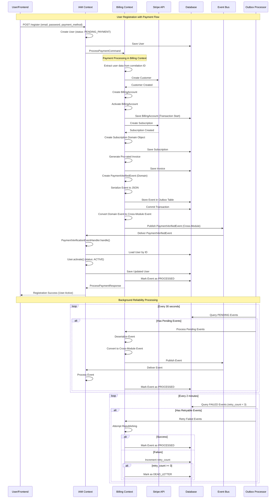

# Billing and IAM Bounded Context Integration Guide

## Overview

This document describes how the Billing and IAM bounded contexts work together in the RegTech system to provide a seamless user registration and payment verification flow. The integration uses domain events and the outbox pattern to ensure reliable cross-context communication.

## Architecture Overview

The RegTech system follows Domain-Driven Design (DDD) principles with two main bounded contexts:

- **IAM Context**: Manages user identity, authentication, and authorization
- **Billing Context**: Handles payment processing, subscriptions, and billing operations

These contexts communicate through domain events using an event-driven architecture with the outbox pattern for reliability.

## Key Components

### Billing Context Components

#### Cross-Module Event Handlers
- `UserRegisteredEventHandler`: Handles user registration events from IAM context

#### Domain Events (Internal)
- `PaymentVerifiedEvent`: Published when payment is successfully verified
- `BillingAccountStatusChangedEvent`: Published when billing account status changes
- `SubscriptionCancelledEvent`: Published when a subscription is cancelled
- `InvoiceGeneratedEvent`: Published when an invoice is generated

#### Outbox Pattern Infrastructure
- `BillingEventPublisher`: Main service for publishing events using outbox pattern (implements `OutboxEventPublisher`)
- `BillingDomainEventEntity`: JPA entity for storing events reliably
- `OutboxEventProcessor`: Billing-specific processor extending `GenericOutboxEventProcessor`
- `EventSerializer`: JSON serialization/deserialization service

### Generic Outbox Components (regtech-core)
- `OutboxEventPublisher`: Generic interface for outbox event publishers
- `GenericOutboxEventProcessor`: Generic scheduled processor for reliable event delivery
- `OutboxEventStats`: Statistics record for monitoring event processing

#### Command Handlers
- `ProcessPaymentCommandHandler`: Handles payment processing and publishes events via outbox

### Core Components

#### Cross-Module Event Bus
- `CrossModuleEventBus`: Spring-based event publisher for cross-context communication
- Uses Spring's `ApplicationEventPublisher` with async support

#### Cross-Module Events
- Located in `regtech-core/src/main/java/com/bcbs239/regtech/core/events/`
- All extend `BaseEvent` with correlation ID and source module tracking

### IAM Context Components

#### Cross-Module Event Publishers
- `RegisterUserCommandHandler`: Publishes cross-module `UserRegisteredEvent` via `CrossModuleEventBus`

#### Cross-Module Event Handlers
- `PaymentVerificationEventHandler`: Handles payment verification events from billing
- `BillingAccountEventHandler`: Handles billing account status changes from billing

#### Domain Model
- `User`: User aggregate with status management
- `UserStatus`: Enum with states (PENDING_PAYMENT, ACTIVE, SUSPENDED, CANCELLED)

### Core Components

#### Cross-Module Events
- `com.bcbs239.regtech.core.events.PaymentVerifiedEvent`: Cross-module event format
- `com.bcbs239.regtech.core.events.BillingAccountStatusChangedEvent`: Cross-module event format
- `com.bcbs239.regtech.core.events.SubscriptionCancelledEvent`: Cross-module event format

#### Event Bus
- `CrossModuleEventBus`: Spring-based event publisher for cross-context communication

## Event Flow Architecture

### 1. Event Publishing (Outbox Pattern)

The Billing context uses the outbox pattern to ensure reliable event delivery:

1. **Transactional Storage**: Events are stored in the same database transaction as business data
2. **Immediate Publishing**: Attempts immediate publication for performance
3. **Background Processing**: Scheduled jobs process pending/failed events
4. **Retry Logic**: Failed events are retried with exponential backoff
5. **Dead Letter Handling**: Events that fail repeatedly are marked as dead letters

### 2. Cross-Context Communication

Events flow between contexts through a structured process:

1. **Domain Event Creation**: Billing context creates domain events with value objects
2. **Event Conversion**: Domain events are converted to cross-module events with string fields
3. **Event Publishing**: Cross-module events are published via `CrossModuleEventBus`
4. **Event Handling**: IAM context receives and processes cross-module events

## User Registration and Payment Flow

### Implementation Status
✅ **COMPLETED**: RegisterUserCommandHandler with proper cross-module event-driven integration
✅ **COMPLETED**: UserRegisteredEvent as cross-module event in regtech-core
✅ **COMPLETED**: UserRegisteredEventHandler in billing context
✅ **COMPLETED**: ProcessPaymentCommandHandler with outbox pattern event publishing
✅ **COMPLETED**: User creation with PENDING_PAYMENT status and bank assignment
✅ **FIXED**: Consistent event architecture using CrossModuleEventBus and outbox pattern

### Complete Sequence Diagram



### Detailed Flow Steps

#### Phase 1: User Registration
1. User submits registration form with payment method and bank ID
2. IAM context creates user with `PENDING_PAYMENT` status and bank assignment
3. IAM context publishes cross-module `UserRegisteredEvent` via `CrossModuleEventBus`
4. Billing context receives event via `UserRegisteredEventHandler` and triggers payment processing
5. Payment processing publishes events via outbox pattern for reliable delivery
6. Enhanced correlation ID includes user data for billing context extraction

#### Phase 2: Payment Processing
1. **User Data Extraction**: Billing context extracts user data from correlation ID
2. **Stripe Customer Creation**: Creates customer in Stripe with payment method
3. **Billing Account Creation**: Creates and activates billing account
4. **Subscription Setup**: Creates Stripe subscription and domain subscription
5. **Invoice Generation**: Generates pro-rated first invoice

#### Phase 3: Event Publishing (Outbox Pattern)
1. **Domain Event Creation**: Creates `PaymentVerifiedEvent` with domain value objects
2. **Event Serialization**: Serializes event to JSON format
3. **Transactional Storage**: Stores event in outbox table within same transaction
4. **Immediate Publishing**: Attempts immediate event publication
5. **Cross-Module Conversion**: Converts domain event to cross-module event format
6. **Event Delivery**: Publishes via `CrossModuleEventBus`

#### Phase 4: User Activation
1. **Event Reception**: IAM context receives `PaymentVerifiedEvent`
2. **User Loading**: Loads user by ID from database
3. **Status Update**: Changes user status from `PENDING_PAYMENT` to `ACTIVE`
4. **Persistence**: Saves updated user to database

#### Phase 5: Reliability Processing
1. **Outbox Monitoring**: Background processor checks for pending/failed events
2. **Retry Logic**: Failed events are retried with exponential backoff
3. **Dead Letter Handling**: Events exceeding retry limit are marked as dead letters

## Event-Driven Cross-Context Communication

The integration uses a consistent event architecture with two layers:

### Cross-Module Events (regtech-core)
For communication between bounded contexts:
- `UserRegisteredEvent` - Published by IAM when user needs payment processing
- `PaymentVerifiedEvent` - Published by Billing when payment is verified
- `BillingAccountStatusChangedEvent` - Published by Billing for account status changes
- `SubscriptionCancelledEvent` - Published by Billing when subscription is cancelled

### Outbox Pattern (Billing Context)
For reliable event delivery within billing context:
- Domain events stored in outbox table
- Automatic conversion to cross-module events
- Retry mechanism for failed deliveries
- Dead letter handling for persistent failures

### UserRegisteredEvent Structure
```java
UserRegisteredEvent extends BaseEvent {
    String userId,
    String email,
    String name,
    String bankId,
    String paymentMethodId,
    String correlationId  // inherited from BaseEvent
}
```

### Enhanced Correlation ID Format
The billing context receives an enhanced correlation ID format:

```
Format: "user-registration-{uuid}|userId={userId}|email={email}|name={name}|bankId={bankId}"
Example: "user-registration-123e4567-e89b-12d3-a456-426614174000|userId=usr_456|email=john@example.com|name=John Doe|bankId=bank_123"
```

This maintains loose coupling while providing necessary data for payment processing.

## Event Types and Mappings

### Domain Events (Billing Context)
```java
// Billing domain events use value objects
PaymentVerifiedEvent(UserId, BillingAccountId, correlationId)
BillingAccountStatusChangedEvent(BillingAccountId, UserId, previousStatus, newStatus, reason, correlationId)
SubscriptionCancelledEvent(SubscriptionId, BillingAccountId, UserId, tier, cancellationDate, reason, correlationId)
```

### Cross-Module Events (Core)
```java
// Cross-module events use string representations
PaymentVerifiedEvent(String userId, String billingAccountId, String correlationId)
BillingAccountStatusChangedEvent(String billingAccountId, String userId, String previousStatus, String newStatus, String reason, String correlationId)
SubscriptionCancelledEvent(String subscriptionId, String billingAccountId, String userId, String tier, LocalDate cancellationDate, String reason, String correlationId)
```

## Status Mappings

### User Status Transitions
- `PENDING_PAYMENT` → `ACTIVE`: When payment is verified
- `ACTIVE` → `SUSPENDED`: When billing account becomes past due
- `ACTIVE` → `CANCELLED`: When subscription is cancelled
- `SUSPENDED` → `ACTIVE`: When billing account becomes active again

### Billing Account Status to User Status Mapping
- `ACTIVE` → `UserStatus.ACTIVE`
- `SUSPENDED` → `UserStatus.SUSPENDED`
- `CANCELLED` → `UserStatus.CANCELLED`
- `PAST_DUE` → `UserStatus.SUSPENDED`
- `PENDING_VERIFICATION` → No change (user remains in current status)

## Error Handling and Reliability

### Outbox Pattern Benefits
1. **Transactional Consistency**: Events are stored in the same transaction as business data
2. **At-Least-Once Delivery**: Events are guaranteed to be delivered at least once
3. **Retry Mechanism**: Failed events are automatically retried
4. **Monitoring**: Event processing status is tracked and monitorable

### Failure Scenarios

#### Immediate Publishing Failure
- Event is stored in outbox but immediate publishing fails
- Background processor will retry the event
- User experience is not affected as the transaction completes successfully

#### IAM Context Unavailable
- Events accumulate in outbox
- When IAM context becomes available, events are processed
- Users may remain in `PENDING_PAYMENT` status temporarily

#### Database Failure
- Entire transaction (including event storage) is rolled back
- User registration fails gracefully
- No inconsistent state is created

## Monitoring and Observability

### Event Statistics
The `BillingEventPublisher` provides statistics for monitoring:
- Pending events count
- Processing events count
- Processed events count
- Failed events count
- Dead letter events count

### Logging
- Event publishing attempts are logged
- Cross-module event delivery is logged
- User status changes are logged with correlation IDs

### Health Checks
- Outbox processor health can be monitored
- Event processing delays can be detected
- Dead letter events indicate system issues

## Configuration

### Outbox Processing Configuration
```yaml
billing:
  outbox:
    enabled: true
    processing-interval: 30000 # 30 seconds
    retry-interval: 120000 # 2 minutes
    max-retries: 3
    cleanup-interval: 86400000 # 24 hours
    cleanup-retention-days: 7
```

### Event Bus Configuration
- Uses Spring's `ApplicationEventPublisher`
- Supports both synchronous and asynchronous event publishing
- Configurable through Spring Boot properties

## Best Practices

### Event Design
1. **Immutable Events**: Events should be immutable once created
2. **Correlation IDs**: Always include correlation IDs for tracing
3. **Backward Compatibility**: Event schema changes must be backward compatible
4. **Minimal Data**: Include only necessary data in events

### Error Handling
1. **Graceful Degradation**: System should continue operating even if events fail
2. **Idempotent Handlers**: Event handlers should be idempotent
3. **Dead Letter Monitoring**: Monitor and alert on dead letter events
4. **Correlation Tracking**: Use correlation IDs for debugging

### Performance
1. **Batch Processing**: Process multiple events in batches when possible
2. **Async Processing**: Use asynchronous event processing for better performance
3. **Database Optimization**: Optimize outbox table with proper indexes
4. **Event Cleanup**: Regularly clean up processed events

## Troubleshooting

### Common Issues

#### Events Not Being Processed
- Check if `OutboxEventProcessor` is enabled
- Verify database connectivity
- Check for dead letter events

#### User Status Not Updating
- Verify IAM event handlers are registered
- Check correlation ID matching
- Review event handler error logs

#### Performance Issues
- Monitor outbox table size
- Check event processing intervals
- Review database query performance

### Debugging Tools
- Event correlation ID tracking
- Outbox table queries
- Event handler logging
- Cross-module event tracing

## Generic Outbox Pattern Usage

### For Other Bounded Contexts

To implement the outbox pattern in other bounded contexts:

1. **Implement OutboxEventPublisher Interface**:
```java
@Service
public class YourContextEventPublisher implements OutboxEventPublisher {
    @Override
    public void processPendingEvents() { /* Implementation */ }
    
    @Override
    public void retryFailedEvents(int maxRetries) { /* Implementation */ }
    
    @Override
    public OutboxEventStats getStats() { /* Implementation */ }
}
```

2. **Extend GenericOutboxEventProcessor**:
```java
@Component
@ConditionalOnProperty(name = "yourcontext.outbox.enabled", havingValue = "true")
public class YourContextOutboxEventProcessor extends GenericOutboxEventProcessor {
    
    public YourContextOutboxEventProcessor(YourContextEventPublisher eventPublisher,
                                          @Value("${yourcontext.outbox.enabled:false}") boolean enabled) {
        super(eventPublisher, "YourContext");
    }
    
    @Override
    protected boolean isProcessingEnabled() {
        return enabled;
    }
}
```

3. **Configure in application.yml**:
```yaml
yourcontext:
  outbox:
    enabled: true
    max-retries: 3
```

### Benefits of Generic Implementation

1. **Code Reuse**: Common outbox logic shared across contexts
2. **Consistency**: Same scheduling and retry patterns everywhere
3. **Maintainability**: Single place to update outbox behavior
4. **Monitoring**: Consistent statistics and logging format
5. **Configuration**: Standardized configuration patterns

## Future Enhancements

### Potential Improvements
1. **Event Sourcing**: Consider full event sourcing for audit trails
2. **Saga Pattern**: Implement sagas for complex multi-step processes
3. **Event Versioning**: Add versioning support for event schema evolution
4. **Distributed Tracing**: Integrate with distributed tracing systems
5. **Event Replay**: Add capability to replay events for recovery scenarios

This integration provides a robust, reliable foundation for cross-context communication while maintaining loose coupling between bounded contexts.