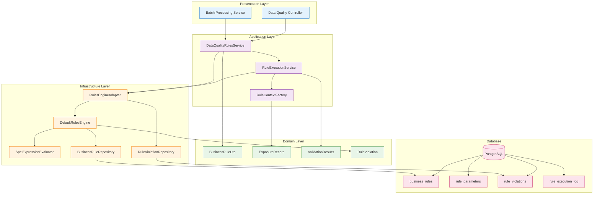

# Data Quality Rules Engine - Complete Guide

## Overview

The RegTech Data Quality system uses a **database-driven Rules Engine** that evaluates exposure data against configurable business rules using Spring Expression Language (SpEL). The system processes JSON batch files containing exposure data and validates them against rules stored in PostgreSQL.

## Architecture Flow

```mermaid
flowchart TD
    A[JSON Batch File<br/>data/raw/*.json] --> B[ExposureRecord<br/>Creation]
    B --> C[RuleContextFactory<br/>fromExposure()]
    C --> D[DataQualityRulesService<br/>prefetchForBatch()]
    D --> E[RuleExecutionService<br/>execute()]
    E --> F[RulesEngineAdapter<br/>execute()]
    F --> G[DefaultRulesEngine<br/>executeRule()]
    G --> H[SpelExpressionEvaluator<br/>evaluateBoolean()]
    H --> I[ValidationResults<br/>with Violations]

    %% Styling
    classDef serviceClass fill:#e1f5fe,stroke:#01579b,stroke-width:2px
    classDef engineClass fill:#f3e5f5,stroke:#4a148c,stroke-width:2px
    classDef evaluatorClass fill:#e8f5e8,stroke:#1b5e20,stroke-width:2px
    classDef dataClass fill:#fff3e0,stroke:#e65100,stroke-width:2px

    class A,B,I dataClass
    class C,D,E serviceClass
    class F,G engineClass
    class H evaluatorClass
```

### Method Call Sequence

1. **DataQualityRulesService.prefetchForBatch()** - Loads and caches rules for batch processing
2. **RuleExecutionService.execute()** - Creates RuleContext from ExposureRecord
3. **RulesEngineAdapter.execute()** - Executes single rule with exemption checking
4. **DefaultRulesEngine.executeRule()** - Evaluates SpEL expression against rule context
5. **SpelExpressionEvaluator.evaluateBoolean()** - Parses and evaluates Spring Expression Language

## Detailed Component Architecture



## Key Components

### 1. DataQualityRulesService (Application Layer)
- **Location**: `regtech-data-quality/application/src/main/java/.../rulesengine/DataQualityRulesService.java`
- **Purpose**: Bridge between legacy Specifications and new Rules Engine
- **Key Methods**:
  - `prefetchForBatch()`: Loads and caches rules for batch processing
  - `validateNoPersist()`: Validates single exposure without persistence
  - `prepareForBatch()`: Returns function for batch validation

### 2. RuleExecutionService (Application Layer)
- **Location**: `regtech-data-quality/application/src/main/java/.../rulesengine/RuleExecutionService.java`
- **Purpose**: Pure rule execution logic without persistence concerns
- **Key Methods**:
  - `execute()`: Executes all applicable rules for an exposure

### 3. RulesEngineAdapter (Infrastructure Layer)
- **Location**: `regtech-data-quality/infrastructure/src/main/java/.../rulesengine/RulesEngineAdapter.java`
- **Purpose**: Infrastructure adapter implementing RuleExecutionPort
- **Key Methods**:
  - `execute()`: Executes single rule with exemption checking

### 4. DefaultRulesEngine (Infrastructure Layer)
- **Location**: `regtech-data-quality/infrastructure/src/main/java/.../rulesengine/engine/DefaultRulesEngine.java`
- **Purpose**: Core rules engine with SpEL evaluation and caching
- **Key Methods**:
  - `executeRule()`: Main rule execution method

### 5. SpelExpressionEvaluator (Infrastructure Layer)
- **Location**: `regtech-data-quality/infrastructure/src/main/java/.../rulesengine/evaluator/SpelExpressionEvaluator.java`
- **Purpose**: Spring Expression Language evaluator
- **Key Methods**:
  - `evaluateBoolean()`: Evaluates SpEL expressions to boolean results

## Rule Execution Flow

### Method Call Sequence

1. **DataQualityRulesService.prefetchForBatch()**
   - Loads all enabled rules from database
   - Caches rules in memory (double-checked locking pattern)
   - Pre-loads exemptions for batch

2. **DataQualityRulesService.prepareForBatch()**
   - Returns lambda function that uses cached rules
   - Same rules instance used for all exposures in batch

3. **RuleExecutionService.execute()**
   - Creates RuleContext from ExposureRecord
   - Iterates through all cached rules
   - Calls RulesEngineAdapter.execute() for each rule

4. **RulesEngineAdapter.execute()**
   - Checks if rule is applicable (date range)
   - Checks for active exemptions
   - Calls DefaultRulesEngine.executeRule()

5. **DefaultRulesEngine.executeRule()**
   - Loads rule from cache (or database if cache miss)
   - Enriches context with rule parameters
   - Evaluates SpEL expression
   - Creates violations if rule fails

6. **SpelExpressionEvaluator.evaluateBoolean()**
   - Parses SpEL expression
   - Creates Spring EvaluationContext with rule context data
   - Evaluates expression and returns boolean

## Rule Context Creation

### RuleContextFactory.fromExposure()

The `RuleContextFactory` maps `ExposureRecord` fields to a `RuleContext` map:

```java
public RuleContext fromExposure(ExposureRecord exposure) {
    Map<String, Object> data = new HashMap<>();

    // Map exposure fields to context
    putIfNotNull(data, "exposureId", exposure.exposureId());
    putIfNotNull(data, "amount", exposure.amount());
    putIfNotNull(data, "currency", exposure.currency());
    putIfNotNull(data, "country", exposure.country());
    putIfNotNull(data, "sector", exposure.sector());  // ← SECTOR FIELD
    // ... other fields

    return new DefaultRuleContext(data);
}
```

### Available Context Variables

From the JSON batch file, these variables are available in SpEL expressions:
- `exposureId`: String
- `amount`: BigDecimal
- `currency`: String
- `country`: String
- `sector`: String ← **This is your sector input**
- `counterpartyId`: String
- `counterpartyType`: String
- `leiCode`: String
- `productType`: String
- `internalRating`: String
- `riskCategory`: String
- `riskWeight`: BigDecimal
- `reportingDate`: LocalDate
- `valuationDate`: LocalDate
- `maturityDate`: LocalDate
- `referenceNumber`: String

## Business Rules Structure

### Database Tables

1. **business_rules**: Core rule definitions
   - `rule_id`: Unique identifier
   - `business_logic`: SpEL expression
   - `parameters`: Rule-specific parameters

2. **rule_parameters**: Configurable parameters
   - `parameter_name`: Name used in SpEL (e.g., `validSectors`)
   - `parameter_value`: Comma-separated values

3. **rule_violations**: Detected violations
4. **rule_execution_log**: Audit trail

### Example Rules

#### Completeness Rules
```sql
-- Sector Required
INSERT INTO business_rules (
    rule_id, business_logic, severity, rule_type
) VALUES (
    'DQ_COMPLETENESS_SECTOR',
    '#sector != null && !#sector.trim().isEmpty()',
    'CRITICAL',
    'COMPLETENESS'
);
```

#### Validity Rules
```sql
-- Valid Sector
INSERT INTO business_rules (
    rule_id, business_logic, severity, rule_type
) VALUES (
    'DQ_VALIDITY_VALID_SECTOR',
    '#sector == null || #validSectors.contains(#sector.toUpperCase())',
    'HIGH',
    'VALIDITY'
);

-- Parameter for valid sectors
INSERT INTO rule_parameters (
    rule_id, parameter_name, parameter_value
) VALUES (
    'DQ_VALIDITY_VALID_SECTOR',
    'validSectors',
    'BANKING,CORPORATE_MANUFACTURING,CORPORATE_SERVICES,CORPORATE_RETAIL,CORPORATE_TECHNOLOGY,SOVEREIGN,RETAIL,SME,REAL_ESTATE,INSURANCE,CORPORATE'
);
```

## Sector Validation Issue

### Current Problem

Your JSON data contains:
```json
{
  "sector": "CORPORATE_BOND"
}
```

But the validity rule parameter contains:
```
BANKING,CORPORATE_MANUFACTURING,CORPORATE_SERVICES,CORPORATE_RETAIL,CORPORATE_TECHNOLOGY,SOVEREIGN,RETAIL,SME,REAL_ESTATE,INSURANCE,CORPORATE
```

**"CORPORATE_BOND" is not in the valid sectors list!**

### Why Sector Is Not Evaluated

1. **Rule Execution Order**: Rules execute in `execution_order`
2. **First Failure Stops?**: No, all rules execute regardless of failures
3. **Sector Field Mapping**: The `sector` field is correctly mapped from JSON to RuleContext
4. **SpEL Expression**: `#sector == null || #validSectors.contains(#sector.toUpperCase())`

### SectorValidator vs Rules Engine

There are **two separate validation systems**:

1. **SectorValidator** (Legacy)
   - Location: `domain/src/main/java/.../validators/SectorValidator.java`
   - Contains comprehensive list including "CORPORATE_BOND"
   - Used by legacy Specifications

2. **Rules Engine** (New)
   - Database-driven with configurable parameters
   - Current valid sectors list doesn't include "CORPORATE_BOND"
   - This is what validates your data

## Maturity Date Validation Issue

### Current Problem

Your JSON data contains:
```json
{
  "product_type": "Business Loan",
  "maturity_date": null
}
```

### Rules Using Maturity Date

There are **two rules** that evaluate `maturityDate`:

#### 1. COMPLETENESS_MATURITY_FOR_TERM (High Priority)
```java
#productType == 'EQUITY' || #maturityDate != null
```

**Logic**: Term exposures (non-equity products) MUST have a maturity date.

- **Your data**: `product_type = "Business Loan"` (not "EQUITY")
- **Expected**: `maturityDate != null`
- **Actual**: `maturityDate = null`
- **Result**: ❌ **FAILS** (returns false)

#### 2. VALIDITY_MATURITY_AFTER_REPORTING (Medium Priority)
```java
#maturityDate == null || #reportingDate == null || !#maturityDate.isBefore(#reportingDate)
```

**Logic**: If maturity date exists, it must be after or equal to reporting date.

- **Your data**: `maturityDate = null`
- **Logic**: Since `maturityDate == null` is true, the entire expression evaluates to true
- **Result**: ✅ **PASSES** (returns true)

### Why You're Getting False

The **COMPLETENESS_MATURITY_FOR_TERM** rule is failing because:
- Your product is "Business Loan" (not equity)
- But maturity_date is null
- The rule requires term exposures to have maturity dates

### Solutions

#### Option 1: Add Maturity Date to JSON
Update your JSON data to include a valid maturity date:
```json
{
  "product_type": "Business Loan",
  "maturity_date": "2025-12-31"
}
```

#### Option 2: Modify the Rule Logic
Change the rule to be less strict for certain product types:
```java
// Current: All non-equity must have maturity
#productType == 'EQUITY' || #maturityDate != null

// Modified: Only loans require maturity
!#productType.contains('LOAN') || #maturityDate != null
```

#### Option 3: Disable Maturity Validation
Temporarily disable the rule:
```sql
UPDATE business_rules
SET enabled = false
WHERE rule_id = 'DQ_COMPLETENESS_MATURITY_TERM';
```

## Configuration

### Enable Rules Engine

```yaml
# application.yml
data-quality:
  rules-engine:
    enabled: true
    cache-enabled: true
    cache-ttl: 300
```

### Enable Rules Migration (One-time)

```yaml
data-quality:
  rules-migration:
    enabled: true  # Run once, then set to false
```

## Debugging Rule Execution

### Enable Detailed Logging

Add to `application.yml`:
```yaml
logging:
  level:
    com.bcbs239.regtech.dataquality: DEBUG
    org.springframework.expression: DEBUG
```

### Check Which Rules Are Failing

```sql
-- Find violations for your exposure
SELECT 
    r.rule_code,
    r.rule_name,
    r.business_logic,
    v.violation_description,
    v.severity
FROM rule_violations v
JOIN business_rules r ON v.rule_id = r.rule_id
WHERE v.exposure_id = 'EXP_001_2024'
ORDER BY v.created_at DESC;

-- Check rule execution logs
SELECT 
    r.rule_code,
    e.execution_status,
    e.execution_duration_ms,
    e.error_message
FROM rule_execution_log e
JOIN business_rules r ON e.rule_id = r.rule_id
WHERE e.entity_id = 'EXP_001_2024'
ORDER BY e.execution_timestamp DESC;
```

### Test SpEL Expressions Manually

You can test expressions using Spring's SpEL:

```java
// In a test or debug session
ExpressionParser parser = new SpelExpressionParser();
EvaluationContext context = new StandardEvaluationContext();

// Set your data
context.setVariable("productType", "Business Loan");
context.setVariable("maturityDate", null);

// Test the expression
Expression expr = parser.parseExpression("#productType == 'EQUITY' || #maturityDate != null");
boolean result = expr.getValue(context, Boolean.class);
// Result: false (because maturityDate is null and productType is not EQUITY)
```

## Solutions

### Option 1: Update Valid Sectors Parameter
Add "CORPORATE_BOND" to the database parameter:

```sql
UPDATE rule_parameters
SET parameter_value = 'BANKING,CORPORATE_MANUFACTURING,CORPORATE_SERVICES,CORPORATE_RETAIL,CORPORATE_TECHNOLOGY,SOVEREIGN,RETAIL,SME,REAL_ESTATE,INSURANCE,CORPORATE,CORPORATE_BOND'
WHERE rule_id = 'DQ_VALIDITY_VALID_SECTOR'
  AND parameter_name = 'validSectors';
```

### Option 2: Update InitialRulesMigration
Modify the `InitialRulesMigration.java` to include "CORPORATE_BOND":

```java
.parameterValue("BANKING,CORPORATE_MANUFACTURING,CORPORATE_SERVICES,CORPORATE_RETAIL,CORPORATE_TECHNOLOGY,SOVEREIGN,RETAIL,SME,REAL_ESTATE,INSURANCE,CORPORATE,CORPORATE_BOND")
```

### Option 3: Disable Sector Validation
Temporarily disable the sector validation rule:

```sql
UPDATE business_rules
SET enabled = false
WHERE rule_id = 'DQ_VALIDITY_VALID_SECTOR';
```

## Summary

The data quality rules engine:
1. **Reads JSON batch files** from `data/raw/`
2. **Maps exposure data** to RuleContext variables
3. **Executes SpEL expressions** against cached rules
4. **Validates sector field** against database parameter
5. **Validates maturity dates** for term exposures
6. **Creates violations** when rules fail

### Your Issues:

#### Sector Issue
Your sector "CORPORATE_BOND" fails validation because it's not in the configured valid sectors list. Update the parameter to include it, or modify the migration to add it to the initial rules.

#### Maturity Date Issue  
Your maturity date is null for a "Business Loan" product, which violates the **COMPLETENESS_MATURITY_FOR_TERM** rule that requires term exposures to have maturity dates. Add a maturity date to your JSON data or modify the rule logic.

### Quick Fixes:

1. **Add maturity date to JSON**:
   ```json
   "maturity_date": "2025-12-31"
   ```

2. **Add CORPORATE_BOND to valid sectors**:
   ```sql
   UPDATE rule_parameters SET parameter_value = parameter_value || ',CORPORATE_BOND' 
   WHERE rule_id = 'DQ_VALIDITY_VALID_SECTOR';
   ```

3. **Enable debug logging** to see detailed rule execution</content>
<parameter name="filePath">c:\Users\alseny\Desktop\react projects\regtech\DATA_QUALITY_RULES_ENGINE_GUIDE.md