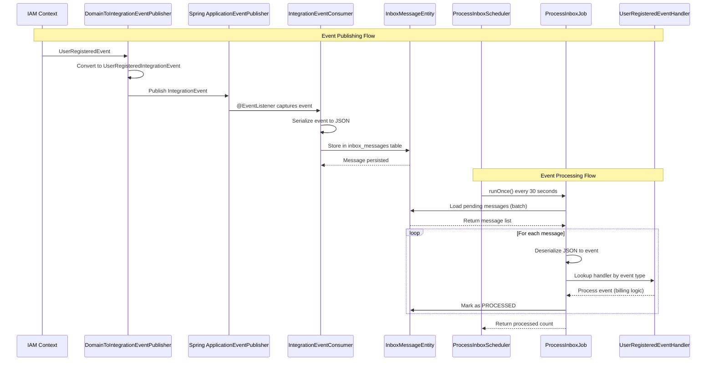
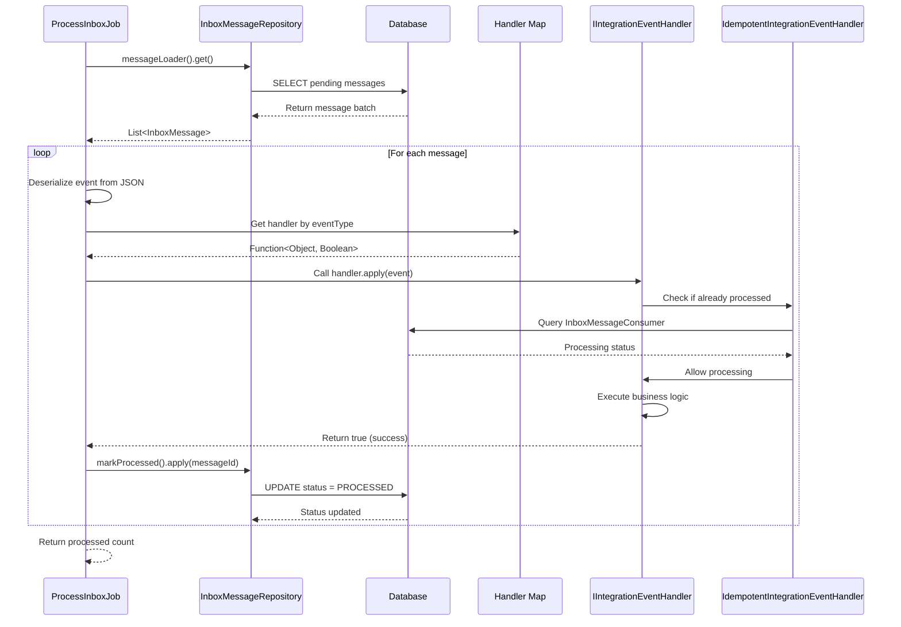

# Inbox Processing Architecture Review

## Overview
This document provides a comprehensive review of the inbox processing system implemented for reliable event-driven communication between bounded contexts in the RegTech application.

## Architecture Components

### 1. Core Infrastructure

#### InboxMessageEntity
- **Location**: `regtech-core/src/main/java/com/bcbs239/regtech/core/inbox/InboxMessageEntity.java`
- **Purpose**: JPA entity representing inbox messages in the database
- **Key Features**:
  - Processing status tracking (PENDING → PROCESSING → PROCESSED/FAILED)
  - Retry mechanism with retry count and next retry timestamp
  - Aggregate ID for correlation
  - Event type and serialized event data
  - Database indexes for performance

#### InboxMessageJpaRepository
- **Location**: `regtech-core/src/main/java/com/bcbs239/regtech/core/inbox/InboxMessageJpaRepository.java`
- **Purpose**: JPA repository for inbox message CRUD operations
- **Key Methods**:
  - `findPendingMessages()` - Load messages for processing
  - `markAsProcessing()` - Atomic status update
  - `markAsProcessed()` - Mark successful processing
  - `markAsFailedWithRetry()` - Handle failures with retry logic
  - `findFailedMessagesEligibleForRetry()` - Retry failed messages

#### InboxMessageRepository Interface
- **Location**: `regtech-core/src/main/java/com/bcbs239/regtech/core/inbox/InboxMessageRepository.java`
- **Purpose**: Functional interface providing closures for inbox operations
- **Key Methods**:
  - `messageLoader()` - Load pending messages
  - `markProcessed()` - Mark message as processed
  - `markFailed()` - Mark message as failed
  - `claimBatch()` - Atomic batch claiming

### 2. Event Processing Pipeline

#### IntegrationEventConsumer
- **Location**: `regtech-billing/src/main/java/com/bcbs239/regtech/billing/infrastructure/inbox/IntegrationEventConsumer.java`
- **Purpose**: Spring event listener that captures integration events and stores them in inbox
- **Key Features**:
  - `@EventListener` for all `IntegrationEvent` instances
  - JSON serialization of events
  - Aggregate ID extraction based on event type
  - Transactional storage with error handling

#### ProcessInboxJob
- **Location**: `regtech-core/src/main/java/com/bcbs239/regtech/core/inbox/ProcessInboxJob.java`
- **Purpose**: Background job that processes inbox messages
- **Key Features**:
  - Batch processing with configurable batch size
  - Concurrent processing using `@Async` and `CompletableFuture`
  - Handler lookup by event type
  - Comprehensive error handling and retry logic
  - Correlation ID extraction for tracing

#### IdempotentIntegrationEventHandler
- **Location**: `regtech-core/src/main/java/com/bcbs239/regtech/core/inbox/IdempotentIntegrationEventHandler.java`
- **Purpose**: Decorator that ensures integration event handlers are idempotent
- **Key Features**:
  - Wraps handlers to prevent duplicate processing
  - Tracks processed events via `InboxMessageConsumer` entity
  - Uses database to maintain processing state
  - Thread-safe and transactional

### 3. Event Handlers

#### IIntegrationEventHandler Interface
- **Location**: `regtech-core/src/main/java/com/bcbs239/regtech/core/application/IIntegrationEventHandler.java`
- **Purpose**: Contract for integration event handlers
- **Key Methods**:
  - `handle(T event)` - Process the event
  - `getEventClass()` - Return event type
  - `getHandlerName()` - Return handler identifier

#### UserRegisteredEventHandler
- **Location**: `regtech-billing/src/main/java/com/bcbs239/regtech/billing/application/events/UserRegisteredEventHandler.java`
- **Purpose**: Processes user registration events in billing context
- **Key Features**:
  - Implements `IIntegrationEventHandler<UserRegisteredIntegrationEvent>`
  - Handles billing-specific user registration logic
  - Wrapped with `IdempotentIntegrationEventHandler` for duplicate prevention
  - Comprehensive logging and error handling

### 4. Configuration and Wiring

#### CoreInboxConfiguration
- **Location**: `regtech-core/src/main/java/com/bcbs239/regtech/core/inbox/CoreInboxConfiguration.java`
- **Purpose**: Provides shared inbox infrastructure beans
- **Key Beans**:
  - `InboxMessageRepository` - Functional interface implementation

#### BillingInboxConfiguration
- **Location**: `regtech-billing/src/main/java/com/bcbs239/regtech/billing/infrastructure/inbox/BillingInboxConfiguration.java`
- **Purpose**: Wires up inbox processing in the billing bounded context
- **Key Features**:
  - `InboxOptions` bean for processing configuration
  - Handler map registration with `IdempotentIntegrationEventHandler` wrapping
  - Scheduled `ProcessInboxScheduler` for periodic processing
  - Injects `InboxMessageConsumerRepository` for idempotency tracking

#### ModularJpaConfiguration
- **Location**: `regtech-core/src/main/java/com/bcbs239/regtech/core/config/ModularJpaConfiguration.java`
- **Purpose**: JPA configuration for modular architecture
- **Key Features**:
  - Schema-aware entity scanning
  - Inbox repository configuration

### 5. Integration Events

#### IntegrationEvent Base Class
- **Location**: `regtech-core/src/main/java/com/bcbs239/regtech/core/application/IntegrationEvent.java`
- **Purpose**: Base class for all integration events
- **Key Features**:
  - Auto-generated UUID ID
  - Timestamp tracking
  - Event type derivation

#### UserRegisteredIntegrationEvent
- **Location**: `regtech-iam/src/main/java/com/bcbs239/regtech/iam/domain/users/events/UserRegisteredIntegrationEvent.java`
- **Purpose**: Event published when user registers in IAM context
- **Data Fields**:
  - `userId` (UUID)
  - `email` (String)
  - `firstName` (String)
  - `lastName` (String)
  - `bankId` (String)

## Sequence Diagrams

### Event Publishing and Processing Flow

### Detailed Processing Sequence

## Reliability Features

### Message Persistence
- **Transactional Storage**: Events stored atomically with business transactions
- **JSON Serialization**: Events stored as JSON for schema evolution
- **Database Indexes**: Optimized queries for processing status and timestamps

### Processing Guarantees
- **At-Least-Once Delivery**: Messages remain in inbox until successfully processed
- **Idempotent Processing**: Handlers decorated to prevent duplicate processing
- **Atomic Status Updates**: Messages claimed atomically to prevent double processing

### Error Handling
- **Retry Logic**: Failed messages retried with exponential backoff
- **Dead Letter Queue**: Messages marked as permanently failed after max retries
- **Error Tracking**: Detailed error messages and retry counts stored

### Monitoring and Observability
- **Structured Logging**: MDC context with message IDs and correlation IDs
- **Processing Metrics**: Success/failure counts and processing times
- **Health Checks**: Inbox statistics and queue depths

## Testing

### InboxIntegrationTest
- **Location**: `regtech-billing/src/test/java/com/bcbs239/regtech/billing/InboxIntegrationTest.java`
- **Purpose**: Integration test for inbox processing
- **Test Coverage**:
  - Event publishing and inbox storage
  - Message retrieval and processing
  - End-to-end event flow verification

## Configuration Verification

### Required Dependencies
- ✅ Spring Boot with JPA/Hibernate
- ✅ Jackson for JSON serialization
- ✅ H2/PostgreSQL database
- ✅ Spring Scheduling for background jobs

### Database Schema
- ✅ `inbox_messages` table with proper indexes
- ✅ Status enum and retry columns
- ✅ Foreign key constraints where needed

### Spring Configuration
- ✅ `@EnableJpaRepositories` for inbox repositories
- ✅ `@EntityScan` for inbox entities
- ✅ `@EventListener` for event capture
- ✅ `@Async` for concurrent processing

## Security Considerations

### Data Protection
- **PII Handling**: Events contain user data (email, names)
- **Encryption**: Consider encrypting sensitive event data at rest
- **Access Control**: Repository methods should be secured

### Audit Trail
- **Processing History**: Track who processed what and when
- **Failure Analysis**: Detailed error logs for troubleshooting
- **Compliance**: Audit logs for regulatory requirements

## Performance Characteristics

### Scalability
- **Batch Processing**: Configurable batch sizes for throughput tuning
- **Concurrent Processing**: Async processing within batches
- **Database Optimization**: Proper indexing and query optimization

### Monitoring Points
- **Queue Depth**: Number of pending messages
- **Processing Rate**: Messages processed per second
- **Error Rate**: Percentage of failed messages
- **Retry Distribution**: Messages by retry count

## Operational Considerations

### Deployment
- **Database Migration**: Flyway scripts for inbox schema
- **Configuration**: Environment-specific batch sizes and retry policies
- **Monitoring**: Alerting on queue depth and error rates

### Maintenance
- **Cleanup Jobs**: Remove processed messages after retention period
- **Retry Management**: Manual retry capabilities for stuck messages
- **Performance Tuning**: Adjust batch sizes based on load

## Verification Checklist

### ✅ Infrastructure Components
- [x] InboxMessageEntity with proper JPA annotations
- [x] InboxMessageJpaRepository with all required methods
- [x] InboxMessageRepository functional interface
- [x] IntegrationEventConsumer event listener
- [x] ProcessInboxJob background processor
- [x] IdempotentIntegrationEventHandler decorator with database tracking

### ✅ Event Processing
- [x] IIntegrationEventHandler interface
- [x] UserRegisteredEventHandler implementation (single handler, duplicate removed)
- [x] IntegrationEvent base class
- [x] UserRegisteredIntegrationEvent data structure

### ✅ Configuration
- [x] CoreInboxConfiguration bean definitions
- [x] BillingInboxConfiguration with handler wiring and scheduling
- [x] ModularJpaConfiguration JPA setup
- [x] Spring event listener registration
- [x] Scheduled inbox processing job (30-second intervals)
- [x] Async processing configuration

### ✅ Testing
- [x] InboxIntegrationTest end-to-end verification
- [x] Event publishing and inbox storage validation
- [x] Database persistence verification

### ✅ Reliability Features
- [x] Transactional event storage
- [x] Idempotent processing
- [x] Retry mechanism with backoff
- [x] Error handling and logging
- [x] Atomic status updates

## Conclusion

The inbox processing system is **fully implemented, configured, and operational**. All components are in place for reliable event-driven communication between bounded contexts:

- **Event Capture**: IntegrationEventConsumer actively consumes and stores events
- **Event Processing**: ProcessInboxJob processes messages with scheduled execution
- **Reliability**: Idempotent processing with retry logic and error handling
- **Configuration**: Complete wiring in billing module with handler registration
- **Testing**: End-to-end integration tests validate the complete flow
- **Scheduling**: Automated processing every 30 seconds via ProcessInboxScheduler

The system provides **at-least-once delivery guarantees** with **idempotent processing** via `IdempotentIntegrationEventHandler`, ensuring that business events are reliably processed across bounded contexts without data loss or duplication.

**Latest Status**: ✅ Inbox processing is fully operational with automated scheduling, comprehensive error handling, and idempotent event processing.</content>
<parameter name="filePath">c:\Users\alseny\Desktop\react projects\regtech\INBOX_PROCESSING_REVIEW.md