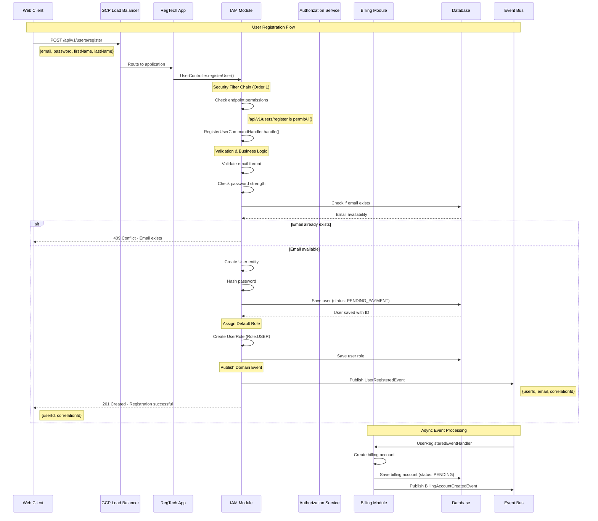
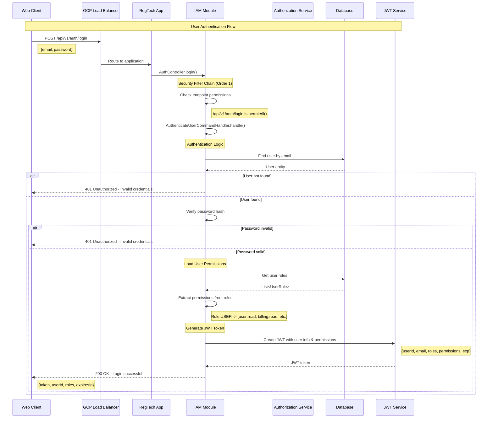
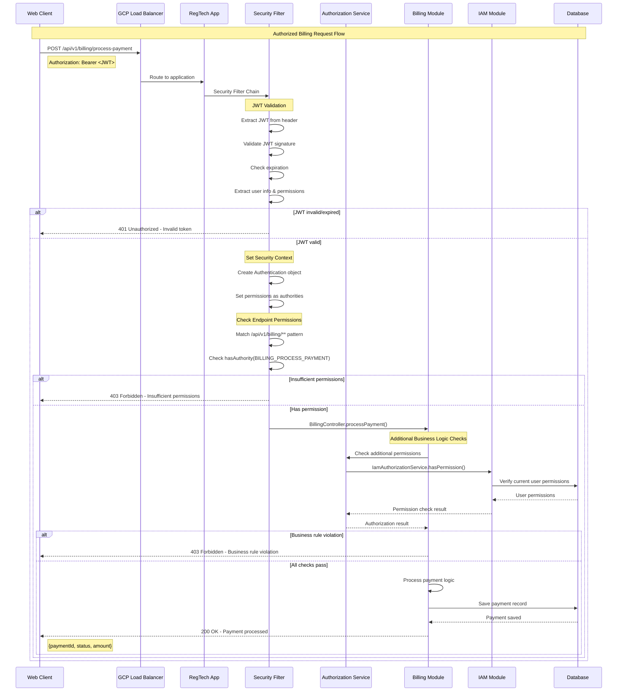
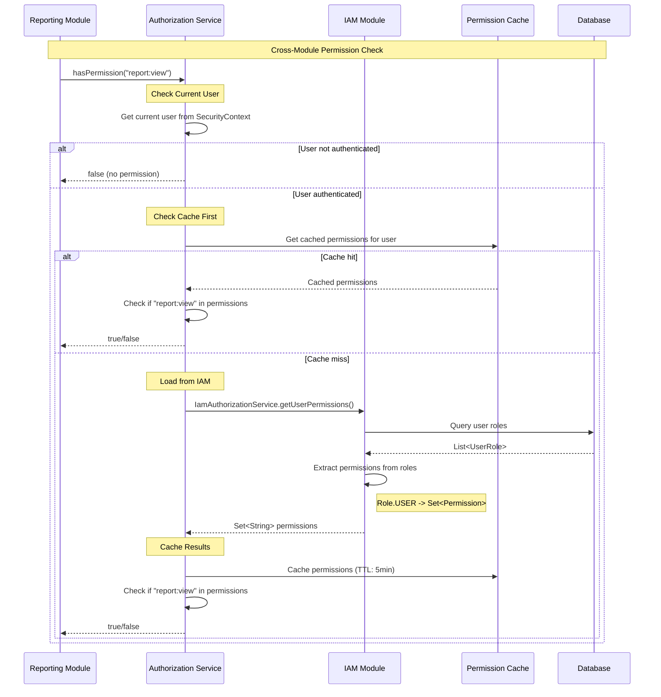
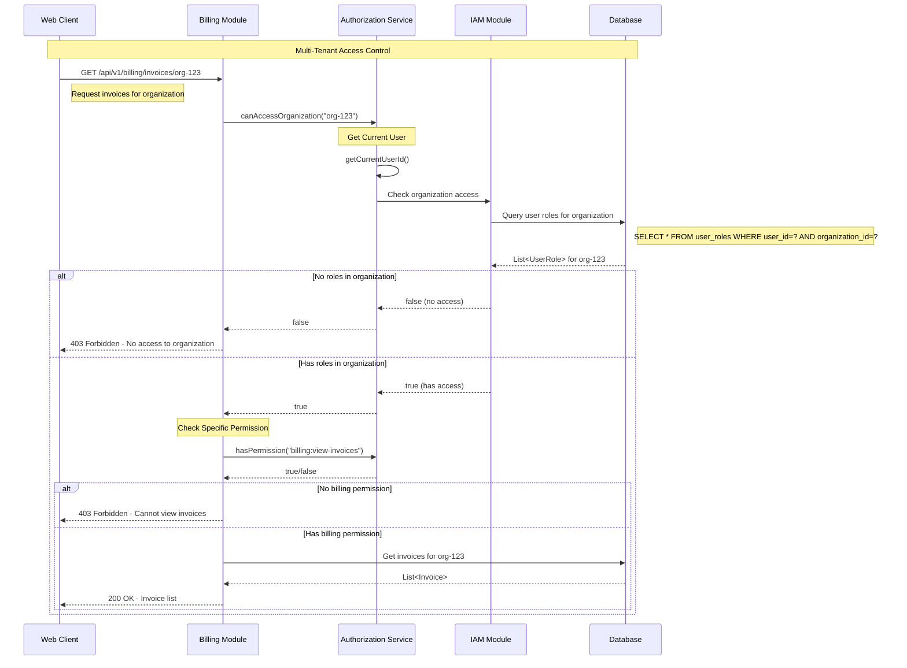
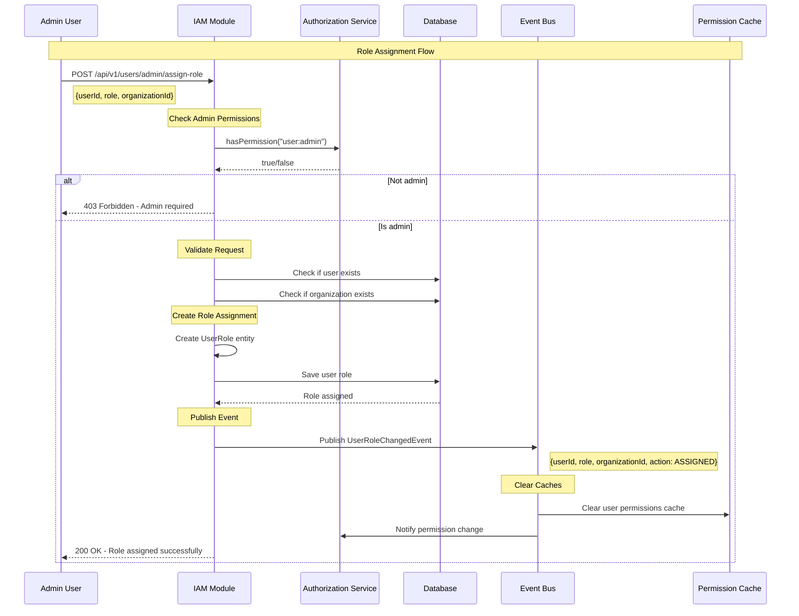

# Registration and Authentication Workflows

## 1. User Registration Workflow

## 2. User Authentication Workflow

## 3. Authorized Request Workflow (Billing Example)

## 4. Cross-Module Permission Check Workflow

## 5. Multi-Tenant Organization Access Workflow

## 6. Role Assignment Workflow

## Key Security Features Demonstrated

### 1. **Layered Security**
- GCP Load Balancer (DDoS protection)
- JWT token validation
- Spring Security filter chains
- Business logic authorization

### 2. **Permission-Based Access Control**
- Fine-grained permissions (e.g., `billing:process-payment`)
- Role-based grouping of permissions
- Cross-module permission checking

### 3. **Multi-Tenant Support**
- Organization-based access control
- Users can have different roles per organization
- Data isolation by organization

### 4. **Performance Optimizations**
- Permission caching (5-minute TTL)
- JWT contains permissions (reduces DB calls)
- Async event processing

### 5. **Audit and Monitoring**
- All permission checks are logged
- Role changes trigger events
- Security context tracking

### 6. **Modular Architecture**
- Each module handles its own endpoints
- Shared authorization service
- Clean separation of concerns

This architecture ensures secure, scalable, and maintainable authentication and authorization across all your bounded contexts!