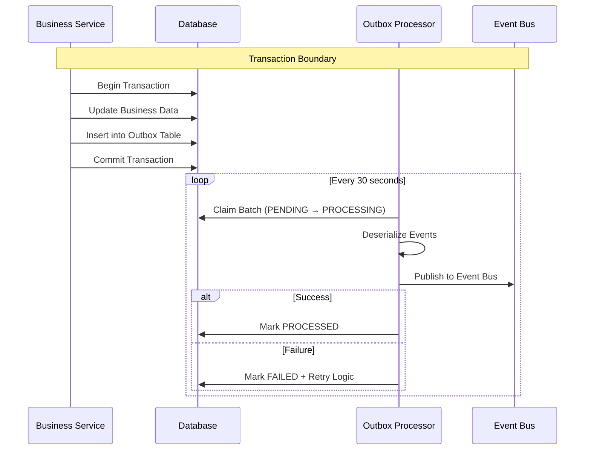
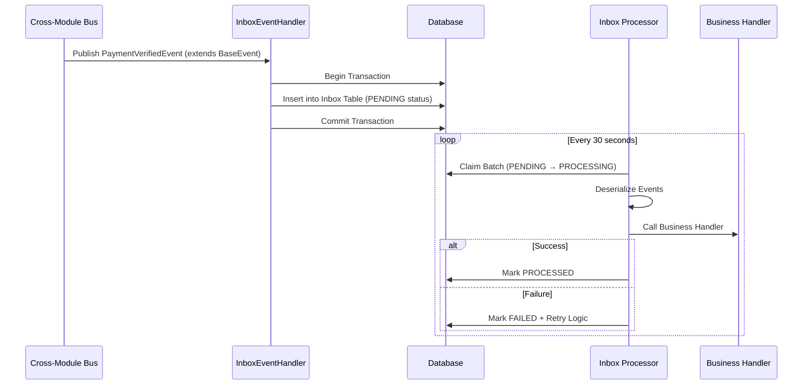
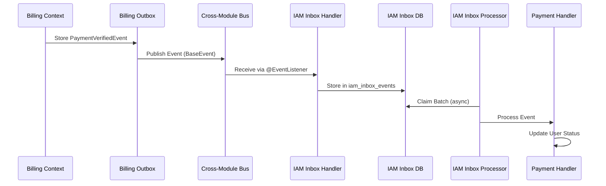
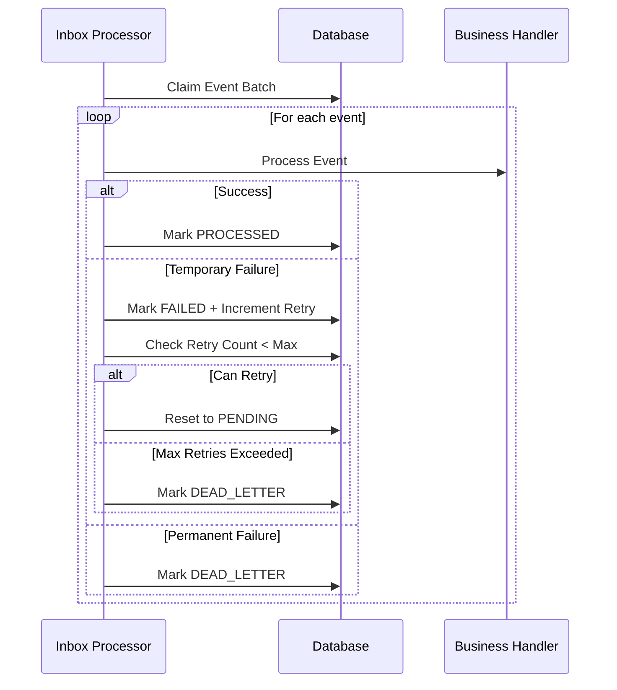

# Outbox and Inbox Patterns Implementation Guide

## Overview

This document describes the implementation of **Outbox Pattern** and **Inbox Pattern** in the RegTech application for reliable cross-module event communication. These patterns ensure transactional consistency and reliable message delivery in a modular monolithic architecture.

## Table of Contents

1. [What are Outbox and Inbox Patterns?](#what-are-outbox-and-inbox-patterns)
2. [When to Use These Patterns](#when-to-use-these-patterns)
3. [Outbox Pattern Implementation](#outbox-pattern-implementation)
4. [Inbox Pattern Implementation](#inbox-pattern-implementation)
5. [Configuration](#configuration)
6. [Monitoring and Operations](#monitoring-and-operations)
7. [Sequence Diagrams](#sequence-diagrams)

## What are Outbox and Inbox Patterns?

### Outbox Pattern
The **Outbox Pattern** ensures reliable event publishing by storing events in a local database table (outbox) within the same transaction as the business operation. A separate background process then publishes these events to external systems.

**Benefits:**
- **Transactional Consistency**: Events are stored atomically with business data
- **Reliability**: Events are guaranteed to be published even if the publishing fails
- **Idempotency**: Duplicate prevention through status tracking
- **Audit Trail**: Complete history of published events

### Inbox Pattern
The **Inbox Pattern** ensures reliable event processing by storing incoming events in a local database table (inbox) before processing them. This prevents message loss and enables retry logic for failed processing.

**Benefits:**
- **Reliable Processing**: Events are persisted before processing
- **Retry Logic**: Automatic retry for failed processing with exponential backoff
- **Idempotency**: Duplicate prevention through status tracking
- **Error Isolation**: Failed events don't block processing of others

## When to Use These Patterns

### Use Outbox Pattern When:
- Publishing events across bounded contexts
- Ensuring transactional consistency between business operations and event publishing
- Dealing with unreliable external systems or networks
- Needing audit trails of published events

### Use Inbox Pattern When:
- Receiving events from other bounded contexts
- Processing events that might fail and need retry logic
- Ensuring events are processed exactly once (at-least-once with deduplication)
- Isolating processing failures from event reception

## Event Communication Architecture

### Cross-Module Event Bus
The application uses a **Cross-Module Event Bus** for asynchronous communication between bounded contexts:

```java
@Service
public class CrossModuleEventBus {
    
    private final ApplicationEventPublisher eventPublisher;
    
    public void publishEvent(BaseEvent event) {
        // Asynchronous publishing to all registered listeners
        eventPublisher.publishEvent(event);
    }
}
```

### Event Structure Hierarchy
```
DomainEvent (interface)
├── eventType(): String
└── BaseEvent (abstract)
    ├── correlationId: String
    ├── timestamp: LocalDateTime  
    ├── sourceModule: String
    └── PaymentVerifiedEvent extends BaseEvent
        ├── userId: String
        └── billingAccountId: String
```

### Event Reception Pattern
Events are received using Spring's `@EventListener` annotation:

```java
@Component
public class InboxEventHandler {
    
    @EventListener
    @Transactional
    public void handlePaymentVerifiedEvent(PaymentVerifiedEvent event) {
        // event extends BaseEvent with correlationId, timestamp, sourceModule
        // Store in inbox for reliable processing
    }
}
```

### Benefits of BaseEvent
- **Correlation Tracking**: `correlationId` links related operations across modules
- **Audit Trail**: `timestamp` and `sourceModule` for observability  
- **Type Safety**: `eventType()` method for handler routing
- **Standardization**: Consistent event structure across the application

## Outbox Pattern Implementation

### Core Components

#### 1. OutboxMessage Entity
```java
@Entity
@Table(name = "iam_outbox_events")
public class OutboxEventEntity {
    @Id
    private String id;
    private String eventType;
    private String aggregateId;
    private String eventData; // JSON
    private Instant createdAt;
    private ProcessingStatus status; // PENDING, PROCESSING, PROCESSED, FAILED

    // Getters, setters, and business methods
}
```

#### 2. OutboxMessageRepository Interface
```java
public interface OutboxMessageRepository {
    Function<Integer, List<OutboxMessage>> messageLoader();
    Function<String, Boolean> markProcessed();
    Function<Integer, List<OutboxMessage>> claimBatch();
    BiFunction<String, String, Boolean> markFailed();
    Function<String, Boolean> resetForRetry();
}
```

#### 3. ProcessOutboxJob
```java
public class ProcessOutboxJob {
    public int runOnce() {
        List<OutboxMessage> messages = repository.claimBatch().apply(batchSize);
        return processMessages(messages);
    }
}
```

### Usage Example

#### Publishing Events (IAM Context)
```java
@Service
public class UserService {

    @PersistenceContext
    private EntityManager em;

    @Transactional
    public void createUser(CreateUserCommand command) {
        // 1. Create user entity
        UserEntity user = new UserEntity(/*...*/);
        em.persist(user);

        // 2. Store event in outbox (same transaction)
        OutboxEventEntity outboxEvent = new OutboxEventEntity(
            "UserCreatedEvent",
            user.getId(),
            objectMapper.writeValueAsString(event)
        );
        em.persist(outboxEvent);

        // 3. Business operation and event storage are atomic
    }
}
```

#### Event Structure (BaseEvent)
```java
public abstract class BaseEvent implements DomainEvent {
    private final String correlationId;
    private final LocalDateTime timestamp;
    private final String sourceModule;

    protected BaseEvent(String correlationId, String sourceModule) {
        this.correlationId = correlationId;
        this.timestamp = LocalDateTime.now();
        this.sourceModule = sourceModule;
    }

    public String getCorrelationId() { return correlationId; }
    public LocalDateTime getTimestamp() { return timestamp; }
    public String getSourceModule() { return sourceModule; }

    @Override
    public String eventType() {
        return this.getClass().getSimpleName(); // e.g., "PaymentVerifiedEvent"
    }
}

public class PaymentVerifiedEvent extends BaseEvent {
    private final String userId;
    private final String billingAccountId;
    
    public PaymentVerifiedEvent(String userId, String billingAccountId, String correlationId) {
        super(correlationId, "billing"); // source module
        this.userId = userId;
        this.billingAccountId = billingAccountId;
    }
    
    // getters...
}
```

#### Wiring Configuration (IamOutboxWiring.java)
```java
@Configuration
public class IamOutboxWiring {

    @Bean
    public OutboxMessageRepository iamOutboxRepository() {
        return new OutboxMessageRepository() {
            @Override
            public Function<Integer, List<OutboxMessage>> messageLoader() {
                return batchSize -> em.createQuery(
                    "SELECT o FROM OutboxEventEntity o WHERE o.status = :status",
                    OutboxEventEntity.class)
                    .setParameter("status", PENDING)
                    .setMaxResults(batchSize)
                    .getResultList()
                    .stream()
                    .map(e -> new OutboxMessage(e.getId(), e.getEventType(), e.getEventData(), e.getCreatedAt(), e.getAggregateId()))
                    .toList();
            }
            // ... other repository methods
        };
    }

    @Bean
    public ProcessOutboxJob iamProcessOutboxJob(/* dependencies */) {
        return new ProcessOutboxJob(iamOutboxRepository, objectMapper, iamOutboxHandlers, iamOutboxOptions);
    }
}
```

#### IamOutboxProcessor - Concrete Implementation
```java
/**
 * Concrete GenericOutboxEventProcessor for IAM bounded context.
 * Extends the generic processor with IAM-specific configuration.
 */
public class IamOutboxProcessor extends GenericOutboxEventProcessor {

    public IamOutboxProcessor(OutboxEventPublisher eventPublisher) {
        super(eventPublisher, "IAM"); // Context name for logging
    }

    @Override
    protected boolean isProcessingEnabled() {
        // IAM-specific logic to enable/disable outbox processing
        // Could be driven by configuration properties or feature flags
        return true;
    }
}
```

#### iamOutboxHandlers - Event Handler Registration
```java
@Bean
public Map<String, Function<Object, Boolean>> iamOutboxHandlers(ObjectMapper objectMapper,
                                                                List<DomainEventHandler<?>> handlers) {
    Map<String, Function<Object, Boolean>> map = new HashMap<>();

    // Register discovered typed handlers - converts raw JSON to typed events and calls handlers
    for (var h : handlers) {
        map.put(h.eventType(), rawEvent -> {
            try {
                // Deserialize JSON payload to typed event object
                Object typed = objectMapper.convertValue(rawEvent, h.eventClass());
                // Call the typed handler and return success/failure
                @SuppressWarnings("rawtypes")
                DomainEventHandler dh = (DomainEventHandler) h;
                return dh.handle((DomainEvent) typed);
            } catch (Exception e) {
                return false; // Handler failed
            }
        });
    }

    return map;
}
```
**Purpose**: Creates a registry mapping event types to handler functions. When the outbox processor loads events from the database, it uses this map to find the appropriate handler for each event type.

#### IamOutboxProcessor - Concrete Implementation
```java
/**
 * Concrete GenericOutboxEventProcessor for IAM bounded context.
 * Extends the generic processor with IAM-specific configuration.
 */
public class IamOutboxProcessor extends GenericOutboxEventProcessor {

    public IamOutboxProcessor(OutboxEventPublisher eventPublisher) {
        super(eventPublisher, "IAM"); // Context name for logging
    }

    @Override
    protected boolean isProcessingEnabled() {
        // IAM-specific logic to enable/disable outbox processing
        // Could be driven by configuration properties or feature flags
        return true;
    }
}
```

## Inbox Pattern Implementation

### Core Components

#### 1. InboxMessage Entity
```java
@Entity
@Table(name = "iam_inbox_events")
public class InboxEventEntity {
    @Id
    private String id;
    private String eventType;
    private String aggregateId;
    private String eventData; // JSON
    private Instant receivedAt;
    private ProcessingStatus status; // PENDING, PROCESSING, PROCESSED, FAILED, DEAD_LETTER

    // Getters, setters, and business methods
}
```

#### 2. InboxMessageRepository Interface
```java
public interface InboxMessageRepository {
    Function<Integer, List<InboxMessage>> messageLoader();
    Function<String, Boolean> markProcessed();
    Function<Integer, List<InboxMessage>> claimBatch();
    BiFunction<String, String, Boolean> markFailed();
    Function<String, Boolean> resetForRetry();
}
```

#### 3. ProcessInboxJob
```java
public class ProcessInboxJob {
    public int runOnce() {
        List<InboxMessage> messages = repository.claimBatch().apply(batchSize);
        return processMessages(messages);
    }
}
```

### Usage Example

#### Receiving Events (IAM Context)
```java
@Component
public class InboxEventHandler {

    @PersistenceContext
    private EntityManager em;

    @EventListener
    @Transactional
    public void handlePaymentVerifiedEvent(PaymentVerifiedEvent event) {
        // 1. Store incoming event in inbox (event extends BaseEvent)
        InboxEventEntity inboxEvent = new InboxEventEntity(
            event.eventType(), // "PaymentVerifiedEvent"
            event.getUserId(), // aggregateId
            objectMapper.writeValueAsString(event)
        );
        em.persist(inboxEvent);

        // 2. Event is safely stored before any processing
        logger.info("Stored {} in inbox: correlationId={}, userId={}",
            event.eventType(), event.getCorrelationId(), event.getUserId());
    }
}
```

#### Cross-Module Event Bus
```java
@Service
public class CrossModuleEventBus {

    private final ApplicationEventPublisher eventPublisher;

    public void publishEvent(BaseEvent event) {
        // Publish to Spring event bus (async)
        eventPublisher.publishEvent(event);
        
        // Events are received by @EventListener methods across modules
    }
}
```

#### Processing Events (PaymentVerificationEventHandler.java)
```java
@Component
public class PaymentVerificationEventHandler {

    public boolean handle(PaymentVerifiedEvent event) {
        try {
            // Business logic for payment verification
            verifyPayment(event.getPaymentId());
            updateUserStatus(event.getUserId());

            return true; // Success
        } catch (Exception e) {
            return false; // Failure - will be retried
        }
    }
}
```

#### Wiring Configuration (IamInboxWiring.java)
```java
@Configuration
public class IamInboxWiring {

    @PersistenceContext
    private EntityManager em;

    @Bean
    public InboxOptions iamInboxOptions() {
        return new InboxOptions(50, Duration.ofSeconds(10), "iam");
    }

    @Bean
    public InboxMessageRepository iamInboxRepository() {
        return new InboxMessageRepository() {
            @Override
            public Function<Integer, List<InboxMessage>> messageLoader() {
                return batchSize -> em.createQuery(
                        "SELECT i FROM InboxEventEntity i WHERE i.processingStatus = :status ORDER BY i.receivedAt ASC", InboxEventEntity.class)
                    .setParameter("status", InboxEventEntity.ProcessingStatus.PENDING)
                    .setMaxResults(batchSize)
                    .getResultList()
                    .stream()
                    .map(e -> new InboxMessage(e.getId(), e.getEventType(), e.getEventData(), e.getReceivedAt(), e.getAggregateId()))
                    .toList();
            }

            @Override
            public Function<String, Boolean> markProcessed() {
                return id -> {
                    try {
                        int updated = em.createQuery("UPDATE InboxEventEntity i SET i.processingStatus = :status, i.processedAt = :processedAt WHERE i.id = :id")
                            .setParameter("status", InboxEventEntity.ProcessingStatus.PROCESSED)
                            .setParameter("processedAt", Instant.now())
                            .setParameter("id", id)
                            .executeUpdate();
                        return updated > 0;
                    } catch (Exception ex) {
                        return false;
                    }
                };
            }

            @Override
            public Function<Integer, List<InboxMessage>> claimBatch() {
                return batchSize -> {
                    // Atomically claim by updating status from PENDING to PROCESSING and returning claimed rows.
                    var pending = em.createQuery(
                            "SELECT i FROM InboxEventEntity i WHERE i.processingStatus = :status ORDER BY i.receivedAt ASC", InboxEventEntity.class)
                        .setParameter("status", InboxEventEntity.ProcessingStatus.PENDING)
                        .setMaxResults(batchSize)
                        .getResultList();

                    var ids = pending.stream().map(InboxEventEntity::getId).toList();
                    if (ids.isEmpty()) return List.of();

                    int updated = em.createQuery("UPDATE InboxEventEntity i SET i.processingStatus = :processing WHERE i.id IN :ids")
                        .setParameter("processing", InboxEventEntity.ProcessingStatus.PROCESSING)
                        .setParameter("ids", ids)
                        .executeUpdate();

                    if (updated <= 0) return List.of();

                    // Reload the claimed entities
                    return em.createQuery("SELECT i FROM InboxEventEntity i WHERE i.id IN :ids", InboxEventEntity.class)
                        .setParameter("ids", ids)
                        .getResultList()
                        .stream()
                        .map(e -> new InboxMessage(e.getId(), e.getEventType(), e.getEventData(), e.getReceivedAt(), e.getAggregateId()))
                        .toList();
                };
            }

            @Override
            public BiFunction<String, String, Boolean> markFailed() {
                return (id, err) -> {
                    try {
                        int updated = em.createQuery("UPDATE InboxEventEntity i SET i.processingStatus = :failed, i.lastError = :err, i.retryCount = i.retryCount + 1 WHERE i.id = :id")
                            .setParameter("failed", InboxEventEntity.ProcessingStatus.FAILED)
                            .setParameter("err", err)
                            .setParameter("id", id)
                            .executeUpdate();
                        return updated > 0;
                    } catch (Exception ex) {
                        return false;
                    }
                };
            }

            @Override
            public Function<String, Boolean> resetForRetry() {
                return id -> {
                    try {
                        int updated = em.createQuery("UPDATE InboxEventEntity i SET i.processingStatus = :pending WHERE i.id = :id AND i.retryCount < 3")
                            .setParameter("pending", InboxEventEntity.ProcessingStatus.PENDING)
                            .setParameter("id", id)
                            .executeUpdate();
                        return updated > 0;
                    } catch (Exception ex) {
                        return false;
                    }
                };
            }

            @Override
            public Function<Integer, List<InboxMessage>> failedMessageLoader() {
                return batchSize -> em.createQuery(
                        "SELECT i FROM InboxEventEntity i WHERE i.processingStatus = :status ORDER BY i.receivedAt ASC", InboxEventEntity.class)
                    .setParameter("status", InboxEventEntity.ProcessingStatus.FAILED)
                    .setMaxResults(batchSize)
                    .getResultList()
                    .stream()
                    .map(e -> new InboxMessage(e.getId(), e.getEventType(), e.getEventData(), e.getReceivedAt(), e.getAggregateId()))
                    .toList();
            }
        };
    }

    @Bean
    public Map<String, Function<Object, Boolean>> iamInboxHandlers(ObjectMapper objectMapper,
                                                                    List<DomainEventHandler<?>> handlers) {
        Map<String, Function<Object, Boolean>> map = new HashMap<>();

        // Register discovered typed handlers - converts raw JSON to typed events and calls handlers
        for (var h : handlers) {
            map.put(h.eventType(), rawEvent -> {
                try {
                    // Deserialize JSON payload to typed event object
                    Object typed = objectMapper.convertValue(rawEvent, h.eventClass());
                    // Call the typed handler and return success/failure
                    @SuppressWarnings("rawtypes")
                    DomainEventHandler dh = (DomainEventHandler) h;
                    return dh.handle((DomainEvent) typed);
                } catch (Exception e) {
                    return false; // Handler failed
                }
            });
        }

        return map;
    }

    @Bean
    public ProcessInboxJob iamProcessInboxJob(InboxMessageRepository iamInboxRepository,
                                                ObjectMapper objectMapper,
                                                Map<String, Function<Object, Boolean>> iamInboxHandlers,
                                                InboxOptions iamInboxOptions) {
        return new ProcessInboxJob(iamInboxRepository, objectMapper, iamInboxHandlers, iamInboxOptions);
    }

    @Bean
    public ProcessInboxEventPublisher iamInboxEventPublisher(ProcessInboxJob iamProcessInboxJob) {
        return new ProcessInboxEventPublisher(iamProcessInboxJob);
    }

    @Bean
    public IamInboxProcessor iamGenericInboxProcessor(ProcessInboxEventPublisher iamInboxEventPublisher) {
        return new IamInboxProcessor(iamInboxEventPublisher);
    }
}
```

#### iamInboxHandlers - Event Handler Registration
```java
@Bean
public Map<String, Function<Object, Boolean>> iamInboxHandlers(ObjectMapper objectMapper,
                                                                List<DomainEventHandler<?>> handlers) {
    Map<String, Function<Object, Boolean>> map = new HashMap<>();

    // Register discovered typed handlers - converts raw JSON to typed events and calls handlers
    for (var h : handlers) {
        map.put(h.eventType(), rawEvent -> {
            try {
                // Deserialize JSON payload to typed event object
                Object typed = objectMapper.convertValue(rawEvent, h.eventClass());
                // Call the typed handler and return success/failure
                @SuppressWarnings("rawtypes")
                DomainEventHandler dh = (DomainEventHandler) h;
                return dh.handle((DomainEvent) typed);
            } catch (Exception e) {
                return false; // Handler failed
            }
        });
    }

    return map;
}
```
**Purpose**: Creates a registry mapping event types to handler functions for inbox processing. Similar to `iamOutboxHandlers` but used by the inbox processor to handle incoming events.

#### IamInboxProcessor - Concrete Implementation
```java
/**
 * Concrete GenericInboxEventProcessor for IAM bounded context.
 * Extends the generic processor with IAM-specific configuration.
 */
public class IamInboxProcessor extends GenericInboxEventProcessor {

    public IamInboxProcessor(InboxEventPublisher eventPublisher) {
        super(eventPublisher, "IAM"); // Context name for logging
    }

    @Override
    protected boolean isProcessingEnabled() {
        // IAM-specific logic to enable/disable inbox processing
        // Could be driven by configuration properties or feature flags
        return true;
    }
}
```

## Configuration

### Application Properties
```yaml
# Outbox Configuration
iam:
  outbox:
    batch-size: 50
    poll-interval: 10000ms  # 10 seconds

# Inbox Configuration
iam:
  inbox:
    batch-size: 50
    poll-interval: 10000ms  # 10 seconds
```

### Scheduling Configuration
```java
@Configuration
@EnableScheduling
public class SchedulingConfig {
    // Scheduling is handled by GenericOutboxEventProcessor and GenericInboxEventProcessor
}
```

## Monitoring and Operations

### Health Checks
Both patterns include health indicators for monitoring:

```java
@Component
public class OutboxHealthIndicator implements HealthIndicator {
    @Override
    public Health health() {
        var stats = outboxPublisher.getStats();
        if (stats.failed() > 100) { // threshold
            return Health.down()
                .withDetail("failed", stats.failed())
                .build();
        }
        return Health.up()
            .withDetail("pending", stats.pending())
            .withDetail("processing", stats.processing())
            .build();
    }
}
```

### Metrics
Key metrics to monitor:
- **Outbox**: Pending events, processing rate, failure rate
- **Inbox**: Unprocessed events, retry attempts, dead letters
- **Performance**: Processing latency, batch sizes

### Operations
```bash
# Manual processing triggers
curl -X POST http://localhost:8080/actuator/outbox/process
curl -X POST http://localhost:8080/actuator/inbox/process

# Health checks
curl http://localhost:8080/actuator/health

# Metrics
curl http://localhost:8080/actuator/metrics/outbox.events.processed
```

## Sequence Diagrams

### Outbox Pattern Sequence



### Inbox Pattern Sequence



### Cross-Module Event Flow



### Error Handling and Retry Flow



## Best Practices

### Outbox Pattern
1. **Keep Transactions Short**: Store events in outbox within the same transaction as business logic
2. **Use Appropriate Batch Sizes**: Balance throughput with memory usage
3. **Monitor Queue Depth**: Alert when pending events exceed thresholds
4. **Handle Poison Messages**: Implement dead letter queues for consistently failing events

### Inbox Pattern
1. **Make Handlers Idempotent**: Ensure processing the same event multiple times is safe
2. **Use Appropriate Retry Limits**: Balance reliability with processing delays
3. **Monitor Dead Letters**: Investigate events that consistently fail
4. **Consider Event Ordering**: If order matters, implement sequencing logic

### General
1. **Schema Separation**: Use separate schemas/tables for different bounded contexts
2. **Monitoring**: Implement comprehensive monitoring and alerting
3. **Testing**: Test failure scenarios and retry logic thoroughly
4. **Documentation**: Keep event contracts well-documented and versioned

## Troubleshooting

### Common Issues

#### Outbox Events Not Publishing
- Check if `GenericOutboxEventProcessor` is enabled
- Verify `@EnableScheduling` is present
- Check database connectivity
- Review logs for processing errors

#### Inbox Events Not Processing
- Check if `GenericInboxEventProcessor` is enabled
- Verify event handlers are registered
- Check for deserialization errors
- Review retry logic and dead letter queues

#### High Error Rates
- Check event payload formats
- Verify handler logic
- Review database constraints
- Check for network connectivity issues

### Debug Commands
```bash
# Check outbox status
SELECT status, COUNT(*) FROM iam_outbox_events GROUP BY status;

# Check inbox status
SELECT processing_status, COUNT(*) FROM iam_inbox_events GROUP BY processing_status;

# View failed events
SELECT * FROM iam_inbox_events WHERE processing_status = 'FAILED' ORDER BY retry_count DESC;
```</content>
<parameter name="filePath">c:\Users\alseny\Desktop\react projects\regtech\docs\OUTBOX_INBOX_PATTERNS_GUIDE.md